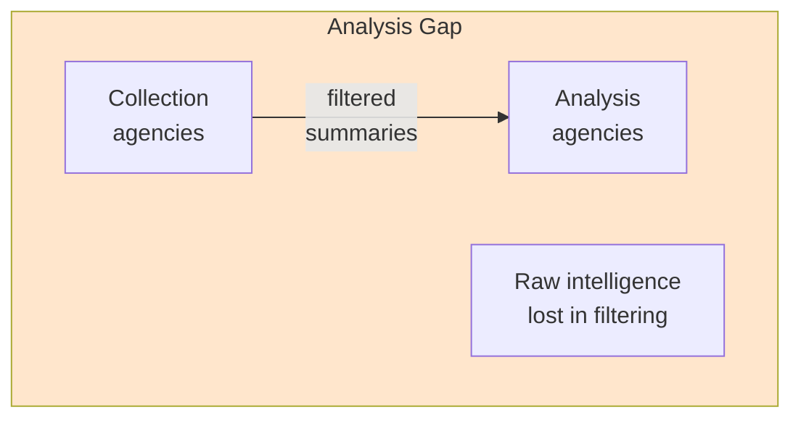
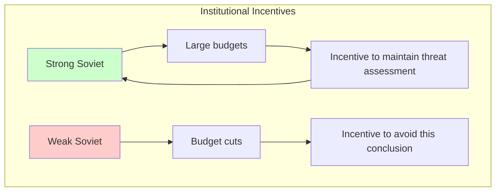

# Intelligence Community Failures

Intelligence agencies face a version of the entanglement problem that predates AI: multiple analysts and agencies are supposed to provide independent assessments, but in practice, their judgments become correlated in ways that defeat the purpose of redundancy.

These failures offer lessons for AI oversight that are both humbling and instructive.

---

## Why Intelligence Failures Are Relevant

The intelligence community has:
- **Multiple redundant sources**: Multiple agencies, analysts, collection methods
- **High-stakes decisions**: War, policy, national security
- **Sophisticated adversaries**: Actors actively trying to deceive
- **Long history of failures**: Documented cases to learn from

The parallels to AI oversight are direct:
| Intelligence Domain | AI Oversight Parallel |
|---------------------|----------------------|
| Multiple agencies (CIA, NSA, DIA, etc.) | Multiple verification layers |
| Analysts interpreting data | LLMs evaluating outputs |
| Source reports | Agent outputs and context |
| National Intelligence Estimates | Final safety decisions |
| Adversary deception | Adversarial inputs, scheming |
| Groupthink | Shared training, correlated blind spots |
| Politicization | Capture by development teams |

---

## Case Study 1: Iraq WMD Intelligence (2003)

### What Happened

The U.S. intelligence community concluded with "high confidence" that Iraq possessed weapons of mass destruction. This assessment was used to justify the 2003 invasion. Post-war investigation found no significant WMD programs.

### The Entanglement Analysis

**Passive entanglement—shared assumptions**:
```
All 16 intelligence agencies shared:
- Assumption: Saddam had WMD (based on 1990s confirmed programs)
- Assumption: Saddam was hiding them (based on behavior patterns)
- Analysis framework: Absence of evidence ≠ evidence of absence

These shared assumptions created correlated assessments
even when raw intelligence was ambiguous
```

**Active entanglement—source contamination**:
```mermaid
flowchart TB
    subgraph Contamination[Source Contamination]
        Curveball[Curveball<br/>(single source)]
        Curveball --> German[German BND<br/>assessment]
        German --> DIA[DIA analysis]
        DIA --> CIA[CIA analysis]
        CIA --> NIE[National Intelligence<br/>Estimate]

        Note[Single source appeared<br/>as multiple sources]
    end

    style Curveball fill:#ffcccc
    style Note fill:#ffe6e6
```

The infamous "Curveball" source provided information that appeared in multiple agency assessments. What looked like corroborating evidence was actually the same source propagated through channels.

**Active entanglement—political pressure**:
- Policymakers clearly wanted confirmation of WMD
- Analysts knew what conclusions would be "useful"
- Dissenting views were marginalized or footnoted
- The principal (policymakers) captured the agents (analysts)

### Quantified Failure

**Perceived redundancy**:
- 16 intelligence agencies
- Multiple collection methods (HUMINT, SIGINT, imagery)
- Estimated reliability: "If 5 agencies agree, probability is very high"

**Actual redundancy**:
- Shared assumptions = correlated priors
- Contaminated sources = reduced independent data
- Political pressure = correlated incentives
- Effective independent sources: ~1-2

**Entanglement tax**: Estimated 5-10× (appeared to have 16 independent sources; effectively had 1-2)

### Lessons for AI

1. **Shared priors destroy independence**: If all verification models have the same assumptions, they'll make the same errors
2. **Source contamination is hard to detect**: One source can appear as many
3. **Political/organizational pressure affects all layers**: Capture can be simultaneous
4. **Confidence is uncorrelated with accuracy**: High-confidence consensus was wrong

---

## Case Study 2: 9/11 Intelligence Failure

### What Happened

Despite numerous warning signs, the U.S. intelligence community failed to prevent the September 11, 2001 attacks. Post-hoc analysis revealed the pieces were available but not assembled.

### The Entanglement Analysis

**Passive entanglement—stovepiping**:
```
Paradoxically, TOO LITTLE sharing created failure:

FBI had: Suspicious flight training activity
CIA had: Known Al-Qaeda operatives in US
NSA had: Chatter about impending attack

Each agency had PIECES
None had the WHOLE PICTURE
No integration mechanism existed
```

This is the opposite problem: *lack* of communication between components prevented synthesis.

**Active entanglement—collection/analysis separation**:


Analysts didn't see raw intelligence—only filtered summaries from collectors. Critical details were filtered out as "noise."

**Adversarial entanglement—imagination failure**:
- Al-Qaeda exploited the assumption that hijackings ended in negotiations
- All agencies shared this assumption
- The novel attack mode (suicide using planes as weapons) was outside all models
- Shared mental models = shared blind spots

### The Needle/Haystack Problem

```
INTELLIGENCE DATA VOLUME (circa 2001):

NSA intercepts: ~100 million per month
CIA cables: ~200,000 per month
FBI tips: ~1 million per year

RELEVANT TO 9/11: ~20-30 items

Finding ratio: ~1 in 10,000,000
```

**This maps to AI oversight**: With massive output volumes, how do you find the few dangerous items among millions of benign ones?

### Lessons for AI

1. **Too little sharing is also failure**: Overly isolated components can't synthesize
2. **Filtering destroys information**: Summaries lose critical details
3. **Imagination failure is shared**: Novel attacks exploit universal assumptions
4. **The haystack problem scales badly**: Rare dangerous events are hard to catch at volume

---

## Case Study 3: Bay of Pigs (1961)

### What Happened

The CIA-backed invasion of Cuba failed catastrophically. Post-mortems revealed that warning signs were ignored and groupthink dominated planning.

### The Entanglement Analysis

**Groupthink dynamics**:
```
GROUPTHINK SYMPTOMS (Irving Janis):

1. Illusion of invulnerability: "This will work"
2. Collective rationalization: "Cubans will rise up"
3. Belief in inherent morality: "We're the good guys"
4. Stereotyping opponents: "Castro's regime is weak"
5. Pressure on dissenters: "Are you not a team player?"
6. Self-censorship: Doubts not voiced
7. Illusion of unanimity: Silence = agreement
8. Mind guards: Protect leadership from dissent

Result: Unanimous agreement on a bad plan
```

**This is adversarial entanglement without an adversary**: The components (analysts, planners) captured themselves through social dynamics.

**The "best and brightest" problem**:
- Kennedy's team was exceptionally talented
- They all had similar elite educations, backgrounds, assumptions
- Homogeneity of talent created homogeneity of blind spots

### Lessons for AI

1. **Homogeneous excellence still fails**: All components being "smart" doesn't prevent correlated errors
2. **Social dynamics create entanglement**: Groupthink is a form of capture
3. **Dissent must be structurally protected**: Optional dissent disappears under pressure
4. **Unanimity should trigger concern**: Real independence rarely produces unanimous agreement

---

## Case Study 4: Soviet Collapse Prediction (1989-1991)

### What Happened

The intelligence community largely failed to predict the sudden collapse of the Soviet Union. Estimates continued predicting Soviet stability until very close to actual collapse.

### The Entanglement Analysis

**Mirror imaging**:
```
MIRROR IMAGING ERROR:

Analysts assumed Soviet leaders thought like Americans:
- Rational actors
- Economic calculations
- Stable institutions

Soviet reality:
- Ideological exhaustion
- Information hiding from leaders
- Institutional brittleness

Result: Models couldn't predict non-linear collapse
```

**Shared models** across agencies meant shared blind spots about Soviet fragility.

**Institutional bias**:


All agencies had incentives to assess the Soviet threat as serious. This is a form of systemic capture.

### Lessons for AI

1. **Model assumptions constrain predictions**: If all models assume continuous behavior, they miss discontinuities
2. **Institutional incentives bias assessment**: Analysts aren't neutral
3. **"Black swan" events exploit shared models**: Low-probability, high-impact events aren't predicted by consensus

---

## Case Study 5: Yom Kippur War (1973)

### What Happened

Israel was surprised by the Egyptian-Syrian attack despite having extensive intelligence. The intelligence assessment concluded war was unlikely just days before the attack.

### The Entanglement Analysis

**The Concept** (shared mental model):
```
Israeli Intelligence Doctrine ("The Concept"):

1. Egypt won't attack without air superiority
2. Egypt can't get air superiority without long-range bombers
3. Egypt doesn't have long-range bombers
4. Therefore: Egypt won't attack

This framework was shared across all intelligence bodies
```

**All** Israeli intelligence agencies used this framework. When evidence contradicted the framework, it was interpreted through the framework rather than updating the framework.

**Adversary adaptation**:
- Egypt knew Israeli intelligence doctrine
- Egypt developed alternative strategies (missile umbrellas instead of air superiority)
- Egypt designed the attack to appear consistent with exercises
- The adversary modeled the verifier and defeated it

### Lessons for AI

1. **Shared mental models are single points of failure**: Adversaries can model and exploit them
2. **Framework-first thinking ignores anomalies**: Evidence is interpreted to fit, not to update
3. **Sophisticated adversaries study their verifiers**: AI agents might learn verification patterns

---

## Structural Remedies Attempted

The intelligence community has tried various reforms. Their partial success (and limitations) are instructive:

### Competitive Analysis (Team A/Team B)

**Approach**: Create independent teams with different assumptions to analyze the same data.

**Example**: 1976 Team B exercise on Soviet military capabilities.

**Results**: Mixed. Team B provided different perspective but also introduced its own biases. Didn't prevent later failures.

**Lesson for AI**: Structural diversity helps but doesn't eliminate shared assumptions at deeper levels.

### Red Teams

**Approach**: Dedicated adversarial teams try to break assessments.

**Results**: Effective when genuinely empowered; often marginalized when findings are inconvenient.

**Lesson for AI**: Red teams must be structurally protected from capture by development teams.

### Information Sharing (Post-9/11)

**Approach**: Break down stovepipes; create integration centers.

**Results**: Improved synthesis but created new problems (over-sharing, analysis bottlenecks, group coordination).

**Lesson for AI**: Balance needed between isolation (independence) and integration (synthesis).

### Analytic Tradecraft Standards

**Approach**: Explicit standards for analysis including confidence levels, alternative hypotheses, key assumptions.

**Results**: Improved documentation and transparency; uncertain effect on accuracy.

**Lesson for AI**: Standards help but can become box-checking exercises.

---

## Cross-Case Patterns

### Common Entanglement Mechanisms

| Mechanism | Iraq WMD | 9/11 | Bay of Pigs | Soviet Collapse | Yom Kippur |
|-----------|----------|------|-------------|-----------------|------------|
| Shared assumptions | ✓ | ✓ | ✓ | ✓ | ✓ |
| Source contamination | ✓ | | | | |
| Groupthink | ✓ | | ✓ | | |
| Filtering/summarization | | ✓ | | | |
| Adversary adaptation | | ✓ | | | ✓ |
| Institutional incentives | ✓ | | | ✓ | |
| Stovepiping | | ✓ | | | |

**Universal factor**: Shared assumptions appear in every case.

### Failure Rate Despite Redundancy

```
INTELLIGENCE COMMUNITY STRUCTURE:

16+ agencies
Thousands of analysts
Multiple collection methods
Explicit mandate for independence

MAJOR SURPRISE RATE:
Significant strategic surprise: ~every 5-10 years

This is NOT an independence success story.
Redundancy does not guarantee diverse outcomes.
```

### The Confidence-Accuracy Paradox

| Case | Confidence Level | Accuracy |
|------|------------------|----------|
| Iraq WMD | "High confidence" | Wrong |
| Soviet collapse | "Stable" assessments | Wrong |
| Yom Kippur | "Low probability" | Wrong |

**Pattern**: Consensus confidence often inversely correlates with accuracy. When everyone agrees, ask why.

---

## Mapping to AI Oversight

### Direct Parallels

| Intelligence Failure Mode | AI Oversight Equivalent |
|---------------------------|------------------------|
| Shared training/doctrine | Shared LLM providers/training data |
| Source contamination | Context flow between components |
| Groupthink | Similar optimization objectives |
| Mirror imaging | Training on human-like data |
| Stovepiping | Over-isolated verification layers |
| Politicization | Capture by development teams |
| Imagination failure | Out-of-distribution adversarial inputs |

### Specific Recommendations from Intelligence History

1. **Mandate alternative hypotheses**: Never allow single assessments; require adversarial alternatives

2. **Protect dissent structurally**: Dissent should be required, documented, and incentivized—not optional

3. **Audit source independence**: Trace whether "multiple sources" are actually independent or contaminated

4. **Rotate relationships**: Prevent capture through regular rotation of agent-verifier pairings

5. **Red team continuously**: Not just at launch—throughout operation

6. **Assume adversary adaptation**: Sophisticated adversaries will study and exploit verification patterns

7. **Beware confidence**: High-confidence consensus should trigger concern, not comfort

---

## Key Takeaways

1. **Intelligence community is a natural experiment in multi-layer verification**—and it frequently fails despite massive redundancy.

2. **Shared assumptions are the universal failure mode**. Every major intelligence failure involved assumptions shared across "independent" agencies.

3. **Structural diversity helps but isn't sufficient**. The intelligence community has tried many reforms; failures continue.

4. **Sophisticated adversaries model their verifiers**. This applies to AI agents as much as to nation-states.

5. **Confidence and accuracy are not correlated**. High-confidence consensus often precedes major failures.

6. **The problem is not solved**. Decades of effort haven't eliminated intelligence surprises. AI oversight should be similarly humble.

---

## Further Reading

| Source | Focus |
|--------|-------|
| WMD Commission Report (2005) | Iraq intelligence failure analysis |
| 9/11 Commission Report (2004) | Pre-9/11 intelligence failures |
| Janis, "Groupthink" (1972) | Bay of Pigs and group dynamics |
| Jervis, "Why Intelligence Fails" (2010) | Theory of intelligence failure |
| Wohlstetter, "Pearl Harbor" (1962) | Signal vs. noise problem |
| Bar-Joseph, "The Watchman Fell Asleep" (2005) | Yom Kippur failure analysis |

---

See also:
- [Historical Case Studies](/applying/entanglements/historical-cases/) - Financial and industrial failures
- [Red Team Methodology](/applying/entanglements/red-team-methodology/) - Testing for entanglement
- [Detecting Influence](/applying/entanglements/detecting-influence/) - Methods for detecting capture
- [Psychology of Oversight](/applying/entanglements/psychology-of-oversight/) - Human factors in verification
