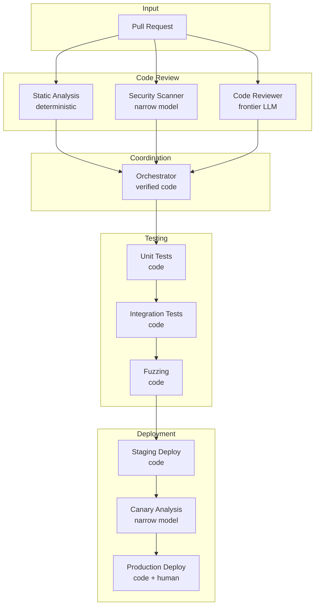
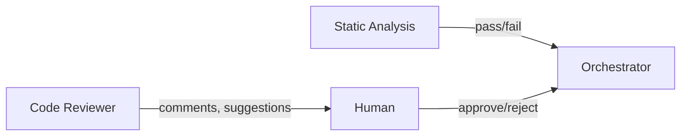
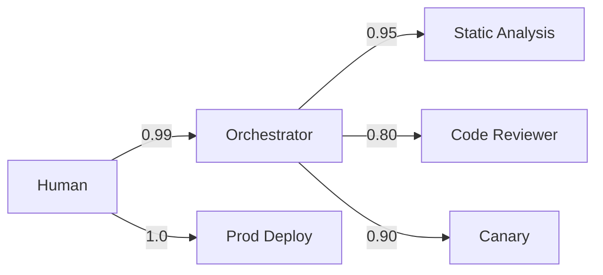

# Example: Autonomous Code Deployment

A second worked example showing how the framework applies to a higher-stakes domain: autonomous code review and deployment.

## Task

"Review pull requests, run tests, and deploy approved changes to production"

## Why This Example

Unlike the research assistant (where failures waste time), code deployment has:
- **Immediate production impact** — bad deploys cause outages
- **Security implications** — malicious code can compromise systems
- **Financial stakes** — downtime = revenue loss

This forces us to be more conservative with trust allocations.

## Component Architecture



## Component Delegation Risk Budgets

| Component | Implementation | Delegation Risk Budget | Rationale |
|-----------|---------------|------------|-----------|
| Static Analysis | Verified code | $50/month | Deterministic, auditable |
| Security Scanner | Fine-tuned 7B model | $200/month | Narrow task, well-tested |
| Code Reviewer | Frontier LLM + constraints | $500/month | Creative, but can't deploy |
| Unit/Integration Tests | Code | $100/month | Deterministic |
| Fuzzer | Code + seeded PRNG | $150/month | Reproducible randomness |
| Staging Deploy | Verified code | $50/month | Isolated environment |
| Canary Analysis | Fine-tuned model | $300/month | Critical gate, narrow task |
| **Orchestrator** | **Verified code only** | **$100/month** | **No LLM in critical path** |
| **Production Deploy** | **Code + human approval** | **$500/month** | **Human in loop** |

**System Total: $1,950/month**

## Key Design Decisions

### 1. No LLM in the Orchestrator

Unlike the research assistant, the deployment orchestrator is **pure verified code**:

```
if all_checks_passed AND human_approved:
    deploy()
else:
    reject()
```

**Why**: Orchestration in deployment is simple enough to specify formally. Using an LLM would add risk without benefit.

### 2. Code Reviewer Can't Block Deploys

The LLM code reviewer provides **advisory comments**, not blocking decisions:



- Reviewer output: "Consider refactoring this function" (suggestion)
- Static analysis: "Security vulnerability CVE-2024-XXX" (blocking)

**Why**: LLMs are good at nuanced review but shouldn't have veto power. Humans decide.

### 3. Canary Analysis is Narrow

The canary analyzer checks specific metrics:
- Error rate comparison (new vs baseline)
- Latency percentiles (p50, p95, p99)
- Resource usage (CPU, memory)

**Implementation**: Fine-tuned model trained only on "is this canary healthy?"

**Not allowed**:
- Reasoning about business logic
- Predicting user behavior
- Strategic recommendations

### 4. Production Deploy Requires Human

No fully autonomous production deployment:

```
Production Deploy = Code execution + Human approval + Time lock
```

- **Code**: Executes the mechanical deployment
- **Human**: Must click "approve" after reviewing canary
- **Time lock**: 15-minute wait between canary success and production

## Risk Inheritance



**Effective trust in Code Reviewer's impact on production**:
```
Trust(Human → Production via Reviewer) = 0.99 × 0.80 × ...
But: Reviewer can't directly affect production!
```

The architecture ensures that even if the Code Reviewer is compromised:
1. It can only add comments (low damage)
2. Comments don't automatically block/approve (no authority)
3. Human reviews all suggestions (filtering)

**Result**: Code Reviewer has high capability but near-zero production impact.

## Applying "Least X" Principles

| Principle | Application |
|-----------|-------------|
| **Least Intelligence** | Orchestrator uses no ML. Canary uses narrow model, not frontier. |
| **Least Privilege** | Code Reviewer can read code but not write to repo or trigger deploys. |
| **Least Context** | Canary sees only metrics, not code content or business context. |
| **Least Persistence** | All components stateless. No "learning" across deploys. |
| **Least Autonomy** | Production deploy requires human approval every time. |
| **Least Surprise** | Static analysis is deterministic. Fuzzer uses logged seeds. |
| **Least Connectivity** | Reviewer → Orchestrator is one-way. Reviewer can't query other components. |

## Failure Mode Analysis

| Failure | Mitigation | Residual Risk |
|---------|------------|---------------|
| Static analysis misses vulnerability | Defense in depth: security scanner + fuzzer + canary | Medium |
| Code reviewer suggests malicious pattern | Human reviews suggestions; suggestions aren't executable | Low |
| Canary analysis misjudges health | Conservative thresholds + human approval + time lock | Low |
| Orchestrator bug allows bad deploy | Verified code + formal specification + extensive testing | Very Low |
| Human approves bad deploy | Time lock allows cancellation; rollback automated | Medium |

## Comparison to Research Assistant

| Aspect | Research Assistant | Code Deployment |
|--------|-------------------|-----------------|
| Primary risk | Wasted effort | Production outage |
| LLM in coordinator | Yes (constrained) | No (verified code) |
| Human in loop | Strategic decisions | Every production deploy |
| Autonomy level | Medium (can run experiments) | Low (advisory only) |
| Acceptable Delegation Risk | $2,000/month | $2,000/month |
| Conservative factor | 1x | 2-3x |

**Key insight**: Same Delegation Risk budget, but higher-stakes domain means:
- More verification layers
- Less LLM in critical path
- More human involvement
- Lower autonomy at each step

## When to Use This Pattern

This architecture is appropriate when:
- ✅ Actions have immediate, hard-to-reverse consequences
- ✅ Security is a primary concern
- ✅ Human oversight is feasible and valuable
- ✅ Tasks are well-specified enough for verified code

Consider more autonomy (like research assistant) when:
- Tasks require creativity or judgment
- Failures are recoverable
- Human oversight doesn't scale
- Speed matters more than caution
