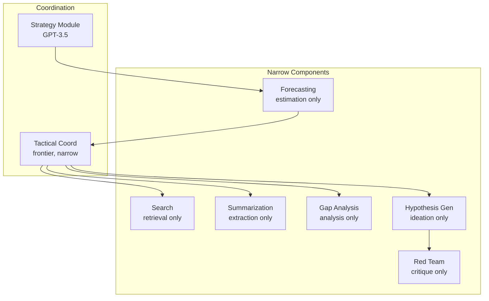

# Concrete Example: Research Assistant

:::note
This is a worked example applying the full framework. It demonstrates how decomposition, principles, and safety mechanisms work together in practice.
:::

Let's make the framework concrete with a system that actually does something useful.

## Task

"Advance understanding of protein folding mechanisms"

## Component Architecture

**Narrow components** (each with bounded intelligence):

1. **Search**: "Find relevant papers on protein folding"

- Domain: academic databases, preprint servers
- Intelligence budget: retrieval, ranking, not interpretation
- Output: list of papers with relevance scores

2. **Summarization**: "Compress papers to key claims"

- Domain: text compression
- Intelligence budget: extraction, not generation of novel ideas
- Output: structured summaries

3. **Gap Analysis**: "Identify inconsistencies or missing links"

- Domain: logical analysis of existing claims
- Intelligence budget: analysis, not creative hypothesis generation
- Output: list of gaps with evidence

4. **Hypothesis Generation**: "Propose experiments or theories"

- Domain: creative ideation
- Intelligence budget: generation, not evaluation or planning
- Output: candidate hypotheses (not filtered)

5. **Forecasting**: "Predict outcomes of research directions"

- Domain: conditional prediction
- Intelligence budget: estimation, not prescription
- Output: probability distributions over outcomes

6. **Red Team**: "Find ways these hypotheses could be dangerous or misleading"

- Domain: adversarial analysis
- Intelligence budget: critique, not coordination of attacks
- Output: risk assessments

## Coordination Architecture

**Strategy Module** (GPT-3.5-level, heavily constrained):

- Receives: Human goal "advance protein folding understanding"
- Generates: 5-10 high-level research strategies
- Implementation: Older model + rule-based filtering
- Limitations: Cannot see component outputs, operates once at start

**Forecasting Delegation**:

- Takes strategies from Strategy Module
- Invokes multiple specialized forecasters:
  - Impact forecaster (predicts scientific value)
  - Feasibility forecaster (estimates resource requirements)
  - Risk forecaster (identifies dangers)
- Aggregates: Statistical combination + uncertainty quantification
- Returns: Ranked strategies with probability distributions

**Tactical Coordination** (frontier model, narrow context):

- Receives: One approved strategy from human
- Breaks down: What components needed, in what order
- Implementation: Claude-level model but only sees current sub-task
- Invokes: search → summarization → gap analysis → hypothesis generation
- Cannot see: Overall plan, other strategies, historical decisions

**Progress Monitor** (mostly code):

- Code: Tracks metrics (papers reviewed, hypotheses generated, time elapsed)
- Simple heuristics: On track? Within budget?
- If anomalies: Trigger human review or fallback plan
- Cannot: Modify execution, only observe and alert

**Aggregation & Verification**:

- Code: Combines outputs from hypothesis generation + forecasting + red team
- Narrow LLM: Formats results for human ("Here are top 10 directions with risks")
- Verification: Separate checker ensures format correctness, no suspicious patterns
- Cannot: Filter results strategically, only format and verify

**Recursive Coordination Example**:

- "Advance protein folding" delegates to "coordinate literature review"
- Literature review coordinator:
  - Separate instance, narrower scope
  - Fine-tuned specifically for lit reviews
  - Invokes: search, summarization, gap analysis
  - Returns: Structured findings to parent coordinator
  - Cannot see: Experiment design or hypothesis generation tasks

## Safety Properties

**No catastrophic single component failure**:

- Search can't conduct experiments (no action beyond retrieval)
- Hypothesis generation can't implement ideas (no lab access)
- Forecasting can't manipulate by strategic mis-prediction (architectural separation from planning)
- Red team can't execute the attacks it identifies (analysis only)
- Strategy Module can't see execution details (planning isolated from tactics)
- Tactical Coordination can't see overall plan (limited context)

**Distributed coordination prevents scheming**:

- No single component controls full pipeline
- Strategy and Tactics use different models (disagreement detectable)
- Forecasting independent from planning (can't collude)
- Verification layers catch suspicious outputs
- Audit trail tracks all decisions immutably

**Redundancy and checking**:

- Could run multiple Strategy Modules, require consensus
- Forecasting uses multiple forecasters, aggregates independently
- Verification checks both format and suspicious patterns
- Human approval required for resource allocation and strategic pivots

**Graduated capabilities**:

- Strategy uses older, safer model (GPT-3.5-level)
- Tactics uses frontier model but narrow context
- Critical safety checks in verified code
- Human in loop for high-level decisions

## Safety Mechanisms in Action

**Monitoring and Detection**:

- **Tripwires**: If any component exceeds 10x normal compute budget → circuit breaker trips
- **Continuous validation**: Every forecast checked (probabilities sum to 1, values in [0,1], no NaN)
- **Behavioral fingerprinting**: Track normal output lengths, vocabulary, timing for each component
- **Canary deployment**: New hypothesis generator tested on 1% of requests first

**Fail-Safe Design**:

- **Fail-closed**: If verification component crashes → block action, don't proceed
- **Progressive deployment**: Start with toy research questions (Level 1) before real projects (Level 4)
- **Automatic rollback**: If research directions lead to 3+ failed experiments → rollback to previous strategy

**Temporal Controls**:

- **Expiring permissions**: Tactics gets component invocation rights for 2 hours, then must renew
- **Time-locked**: Strategic changes proposed → 30-minute wait → execution (allows review/cancellation)
- **Rate limiting**: Strategy can change approach max 1/hour, Tactics max 10 component invocations/second

**Information Bottlenecks**:

- **Strategy → Tactics**: Only 500 words of context passed (forces compression from MB to KB)
- **Low fidelity**: Tactics sees "pursue direction A" not full reasoning (limits coordination)

**Diversity and Redundancy**:

- **N-version forecasting**: 3 different forecaster implementations (transformer, retrieval, statistical) must broadly agree
- **Byzantine strategy**: 5 strategy modules propose independently, need 4/5 agreement
- **Heterogeneous verification**: Code checker + LLM + formal rules all must approve research direction

**Principle Applications**:

- **Least Surprise**: All LLMs run at temperature=0 (deterministic), same input → same output
- **Least Connectivity**: Hypothesis generator can send to forecaster, but forecaster can't send back
- **Least Observability**: Components don't know they're being tested vs deployed
- **Least Compute**: Search gets 1 CPU-second, Strategy gets 10 CPU-seconds, Hypothesis generation gets 30
- **Least Latency**: Summarization must complete within 5 seconds, Forecasting within 10 seconds

**Iterative safety**:

- Initial research directions are low-risk (forecasting filters high-risk early)
- As results come in, forecasts update
- If unexpected risks emerge, forecasts should show increased uncertainty → pause for human review
- Worst case: wasted research effort, not deployed dangerous capability

## Implementation Using Verifiability Hierarchy

How would you actually build each component? Apply the verifiability principle and prefer narrow models:

**Search Component**:

- Implementation: **Regular code** (API calls + ranking algorithm)
- Why not LLM: Search is deterministic, can be explicitly programmed
- Code handles: database queries, result ranking, deduplication
- No ML needed except possibly for relevance scoring (if so: fine-tuned narrow model, not GPT-4)

**Summarization Component**:

- Implementation: **Fine-tuned narrow LLM** (7B parameter model trained specifically on paper summarization)
- Why not frontier model: Task-specific fine-tuning gives better, more predictable results
- Benefits: Faster, cheaper, more auditable behavior
- Fallback: Heavily prompted general LLM if fine-tuning insufficient

**Gap Analysis Component**:

- Implementation: **Hybrid - code + fine-tuned narrow LLM**
- Code handles: Citation graph analysis, contradiction detection, pattern matching
- Fine-tuned LLM: Trained on "find gaps in research" task
- Constrained by: Must point to specific papers for evidence, structured output format

**Hypothesis Generation Component**:

- Implementation: **Frontier LLM** (Claude/GPT-4 level)
- Why: Creativity and novelty are goals, hard to constrain
:::tip
Frontier models are acceptable here because the component has low privilege (can't execute ideas), low autonomy (output evaluated by others), low scope (ideation only), and low persistence (stateless).
:::

**Forecasting Component**:

- Implementation: **Ensemble: fine-tuned models + statistical code**
- Multiple fine-tuned forecasters (each trained on different domains)
- Statistical code: Base rates, reference class forecasting, aggregation
- No single frontier model making all predictions
- Critical: Calibration testing on historical forecasts
- Must track: "When you said 70%, were you right 70% of the time?"

**Red Team Component**:

- Implementation: **Fine-tuned adversarial model + coded checklists**
- Model fine-tuned specifically on "find risks in research proposals"
- Coded checklists: Known dual-use patterns, explicit risk categories
- Combined: Code catches known risks, fine-tuned model finds novel ones
- Could use frontier model but adversarial fine-tuning often better

**Strategy Module**:

- Implementation: **Older frontier model (GPT-3.5) + rule-based filtering**
- Older model: Less capable = less risky for strategic reasoning
- Rule-based: Hard constraints on output format, content restrictions
- Could fine-tune GPT-3.5 on "research strategy generation" for even better predictability

**Tactical Coordination**:

- Implementation: **Hybrid - verified code + fine-tuned coordinator model**
- Verified code: Component invocation logic, access control, safety invariants
- Fine-tuned model: Trained on "coordinate task execution" specifically
- Benefits: Much more predictable than general frontier model for coordination

**Progress Monitor**:

- Implementation: **Mostly code, minimal LLM**
- Code: Metric tracking, threshold checking, anomaly detection
- Tiny LLM: Only for translating metrics to human-readable alerts (can be very small model)

**Verification & Aggregation**:

- Implementation: **Pure code + small narrow LLM**
- Code: Format verification, safety rule checking
- Small LLM (1B param): "Explain this decision clearly" (doesn't need sophistication)

## Why Fine-Tuning Matters

Instead of using GPT-4/Claude for everything:

- **10+ task-specific fine-tuned models** (7B-13B parameters each)
- Each trained on narrow task with extensive examples
- Each audited for that specific behavior
- Combined: as capable as frontier model for overall system
- But: Much more predictable, verifiable, and safe

:::note[Cost-Benefit]
Fine-tuning 10 models costs ~$10K-50K. The benefit: each model's behavior is specific and auditable. The alternative—using a frontier model for everything—is higher risk and less verifiable.
:::

## Why This Layering Matters

The riskiest components (strategy, tactical coordination) have:

- Critical logic in verified code
- Older or fine-tuned models (not frontier)
- Heavy output verification

Creative components (hypothesis generation) use frontier models but have:

- Minimal privilege
- Heavy monitoring
- Output evaluated by independent forecasters

:::tip[Defense in Depth]
This is defense in depth: If LLM components misbehave → bounded by low privilege, caught by verification. If verified components have bugs → much smaller surface area to audit. If coordination tries to scheme → decomposition + old models + verification catches it. If system as a whole drifts → forecasting should detect.
:::
