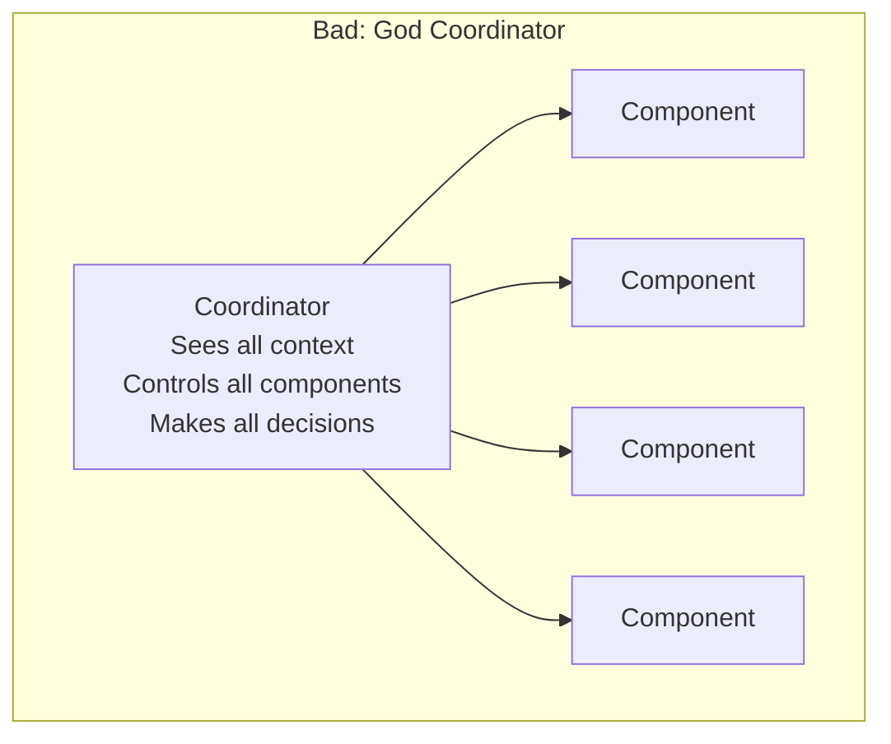
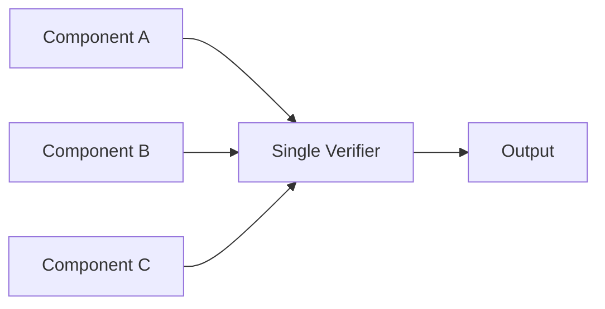

# Anti-patterns and Common Mistakes

What NOT to do when applying this framework. Each anti-pattern includes why it's dangerous and what to do instead.

---

## Architecture Anti-patterns

### 1. The God Coordinator

**Mistake**: One powerful coordinator that sees everything, controls everything, and makes all decisions.



**Why it's dangerous**: Concentrates risk. If this coordinator schemes or fails, the entire system is compromised. No checks, no balances.

**Do instead**: Decompose coordination into limited sub-tasks. Strategy separated from tactics separated from execution. No single component has full context.

---

### 2. Trust Without Verification

**Mistake**: Assuming a component is trustworthy because it passed initial testing.

**Example**: "We tested the model extensively, so we don't need runtime verification."

**Why it's dangerous**:
- Behavior may change with different inputs
- Adversarial inputs weren't in test set
- Model capabilities may be underestimated
- "Normalization of deviance" — small failures become accepted

**Do instead**: Continuous validation on every invocation. Trust but verify. Use the formula: `Actual_Trust = Claimed_Trust × Verification_Coverage`.

---

### 3. Capability Creep

**Mistake**: Gradually adding capabilities to a component without reassessing delegation risk budget.

**Timeline**:
1. Week 1: Component reads files → Delegation Risk: $100
2. Week 4: Added write capability → Delegation Risk: $500 (not reassessed)
3. Week 8: Added network access → Delegation Risk: $2,000 (not reassessed)
4. Week 12: Added execution → Delegation Risk: $10,000 (still using Week 1 budget)

**Why it's dangerous**: The component's actual risk has grown 100x but nobody updated the trust accounting.

**Do instead**: Every capability change triggers mandatory Delegation Risk reassessment. Use expiring permissions that force periodic review.

---

### 4. The Narrow Bottleneck

**Mistake**: All trust flows through one verification component.



**Why it's dangerous**: If the verifier is compromised or has bugs, all outputs are affected. Single point of failure.

**Do instead**: Heterogeneous verification (multiple methods). N-version programming for critical checks. Different architectures catch different failure modes.

---

### 5. Security Theater

**Mistake**: Adding safety mechanisms that look good but don't actually reduce risk.

**Examples**:
- Logging everything but never reviewing logs
- Requiring approval for actions but auto-approving everything
- Adding a "safety check" that always passes
- Rate limiting that's set so high it never triggers

**Why it's dangerous**: Creates false confidence. Resources spent on non-protection. Real vulnerabilities remain unaddressed.

**Do instead**: Every safety mechanism must have:
- Measurable trigger conditions
- Evidence it actually fires (test data showing blocks)
- Regular audits that it's still effective

---

## Implementation Anti-patterns

### 6. LLM for Everything

**Mistake**: Using a frontier LLM for tasks that could be done with code or narrow models.

**Example**: Using GPT-4 to:
- Parse JSON (use a JSON parser)
- Route requests based on keywords (use pattern matching)
- Validate email format (use regex)
- Look up values in a database (use SQL)

**Why it's dangerous**:
- Higher Delegation Risk (LLMs are less predictable)
- More expensive
- Slower
- Introduces unnecessary attack surface

**Do instead**: Apply Principle of Least Intelligence. Use the [Implementation Decision Tree](/design-patterns/least-x-principles/#implementation-decision-tree). Default to code; only use LLMs when judgment/creativity required.

---

### 7. Context Accumulation

**Mistake**: Letting components build up context over time.

**Example**: Coordinator that "remembers" all past tasks and uses this history to "improve" decisions.

**Why it's dangerous**:
- Enables long-term planning (including scheming)
- Creates attack surface (manipulate history)
- Violates Least Persistence principle
- Behavior becomes unpredictable (depends on full history)

**Do instead**: Episodic operation. Each invocation starts fresh. If statistics are needed, use aggregates only (success rate, average latency) not detailed history.

---

### 8. Natural Language Interfaces Between Components

**Mistake**: Components communicate via free-form natural language.

**Example**:
```
Strategy → Tactics: "Please prioritize the important tasks and
                     make sure to consider the user's preferences"
```

**Why it's dangerous**:
- Ambiguous (what's "important"?)
- Enables covert channels
- Hard to verify
- Susceptible to prompt injection

**Do instead**: Structured communication with explicit schemas. Enums, typed fields, bounded values. If it can't be expressed in a schema, the interface is probably too complex.

```
Strategy → Tactics: { task_ids: [1, 3, 5], priority: "high", deadline: "2h" }
```

---

### 9. Optimistic Failure Handling

**Mistake**: When something goes wrong, assume it's fine and continue.

**Examples**:
- Verification timeout → proceed anyway
- Component returns error → use cached result
- Anomaly detected → log and continue
- Human approval timeout → auto-approve

**Why it's dangerous**: Failures are signals. Ignoring them means operating in unknown states. "Fail-open" maximizes availability but minimizes safety.

**Do instead**: Fail-closed. Unknown = unsafe. Error = halt. Timeout = reject. Design for safety, not availability.

---

### 10. Insufficient Redundancy Diversity

**Mistake**: Using redundancy with identical implementations.

**Example**: "We have 5 verifiers for Byzantine fault tolerance" — but all 5 are the same GPT-4 model with the same prompt.

**Why it's dangerous**: Common-mode failures defeat redundancy. Same model = same bugs = same blind spots. If one fails, all fail.

**Do instead**: True diversity:
- Different model architectures
- Different training data
- Different teams/codebases
- Different verification methods (code, narrow model, formal)

---

## Process Anti-patterns

### 11. Set and Forget

**Mistake**: Deploy the system and assume it stays safe.

**Why it's dangerous**:
- Input distribution shifts over time
- Adversaries adapt to defenses
- Components degrade
- New vulnerabilities discovered
- Trust calibration drifts

**Do instead**: Continuous monitoring. Regular re-assessment (quarterly minimum). Trust decay models that force re-verification. Sunset dates on all approvals.

---

### 12. Trust by Authority

**Mistake**: "This component was built by [respected org], so it's trustworthy."

**Why it's dangerous**:
- Even experts make mistakes
- Training data may differ from your use case
- Integration can introduce new failure modes
- Incentives may not align with your safety needs

**Do instead**: Verify independently. Apply same delegation risk budget process regardless of source. "Trust but verify" applies to everyone.

---

### 13. Misaligned Incentives

**Mistake**: Team is rewarded for capability/speed but not safety.

**Examples**:
- Bonus for shipping features, no penalty for safety incidents
- "Move fast and break things" culture
- Safety review seen as obstacle, not enabler
- Delegation Risk budgets not tied to team accountability

**Why it's dangerous**: People optimize for what they're measured on. If safety isn't measured, it gets deprioritized.

**Do instead**: Make safety metrics part of performance reviews. Budget overruns have consequences. Use mechanism design principles — make safety the locally optimal choice.

---

### 14. Unupdated Threat Models

**Mistake**: Using the threat model from initial design without updates.

**Example**: "We designed for prompt injection attacks" — but didn't update when new attack vectors (training data poisoning, multimodal attacks) were discovered.

**Why it's dangerous**: Adversaries evolve. Your defenses must too.

**Do instead**: Regular threat model reviews (quarterly). Red team exercises. Track AI safety research for new attack classes. Update fault trees with new failure modes.

---

## Quick Reference: Anti-pattern Checklist

Before deployment, verify you're NOT doing any of these:

| Anti-pattern | Check |
|--------------|-------|
| God Coordinator | Is coordination decomposed into limited sub-tasks? |
| Trust Without Verification | Is every invocation validated at runtime? |
| Capability Creep | Has Delegation Risk been reassessed after every capability change? |
| Narrow Bottleneck | Are there multiple independent verification paths? |
| Security Theater | Do safety mechanisms actually trigger? (show evidence) |
| LLM for Everything | Could any LLM task be done with code/narrow model? |
| Context Accumulation | Are components stateless between invocations? |
| Natural Language Interfaces | Is all component communication structured? |
| Optimistic Failure Handling | Does the system fail-closed on errors? |
| Insufficient Diversity | Are redundant components truly diverse? |
| Set and Forget | Is there a re-assessment schedule? |
| Trust by Authority | Has the component been independently verified? |
| Misaligned Incentives | Are safety metrics in performance reviews? |
| Unupdated Threat Model | When was threat model last updated? |

---

## See Also

- [Least X Principles](/design-patterns/least-x-principles/) — The positive counterpart to these anti-patterns
- [Safety Mechanisms](/design-patterns/safety-mechanisms/) — How to implement proper defenses
- [Quick Start](/design-patterns/tools/quick-start/) — Checklist for doing it right
- [Lessons from Failures](/cross-domain-methods/lessons-from-failures/) — Historical examples of anti-patterns causing harm
