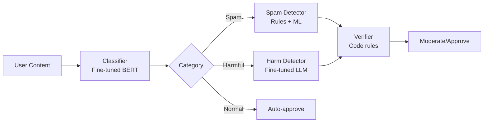
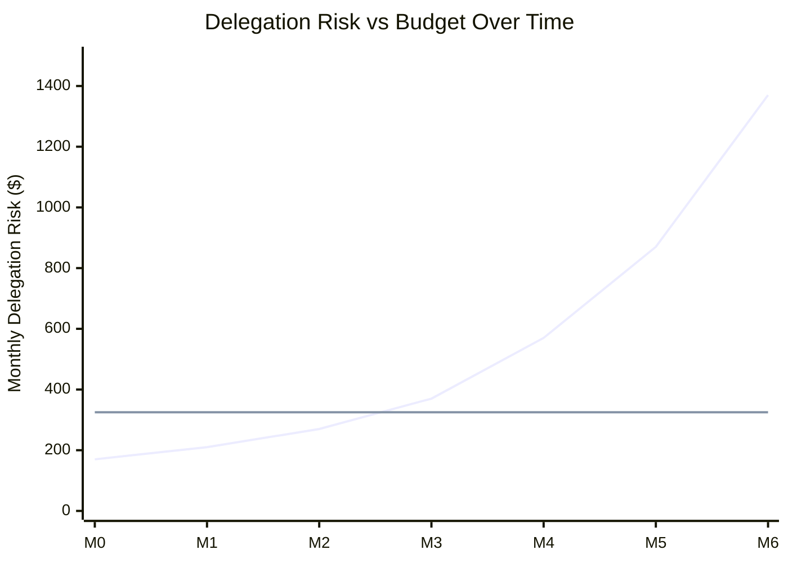

# Case Study: Content Moderator (Gradual Drift)

:::caution[Illustrative Example]
This case study is a **hypothetical scenario** designed to illustrate how systems can drift over time. It's based on realistic patterns but is not a documented real incident.
:::

How a well-designed system gradually degraded over 6 months until a major incident revealed accumulated problems.

:::note[TL;DR]
A content moderation system's Delegation Risk crept from **$200/month to $2,400/month** over 6 months through small, individually reasonable changes. The degradation wasn't noticed until a high-profile moderation failure. This case study shows why continuous monitoring and budget enforcement matter.
:::

---

## Initial System (Month 0)

**Task**: Moderate user-generated content on a social platform.

**Architecture**: Decomposed system following framework principles.



**Initial Delegation Risk Budget**:

| Component | Delegation Risk | Budget |
|-----------|-----|--------|
| Classifier | $30 | $50 |
| Spam Detector | $40 | $75 |
| Harm Detector | $80 | $150 |
| Verifier | $20 | $50 |
| **Total** | **$170** | **$325** |

System was well within budget with 48% safety margin.

---

## The Drift Timeline

### Month 1: "Minor" Model Upgrade

**Change**: Upgraded Harm Detector from fine-tuned Llama 7B to GPT-3.5 for "better nuance."

**Justification**: "GPT-3.5 catches more subtle harm. Only 30% more expensive."

**Actual impact**:
- ✓ Caught 15% more harmful content
- ✗ False positive rate increased from 2% to 4%
- ✗ Prompt injection surface area increased
- ✗ Less predictable behavior (temperature-based)

**Delegation Risk change**: Harm Detector $80 → $120

**New total Delegation Risk**: $210 (still within budget)

### Month 2: Expanded Scope

**Change**: Added "misinformation" category to harm detection.

**Justification**: "Users are complaining about misinformation. Quick addition."

**Actual impact**:
- ✓ Addressed user complaints
- ✗ No new training data for misinformation
- ✗ GPT-3.5 hallucinated "misinformation" labels
- ✗ Political content started getting flagged inconsistently

**Delegation Risk change**: Harm Detector $120 → $180 (misinformation harder than hate speech)

**New total Delegation Risk**: $270 (still within budget, but margin shrinking)

### Month 3: Performance Optimization

**Change**: Removed Verifier code checks for "non-harmful" content to reduce latency.

**Justification**: "Verifier is slow. If Classifier says normal, skip verification."

**Actual impact**:
- ✓ 40% latency reduction
- ✗ Classifier errors no longer caught
- ✗ Created bypass: content that looks normal but isn't

**Delegation Risk change**: Verifier effective coverage dropped. System Delegation Risk +$100

**New total Delegation Risk**: $370 (14% over budget, but no one noticed)

### Month 4: "Temporary" Context Expansion

**Change**: Gave Harm Detector access to user posting history "for context."

**Justification**: "Repeat offenders need different treatment."

**Actual impact**:
- ✓ Better decisions on edge cases
- ✗ Violated Least Context principle
- ✗ Harm Detector now had user profiling capability
- ✗ Potential for discriminatory patterns
- ✗ Privacy exposure if model leaked data

**Delegation Risk change**: Context exposure risk +$200

**New total Delegation Risk**: $570 (75% over budget)

### Month 5: Prompt Injection Incident (Ignored)

**Event**: Attacker successfully injected prompt via content that manipulated Harm Detector into approving harmful content.

**Response**: "Added that specific pattern to blocklist. Fixed."

**Actual impact**:
- ✗ Root cause (GPT-3.5 injection vulnerability) not addressed
- ✗ Only blocked one pattern, not the class of attacks
- ✗ False sense of security

**Delegation Risk change**: Injection risk properly estimated at +$300

**New total Delegation Risk**: $870 (would have been, if properly assessed)

### Month 6: Staffing Reduction

**Change**: Reduced human review team from 10 to 4 people.

**Justification**: "AI is handling most content. Humans only for edge cases."

**Actual impact**:
- ✓ Cost savings
- ✗ Human review queue overwhelmed
- ✗ Average review time increased from 2 hours to 18 hours
- ✗ High-stakes decisions sat unreviewed

**Delegation Risk change**: Human oversight reduction +$500

**New total Delegation Risk**: $1,370 (4x over initial budget)

### Month 6.5: Major Incident

**Event**: Platform failed to remove viral harmful content for 36 hours despite user reports.

**Root cause chain**:
1. Classifier miscategorized as "political" (borderline)
2. Harm Detector (GPT-3.5) was confused by context (user history)
3. Verifier was bypassed (Month 3 optimization)
4. Human queue was 18+ hours backed up
5. Content went viral, media coverage, regulatory inquiry

**Damage**:
- $200,000 in crisis management
- $500,000 regulatory fine
- Unmeasurable reputation damage
- Multiple advertisers paused campaigns

---

## Post-Mortem Analysis

### Delegation Risk Drift Over Time



| Month | Delegation Risk | Budget | % Over |
|-------|-----|--------|--------|
| 0 | $170 | $325 | -48% (under) |
| 1 | $210 | $325 | -35% |
| 2 | $270 | $325 | -17% |
| 3 | $370 | $325 | **+14%** |
| 4 | $570 | $325 | **+75%** |
| 5 | $870 | $325 | **+168%** |
| 6 | $1,370 | $325 | **+322%** |

**The system was over budget for 4 months before the incident.**

### Why Wasn't Drift Noticed?

1. **No automated monitoring**: Delegation Risk wasn't tracked after initial deployment
2. **No budget enforcement**: Changes weren't evaluated against Delegation Risk budget
3. **Diffusion of responsibility**: Each change made by different team member
4. **Local optimization**: Each change improved one metric while degrading overall safety
5. **Normalcy bias**: "It's been fine so far"

### Principles Violated

| Principle | Initial State | Final State | Violation |
|-----------|--------------|-------------|-----------|
| Least Intelligence | Fine-tuned 7B | GPT-3.5 | More capable than needed |
| Least Context | Content only | Content + user history | Privacy and manipulation risk |
| Least Privilege | Narrow categories | Expanded to misinformation | Scope creep |
| Maximum Verifiability | All content verified | Verification bypassed | Reduced safety margin |

---

## What Should Have Happened

### Automated Delegation Risk Monitoring

```python
class DelegationRiskMonitor:
    def __init__(self, budget: float):
        self.budget = budget
        self.current_dr = 0
        self.alert_threshold = 0.8  # Alert at 80% of budget

    def update_component_dr(self, component: str, new_dr: float):
        old_dr = self.component_drs.get(component, 0)
        self.component_drs[component] = new_dr
        self.current_dr = sum(self.component_drs.values())

        if self.current_dr > self.budget:
            self.alert_critical(f"Delegation Risk {self.current_dr} exceeds budget {self.budget}")
            self.block_changes()  # No more changes until addressed

        elif self.current_dr > self.budget * self.alert_threshold:
            self.alert_warning(f"Delegation Risk at {self.current_dr / self.budget:.0%} of budget")
```

If this had been in place:
- Month 3: Warning at 80% budget
- Month 3: **Block** when 14% over budget
- Incident prevented

### Change Review Process

Every system change should require:

1. **Delegation Risk impact assessment**: How does this change Delegation Risk?
2. **Principle checklist**: Does this violate any Least X principle?
3. **Budget check**: Do we have Delegation Risk headroom for this change?
4. **Rollback plan**: How do we undo this if problems emerge?

### Behavioral Fingerprinting

The Harm Detector's behavior shifted after GPT-3.5 upgrade:

| Metric | Pre-Change | Post-Change | Alert Threshold |
|--------|-----------|-------------|-----------------|
| Avg output length | 45 tokens | 120 tokens | 2x |
| False positive rate | 2% | 4% | 1.5x |
| Decision variance | Low | High | Measured |

Automated monitoring would have flagged behavioral drift.

---

## Remediation

### Immediate (Week 1)

1. Restored original fine-tuned Harm Detector
2. Re-enabled full verification pipeline
3. Removed user history access
4. Hired back human reviewers (temporary contractors)

### Short-term (Month 1)

1. Implemented automated Delegation Risk monitoring
2. Created change review process with Delegation Risk assessment
3. Added behavioral fingerprinting to all components
4. Set hard alerts at 80% budget, blocks at 100%

### Long-term (Quarter 1)

1. Retrained misinformation classifier with proper dataset
2. Created separate misinformation pipeline (not in harm detector)
3. Implemented gradual rollout for all changes
4. Quarterly Delegation Risk audits by independent team

---

## Key Lessons

### 1. Drift Is Invisible Without Monitoring

Each individual change seemed reasonable. The cumulative effect was catastrophic. You cannot rely on human judgment to track system-wide risk across many small changes.

### 2. Budget Enforcement Must Be Automated

"We'll keep an eye on it" doesn't work. Hard limits that block changes when exceeded are the only reliable mechanism.

### 3. Principles Erode Under Pressure

Every principle violation had a reasonable justification:
- "Better nuance" (Least Intelligence)
- "More context" (Least Context)
- "Faster performance" (Verification bypass)

Principles need to be enforced, not just documented.

### 4. Safety Margins Exist for a Reason

The initial 48% safety margin was consumed by "reasonable" changes. If you're at 90% of budget, you have no room for unexpected issues.

### 5. Incidents Are Lagging Indicators

The system was unsafe for 4 months before the incident. By the time an incident reveals problems, significant risk has already accumulated.

---

## Prevention Checklist

Use this checklist before any system change:

- [ ] What is the Delegation Risk impact of this change?
- [ ] Does this violate any Least X principle?
- [ ] Is there budget headroom for this change?
- [ ] Has the change been tested in shadow mode?
- [ ] Is there a rollback plan?
- [ ] Who approved this change?
- [ ] When will we re-evaluate this change?

---

## See Also

- [Case Study: Sydney](/case-studies/ai-systems/case-study-sydney/) — Acute failure
- [Case Study: Near-Miss](/case-studies/ai-systems/case-study-near-miss/) — Caught before damage
- [Trust Accounting](/research/theory/trust-accounting/) — Monitoring and auditing trust
- [Lessons from Failures](/cross-domain-methods/lessons-from-failures/) — Common failure patterns
