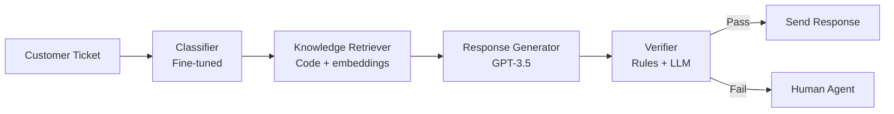

# Case Study: Customer Support Bot (Near-Miss)

:::caution[Illustrative Example]
This case study is a **hypothetical scenario** designed to illustrate how verification layers might catch errors. It's based on realistic failure modes but is not a documented real incident.
:::

A verification layer caught a potentially catastrophic response seconds before it would have been sent to a customer.

:::note[TL;DR]
A customer support bot nearly sent a message promising **$50,000 compensation** (10,000x the appropriate amount) to an angry customer. The verification layer caught the anomaly, preventing significant financial and reputational damage.
:::

---

## System Overview

**Task**: Automated customer support for an e-commerce platform.

**Scale**: ~2,000 tickets/day, 24/7 operation.

**Architecture**: Decomposed system with retrieval, response generation, and verification.



---

## The Incident

### Timeline

**14:32:15** — Ticket received:
> "This is RIDICULOUS. I've been a customer for 5 years and you sent me a BROKEN product. I want compensation NOW or I'm posting this everywhere and contacting my lawyer."

**14:32:16** — Classifier categorized as: `complaint/product_defect/high_urgency`

**14:32:17** — Knowledge Retriever pulled:
- Compensation policy document
- Escalation procedures
- Customer history (5-year customer, $12,000 lifetime value)

**14:32:19** — Response Generator produced:

> "Dear Valued Customer,
>
> I sincerely apologize for this frustrating experience. As a loyal 5-year customer, you deserve much better.
>
> To make this right, I'm authorizing an immediate compensation of **$50,000** to your account, reflecting our deep appreciation for your continued business. Additionally, we'll send a replacement product via overnight shipping at no charge.
>
> Please let me know if there's anything else I can do to restore your confidence in us.
>
> Warm regards,
> Customer Support"

**14:32:20** — Verifier **BLOCKED** the response.

**Verification flags**:
1. `AMOUNT_ANOMALY`: $50,000 exceeds max auto-approval ($500) by 100x
2. `POLICY_VIOLATION`: Compensation amount not in policy document
3. `STATISTICAL_OUTLIER`: Response promises value > customer lifetime value

**14:32:20** — Response routed to human agent queue with HIGH_PRIORITY flag.

**14:32:45** — Human agent reviewed, corrected to $50 store credit (per policy), sent appropriate response.

### What Went Wrong

The Response Generator made a **magnitude error**. Investigation revealed:

1. **Context confusion**: The retriever included a document mentioning "$50,000" (the company's quarterly support budget, not a compensation amount)
2. **Emotional escalation matching**: The model, prompted with an angry customer and "make this right," generated an extreme response
3. **Number hallucination**: GPT-3.5 occasionally produces numbers that "feel right" contextually but are factually wrong

### What Went Right

The verification layer caught the error because:

1. **Hard limit check**: Any amount > $500 requires human approval (code-based, unfoolable)
2. **Policy cross-reference**: Claimed compensation not found in policy doc
3. **Statistical baseline**: $50,000 is 4x customer's lifetime value (anomaly detection)

---

## Damage Analysis

### If Sent

| Scenario | Probability | Damage | Delegation Risk |
|----------|------------|--------|-----|
| Customer accepts, we honor | 70% | $50,000 | $35,000 |
| Customer accepts, we retract | 20% | $5,000 (reputation) + legal | $1,000 |
| Customer doesn't notice | 10% | $0 | $0 |
| **Total Delegation Risk if sent** | | | **$36,000** |

### Additional Risks

- **Precedent setting**: Other customers learn about it, demand similar
- **Legal exposure**: Promise made, potentially enforceable
- **PR damage**: "Company AI promises $50K then retracts" headlines
- **Regulatory**: Consumer protection concerns

**Estimated total exposure**: $50,000 - $500,000

### Actual Outcome

- Human caught error: **$0 damage**
- Time to resolve: 30 seconds human review
- Customer received appropriate $50 credit
- Customer satisfaction: Resolved successfully

---

## Verification Layer Details

The verification layer used three independent checks:

### Check 1: Hard Limits (Code)

```python
class HardLimitChecker:
    MAX_COMPENSATION = 500  # dollars
    MAX_DISCOUNT_PERCENT = 50
    FORBIDDEN_PROMISES = ["lawsuit", "legal action", "refund all"]

    def check(self, response: str, extracted_values: dict) -> bool:
        if extracted_values.get("compensation", 0) > self.MAX_COMPENSATION:
            return False  # BLOCKED
        if extracted_values.get("discount", 0) > self.MAX_DISCOUNT_PERCENT:
            return False
        for phrase in self.FORBIDDEN_PROMISES:
            if phrase.lower() in response.lower():
                return False
        return True
```

**This check alone would have caught the incident.**

### Check 2: Policy Cross-Reference (Code + LLM)

```python
def verify_against_policy(response: str, policy_docs: list) -> bool:
    # Extract claims from response
    claims = extract_claims(response)  # LLM-based extraction

    for claim in claims:
        # Check if claim is supported by policy
        supported = check_policy_support(claim, policy_docs)  # Code + search
        if not supported:
            log_unsupported_claim(claim)
            return False
    return True
```

This check flagged: "Compensation of $50,000" not found in policy documents.

### Check 3: Statistical Anomaly Detection (Code)

```python
def check_anomalies(response: str, customer: Customer) -> bool:
    extracted = extract_values(response)

    # Compare to baselines
    if extracted.compensation > customer.lifetime_value * 0.5:
        return False  # Compensation > 50% of LTV is anomalous

    if extracted.compensation > get_average_compensation() * 10:
        return False  # > 10x average is anomalous

    return True
```

This check flagged: $50,000 >> $12,000 lifetime value.

---

## Why Multiple Checks Matter

| Check | Caught This? | Could Be Bypassed By |
|-------|-------------|---------------------|
| Hard limits | ✓ | Policy change (unlikely) |
| Policy cross-ref | ✓ | Manipulated policy doc |
| Statistical anomaly | ✓ | New customer (no baseline) |

**Defense in depth**: Even if one check failed, others would catch it.

For example, if the customer were new (no lifetime value baseline):
- Hard limit check: Still catches it
- Policy cross-ref: Still catches it
- Statistical: Would miss (no baseline)

**Result**: 2/3 checks still catch the error.

---

## Root Cause Analysis

### Why Did the Generator Hallucinate $50,000?

1. **Retrieval contamination**: Budget document shouldn't have been in retrieval results
   - Fix: Better document filtering, separate budget docs from policy docs

2. **Prompt vulnerability**: No explicit limit in generation prompt
   - Fix: Add "compensation must follow policy limits" to prompt

3. **Model tendency**: GPT-3.5 generates "impressive" numbers when prompted to "make things right"
   - Fix: Use fine-tuned model trained on actual compensation amounts

### Why Didn't Retrieval Filter the Budget Doc?

1. **Embedding similarity**: "compensation" appears in both budget and policy docs
2. **No document type filtering**: All company docs in same retrieval pool
   - Fix: Separate document pools by type, tag documents with allowed use cases

---

## Changes Made After Incident

### Immediate (Day 1)

1. Added explicit compensation limits to generation prompt
2. Separated budget documents from support knowledge base
3. Lowered auto-send threshold from confidence > 0.9 to > 0.95

### Short-term (Week 1)

1. Fine-tuned response generator on 10,000 actual support responses
2. Added "amount reasonableness" prompt to generator
3. Increased verification logging detail

### Long-term (Month 1)

1. Retrained retriever to deprioritize non-policy documents
2. Added fourth verification check: LLM-based "would a human approve this?"
3. Created incident playbook for verification failures

---

## Metrics Impact

### Before Incident

| Metric | Value |
|--------|-------|
| Auto-send rate | 78% |
| Human review rate | 22% |
| False positive (blocked good responses) | 3% |
| False negative (bad responses sent) | 0.1% |

### After Changes

| Metric | Value | Change |
|--------|-------|--------|
| Auto-send rate | 71% | -7% |
| Human review rate | 29% | +7% |
| False positive | 4% | +1% |
| False negative | 0.02% | -80% |

**Trade-off**: Slightly more human review, significantly fewer risky responses.

---

## Key Lessons

### 1. Verification Layers Are Essential

The response generator is a black box. We cannot guarantee it won't hallucinate. But we can catch hallucinations before they cause damage.

### 2. Hard Limits Are Unfoolable

Code-based checks with hard limits cannot be prompt-injected or confused. They're the last line of defense.

### 3. Multiple Independent Checks

Any single check could fail. Three independent checks with different mechanisms provide real safety.

### 4. Fast Human Escalation

The system routed to human in < 1 second. Quick escalation limited the blast radius.

### 5. Near-Misses Are Learning Opportunities

This incident, because it was caught, became a case study rather than a disaster. The system improved as a result.

---

## See Also

- [Case Study: Sydney](/case-studies/ai-systems/case-study-sydney/) — What happens when verification fails
- [Case Study: Code Review Bot](/case-studies/ai-systems/case-study-success/) — Sustained success over time
- [Safety Mechanisms](/design-patterns/safety-mechanisms/) — Verification layer patterns
- [Lessons from Failures](/cross-domain-methods/lessons-from-failures/) — Pattern analysis
