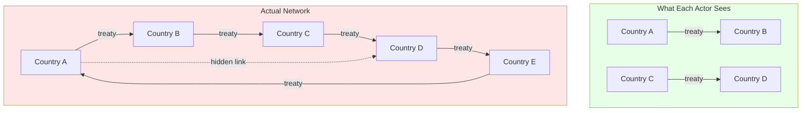
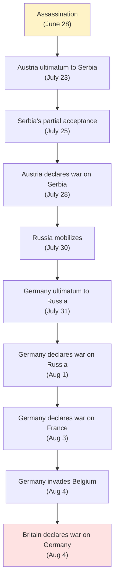
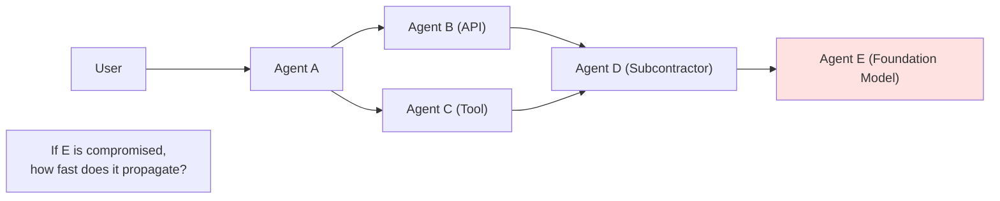

# Alliance Cascades: When Bilateral Becomes Systemic

:::note[TL;DR]
When actors form bilateral alliances without mapping the full network, local commitments can create global catastrophe. WW1 is the canonical example: each country understood their own treaties, but nobody modeled the system. A regional assassination triggered world war because the sum of bilateral relationships ≠ system behavior.
:::

---

## The Pattern

**Alliance cascade failure** occurs when:
1. Multiple actors form bilateral relationships (treaties, contracts, dependencies)
2. Each actor reasons about their own relationships, not the network
3. A trigger event activates one relationship
4. That activation triggers others through hidden connections
5. The cascade propagates faster than decision-making can respond

This differs from [correlation under stress](/research/trust-behavior/correlated-failure-modeling/#correlation-under-stress) (like 2008) where correlations *increase* during crisis. In alliance cascades, the correlations were always there—just invisible to the actors.



---

## Case Study: World War I

### The Setup

By 1914, Europe's major powers had constructed a web of alliances:

**Triple Entente:**
- France-Russia Alliance (1894)
- Entente Cordiale: France-Britain (1904)
- Anglo-Russian Entente (1907)

**Triple Alliance:**
- Germany-Austria-Hungary (1879)
- Italy joins (1882) — though with escape clauses

**The Balkan Tangle:**
- Serbia as Russian client state
- Austria-Hungary's Bosnian annexation (1908)
- Multiple Balkan wars (1912-1913)

### What Each Actor Saw

| Country | Primary Concern | Key Alliance | Perceived Risk |
|---------|-----------------|--------------|----------------|
| **Austria-Hungary** | Serbian nationalism | Germany backup | Regional Balkan war |
| **Germany** | Two-front war | Austria support | Contained conflict |
| **Russia** | Slavic solidarity | French alliance | Deterrence of Austria |
| **France** | German revenge (1870) | Russian alliance | Defensive balance |
| **Britain** | Balance of power | Entente (informal) | Naval/colonial issues |

**Critical blindspot:** Each country modeled their bilateral relationships as independent. Nobody computed: "If Austria mobilizes against Serbia, what happens system-wide?"

### The Hidden Couplings

Beyond formal treaties, **hidden dependencies** made the network far more connected:

**1. Mobilization Schedules**
The Schlieffen Plan required Germany to attack France *before* Russia could fully mobilize. This created a terrifying coupling:
- If Russia mobilizes → Germany must mobilize immediately
- German mobilization → attack through Belgium (the only plan they had)
- Attack through Belgium → Britain enters (Belgian neutrality treaty)

The *speed* of the cascade was hardcoded into war plans.

**2. Secret Clauses**
Many treaties had unpublished provisions. Germany didn't fully know what Britain had promised France. Russia wasn't sure of British commitment.

**3. Implicit Commitments**
Beyond formal treaties, there were:
- Staff talks between British and French militaries (implying coordination)
- Naval agreements (Britain to cover Channel, France to cover Mediterranean)
- Reputation and credibility concerns

**4. Economic Interdependence**
Banking networks, trade relationships, and gold flows created additional hidden links that would amplify any conflict.

### The Cascade

**June 28, 1914:** Archduke Franz Ferdinand assassinated in Sarajevo.



**Five weeks** from assassination to world war. The cascade speed exceeded decision-making capacity.

### The Entanglement Tax

**Perceived risk (bilateral thinking):**
- Austria-Serbia conflict: Regional war, contained
- Probability of world war from Balkan incident: ~5%?

**Actual risk (network reality):**
- Full European war: Near-certain given alliance structure
- Probability given trigger: ~95%

**Entanglement Tax:** ~20× underestimate of systemic risk.

---

## Why Nobody Saw It

### Bilateral Thinking

Each foreign ministry modeled their own relationships:
- "We have a treaty with X"
- "X will support us if Y attacks"
- "This deters Y from attacking"

Nobody asked: "What is the correlation matrix of all European alliance activations?"

### Complexity Blindness

The network had:
- 6 major powers
- ~15 significant bilateral relationships
- Unknown number of secret provisions
- Implicit commitments and expectations

Computing the full activation graph was beyond 1914 analytical capacity.

### Motivated Reasoning

Each power believed:
- Their alliances were defensive
- War was unlikely because everyone knew it would be catastrophic
- Adversaries would back down when facing a firm alliance

**The tragedy:** Everyone was partially right about their local view, catastrophically wrong about the system.

### Speed vs. Decision-Making

The Schlieffen Plan created a **time bomb**: once mobilization started, stopping was nearly impossible.

| Action | Time Required | Decision Window |
|--------|---------------|-----------------|
| Russian mobilization | 6 weeks | Days to decide |
| German mobilization | 2 weeks | Hours once Russia moves |
| Schlieffen Plan execution | Must start immediately | No pause possible |
| Diplomatic de-escalation | Weeks of negotiation | Not available |

The system was designed to cascade faster than humans could intervene.

---

## Modern Parallels

### Financial Contagion

The 2008 crisis showed similar patterns:
- Banks had bilateral relationships (derivatives, lending)
- Nobody mapped the full network
- Lehman's failure triggered cascade through hidden connections
- Speed of deleveraging exceeded regulatory response

**Difference from WW1:** In 2008, correlations *spiked* under stress. In WW1, the correlations were *always* present but unmapped.

### Supply Chain Dependencies

Modern supply chains exhibit alliance-cascade vulnerability:
- Companies optimize bilateral supplier relationships
- Hidden dependencies through shared Tier-2/3 suppliers
- Single point of failure (Taiwan semiconductors, rare earths)
- Cascade speed exceeds reshoring capability

**Example:** 2021 chip shortage—a drought in Taiwan + Texas freeze + COVID = global auto production halt.

### AI Agent Networks

As AI agents increasingly delegate to other agents:
- Each agent knows its immediate dependencies
- Nobody maps the full network
- A vulnerability in one model could cascade through the system
- Response time for AI incidents may be minutes, not days



**Key question:** What's the "mobilization schedule" of AI systems? How fast do cascades propagate vs. human response time?

### API Dependency Chains

Modern software has deep dependency chains:
- Your app → Cloud provider → DNS → Payment processor → Bank API → ...
- Each link seems robust
- Aggregate failure probability much higher than any link
- Cascade failures are routine (AWS outages taking down half the internet)

---

## Detection and Prevention

### Mapping Hidden Networks

**For human systems:**
1. **Treaty mapping:** Document not just your alliances but allies' alliances
2. **Scenario modeling:** "If X happens, what triggers?"
3. **Red team:** Adversary's view of your alliance network
4. **Time analysis:** How fast can cascades propagate vs. decision cycles?

**For AI systems:**
1. **Dependency graphs:** Full tree of API calls, model dependencies
2. **Failure correlation testing:** If Provider A fails, who else fails?
3. **Cascade simulation:** Inject failures, measure propagation
4. **Response time analysis:** Human-in-loop latency vs. cascade speed

### Breaking Cascade Paths

**Circuit breakers:**
- Financial: Trading halts, central bank intervention
- AI: Automatic degradation, fallback models
- Political: Cool-off periods, mandatory consultation

**Decoupling mechanisms:**
- Reduce hidden dependencies
- Make commitments conditional rather than automatic
- Build in decision points before cascade

**Speed governors:**
- Slow down automatic responses
- Require human approval for irreversible actions
- Build deliberation time into protocols

### The Mobilization Schedule Problem

The most dangerous cascades have:
1. **Automatic triggers:** No decision point between events
2. **Speed asymmetry:** Cascade faster than deliberation
3. **Irreversibility:** Once started, cannot stop

**Design principle:** Never build systems where the cascade speed exceeds human decision-making capacity without explicit circuit breakers.

---

## Implications for Delegation Risk

### Alliance ≈ Delegation

An alliance is a form of delegation:
- "I delegate my security decisions to this alliance structure"
- "When X happens, I commit to Y"
- "My response is now entangled with my ally's response"

The [Delegation Risk](/delegation-risk/overview/) of alliance A =
Σ P(A triggers cascade) × Damage(cascade outcome)

### Hidden Delegation Chains

When you delegate to Agent A who delegates to Agent B:
- Your Delegation Risk depends on the A→B relationship
- Which may depend on B→C, C→D, etc.
- The "alliance cascade" problem in delegation form

### Network-Aware Risk Budgeting

Standard [risk budgeting](/cross-domain-methods/euler-allocation/) assumes you know the dependencies. Alliance cascades violate this:

**Standard assumption:**
```
Risk(System) = Σ Risk(Component_i) + Σ Cov(i,j) × interaction_ij
```

**Alliance cascade reality:**
```
Risk(System) = f(unknown network structure, hidden trigger conditions, cascade speed)
```

**Implication:** Reserve larger safety margins for systems with unmapped dependencies.

---

## Key Takeaways

:::note[Key Takeaways]
1. **Bilateral thinking is dangerous.** Each actor's local view of their relationships doesn't reveal system behavior.

2. **Sum of bilateral commitments ≠ system behavior.** Emergent cascade dynamics aren't visible from any single node.

3. **Hidden couplings create hidden risk.** Secret clauses, implicit commitments, and shared dependencies bind the network tighter than formal agreements suggest.

4. **Cascade speed matters.** When propagation is faster than decision-making, human intervention becomes impossible.

5. **The entanglement tax can be catastrophic.** WW1's ~20× underestimate of systemic risk cost millions of lives.

6. **Map the network, not just your edges.** Ask: "What happens two hops out? Three?"

7. **Build in circuit breakers.** Design systems with decision points that can interrupt cascades.
:::

---

## See Also

- [Correlated Failure Modeling](/research/trust-behavior/correlated-failure-modeling/) — The 2008 parallel and formal models
- [Channel Integrity Patterns](/design-patterns/channel-integrity/) — Preventing unauthorized coordination
- [Hidden Coordination](/entanglements/cross-domain/hidden-coordination/) — Adversarial use of hidden networks
- [Entanglements Overview](/entanglements/) — Types of entanglement and their effects
- [Exposure Cascade](/delegation-risk/exposure-cascade/) — How risk flows through hierarchies

---

## Further Reading

### Primary Sources
- Clark, Christopher. *The Sleepwalkers: How Europe Went to War in 1914* (2012) — Detailed alliance analysis
- Tuchman, Barbara. *The Guns of August* (1962) — The cascade in action
- Ferguson, Niall. *The Pity of War* (1999) — Counterfactual analysis

### Network Analysis
- Snyder, Glenn H. *Alliance Politics* (1997) — Formal theory of alliance dynamics
- Vasquez, John A. *The War Puzzle Revisited* (2009) — Why wars cluster

### Modern Parallels
- Haldane, Andrew. "Rethinking the Financial Network" (2009) — 2008 as network failure
- Taleb, Nassim. *The Black Swan* (2007) — Hidden dependencies and fat tails
