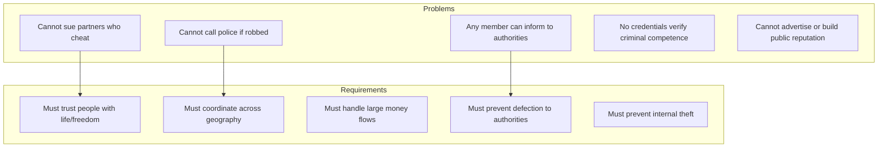
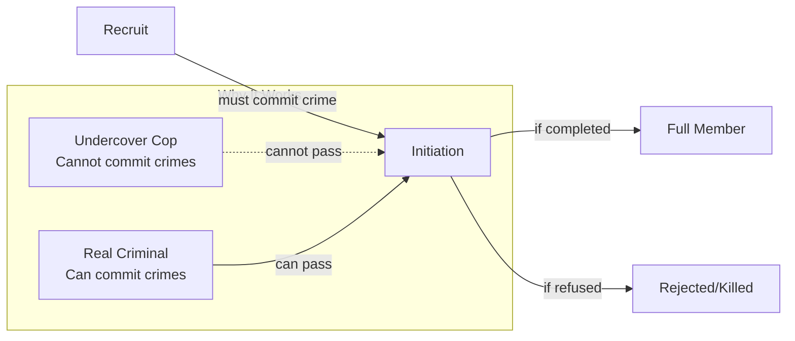
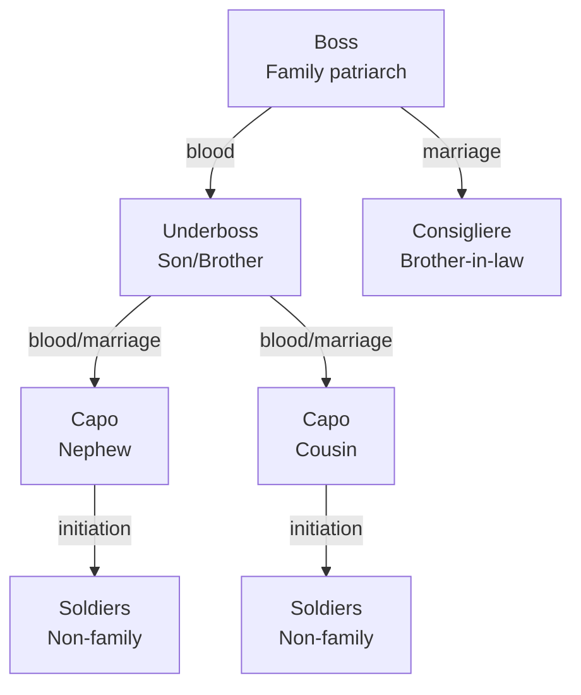
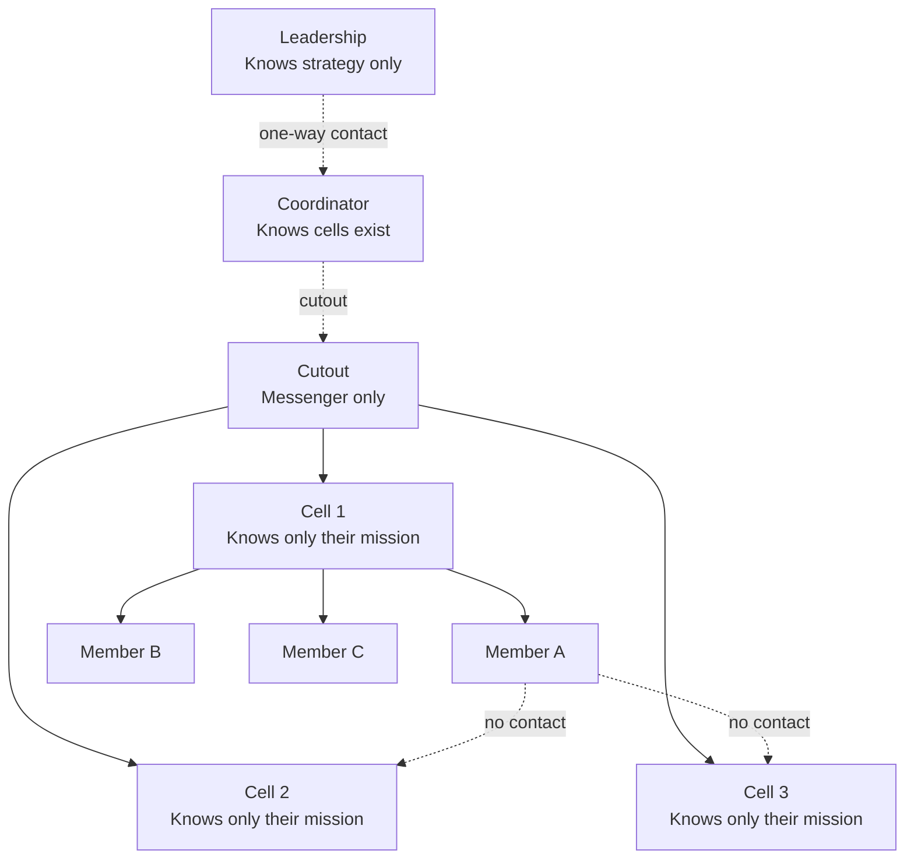
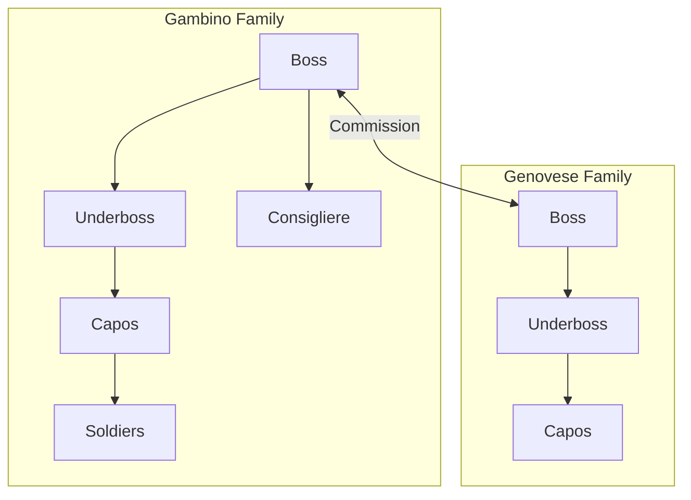
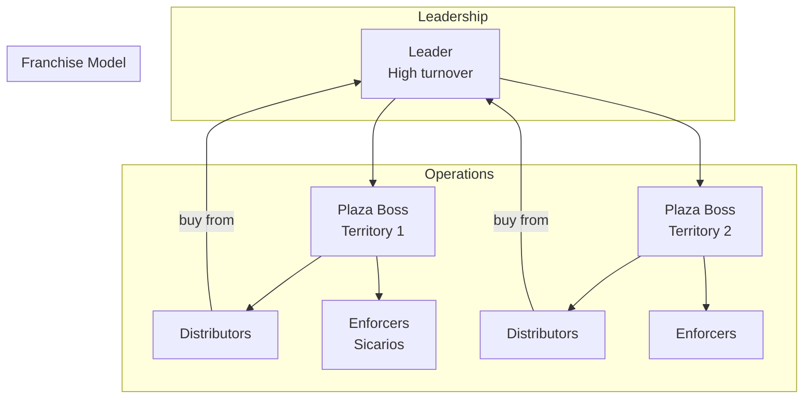
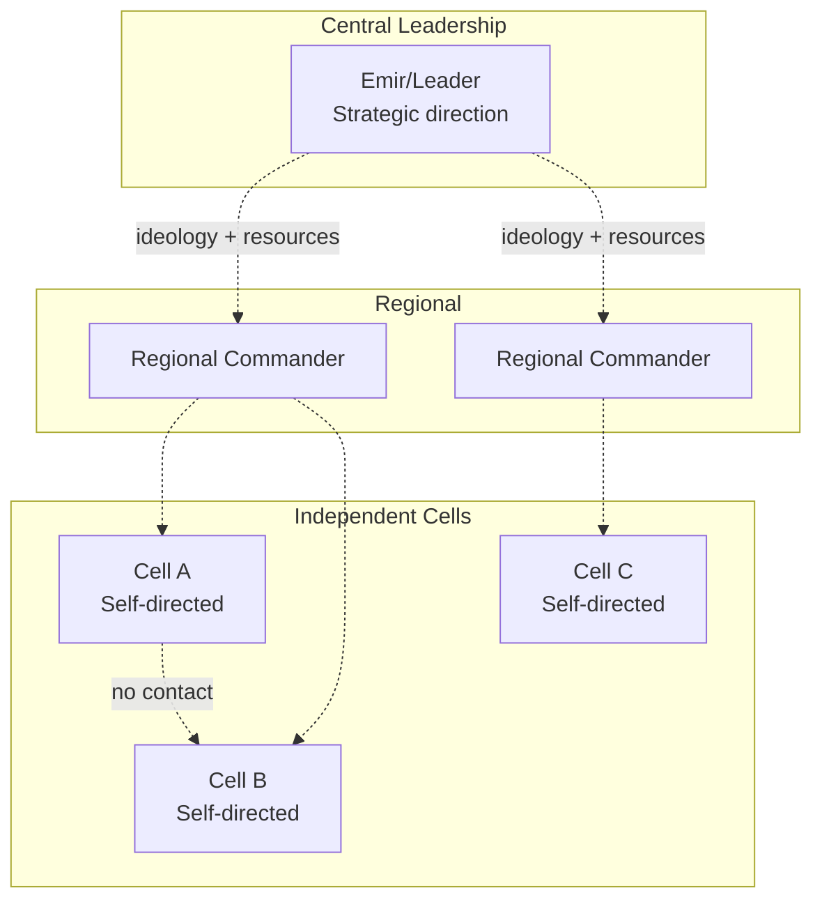

# Criminal Organizations: Trust Without Courts

:::note[Framework Interpretation]
This case study analyzes real phenomena through the lens of our delegation risk framework. The facts about criminal organizations are drawn from criminology research, but the interpretation and parallels to AI systems are our own framing.
:::

Criminal organizations face a fascinating problem: how do you enforce trust when you can't sue for breach of contract, can't call the police if someone cheats you, and your "employees" could destroy your enterprise by talking to the wrong people?

The solutions they've developed—violence as commitment device, initiation rituals as costly signaling, family-based trust, and extreme compartmentalization—anticipate many of the structural trust mechanisms we recommend for AI systems.

:::tip[The Core Insight]
Criminal organizations are **forced to be structurally rigorous** about trust because they can't rely on external enforcement. Their solutions are battle-tested in adversarial conditions—which is exactly the environment we're designing AI systems for.
:::

---

## Part 1: The Trust Problem Without Law

### What Legal Organizations Take for Granted

In legitimate business, trust architecture is supported by:

| External Enforcement | What It Provides |
|---------------------|------------------|
| Contract law | Can sue for breach |
| Criminal law | Theft, fraud are punished by state |
| Reputation systems | Credit scores, BBB, reviews |
| Professional licensing | Credentials verify competence |
| Employment law | Framework for hiring/firing |
| Insurance | Third-party risk absorption |

Criminal organizations have **none of this**. Every trust relationship must be self-enforcing.

### The Criminal Trust Challenge



---

## Part 2: Violence as Trust Mechanism

### The Economics of Criminal Punishment

In legitimate business:
```
Cost of betrayal = Lawsuit damages + Reputation loss
                 ≈ 1-3× amount stolen
```

In criminal organizations:
```
Cost of betrayal = P(caught) × P(punishment succeeds) × Severity(punishment)
```

Where punishment can include death, torture, harm to family.

**For trust to be self-enforcing:**
```
Expected value of betrayal < Expected value of loyalty

E[betrayal] = Gain from betrayal - P(caught) × Cost(punishment)
E[loyalty] = Ongoing income + Safety

Requires: P(caught) × Cost(punishment) > Gain from betrayal - Ongoing income
```

### Calibrating Violence

If a drug courier could steal $100,000 by running off with a shipment:

| Punishment Regime | P(caught) | Punishment | Expected Cost | Theft Deterred? |
|-------------------|-----------|------------|---------------|-----------------|
| Beat up | 0.70 | $5,000 (medical) | $3,500 | No |
| Break legs | 0.70 | $50,000 (permanent injury) | $35,000 | No |
| Kill courier | 0.60 | ∞ (life) | ∞ | Yes |
| Kill family | 0.50 | ∞ × N | ∞ | Yes |

**Criminal organizations converge on extreme violence not from cruelty but from math.** Moderate punishments don't produce self-enforcing trust given the temptations involved.

### The Reputation for Violence

The *reputation* for certain punishment is more valuable than actual punishment:

```
Deterrence value = P(people believe punishment is certain) × Perceived severity
```

**Investment in reputation:**

| Action | Cost | Reputation Gain | ROI |
|--------|------|-----------------|-----|
| Actually kill one traitor | High (risk, resources) | Very high | Moderate |
| Spread stories about killing | Low | Moderate | High |
| Make examples public | Moderate | Very high | Very high |

This is why cartels engage in spectacular violence—it's **marketing** for their punishment capability.

### Delegation Risk of Violence-Based Trust

**For the organization:**

| Failure Mode | P(occurrence/year) | Damage | Delegation Risk |
|--------------|-------------------|--------|-----|
| Member steals and escapes | 0.05 | $500K | $25K |
| Member informs to police | 0.03 | $5M (arrests, seizures) | $150K |
| Member caught, cooperates | 0.10 | $10M (RICO case) | $1M |
| Excessive violence causes war | 0.02 | $20M (losses) | $400K |
| **Organization Delegation Risk** | | | **$1.575M/year** |

**For individual members:**

| Outcome | P(over career) | Damage | Delegation Risk |
|---------|---------------|--------|-----|
| Killed by organization | 0.15 | ∞ | ∞ |
| Killed by rivals | 0.20 | ∞ | ∞ |
| Imprisoned | 0.50 | 10 years × $50K | $250K |
| Successful retirement | 0.15 | 0 | $0 |

**The individual Delegation Risk is catastrophic**—which is why recruitment focuses on those with few alternatives.

---

## Part 3: Initiation as Costly Signaling

### The Economics of Initiation

Problem: How do you know a new recruit isn't an undercover cop?

Solution: Require them to do something an undercover cop cannot do.



### Types of Initiation Rituals

| Initiation Type | What's Required | Why It Works |
|-----------------|-----------------|--------------|
| **"Make your bones"** (Mafia) | Kill someone for the organization | Cops cannot murder; creates shared liability |
| **Gang beatings** | Survive assault by members | Tests toughness; creates investment |
| **Commit robbery together** | Participate in crime with members | Creates mutual blackmail material |
| **Burn bridges** | Visibly associate with organization | Cannot return to legitimate life |

### The Trust Math

**Before initiation:**
```
P(recruit is informant) = Base rate ≈ 0.05-0.20 (depending on heat)
```

**After "make your bones" initiation:**
```
P(member is informant) = P(informant) × P(cop would commit murder)
                       ≈ 0.10 × 0.001
                       = 0.0001
```

**100× reduction in informant probability.**

### Mutual Blackmail as Trust

Initiation creates **symmetric vulnerability**:

```
Before: Organization must trust recruit (one-way risk)
After: Both have blackmail material on each other (symmetric risk)
```

This is **trust through mutual assured destruction**:
- If you betray me, I can testify against you
- If I betray you, you can testify against me
- Neither benefits from betrayal

---

## Part 4: Family-Based Trust Networks

### Why Families?

Blood relationships provide:

| Property | Trust Value |
|----------|-------------|
| Pre-existing loyalty | Don't need to build from scratch |
| Lifetime relationship | Long time horizon |
| Shared identity | Betrayal affects self |
| Hostage dynamics | Family members at risk |
| Implicit contracts | Social pressure from relatives |

### The Sicilian Mafia Model



**Trust levels by relationship:**

| Relationship | Trust Level | Access to Information | Authority |
|--------------|-------------|----------------------|-----------|
| Blood relative | 0.95 | Full | Can lead |
| Marriage relative | 0.85 | High | Can advise |
| Made member | 0.70 | Moderate | Can operate |
| Associate | 0.40 | Need-to-know | Task only |

### The Family Trust Premium

**Comparing family-based vs. non-family organizations:**

| Metric | Family-Based (Sicilian Mafia) | Non-Family (Street Gangs) |
|--------|------------------------------|---------------------------|
| Leadership tenure | 10-30 years | 1-5 years |
| Succession stability | High (hereditary) | Low (violent) |
| Inter-organization war | Rare (marriages create ties) | Common |
| Informant rate | Very low | Moderate |
| Expansion ability | Limited (need family) | Higher |

**The tradeoff**: Family-based organizations are more stable but harder to scale.

### Delegation Risk: Family vs. Non-Family

**Family organization Delegation Risk:**
```
P(leadership betrayal) ≈ 0.01
P(information leak from top) ≈ 0.02
Trust maintenance cost: Low (family bonds are free)

Annual Delegation Risk ≈ $500K
```

**Non-family organization Delegation Risk:**
```
P(leadership betrayal) ≈ 0.10
P(information leak from top) ≈ 0.15
Trust maintenance cost: High (constant enforcement needed)

Annual Delegation Risk ≈ $3M
```

**Family trust provides ~6× lower Delegation Risk**—which is why mafias organized this way for centuries.

---

## Part 5: Compartmentalization — The Cell Structure

### The Problem of Infiltration

If one member is caught and cooperates:
- Can identify everyone they know
- Can describe all operations they've seen
- Can trace money flows they've touched

**Solution**: Make sure each member knows as little as possible.

### Terrorist Cell Structure



**Key properties:**
- Cells don't know each other exist
- Cell members only know their cell
- Communications go through cutouts
- Leadership never meets operational members

### Information Exposure Calculation

**Hierarchical organization (Mafia-style):**
```
If member at level 3 is caught:
- Knows everyone in their crew (~10 people)
- Knows capo's identity (1 person)
- Has partial knowledge of other crews (~5 people)
- Total exposure: ~16 people
```

**Cell structure (Al-Qaeda style):**
```
If member in a cell is caught:
- Knows cell members (~4 people)
- Knows cutout (1 person, pseudonym only)
- No knowledge of other cells
- Total exposure: ~4 people
```

**4× reduction in exposure per compromise.**

### Delegation Risk of Different Structures

| Structure | P(one member caught) | People exposed | Operations compromised | Delegation Risk |
|-----------|---------------------|----------------|----------------------|-----|
| Flat (everyone knows everyone) | 0.10 | 50 | All | $50M |
| Hierarchical | 0.10 | 16 | 30% | $15M |
| Cell structure | 0.10 | 4 | 5% | $2.5M |

### The Coordination Cost

Compartmentalization has costs:

| Cost | Description | Magnitude |
|------|-------------|-----------|
| Communication overhead | Messages through cutouts | 3× slower |
| Coordination failure | Cells can't adapt to each other | Significant |
| Duplication | Each cell needs independent capabilities | 2-3× resources |
| Leadership bottleneck | All decisions funnel to few people | Fragile |

**The optimal structure depends on:**
- How likely is infiltration? (High → more compartmentalization)
- How much coordination needed? (High → less compartmentalization)
- How catastrophic is exposure? (High → more compartmentalization)

---

## Part 6: Comparative Analysis — Mafia vs. Cartel vs. Terrorist Cell

### Organizational Comparison

| Feature | Italian Mafia | Mexican Cartel | Terrorist Cell |
|---------|--------------|----------------|----------------|
| **Primary trust mechanism** | Family + initiation | Violence + money | Ideology + compartmentalization |
| **Structure** | Hierarchical families | Networked franchises | Independent cells |
| **Leadership tenure** | Long (decades) | Short (years) | Variable |
| **Territory** | Defined, defended | Contested, violent | Global, diffuse |
| **Primary vulnerability** | RICO + family cooperation | Leadership decapitation | Ideological defeat |
| **Trust decay rate** | Low | High | Low |

### Trust Architecture Diagrams

**Italian Mafia:**


**Mexican Cartel:**


**Terrorist Cell:**


### Delegation Risk Comparison

| Organization Type | Annual Revenue (est.) | Annual Delegation Risk | Delegation Risk as % of Revenue |
|-------------------|----------------------|------------|---------------------|
| Large Mafia family | $500M | $15M | 3% |
| Major cartel | $5B | $500M | 10% |
| Terrorist network | N/A (not revenue-driven) | Measured in operational capability | N/A |

**Why cartels have higher Delegation Risk%:**
- More violence → more retaliation
- Less family trust → more internal theft
- Higher law enforcement pressure
- More territorial competition

---

## Part 7: The Informant Problem

### Why People Inform

| Motivation | Frequency | Reliability |
|------------|-----------|-------------|
| Arrested, offered deal | Very common | Variable (might lie to get deal) |
| Revenge after slight | Common | Emotional, may exaggerate |
| Money (paid informant) | Moderate | Ongoing relationship |
| Ideology (undercover) | Rare | Highly reliable |
| Conscience | Rare | Variable |

### Anti-Informant Architecture

**1. Omertà (Code of Silence)**

Cultural norm that informing is worst possible sin:
- Social death (family disowns)
- Physical death (organization kills)
- Eternal shame (remembered as rat forever)

**Effectiveness:**
```
P(member informs | caught) without Omertà ≈ 0.40
P(member informs | caught) with Omertà ≈ 0.15
```

**2. Treat families well**

If organization supports imprisoned members' families:
- Less financial incentive to cooperate
- Family loyalty maintained
- Example for others

**Cost-benefit:**
```
Cost of supporting family: $50K/year
Benefit of preventing cooperation: $5M (avoided prosecution) × 0.10 = $500K expected value
ROI: 10×
```

**3. Kill informants' families**

The ultimate deterrent:
```
Expected value of informing = (Benefit from deal) - P(family killed) × Cost(family killed)

If benefit = $500K (witness protection + reward)
And P(family killed) = 0.30, Cost = ∞

Then informing is never rational if family is at risk
```

:::caution[The Moral Dimension]
Criminal organizations' trust mechanisms often work precisely because they're willing to do things legitimate organizations aren't—like kill informants' families. This is a genuine "advantage" in the delegation risk framework that comes at profound moral cost.
:::

### The RICO Problem

The US RICO (Racketeer Influenced and Corrupt Organizations Act) broke traditional anti-informant architecture:

| Pre-RICO | Post-RICO |
|----------|-----------|
| Prosecution required proving individual crimes | Prosecution could target organization |
| Sentences moderate | Sentences extreme (life) |
| Little incentive to cooperate | Massive incentive to cooperate |
| Made members rarely informed | Made members regularly inform |

**RICO changed the math:**
```
Before RICO:
P(major sentence if caught) = 0.30
Value of cooperation = small reduction
Omertà holds: cooperation not worth risk

After RICO:
P(life sentence if caught) = 0.70
Value of cooperation = potentially no prison
Omertà breaks: life vs. freedom is too stark
```

---

## Part 8: Lessons for Legitimate Organizations (and AI)

Criminal organizations have independently discovered trust principles that apply broadly:

### Lesson 1: Self-Enforcing Trust > External Enforcement

Criminal organizations can't rely on courts, so every trust relationship must be incentive-compatible without external enforcement.

**For AI systems**: Design trust architectures that work even if the "legal system" (oversight, shutdown authority) fails. Don't assume external enforcement will always be available.

### Lesson 2: Costly Signaling Proves Commitment

Initiation rituals work because they're costly and can't be faked by adversaries.

**For AI systems**: Don't trust AI claims; require demonstrated behavior that would be costly for a deceptive AI to fake.

| Criminal Example | AI Analog |
|------------------|-----------|
| "Make your bones" (commit crime) | AI demonstrates costly cooperation |
| Burn bridges (can't go back to legit life) | AI takes actions that damage deceptive strategies |
| Mutual blackmail material | AI makes verifiable commitments |

### Lesson 3: Compartmentalization Limits Damage

Terrorist cells ensure that one compromise doesn't cascade to the whole organization.

**For AI systems**: Apply Least Context and Least Knowledge principles. No single component should know enough to cause catastrophic harm or compromise other components.

### Lesson 4: Violence is Expensive; Preference is Prevention

Criminal organizations use violence, but they prefer not to—it's expensive, attracts attention, and creates vendettas.

**For AI systems**: Shutdown capability is important, but preventing the need for shutdown is better. Design architectures where harmful behavior is structurally difficult, not just punishable.

### Lesson 5: Family/Ideology Create Robust Trust

The most stable criminal organizations rely on pre-existing bonds (family) or shared purpose (ideology).

**For AI systems**: Consider whether AI systems can have genuine alignment (the equivalent of family loyalty) vs. merely incentive-compatible behavior (the equivalent of mercenary soldiers).

### Lesson 6: Time Horizon Matters

Mafia families lasted centuries partly because members had lifetime stakes. Cartels have high turnover because everyone expects to die or be imprisoned soon.

**For AI systems**: AI systems with long time horizons may be more trustworthy (more to lose from betrayal) or less (more time to plan elaborate schemes). The trust architecture should account for expected lifetime.

---

## Summary: The Criminal Trust Stack

Criminal organizations have developed a layered trust architecture:

```
┌─────────────────────────────────────────────────────────┐
│ Layer 5: Violence (Ultimate enforcement)                 │
├─────────────────────────────────────────────────────────┤
│ Layer 4: Omertà/Code (Cultural enforcement)              │
├─────────────────────────────────────────────────────────┤
│ Layer 3: Mutual blackmail (Symmetric risk)               │
├─────────────────────────────────────────────────────────┤
│ Layer 2: Initiation (Costly signaling)                   │
├─────────────────────────────────────────────────────────┤
│ Layer 1: Family/Ideology (Pre-existing bonds)            │
└─────────────────────────────────────────────────────────┘
```

Each layer reinforces the others. Remove any one, and the system weakens but survives. Remove several, and it collapses (as happened to Italian-American mafia post-RICO).

---

## Key Takeaways

:::tip[Key Takeaways]
1. **Criminal organizations solve trust without external enforcement**—every mechanism must be self-enforcing
2. **Violence is economically rational**—moderate punishments don't deter when stakes are high
3. **Initiation rituals are costly signaling**—they prove commitment by requiring actions adversaries can't take
4. **Family trust is 6× more efficient**—but doesn't scale
5. **Compartmentalization trades efficiency for security**—cell structures limit damage from compromise
6. **Different organizations optimize differently**—Mafia for stability, cartels for scale, terrorists for resilience
7. **RICO broke the trust equilibrium**—by changing the math of cooperation vs. silence
8. **These lessons apply to AI**—self-enforcing trust, costly signaling, compartmentalization all transfer directly
:::

---

## See Also

- [Nuclear Launch Authority](/case-studies/human-systems/nuclear-launch-authority/) — Another high-stakes trust domain
- [The Oversight Dilemma](/case-studies/human-systems/oversight-dilemma/) — Trust in monitoring systems
- [Mechanism Design](/cross-domain-methods/mechanism-design/) — Incentive-compatible structures
- [Trust Across Civilizations](/case-studies/human-systems/trust-across-civilizations/) — Historical trust architectures
- [Least X Principles](/design-patterns/least-x-principles/) — Principles for limiting exposure
