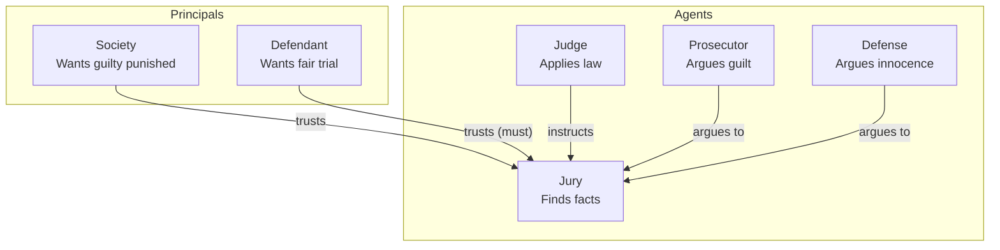
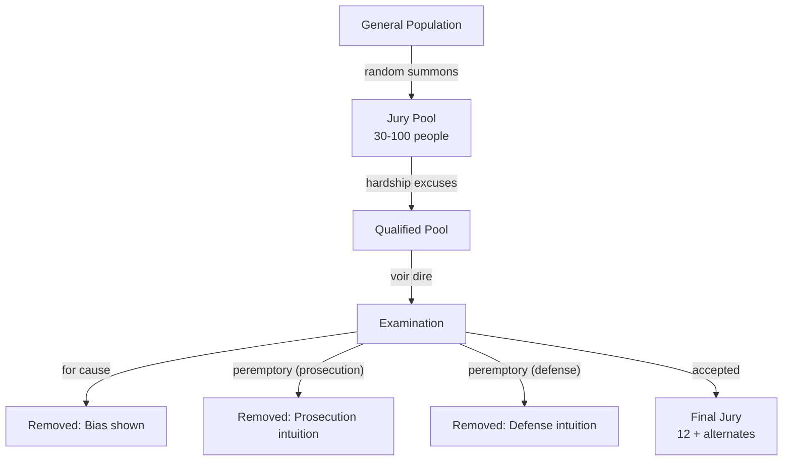
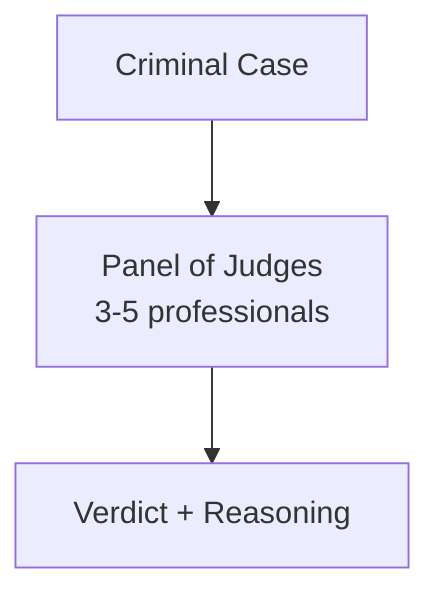
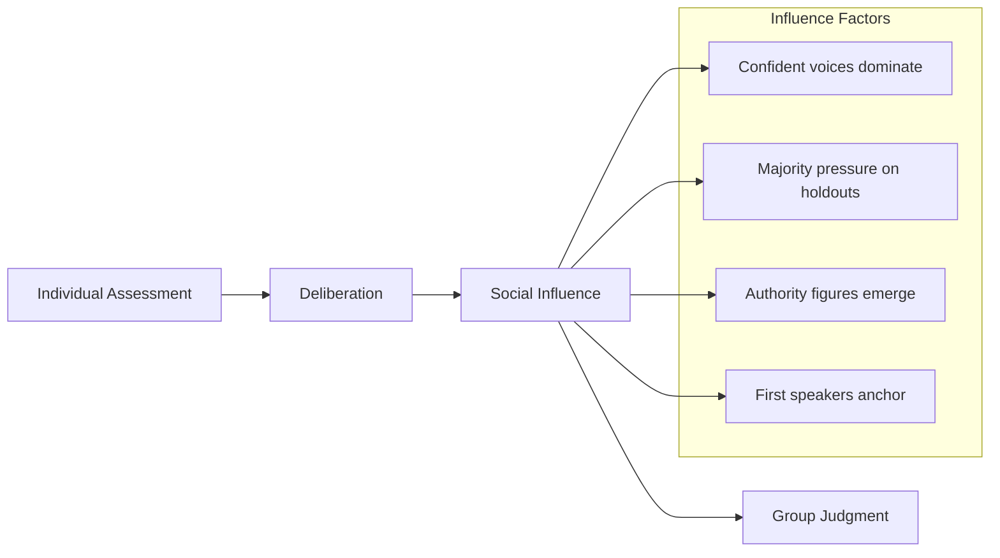
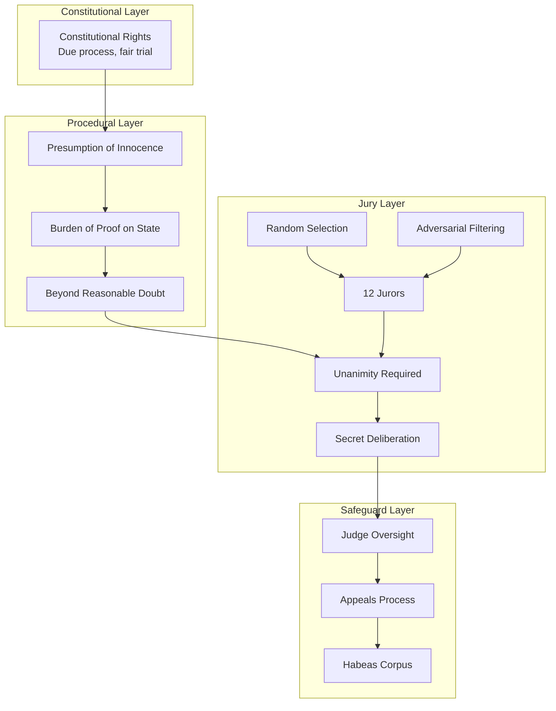

# Jury Systems: Twelve Strangers Decide Your Fate

:::note[Framework Interpretation]
This case study analyzes jury systems through the lens of our delegation risk framework. The historical and legal facts are drawn from legal scholarship, but the mathematical framing and parallels to AI systems are our own interpretation.
:::

In a criminal trial, twelve strangers—who have never met you, know nothing about law, and were selected partly because they knew nothing about your case—will decide whether you go free or spend decades in prison. Why do we trust this system?

The jury system is a remarkable piece of trust architecture that has evolved over 800 years. Its peculiar features—twelve people, unanimous verdicts, random selection—turn out to have deep mathematical justifications.

:::tip[The Core Insight]
The jury system is designed to **asymmetrically weight errors**. It treats wrongful conviction as far worse than wrongful acquittal, and every design choice—twelve jurors, unanimity, presumption of innocence—reinforces this asymmetry.
:::

---

## Part 1: The Trust Problem in Criminal Justice

### Who Trusts Whom?



**The key trust delegation**: Society and the defendant both place trust in the jury, despite having opposing interests.

### The Two Types of Errors

| Error Type | Description | Who is Harmed | Historical Term |
|------------|-------------|---------------|-----------------|
| **Type I (False Positive)** | Convict an innocent person | Defendant, society's conscience | "Wrongful conviction" |
| **Type II (False Negative)** | Acquit a guilty person | Victim, public safety | "Guilty goes free" |

**The fundamental question**: How should we weight these errors?

---

## Part 2: The Mathematics of Jury Size

### Why Twelve?

The number twelve has no magical property. It emerged from medieval English practice and stuck through tradition. But we can ask: **what does the math say?**

**Condorcet's Jury Theorem** (1785):

If each juror has probability p > 0.5 of being correct, and jurors vote independently, then:
- As jury size increases, probability of correct verdict approaches 1
- The improvement has diminishing returns

```
P(majority correct) = Σ(k=⌈n/2⌉ to n) C(n,k) × p^k × (1-p)^(n-k)
```

**For p = 0.7 (each juror 70% likely to be correct):**

| Jury Size | P(Majority Correct) | Marginal Improvement |
|-----------|--------------------|--------------------|
| 1 | 0.700 | — |
| 3 | 0.784 | +8.4% |
| 6 | 0.841 | +5.7% |
| 9 | 0.879 | +3.8% |
| 12 | 0.903 | +2.4% |
| 15 | 0.919 | +1.6% |
| 21 | 0.939 | +2.0% |
| 100 | 0.993 | +5.4% |

**Observations:**
- 12 jurors achieves ~90% accuracy (if jurors are 70% individually accurate)
- Marginal returns diminish rapidly after 12
- Going from 12 to 100 only gains ~9%

### The Cost of Larger Juries

| Cost Factor | How It Scales |
|-------------|--------------|
| Juror compensation | Linear in jury size |
| Deliberation time | Worse than linear (coordination costs) |
| Scheduling difficulty | Combinatorial |
| Hung jury probability | Increases with size (harder to reach unanimity) |
| Courtroom logistics | Step functions (need bigger rooms) |

**The tradeoff:**
```
Accuracy gain from larger jury     vs.    Cost of larger jury
       (diminishing returns)                 (linear or worse)
```

**Twelve represents a historical equilibrium**—good enough accuracy without excessive cost.

### What Modern Analysis Suggests

Studies examining actual jury accuracy (through cases later definitively resolved) suggest:

| Jury Size | Estimated Accuracy | Notes |
|-----------|-------------------|-------|
| 6 | 85-88% | Permitted in some US civil cases |
| 12 | 90-93% | Standard criminal |
| >12 | 92-95% | Marginal improvement |

**The Supreme Court** has held that six-person juries are constitutional for some purposes (*Williams v. Florida*, 1970), but maintained twelve for serious criminal cases.

---

## Part 3: The Unanimity Requirement

### Why Unanimous?

For serious criminal cases, most US jurisdictions require **unanimous** verdict for conviction. Why not majority rule?

**The Asymmetric Error Weighting**

Let's calculate false conviction rates under different rules:

**Assume:**
- P(juror believes guilty | truly guilty) = 0.85
- P(juror believes guilty | truly innocent) = 0.10
- Prior: P(defendant guilty) = 0.70 (prosecutors generally bring strong cases)

**Majority rule (7 of 12 to convict):**

For innocent defendant:
```
P(7+ jurors vote guilty | innocent) = Σ(k=7 to 12) C(12,k) × 0.10^k × 0.90^(12-k)
                                   ≈ 0.000003
                                   ≈ 0.0003%
```

For guilty defendant:
```
P(7+ jurors vote guilty | guilty) = Σ(k=7 to 12) C(12,k) × 0.85^k × 0.15^(12-k)
                                  ≈ 0.996
                                  ≈ 99.6%
```

**Unanimity rule (12 of 12 to convict):**

For innocent defendant:
```
P(12 jurors vote guilty | innocent) = 0.10^12
                                    = 10^(-12)
                                    ≈ 0.0000000001%
```

For guilty defendant:
```
P(12 jurors vote guilty | guilty) = 0.85^12
                                  ≈ 0.142
                                  ≈ 14.2%
```

### The Tradeoff Table

| Decision Rule | P(Convict Innocent) | P(Acquit Guilty) |
|---------------|--------------------|-----------------|
| Simple majority (7/12) | 0.0003% | 0.4% |
| Supermajority (10/12) | 0.000005% | 7% |
| Unanimity (12/12) | ~0% | 86% |

:::note[The Unanimity Insight]
Unanimity makes wrongful conviction virtually impossible, but at the cost of acquitting most guilty defendants. The system strongly prefers Type II errors (guilty go free) over Type I errors (innocent convicted).
:::

### "Beyond Reasonable Doubt"

The unanimity requirement *implements* the "beyond reasonable doubt" standard:

```
If ANY juror has reasonable doubt → acquittal
Only if NO juror has reasonable doubt → conviction
```

**The mathematical meaning of "reasonable doubt":**

If "reasonable doubt" means P(innocent) > 5%, and jurors are calibrated:
- A juror votes "guilty" only if P(guilty) > 95%
- With 12 independent jurors, P(all vote guilty | innocent) ≈ 0

**Unanimity + reasonable doubt = extreme protection against wrongful conviction**

---

## Part 4: Jury Selection as Trust Filtering

### The Selection Process



### Purpose of Each Filter

| Filter | Purpose | Trust Function |
|--------|---------|---------------|
| Random summons | Representative of community | Legitimacy |
| Hardship excuses | Practical functionality | Removes distracted jurors |
| For-cause challenges | Remove proven bias | Removes known bad actors |
| Peremptory (prosecution) | Remove suspected defense-friendly | Adversarial filtering |
| Peremptory (defense) | Remove suspected prosecution-friendly | Adversarial filtering |

### Adversarial Selection as Trust Mechanism

Both sides try to remove jurors favorable to the other side. In equilibrium:

```
Jury = People neither side could eliminate
     = People neither side expects to be biased
     = (Approximately) neutral population
```

**This is adversarial trust filtering**—like the adversarial oversight model in the [Oversight Dilemma](/case-studies/human-systems/oversight-dilemma/).

### Delegation Risk of Jury Selection

**Failure modes in selection:**

| Failure Mode | P(occurrence) | Impact on Verdict | Delegation Risk |
|--------------|---------------|-------------------|-----|
| Biased juror not detected | 0.10 | Could swing verdict | Significant |
| Stealth juror (lies in voir dire) | 0.02 | High impact | High |
| Both sides miscalculate | 0.30 | Jury leans one way | Moderate |
| Systematic bias in pool | 0.05 | Unfair trial | High |

**The voir dire arms race:**

```
Prosecution hiring: Jury consultants, psychologists, demographic analysis
Defense hiring: Same

Result: Both sides neutralize each other, returning to ~random selection
       Plus ~$50K-$500K spent on consultants (for major cases)
```

---

## Part 5: Cross-National Comparison

### Different Countries, Different Trust Architectures

| Country | Jury Size | Decision Rule | Who Decides |
|---------|-----------|---------------|-------------|
| **USA (Federal)** | 12 | Unanimous | Jury (facts) + Judge (law) |
| **USA (State)** | 6-12 | Varies (some allow 10/12) | Jury + Judge |
| **UK** | 12 | 10/12 after 2+ hours | Jury + Judge |
| **France** | 6 jurors + 3 judges | 2/3 majority | Mixed panel |
| **Germany** | 0 (no jury) | Judges decide | Professional judges |
| **Japan** | 6 citizens + 3 judges | Majority | Mixed panel (saiban-in) |
| **Russia** | 8 (in some cases) | 6/8 | Jury (for serious crimes) |

### The German Model: Professional Judges



**Trust architecture:**
- No random citizens
- Professional legal training
- Must write detailed reasoning
- Subject to appeal on law AND facts

**Advantages:**
- Consistent application of law
- Detailed reasoning for appeals
- No "jury nullification"
- Faster proceedings

**Disadvantages:**
- No community input
- Judges may become case-hardened
- Single point of failure (judge corruption)
- Less democratic legitimacy

### Delegation Risk Comparison Across Systems

| System | P(Wrongful Conviction) | P(Wrongful Acquittal) | Trust Architecture |
|--------|----------------------|----------------------|-------------------|
| US (unanimous 12) | Very low | High | Community + unanimity |
| UK (10/12) | Low | Moderate | Community + supermajority |
| France (mixed) | Low | Moderate | Professional + community |
| Germany (judges) | Low-moderate | Low | Professional only |
| Japan (mixed) | Low | Moderate | Professional + community |

**The Innocence Project data** (US):
- 375+ exonerations via DNA evidence
- Estimated 1-6% of US prisoners may be innocent
- P(wrongful conviction) ≈ 1-6% despite "unanimity"

**Why so high despite unanimity?**
- Eyewitness misidentification
- False confessions
- Prosecutorial misconduct
- Bad forensic science
- Jurors not actually independent (deliberation influence)

---

## Part 6: The Deliberation Problem

### Juror Independence Assumption

Condorcet's theorem assumes **independent** judgments. But juries deliberate together.

**What actually happens:**



### The Conformity Effect

**Asch conformity experiments** (adapted to juries): Even when the answer is objectively clear, ~30% of people conform to incorrect majority opinion.

**For juries:**
```
P(holdout maintains position | 11-1 against) ≈ 0.30
P(holdout maintains position | 10-2 against) ≈ 0.45
P(holdout maintains position | 9-3 against) ≈ 0.65
```

**Implication**: Unanimity doesn't mean 12 independent agreements. It often means 8-10 independent agreements plus 2-4 social conformists.

### The Hung Jury Safety Valve

When even conformity pressure can't produce unanimity:

| Outcome | Frequency | What Happens |
|---------|-----------|--------------|
| Unanimous guilty | ~60% | Conviction |
| Unanimous not guilty | ~30% | Acquittal |
| Hung jury | ~10% | Mistrial, possible retrial |

**Hung juries as trust signal:**

```
Hung jury suggests: Either
(a) Evidence genuinely ambiguous, OR
(b) One or more jurors deeply unconvinced

Either way, unanimity hasn't been achieved → no conviction
```

The hung jury is a **circuit breaker** that prevents conviction when genuine disagreement exists.

---

## Part 7: Jury Nullification — When Juries Override

### The Power to Nullify

Juries can acquit **even when evidence clearly establishes guilt** if they believe:
- The law is unjust
- The punishment is disproportionate
- The defendant has suffered enough
- Prosecution is politically motivated

**This is not a bug—it's a feature.**

### Historical Examples

| Case/Era | Law | Jury Action | Outcome |
|----------|-----|-------------|---------|
| Fugitive Slave Act (1850s) | Required returning escaped slaves | Northern juries refused to convict | Law became unenforceable |
| Prohibition (1920s) | Alcohol possession | Juries frequently acquitted | Contributed to repeal |
| Vietnam draft (1960s) | Draft evasion | Some juries acquitted | Selective enforcement |
| Drug cases (modern) | Possession | Occasional nullification | Varies |

### The Delegation Risk of Nullification

**From the system's perspective:**

```
P(unjust law enforced) = P(prosecution) × P(jury convicts | unjust law)
```

With nullification possible:
```
P(jury convicts | unjust law) < P(jury convicts | just law)
```

**Nullification creates a feedback mechanism**: Laws that communities find unjust become harder to enforce → pressure to change laws.

### Arguments For and Against

| For Nullification | Against Nullification |
|-------------------|----------------------|
| Democratic check on unjust laws | Inconsistent application of law |
| Community conscience matters | "Rule of law" principle violated |
| Historical role in ending unjust laws | Could enable prejudice (racist acquittals) |
| Last resort against tyranny | Undermines predictability |

---

## Part 8: The Trust Architecture of Justice

### The Full Picture



### Why Each Element Matters

| Element | Trust Function | What It Prevents |
|---------|---------------|------------------|
| Presumption of innocence | Asymmetric error weighting | State railroading defendants |
| Burden on prosecution | Prosecution must prove case | Easy convictions |
| Beyond reasonable doubt | High confidence required | Uncertain convictions |
| Random selection | Representative community | Stacked juries |
| Adversarial filtering | Neither side controls | Biased juries |
| 12 jurors | Statistical accuracy | Small-sample error |
| Unanimity | Single holdout blocks | Majority coercion |
| Secret deliberation | Free discussion | External pressure on jurors |
| Judge oversight | Legal accuracy | Jury legal errors |
| Appeals | Error correction | Procedural mistakes |

### System-Wide Delegation Risk

**For the US criminal justice system:**

| Outcome | Estimated Rate | Damage per Incident | Annual Delegation Risk |
|---------|---------------|---------------------|------------|
| Wrongful conviction | 1-6% of convictions | $1M-$10M (lost years, trauma) | $10B+ |
| Wrongful acquittal | Unknown (probably 20-40%?) | $100K-$10M (recidivism) | $10B+ |
| Hung jury (delay justice) | ~10% of trials | $50K per case | $500M |
| Trial cost | 100% of trials | $25K-$500K per case | $10B |
| **System Delegation Risk** | | | **$30B+/year** |

---

## Part 9: Lessons for AI Systems

### The Unanimity Principle

Juries require unanimity for conviction because we've decided wrongful conviction is much worse than wrongful acquittal.

**For AI systems:**
- When should we require "unanimity" among safety checks before allowing an action?
- Which errors are "wrongful convictions" (stopping beneficial actions) vs. "wrongful acquittals" (allowing harmful actions)?

| AI Context | "Wrongful Conviction" | "Wrongful Acquittal" | Which is Worse? |
|------------|----------------------|---------------------|-----------------|
| AI shutdown | Stopping beneficial AI | Missing dangerous AI | Probably FN |
| Code deployment | Blocking good code | Deploying malicious code | Probably FN |
| Content moderation | Censoring legitimate speech | Allowing harmful content | Context-dependent |

### Adversarial Filtering

Jury selection uses adversarial parties (prosecution and defense) to filter for neutrality.

**For AI systems:**
- Can we use adversarial AI systems to filter decisions?
- Red team vs. blue team verification?
- Prosecution-bot vs. defense-bot before AI actions?

### The Deliberation Problem

Jury deliberation compromises independence through social pressure.

**For AI systems:**
- Multiple AI systems "deliberating" might exhibit similar conformity
- Ensemble methods face correlated errors
- How to maintain true independence?

### Nullification as Safety Valve

Juries can refuse to apply laws they consider unjust.

**For AI systems:**
- Should AI have something like "nullification"—refusing instructions it judges unethical?
- This is essentially the alignment problem: do we want AI that blindly follows or that exercises judgment?

---

## Key Takeaways

:::tip[Key Takeaways]
1. **Juries asymmetrically weight errors**—wrongful conviction is treated as far worse than wrongful acquittal
2. **Twelve jurors is a historical equilibrium**—good enough accuracy without excessive cost
3. **Unanimity makes Type I errors virtually impossible**—but allows many Type II errors
4. **Adversarial selection produces neutrality**—neither side can stack the jury
5. **Deliberation compromises independence**—social pressure affects holdouts
6. **Nullification is a feature**—community conscience can override law
7. **Different countries made different choices**—pure jury, mixed panels, or professional judges
8. **These principles apply to AI**—unanimity requirements, adversarial filtering, and nullification-like safety valves
:::

---

## See Also

- [The Oversight Dilemma](/case-studies/human-systems/oversight-dilemma/) — Adversarial oversight structures
- [Nuclear Launch Authority](/case-studies/human-systems/nuclear-launch-authority/) — Another asymmetric error system
- [Criminal Organizations](/case-studies/human-systems/criminal-trust/) — Trust without legal enforcement
- [Risk Inheritance](/research/theory/trust-propagation/) — How trust flows through networks
