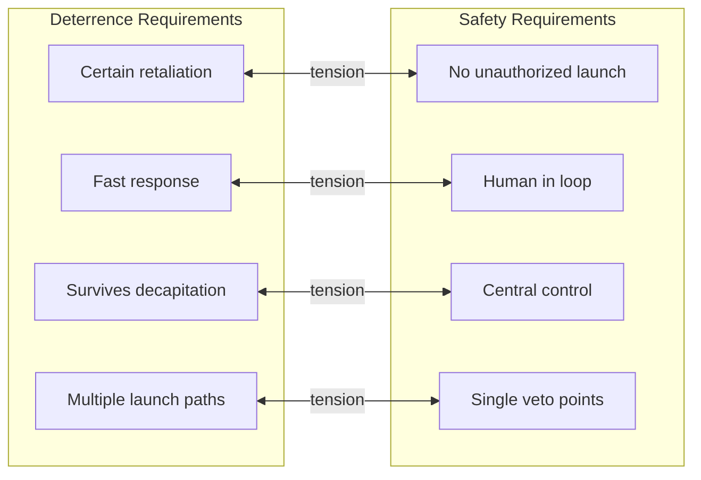
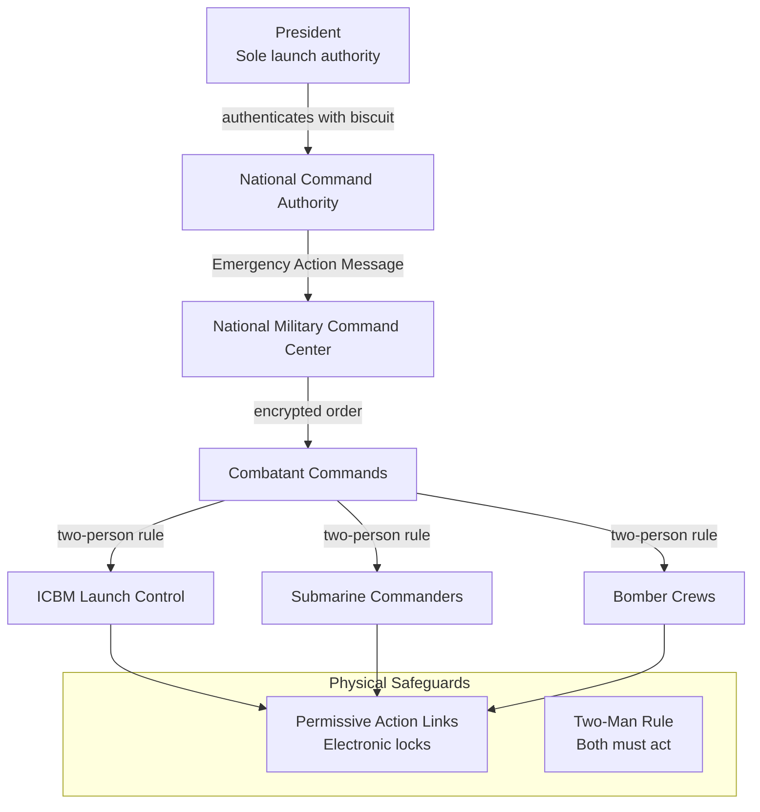
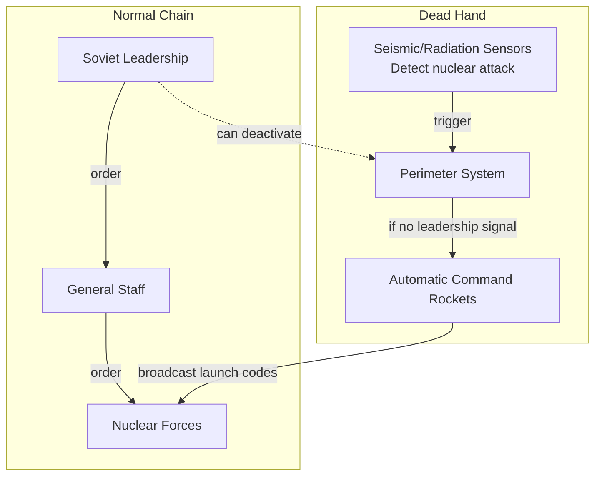
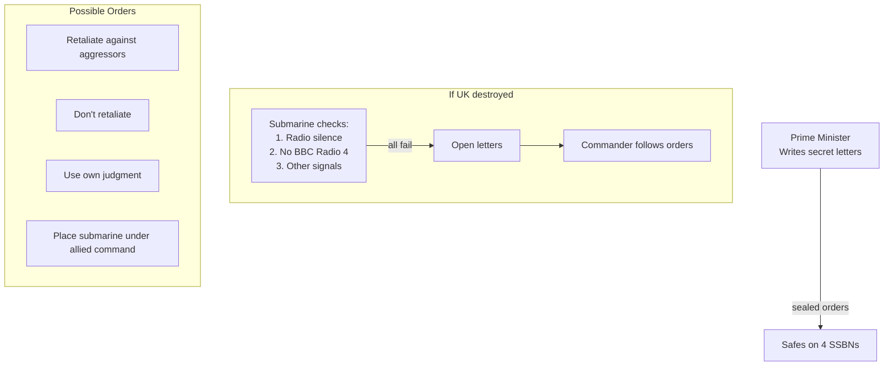
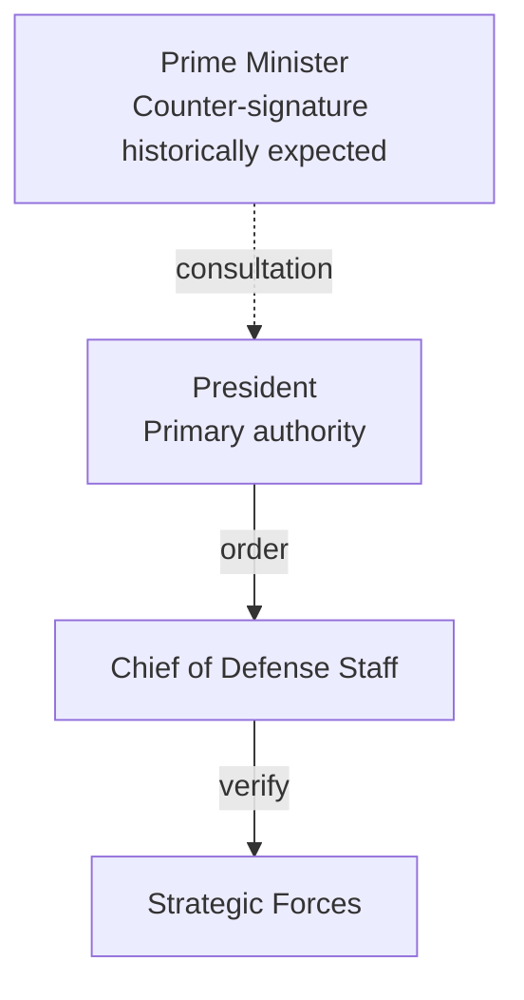
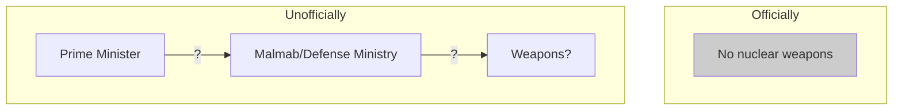

# Nuclear Launch Authority: Trust at Civilization Scale

:::note[Framework Interpretation]
This case study analyzes real nuclear command-and-control systems through the lens of our delegation risk framework. The historical facts are drawn from declassified sources and academic research, but the interpretation and parallels to AI systems are our own framing.
:::

No trust problem in human history has higher stakes than nuclear launch authority. A single decision by a small number of people could end civilization. How do you design a trust architecture for that?

Different nuclear powers have made radically different choices, each representing a distinct answer to the fundamental question: **What's worse—unauthorized launch or failure to retaliate?**

:::danger[The Stakes]
Global nuclear arsenal: ~12,500 warheads. A full exchange would kill hundreds of millions immediately and potentially billions from nuclear winter. The Delegation Risk of getting this wrong is measured in human civilization.
:::

---

## Part 1: The Core Dilemma

Nuclear deterrence creates a paradox:

**For deterrence to work:**
- Adversaries must believe you *will* retaliate
- Retaliation must be *certain* even after decapitation strike
- Launch capability must survive first strike

**For safety:**
- Unauthorized launch must be *impossible*
- Accidents must be prevented
- Madmen must be stopped

These requirements are in tension:



**Every nuclear architecture is a tradeoff between these poles.**

---

## Part 2: Failure Mode Analysis

### The Two Catastrophic Failures

| Failure Type | Description | Historical Near-Misses | Damage |
|--------------|-------------|----------------------|--------|
| **False Positive** | Launch without legitimate order | Petrov 1983, Able Archer 1983, Norwegian rocket 1995 | $50T+ (civilization) |
| **False Negative** | Failure to launch when legitimately ordered | None known | $10T+ (defeat, occupation) |

### False Positive: Unauthorized/Accidental Launch

**Causes:**
- Technical malfunction (false warning)
- Human error (misinterpretation)
- Rogue actor (mad general)
- Communication failure (garbled order)
- Cyberattack (spoofed command)

**Historical incidents:**

| Year | Incident | What Happened | Why Launch Didn't Occur |
|------|----------|---------------|------------------------|
| 1979 | NORAD training tape | Training scenario loaded into live system, showed 2,200 Soviet missiles | Human verification caught error |
| 1980 | Faulty chip | Computer showed Soviet SLBM launch | Cross-checking with other systems |
| 1983 | Petrov incident | Soviet satellite showed 5 US ICBMs launching | Lt. Col. Petrov's judgment call |
| 1983 | Able Archer | NATO exercise misread as preparation for first strike | Soviet intelligence assets reported it was exercise |
| 1995 | Norwegian rocket | Russian radar detected research rocket, resembled Trident trajectory | Yeltsin had time to verify |

**Pattern**: Every prevented false positive relied on human judgment overriding technical systems.

### False Negative: Failure to Retaliate

**Causes:**
- Decapitation (leadership killed before ordering)
- Communication destruction (can't transmit orders)
- Hesitation (leader won't give order)
- Technical failure (systems don't work)

**No known historical cases**—but this is by design. We've never had a legitimate launch order, so we don't know if the system actually works.

---

## Part 3: The American Architecture

### Command Structure



### Key Features

**1. Sole Presidential Authority**
- Only the President can authorize nuclear use
- No legal requirement for anyone else to agree
- SecDef transmits order but cannot veto

**2. The "Football" and "Biscuit"**
- Football: Briefcase with communication equipment and strike options
- Biscuit: Card with authentication codes, carried by President personally
- Neither is sufficient alone—need both to initiate

**3. Permissive Action Links (PALs)**
- Electronic locks on weapons requiring codes
- Codes held at high levels, transmitted down chain
- Prevent rogue use even with physical access

**4. Two-Person Rule**
- No single person can physically launch
- ICBM: Two officers turn keys simultaneously
- Submarine: Captain and XO must both authenticate
- Bombers: Two crew members required

### Delegation Risk Calculation: US System

**False Positive (Unauthorized Launch):**

For unauthorized launch to occur:

```
P(unauthorized) = P(false alarm believed) × P(President orders rashly) × P(chain doesn't refuse) × P(PAL fails or bypassed) × P(two-person rule fails)
```

| Factor | Estimate | Reasoning |
|--------|----------|-----------|
| P(false alarm believed) | 0.01/year | Historical rate of serious false alarms |
| P(President orders rashly) | 0.10 | Given false alarm, some presidents might |
| P(chain doesn't refuse) | 0.70 | Military obedience culture |
| P(PAL bypassed) | 0.01 | Technically very difficult |
| P(two-person collusion) | 0.30 | Under time pressure, both might comply |

```
P(unauthorized) = 0.01 × 0.10 × 0.70 × 0.01 × 0.30 = 0.0000021/year
               ≈ 2.1 × 10⁻⁶/year
```

**Over 50 years**: 1 - (1 - 2.1×10⁻⁶)⁵⁰ ≈ 0.01% cumulative probability

**Delegation Risk of False Positive:**
```
Delegation Risk = P(unauthorized) × Damage
    = 2.1 × 10⁻⁶ × $50T
    = $105M/year
```

**False Negative (Failure to Retaliate):**

```
P(failure to retaliate) = P(legitimate order needed) × P(system fails)
```

| Factor | Estimate | Reasoning |
|--------|----------|-----------|
| P(decapitation succeeds) | 0.30 | If first strike, President may not survive |
| P(communication destroyed) | 0.20 | EMP, physical destruction |
| P(crews don't execute) | 0.05 | Moral refusal, confusion |
| P(technical failure) | 0.05 | Equipment doesn't work |

```
P(failure given attack) = 1 - (1-0.30) × (1-0.20) × (1-0.05) × (1-0.05)
                       = 1 - 0.70 × 0.80 × 0.95 × 0.95
                       = 1 - 0.505
                       = 0.495
```

**~50% chance of failure to retaliate if decapitation strike is attempted**

But what's P(nuclear attack per year)? During Cold War peak, perhaps 0.001/year. Today, perhaps 0.0001/year.

```
Delegation Risk = 0.0001 × 0.495 × $10T = $495M/year
```

**Total US System Delegation Risk:**
```
Total Delegation Risk = False Positive Delegation Risk + False Negative Delegation Risk
         = $105M + $495M
         = $600M/year
```

:::note[The American Tradeoff]
The US system strongly prioritizes preventing unauthorized launch (false positive) over guaranteeing retaliation (false negative). This reflects a judgment that accidental nuclear war is worse than losing a nuclear war.
:::

---

## Part 4: The Soviet/Russian Architecture

### The Dead Hand (Perimeter System)

The Soviets took a radically different approach:



### Key Features

**1. Guaranteed Retaliation**
- System designed to survive decapitation
- Can launch *without* living leadership
- Command rockets broadcast launch orders to all forces

**2. Semi-Automatic**
- Humans must arm the system
- Once armed, operates autonomously if certain conditions met:
  - Nuclear detonations detected on Soviet soil
  - Communication with leadership lost
  - Timer expires without stand-down order

**3. Dual Control Philosophy**
- Regular chain requires multiple authorizations
- Dead Hand is backup ensuring retaliation even if chain destroyed

### Delegation Risk Calculation: Soviet/Russian System

**False Positive:**

New failure mode: automated system launches when it shouldn't

```
P(unauthorized) = P(sensors false positive) × P(communication failure coincides) × P(Dead Hand armed) × P(no stand-down)
```

| Factor | Estimate | Reasoning |
|--------|----------|-----------|
| P(sensors false positive) | 0.001/year | Nuclear detonation signatures are distinctive |
| P(communication failure) | 0.05 | Routine failures happen |
| P(Dead Hand armed) | 0.10 | Only armed during high tensions |
| P(no stand-down in time) | 0.50 | If leadership dead/incapacitated |

```
P(Dead Hand false positive) = 0.001 × 0.05 × 0.10 × 0.50 = 2.5 × 10⁻⁶/year
```

Plus regular chain false positives (similar to US): ~2 × 10⁻⁶/year

**Total false positive**: ~4.5 × 10⁻⁶/year

**False Negative:**

Dead Hand dramatically reduces failure probability:

```
P(failure to retaliate) = P(regular chain fails) × P(Dead Hand fails)
```

| Factor | Estimate | Reasoning |
|--------|----------|-----------|
| P(regular chain fails given attack) | 0.50 | Similar to US |
| P(Dead Hand fails) | 0.10 | Designed for survivability |

```
P(failure given attack) = 0.50 × 0.10 = 0.05
```

**Only 5% failure rate vs 50% for US**—the Dead Hand works as designed.

### Delegation Risk Comparison

| System | P(False Positive)/year | P(False Negative given attack) | Balance |
|--------|----------------------|-------------------------------|---------|
| US | 2.1 × 10⁻⁶ | 0.50 | Safety-weighted |
| USSR | 4.5 × 10⁻⁶ | 0.05 | Deterrence-weighted |

**The Soviets accepted 2× higher accident risk to achieve 10× better retaliation guarantee.**

```
US Delegation Risk = $105M (FP) + $495M (FN) = $600M/year
USSR Delegation Risk = $225M (FP) + $50M (FN) = $275M/year
```

Wait—the Soviet system has *lower* total Delegation Risk?

:::caution[The Counterintuitive Result]
If you take the math seriously, the Soviet system with its "doomsday device" properties has lower expected damage than the American system. This is because the massive reduction in false negative risk (retaliation failure) outweighs the modest increase in false positive risk (accidental launch).

This assumes deterrence actually works—that guaranteed retaliation reduces P(attack). If deterrence is illusory, the American system is safer.
:::

---

## Part 5: The British Architecture — Letters of Last Resort

### The System



### Key Features

**1. Pre-Delegation**
- PM decides retaliation policy *before* an attack
- Decision written in handwritten letters
- New PM writes new letters; old ones destroyed unread

**2. Submarine Commander Discretion**
- Commander must judge if UK has been destroyed
- Checks for signs of government continuity
- Famous test: "Is BBC Radio 4 still broadcasting?"

**3. Ambiguity as Feature**
- No one knows what the letters say
- Different PMs may have written different orders
- Adversary cannot know if retaliation is guaranteed

### Delegation Risk Calculation: British System

**False Positive:**

The British system is highly resistant to false positives:

```
P(unauthorized) = P(commander thinks UK destroyed wrongly) × P(letters say "retaliate") × P(commander obeys)
```

| Factor | Estimate | Reasoning |
|--------|----------|-----------|
| P(false "UK destroyed" conclusion) | 0.0001/year | Would need all verification to fail |
| P(letters say retaliate) | 0.60 | Unknown, but likely some PMs wrote this |
| P(commander obeys given ambiguity) | 0.70 | Training says obey, but conscience exists |

```
P(false positive) = 0.0001 × 0.60 × 0.70 = 4.2 × 10⁻⁵/year
```

**Higher than US/USSR!** The ambiguity creates risk—a commander might convince themselves the UK is destroyed.

**False Negative:**

```
P(failure to retaliate) = P(letters say don't) + P(letters ambiguous) × P(commander doesn't) + P(technical failure)
```

| Factor | Estimate | Reasoning |
|--------|----------|-----------|
| P(letters say "don't retaliate") | 0.15 | Some PMs might |
| P(letters say "use judgment") | 0.25 | The moderate option |
| P(commander doesn't given judgment) | 0.50 | Moral weight of decision |
| P(technical failure) | 0.05 | Submarines are maintained |

```
P(failure) = 0.15 + 0.25 × 0.50 + (1 - 0.15 - 0.25) × 0.05
          = 0.15 + 0.125 + 0.03
          = 0.305
```

**30.5% chance of failure to retaliate**—between US and Soviet systems.

### The Ambiguity Premium

The British system deliberately sacrifices some deterrence clarity for:
- Moral flexibility (PM can choose proportionality)
- Reduced peacetime accident risk
- Commander conscience as final check

| System | Deterrence Clarity | Safety | Moral Flexibility |
|--------|-------------------|--------|------------------|
| US | High | Very High | Low |
| USSR | Very High | Moderate | None |
| UK | Moderate | High | High |

---

## Part 6: French and Israeli Variations

### France: Dual Political Control



**Key difference**: Tradition of consulting Prime Minister, though legally not required.

**French philosophy**: Force de frappe as independent deterrent, even against superpowers. "Tear off an arm" capability—can't defeat USSR, but can make victory pyrrhic.

### Israel: Deliberate Opacity



**Key features:**
- Policy of "nuclear ambiguity" (neither confirm nor deny)
- Command structure unknown publicly
- Doctrine unknown (first use? last resort only?)

**Trust architecture purpose**: Ambiguity itself is the strategy. Adversaries must assume worst case, but Israel avoids NPT obligations and regional arms race pressure.

**Delegation Risk is literally incalculable**—which may be the point.

---

## Part 7: Comparative Analysis

### Architecture Comparison Matrix

| Country | Who Authorizes | Verification | Automation | Crew Override | Ambiguity |
|---------|---------------|--------------|------------|---------------|-----------|
| **USA** | President alone | Two-person rule, PALs | None | Theoretical only | Low |
| **Russia** | Leadership / Dead Hand | Multiple redundant chains | High (Dead Hand) | No | Low |
| **UK** | PM (pre-delegated) | Commander judgment | None | Yes (letters might say) | High |
| **France** | President (tradition: PM consult) | Military chain | None | Theoretical | Moderate |
| **Israel** | Unknown | Unknown | Unknown | Unknown | Maximum |

### Delegation Risk Comparison

| System | False Positive Delegation Risk | False Negative Delegation Risk | Total Delegation Risk | Philosophy |
|--------|-------------------|-------------------|-----------|------------|
| US | $105M | $495M | $600M | "Never accidentally" |
| Russia | $225M | $50M | $275M | "Always retaliate" |
| UK | $210M | $305M | $515M | "Moral flexibility" |
| France | $120M | $400M | $520M | "Independent deterrent" |
| Israel | ? | ? | ? | "Strategic ambiguity" |

:::tip[The Key Insight]
There is no "correct" nuclear launch architecture. Each represents a different judgment about:
1. Relative cost of false positives vs false negatives
2. Trust in human judgment vs automated systems
3. Value of ambiguity vs clarity
4. Role of morality at the moment of decision

The "safest" system (lowest total Delegation Risk) may be the one that seems scariest (Russia's Dead Hand), because deterrence effectiveness matters enormously.
:::

---

## Part 8: The Human Factors

### The Petrov Case Study

September 26, 1983: Soviet satellite system shows 5 US ICBMs launching toward USSR.

**The situation:**
- Lt. Col. Stanislav Petrov was duty officer
- System designed: if satellites detect launch → report up chain → leadership decides
- Protocol: report immediately and let superiors decide

**What Petrov did:**
- Judged it was false alarm (5 missiles made no sense; US would launch all or none)
- Reported "system malfunction" instead of "missile attack"
- Violated protocol by making judgment call at his level

**What would have happened if he followed protocol:**
- Soviet leadership was already paranoid (Able Archer exercise ongoing)
- Andropov (dying, suspicious) might have ordered retaliation
- ~45% chance of escalation to full exchange per expert estimates

**Delegation risk framework implication:**

Petrov was a **human circuit breaker**—he had neither the authority nor the protocol to make that decision, but he did anyway.

```
Value of Petrov's judgment = P(escalation if reported) × Damage avoided
                          = 0.45 × $50T
                          = $22.5T saved
```

The Soviet system's trust architecture didn't account for this—it worked *despite* the system, not because of it.

### The Trust in Human Judgment

| Role | Trust Required | What They Decide |
|------|---------------|------------------|
| President/Premier | "Should we launch?" | Policy judgment |
| Generals | "Is the order authentic?" | Verification |
| Sensor operators | "Is this a real attack?" | Technical judgment |
| Launch officers | "Will I turn this key?" | Moral judgment |

Every layer involves trust, and every layer has failed or nearly failed:
- Leaders have been drunk, impaired, or irrational
- Verification has been spoofed or confused
- Sensors have malfunctioned
- Launch officers have... actually, launch officers have never refused an authenticated order (that we know of)

### The Unexercised Trust

We've never actually tested the full launch sequence under real attack conditions:

```
P(system works when needed) = P(each component works) ^ (number of components)
```

With 10 components each 99% reliable:
```
P(full chain works) = 0.99^10 = 0.90
```

**10% failure rate**—higher than most estimates assume.

This is the terrifying truth: the systems designed to end civilization have never been fully tested, and can never be fully tested without ending civilization.

---

## Part 9: Design Lessons for Other Domains

Nuclear launch authority offers lessons for any high-stakes trust system:

### Lesson 1: Optimize for the Costlier Error

US optimizes against false positives; USSR against false negatives. Choose consciously:

| Domain | False Positive | False Negative | Which is Costlier? |
|--------|---------------|----------------|-------------------|
| Nuclear launch | Accidental war | Failed deterrence | Probably FP |
| Criminal justice | Wrongful conviction | Guilty go free | Culture-dependent |
| Medical diagnosis | Unnecessary treatment | Missed disease | Disease-dependent |
| AI shutdown | Stopping beneficial AI | Missing dangerous AI | Depends on AI capability |

### Lesson 2: Human Judgment as Safety Net

Every prevented nuclear catastrophe involved human judgment overriding systems:
- Petrov ignored protocol
- Arkhipov refused submarine launch during Cuban Crisis
- Multiple US officers questioned false alarms

**Implication**: Pure automation is dangerous. Keep humans in the loop, and give them permission to override.

### Lesson 3: Ambiguity Has Value

The UK's deliberate ambiguity about letter contents:
- Reduces adversary certainty (maintains deterrence)
- Preserves moral flexibility
- Allows different leaders to make different choices without public commitment

**For AI**: Sometimes ambiguity about shutdown criteria is safer than published thresholds (which can be gamed).

### Lesson 4: Test What You Can

Nuclear systems are tested extensively—everything except the actual launch sequence:
- Regular exercises
- Simulated scenarios
- Component testing
- Communication drills

**For AI**: Test every component of the trust architecture you can test without causing the harm you're trying to prevent.

### Lesson 5: Redundancy vs. Single Points

| Approach | Nuclear Example | Tradeoff |
|----------|----------------|----------|
| Redundancy | Multiple submarines, bombers, ICBMs | Higher false negative risk (harder to stop if one goes wrong) |
| Single point | Presidential sole authority | Higher false positive risk (one person can launch) |

Neither is obviously correct. The choice depends on which error is costlier.

---

## Key Takeaways

:::tip[Key Takeaways]
1. **Nuclear launch authority is the highest-stakes trust problem ever designed**—Delegation Risk measured in civilization
2. **Different nations made different tradeoffs**—US prioritizes safety, Russia prioritizes deterrence, UK prioritizes flexibility
3. **The "scariest" system may be safest**—Dead Hand's guaranteed retaliation may reduce total Delegation Risk by improving deterrence
4. **Human judgment has saved us repeatedly**—Petrov, Arkhipov, and others who violated protocol
5. **Systems have never been fully tested**—we don't know if they actually work
6. **Ambiguity can be a feature**—the UK system deliberately preserves moral choice
7. **These lessons apply to AI**—substitute "AI shutdown authority" for "nuclear launch authority" and the tradeoffs are similar
:::

---

## See Also

- [The Oversight Dilemma](/case-studies/human-systems/oversight-dilemma/) — Who watches the watchmen?
- [Trust Across Civilizations](/case-studies/human-systems/trust-across-civilizations/) — Historical trust architectures
- [Anti-patterns](/case-studies/ai-systems/anti-patterns/) — Trust architecture mistakes
- [Risk Inheritance](/research/theory/trust-propagation/) — How trust flows through chains
