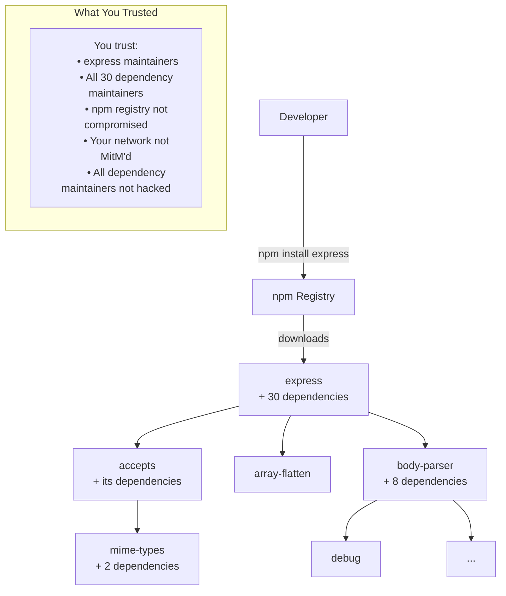
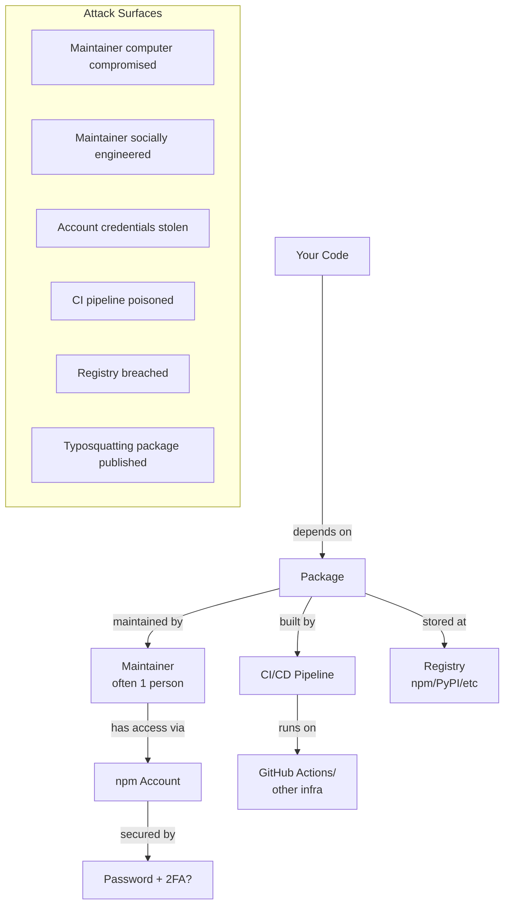
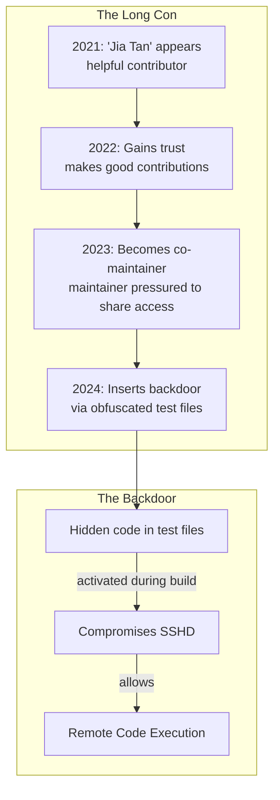
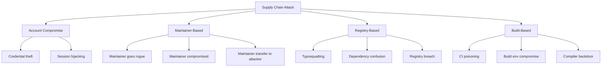
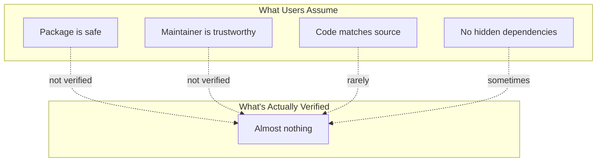
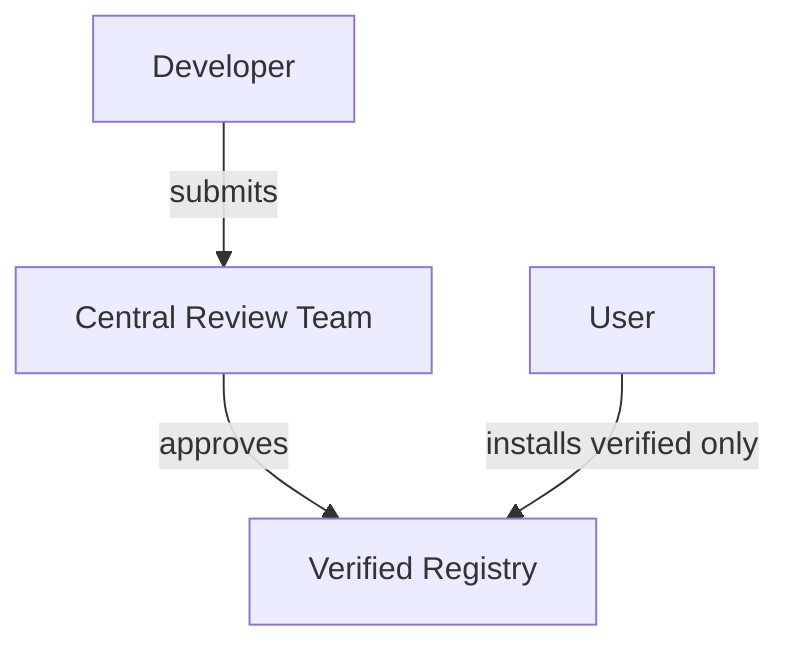
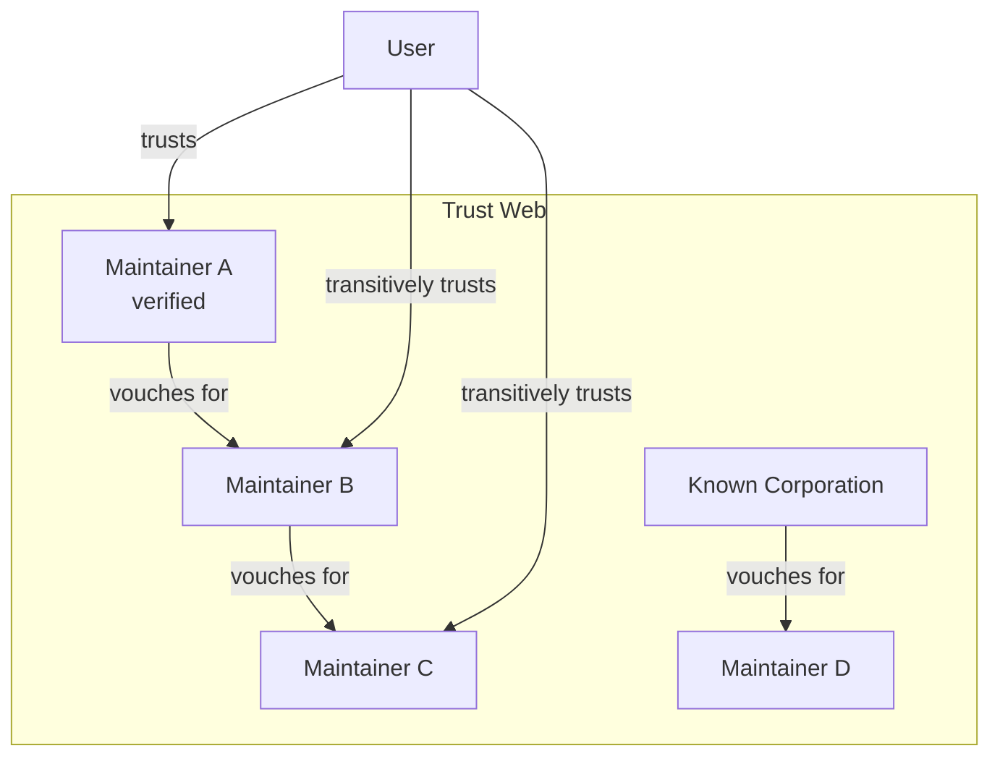
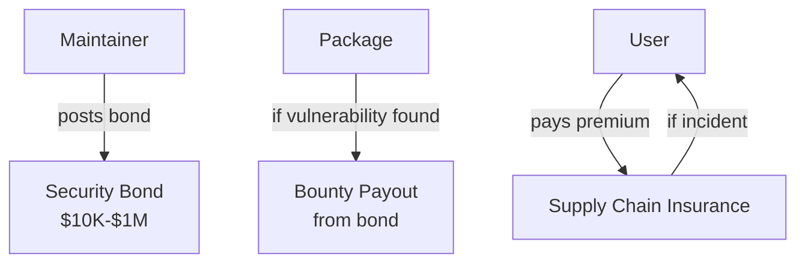
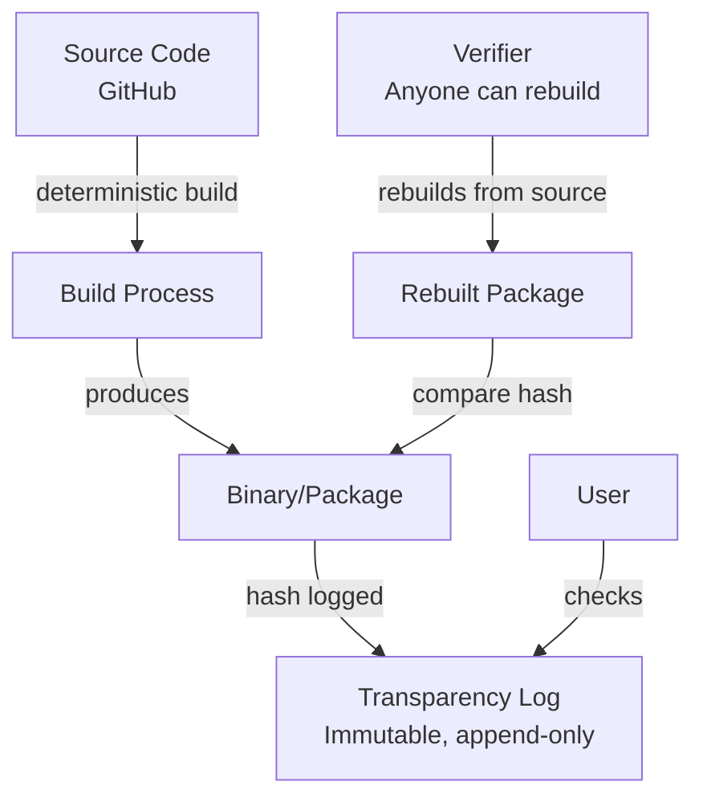
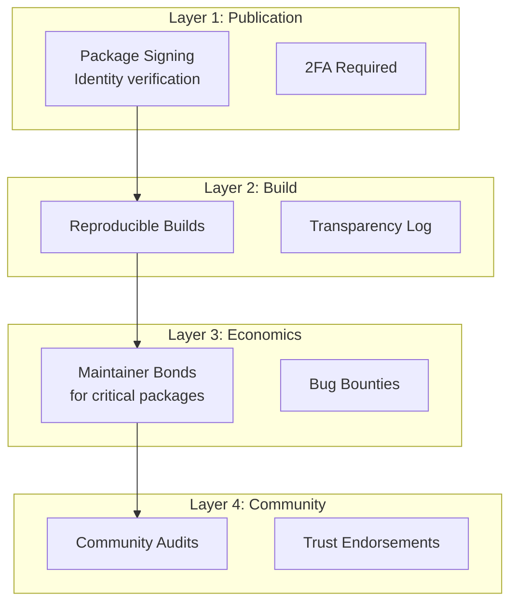

# Open Source Supply Chain: Trust at Internet Scale

:::note[Framework Interpretation]
This case study analyzes open source ecosystems through the lens of our delegation risk framework. The facts about package managers and incidents are documented, but the framing and parallels to AI systems are our own interpretation.
:::

Every day, millions of developers run `npm install` or `pip install`, downloading code written by strangers and executing it on their machines, their servers, their production systems. They do this without reading the code, without verifying the authors, without understanding the dependencies.

We have accidentally built the largest trust network in human history—and it's terrifyingly fragile.

:::danger[The Scope]
- npm: 2+ million packages, 30+ billion downloads per week
- PyPI: 450,000+ packages, 40+ billion downloads/month
- A single malicious package could compromise millions of systems within hours
:::

---

## Part 1: The Dependency Trust Problem

### What Happens When You Install a Package



**A simple web framework (Express) pulls in 30+ dependencies.** Each is a trust relationship.

### The Transitive Trust Explosion

| Package | Direct Dependencies | Transitive Dependencies | Unique Maintainers |
|---------|--------------------|-----------------------|-------------------|
| express | 30 | 57 | ~40 |
| react | 3 | 8 | ~10 |
| lodash | 0 | 0 | ~5 |
| create-react-app | 50+ | 1,500+ | ~500 |
| AWS SDK | 100+ | 400+ | ~200 |

**Trust equation:**
```
P(supply chain safe) = P(each dependency safe)^(number of dependencies)
```

If each dependency has 99.9% probability of being safe:
- 10 dependencies: 0.999^10 = 99.0% safe
- 100 dependencies: 0.999^100 = 90.5% safe
- 1,000 dependencies: 0.999^1000 = 36.8% safe

:::caution[The Math is Brutal]
With typical enterprise JavaScript projects having 1,000+ transitive dependencies, even 99.9% per-dependency safety yields only ~37% supply chain safety. The compounding of small risks creates large systemic risk.
:::

---

## Part 2: The Trust Topology

### Who Do You Actually Trust?



### Trust Levels by Entity

| Entity | What You Trust Them For | P(compromise) | Impact if Compromised |
|--------|------------------------|---------------|----------------------|
| Package maintainer | Not malicious, competent | 0.001/year | All users of package |
| Maintainer's account | Not hacked | 0.01/year | All users of package |
| Registry (npm/PyPI) | Not breached, honest | 0.001/year | All users of registry |
| CI/CD system | Not poisoned | 0.005/year | All packages using that CI |
| Your network | Not MitM'd | 0.0001/install | Your system |

### The "Bus Factor" Problem

Many critical packages are maintained by one or two people:

| Package | Weekly Downloads | Maintainers | Bus Factor |
|---------|-----------------|-------------|------------|
| core-js | 30M+ | 1 (Denis Pushkarev) | 1 |
| colors | 20M+ | 1 (Marak Squires) | 1 |
| node-ipc | 1M+ | 1 | 1 |
| left-pad | 2.5M+ (at peak) | 1 | 1 |

**These single individuals have implicit commit access to millions of production systems.**

---

## Part 3: Case Study — The xz Backdoor (2024)

### What Happened

In early 2024, a backdoor was discovered in xz-utils, a compression library used by virtually every Linux system.



### The Attack Vector

1. **Social engineering the maintainer**: The original maintainer was burned out. "Jia Tan" offered to help. Community members (possibly sock puppets) pressured maintainer to accept help.

2. **Years of trust-building**: Jia Tan made legitimate contributions for 2+ years, building reputation.

3. **Gaining commit access**: Eventually became co-maintainer with ability to merge code.

4. **Obfuscated payload**: Backdoor hidden in binary test files, not visible in source review.

5. **Targeted distribution**: Specifically designed to compromise OpenSSH on systemd-based Linux.

### Why It Almost Worked

| Factor | How It Helped Attack |
|--------|---------------------|
| Maintainer burnout | Created opportunity for "helpful" attacker |
| Trust accumulation | Years of good behavior built reputation |
| Complexity | Backdoor hidden in build process, not source |
| Dependency chains | xz is dependency of SSH, which is everywhere |
| Binary test files | Not human-readable, not reviewed |

### Why It Was Caught

**Luck.** A Microsoft developer (Andres Freund) noticed SSH was using slightly more CPU than expected. He investigated for performance reasons and found the backdoor.

**This was not caught by:**
- Code review
- Automated scanning
- Security audits
- Reproducible builds (not widely deployed)

### Delegation Risk Calculation: If xz Hadn't Been Caught

**Scope of compromise:**
- Every Linux system with affected xz version
- Every SSH server using affected systemd
- Estimated: 50-100 million systems

**Potential damage:**
```
Delegation Risk = P(exploitation) × Number of systems × Damage per system
```

| Scenario | P(exploitation) | Systems | Damage/System | Total Delegation Risk |
|----------|----------------|---------|---------------|-----------|
| Targeted espionage | 0.001 | 100M | $1,000 | $100B |
| Widespread ransomware | 0.01 | 100M | $10,000 | $10T |
| Critical infrastructure | 0.0001 | 1M critical | $10M | $1T |

**The xz attack could have been the most damaging cyberattack in history if not for one person's curiosity about CPU usage.**

---

## Part 4: Historical Supply Chain Attacks

### The Attack Catalog

| Attack | Year | Vector | Impact |
|--------|------|--------|--------|
| **left-pad removal** | 2016 | Maintainer unpublished package | Broke thousands of builds |
| **event-stream** | 2018 | Trusted maintainer added, inserted malware | Bitcoin wallet theft |
| **ua-parser-js** | 2021 | Account compromise | Cryptominer installed |
| **colors & faker** | 2022 | Maintainer sabotage (protest) | Broke many applications |
| **node-ipc** | 2022 | Maintainer protest (Ukraine) | Deleted files on Russian IPs |
| **PyPI typosquatting** | Ongoing | Malicious packages with similar names | Various |
| **xz backdoor** | 2024 | Long-term social engineering | (Caught before impact) |

### Attack Taxonomy



### Pattern: Trust Decay Over Time

Many attacks exploit **trust decay**—the original trusted maintainer is gone, but the trust persists:

```
Year 0: Alice creates popular package, everyone trusts it
Year 3: Alice burns out, stops maintaining
Year 4: Bob offers to help, Alice transfers ownership
Year 5: Bob is either compromised or was always malicious
Year 5+: Everyone still trusts "the package" but Bob controls it
```

**The trust was in Alice, but it transferred to Bob implicitly.**

---

## Part 5: The Trust Architecture of Open Source

### Current State (Implicit Trust)



### Trust Verification Mechanisms (Existing)

| Mechanism | What It Verifies | Adoption | Effectiveness |
|-----------|-----------------|----------|---------------|
| **Package signing** | Publisher identity | Low | Moderate |
| **2FA on accounts** | Account not trivially stolen | Growing | Moderate |
| **Reproducible builds** | Binary matches source | Very low | High (when used) |
| **Security audits** | Code is safe | Very low (expensive) | High (when done) |
| **Dependency scanning** | Known vulnerabilities | Growing | Moderate |
| **SBOM** | Know what you have | Low | Helps remediation |
| **Lock files** | Pin versions | High | Prevents some drift |

### The Verification Gap

**Effort to publish a package:**
```
1. Create npm account (5 minutes)
2. Write package (varies)
3. npm publish (1 minute)
4. Done
```

**Effort to verify a package:**
```
1. Read all code (hours to days)
2. Verify maintainer identity (hard)
3. Audit dependencies recursively (impossible at scale)
4. Monitor for future changes (ongoing)
```

**The asymmetry is 1000:1 or worse.**

---

## Part 6: Delegation Risk Analysis of the Open Source Ecosystem

### Package-Level Delegation Risk

**For a typical npm package:**

| Risk | P(occurrence/year) | Impact | Delegation Risk |
|------|-------------------|--------|-----|
| Maintainer account compromised | 0.01 | All users | Depends on users |
| Malicious dependency added | 0.005 | All users | Depends on users |
| Vulnerability introduced | 0.05 | All users | Moderate |
| Package unpublished | 0.001 | Build breakage | Low |

**Delegation Risk scales with popularity:**
```
Package Delegation Risk = Base_risk × Number_of_dependents × Impact_per_dependent
```

| Package | Dependents | Base Risk | Impact | Annual Delegation Risk |
|---------|------------|-----------|--------|------------|
| lodash | 150,000+ packages | 0.001 | $100K avg | $15M |
| express | 80,000+ packages | 0.001 | $200K avg | $16M |
| core-js | 50,000+ packages | 0.002 (single maintainer) | $100K avg | $10M |

### Ecosystem-Level Delegation Risk

**For the entire npm ecosystem:**

```
Ecosystem Delegation Risk = Σ(Package Delegation Risk) + P(registry compromise) × Total impact
```

| Component | Annual Delegation Risk |
|-----------|------------|
| Sum of top 1000 packages | ~$500M |
| Long tail (2M other packages) | ~$200M |
| Registry-level risk | ~$10B (low P, catastrophic impact) |
| **Total npm Ecosystem Delegation Risk** | **~$10B/year** |

:::note[Underestimation]
This is almost certainly an underestimate. The xz backdoor alone could have caused $100B+ in damage, and it targeted a relatively obscure package. A successful attack on a more popular package could be far worse.
:::

---

## Part 7: Potential Trust Architectures

### Option A: Centralized Verification (App Store Model)



**Like Apple's App Store for packages.**

| Aspect | Pro | Con |
|--------|-----|-----|
| Quality | Higher average quality | Bottleneck, slow |
| Security | Professional review | Still imperfect (malware in App Store exists) |
| Innovation | - | Gatekeeping stifles innovation |
| Cost | - | Who pays for reviewers? |

**Delegation Risk impact:**
```
Verification catch rate: 80%
New ecosystem Delegation Risk = 0.20 × Original Delegation Risk = $2B/year
Cost of verification: $500M+/year
Net: Maybe positive ROI, but changes ecosystem nature
```

### Option B: Web of Trust (PGP Model)



**Trust flows through vouching relationships.**

| Aspect | Pro | Con |
|--------|-----|-----|
| Decentralized | No single bottleneck | Hard to bootstrap |
| Scales | Verification distributed | Trust decay problems |
| Community-driven | Leverages existing relationships | Cliques, politics |

**Delegation Risk impact:**
```
Effective trust verification: 50%
New ecosystem Delegation Risk = 0.50 × Original Delegation Risk = $5B/year
Cost: Low (community-based)
Net: Moderate improvement, culturally difficult
```

### Option C: Economic Incentives (Bug Bounties + Insurance)



**Market-based trust verification.**

| Aspect | Pro | Con |
|--------|-----|-----|
| Incentive-aligned | Maintainers have skin in game | Excludes hobbyists |
| Scalable | Market sets prices | May not cover long-term attacks |
| Insurance | Risk transferred to those who can assess it | Expensive |

**Delegation Risk impact:**
```
With $100K average bond per popular package (top 10K):
- Direct Delegation Risk reduction from bonds: $1B/year
- Indirect effect (better practices): 2-3×

New ecosystem Delegation Risk = $3B/year
Cost: Passed to ecosystem (higher package costs)
```

### Option D: Reproducible Builds + Transparency Logs



**Technical verification that binaries match source.**

| Aspect | Pro | Con |
|--------|-----|-----|
| Cryptographic guarantee | Can verify build integrity | Doesn't verify source is safe |
| Tamper-evident | Log shows all changes | Complex infrastructure |
| Community verification | Anyone can verify | Few actually do |

**Delegation Risk impact:**
```
Catches: Build tampering, CI poisoning, some account compromises
Doesn't catch: Malicious source commits, social engineering
Delegation Risk reduction: ~30% (significant portion of attacks)

New ecosystem Delegation Risk = $7B/year
Cost: Infrastructure + ecosystem adoption
```

### Combined Approach

**Optimal architecture combines elements:**



**Combined Delegation Risk:**
```
Layer 1 (identity): -20% Delegation Risk
Layer 2 (builds): -30% Delegation Risk (of remaining)
Layer 3 (economics): -40% Delegation Risk (of remaining)
Layer 4 (community): -20% Delegation Risk (of remaining)

Combined: 0.80 × 0.70 × 0.60 × 0.80 = 0.27
New ecosystem Delegation Risk = $2.7B/year (73% reduction)
```

---

## Part 8: The Maintainer Problem

### The Human Element

Behind every package is a human (or small team):

**Maintainer demographics:**
- Most are volunteers
- Many maintain critical packages in spare time
- Burnout is epidemic
- Compensation is rare

**The xz maintainer's situation:**
- Solo maintainer of critical infrastructure
- Burnout and mental health struggles (publicly documented)
- Community pressure to accept help
- Transferred trust to someone who turned out to be an attacker

### The Incentive Mismatch

| Party | Benefit from Package | Cost of Maintenance | Cost of Security Incident |
|-------|---------------------|--------------------|-----------------------------|
| Maintainer | Reputation, maybe donations | Time, stress, liability | Reputation, harassment |
| Users | Free functionality | Nothing | Lost data, breach |
| Companies | Free infrastructure | Nothing (usually) | Major (but passed to customers) |

**The maintainer bears costs but captures almost none of the benefit.**

### Potential Solutions

**1. Corporate sponsorship of critical packages**

```
Company using critical package → pays maintainer salary
```

Examples:
- Tidelift (marketplace for maintainer support)
- GitHub Sponsors
- Corporate open source offices

**2. Foundation stewardship**

```
Critical packages → maintained by foundation with funding
```

Examples:
- Linux Foundation
- Apache Foundation
- Python Software Foundation

**3. Paid security audits for critical packages**

```
Fund → Security firm → Audits critical packages → Reports
```

Examples:
- OSTIF (Open Source Technology Improvement Fund)
- Google's OSS-Fuzz
- Various corporate-funded audits

### Delegation Risk of Maintainer Support

**If top 1000 critical packages had:**
- Full-time paid maintainer
- Regular security audits
- 2+ person maintenance team (no single point of failure)

```
Risk reduction per package: ~80%
Coverage: Top 1000 packages = 90% of ecosystem impact
Cost: ~$100M/year (1000 × $100K average)
Delegation Risk reduction: 0.80 × 0.90 × $10B = $7.2B/year

ROI: 72× ($7.2B saved for $100M spent)
```

**This is perhaps the highest-ROI security investment possible.**

---

## Part 9: Lessons for AI Systems

### The Dependency Problem

AI systems have similar dependency structures:
- Models depend on training data from many sources
- Pipelines depend on libraries with their own dependencies
- Deployment depends on infrastructure code

**AI supply chain risks:**
- Poisoned training data
- Backdoored model weights
- Compromised ML libraries
- Malicious model cards

### Trust Topology Similarities

| Open Source | AI Systems |
|-------------|------------|
| Package maintainer | Model creator |
| npm registry | Model hub (HuggingFace) |
| Dependencies | Fine-tuning, embeddings, tools |
| Transitive trust explosion | Model-to-model dependencies |

### Design Principles That Transfer

**1. Minimize dependencies**
- Fewer dependencies = fewer trust relationships
- "Least Dependency" principle

**2. Verify what you can**
- Reproducible builds → Reproducible training
- Hash verification → Model hash verification
- Build logs → Training logs

**3. Monitor for drift**
- Version pinning → Model version pinning
- Dependency scanning → Model behavior monitoring

**4. Fund critical infrastructure**
- Maintainer support → AI safety research support
- The people building the foundations need resources

---

## Key Takeaways

:::tip[Key Takeaways]
1. **Open source is the largest trust network ever built**—and it evolved accidentally
2. **Transitive dependencies create exponential risk**—1000 dependencies at 99.9% safety each = 37% overall safety
3. **The xz attack showed the system's fragility**—years of social engineering, caught by luck
4. **Single-maintainer packages are critical vulnerabilities**—core-js, left-pad, etc.
5. **The verification gap is 1000:1**—publishing is trivial, verification is nearly impossible
6. **Combined trust architectures can reduce Delegation Risk by 70%+**—signing, reproducible builds, economics, community
7. **Funding maintainers has 72× ROI**—the highest-leverage security investment available
8. **These problems are directly analogous to AI trust**—model hubs, training data, dependencies
:::

---

## See Also

- [Nuclear Launch Authority](/case-studies/human-systems/nuclear-launch-authority/) — High-stakes trust under uncertainty
- [Criminal Organizations](/case-studies/human-systems/criminal-trust/) — Trust without external enforcement
- [The Oversight Dilemma](/case-studies/human-systems/oversight-dilemma/) — Structuring verification
- [Risk Inheritance](/research/theory/trust-propagation/) — How trust flows through networks
- [Lessons from Historical Failures](/cross-domain-methods/lessons-from-failures/) — When trust systems break
