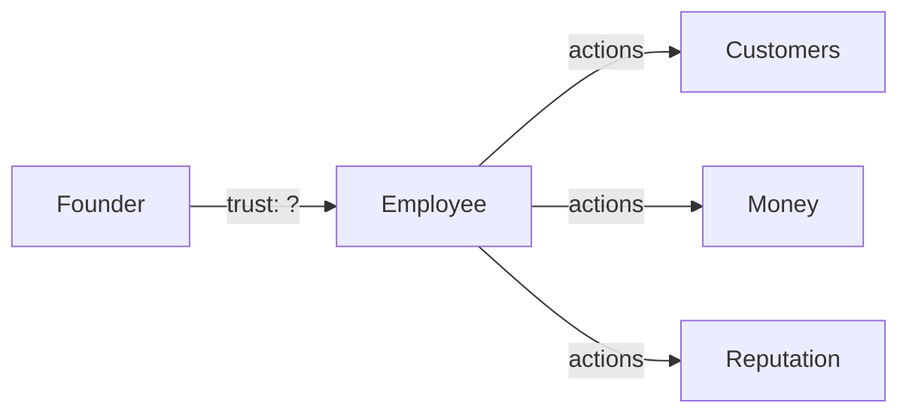
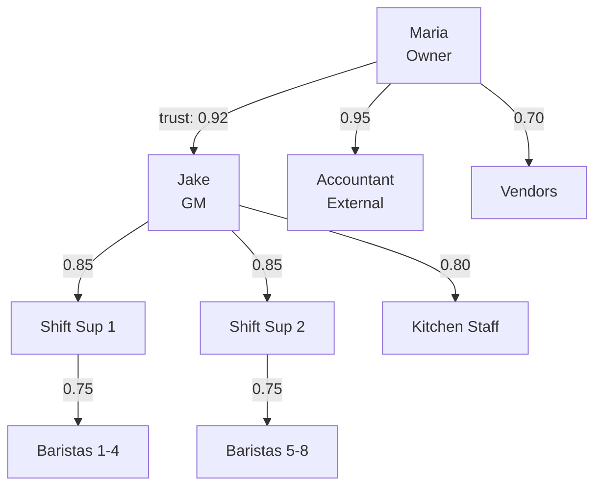
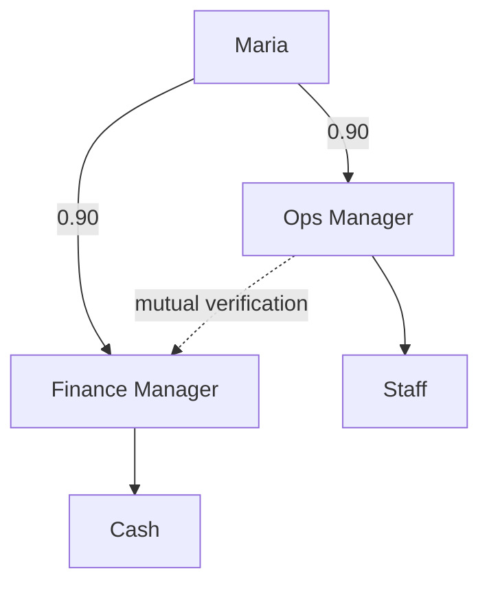
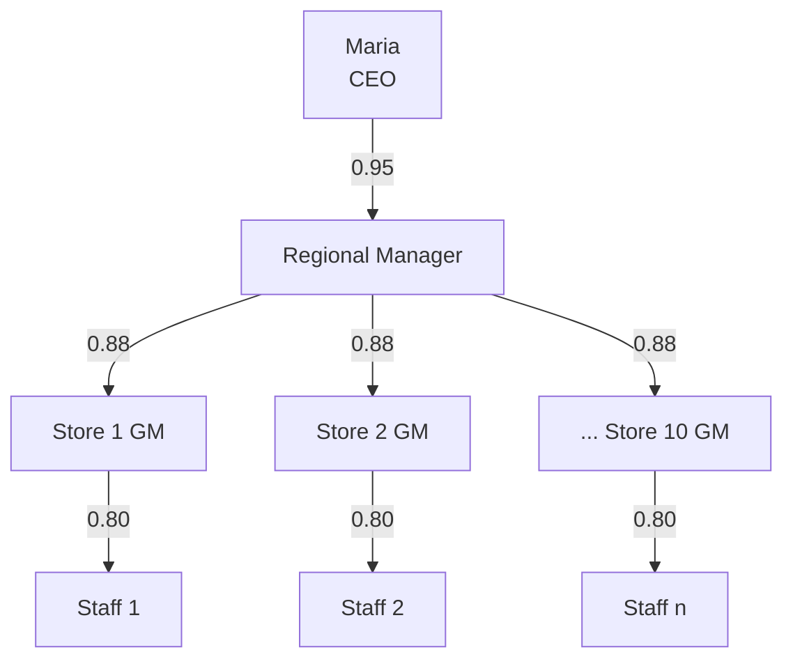
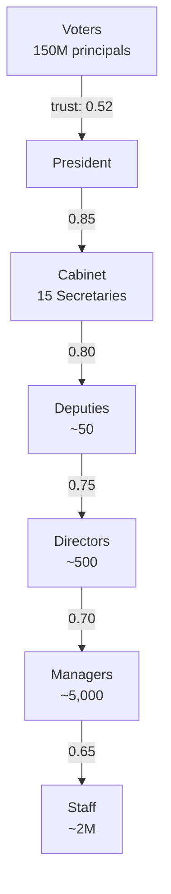
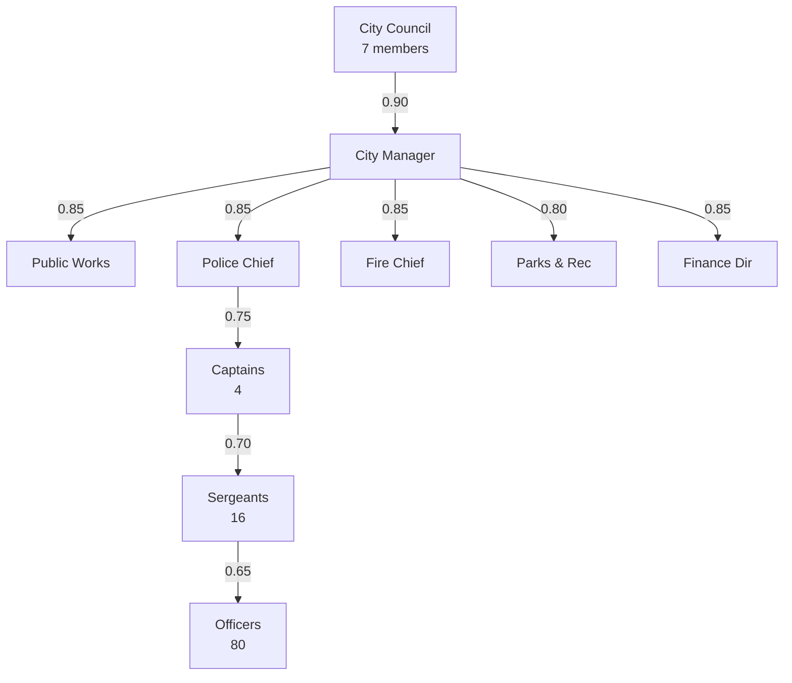
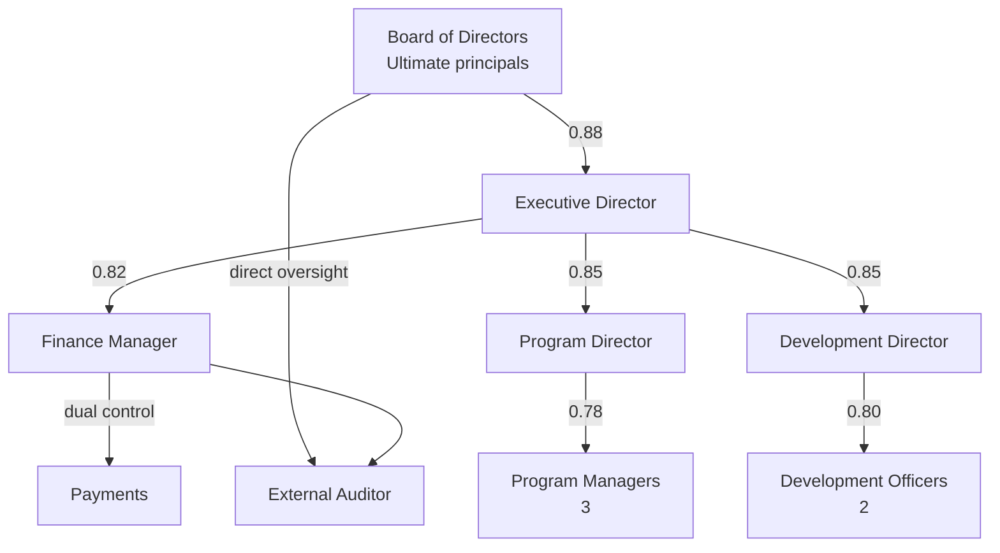

# Trust Calculations in Organizations

:::note[Framework Interpretation]
This case study analyzes organizational dynamics through the lens of our delegation risk framework. The patterns described are based on organizational research, but the specific framing and parallels to AI systems are our own interpretation.
:::

Before AI systems introduced novel trust challenges, human organizations have grappled with delegation, accountability, and risk for millennia. Bureaucracies are, fundamentally, **trust management systems**—structures designed to extend the reach of principals (owners, executives, voters) through chains of trusted agents (employees, managers, officials).

Analyzing organizational trust using the same calculus we apply to AI systems reveals surprisingly quantifiable patterns and offers practical tools for organizational design.

:::tip[Key Insight]
Organizations are trust networks where every delegation creates risk. The same Delegation Risk framework that quantifies AI safety applies directly to bureaucratic structures—and reveals why certain organizational designs persistently fail or succeed.
:::

## The Fundamental Problem: Scaling Trust

A solo founder can trust themselves completely. But the moment they hire their first employee, they face the delegation problem:



**Every additional person multiplies both capability and risk exposure.**

The fundamental trade-off: delegation enables scale, but each link in the trust chain introduces potential failure modes.

---

## Part 1: Small Business Trust Analysis

### Scenario: "River's Edge Café" — A 15-Person Coffee Shop

River's Edge is a successful café with $1.2M annual revenue. Owner Maria Fernandez runs the business with:

- 1 General Manager (Jake)
- 2 Shift Supervisors
- 8 Baristas
- 3 Part-time Kitchen Staff

Let's analyze the trust structure and quantify the risk exposure.

### Trust Topology



### Failure Modes and Delegation Risk Analysis

#### Cash Handling Trust

| Role | Access Level | P(theft/month) | Max Exposure | Delegation Risk |
|------|-------------|----------------|--------------|-----|
| GM (Jake) | Safe combination, bank deposits, vendor payments | 0.002 | $50,000 | $100/mo |
| Shift Supervisors | Daily deposits up to $2,000 | 0.008 | $2,000 | $16/mo |
| Baristas | Cash register, tips | 0.015 | $500 | $7.50/mo × 8 = $60/mo |
| **Total Cash Delegation Risk** | | | | **$176/mo** |

**Insight**: The GM represents 57% of cash-related trust exposure despite being one person. This is typical—trusted positions concentrate risk.

#### Quality Control Trust

| Failure Mode | P(occurrence/month) | Damage | Delegation Risk |
|--------------|--------------------| -------|-----|
| Food safety violation (kitchen) | 0.003 | $30,000 (fines, closure) | $90/mo |
| Barista serves allergen without disclosure | 0.001 | $100,000 (lawsuit) | $100/mo |
| Supervisor approves expired ingredients | 0.002 | $15,000 (health incident) | $30/mo |
| GM ignores health inspection issues | 0.0005 | $200,000 (business closure) | $100/mo |
| **Total Quality Delegation Risk** | | | **$320/mo** |

#### Customer Relationship Trust

| Failure Mode | P(occurrence/month) | Damage | Delegation Risk |
|--------------|--------------------| -------|-----|
| Barista rude to customer (viral incident) | 0.01 | $5,000 (reputation) | $50/mo |
| Supervisor handles complaint poorly | 0.005 | $3,000 | $15/mo |
| GM makes discriminatory policy | 0.0005 | $80,000 | $40/mo |
| Employee posts damaging social media | 0.003 | $20,000 | $60/mo |
| **Total Customer Relationship Delegation Risk** | | | **$165/mo** |

### Total Business Trust Exposure

| Category | Monthly Delegation Risk |
|----------|-------------|
| Cash Handling | $176 |
| Quality Control | $320 |
| Customer Relationships | $165 |
| Inventory/Supplies | $85 |
| Equipment/Property | $45 |
| Legal/Compliance | $120 |
| **Total System Delegation Risk** | **$911/month** |

**Annualized**: ~$10,932/year of expected trust-related losses.

For a business with $1.2M revenue and ~8% profit margin ($96,000 profit), this represents **11.4% of profits** consumed by trust exposure—a significant but manageable cost.

### Trust Optimization Decisions

Maria is considering several changes. Let's analyze each:

#### Option A: Promote Jake to Partner (5% equity)

**Current state**: Jake has significant authority but misaligned incentives.

**Change**: 5% equity stake aligns his interests with business success.

| Metric | Before | After | Change |
|--------|--------|-------|--------|
| Trust(Maria→Jake) | 0.92 | 0.97 | +5% |
| P(theft by Jake) | 0.002 | 0.0005 | -75% |
| P(negligent decisions) | 0.01 | 0.004 | -60% |
| GM-related Delegation Risk | $250/mo | $85/mo | -66% |
| Cost | $0 | $4,800/yr (equity value) | — |

**Net benefit**: $1,980/year in reduced Delegation Risk minus $4,800 in equity dilution = **-$2,820**

**Verdict**: Not financially optimal, but may be worthwhile for retention and long-term alignment.

#### Option B: Install Security Cameras + POS Monitoring

**Cost**: $5,000 installation + $200/month service

| Metric | Before | After | Change |
|--------|--------|-------|--------|
| P(employee theft) | 0.015 | 0.004 | -73% |
| P(detected if theft occurs) | 0.30 | 0.85 | +183% |
| Cash handling Delegation Risk | $176/mo | $52/mo | -70% |
| Trust needed in each employee | 0.75 | 0.85 | +13% (less trust required) |

**Net benefit**: $124/month savings - $200/month cost = **-$76/month**

**Verdict**: Negative ROI as pure security measure, but deters theft which has value beyond expected loss.

#### Option C: Split GM Role into Two Positions

Instead of one GM with $50,000 exposure:
- Operations Manager (schedules, staff, customers)
- Finance Manager (cash, deposits, vendor payments)



| Metric | Before (1 GM) | After (2 Managers) | Change |
|--------|---------------|-------------------|--------|
| Max single-person exposure | $50,000 | $25,000 | -50% |
| Total management Delegation Risk | $250/mo | $180/mo | -28% |
| Salary cost | $55,000/yr | $90,000/yr | +$35,000 |
| Coordination overhead | 0 | ~$5,000/yr | +$5,000 |

**Net cost**: $40,000/year additional expense for $840/year Delegation Risk reduction = **-$39,160**

**Verdict**: Poor ROI unless Maria has specific concerns about Jake or the business scales significantly.

:::note[The Verification Insight]
Option C reveals a key principle: **splitting authority is expensive**. The delegation risk framework shows when concentration is acceptable (small exposure) vs. when decomposition is essential (catastrophic potential).
:::

---

### Restaurant Chain: Scaling Trust Hierarchically

Let's examine how trust calculations change as River's Edge expands to 10 locations.



#### Risk Inheritance Through Hierarchy

**Effective trust from Maria to any barista:**
```
Trust(Maria → Barista) = 0.95 × 0.88 × 0.80 = 0.67
```

**Interpretation**: Maria is effectively placing 33% potential harm on each barista's actions. With 100+ frontline staff, this quickly becomes unmanageable.

#### Comparing Organizational Structures

| Structure | Layers | Trust per Layer | Effective Trust at Base | System Delegation Risk |
|-----------|--------|-----------------|------------------------|------------|
| Flat (Maria → all GMs) | 2 | 0.88 | 0.88 | $8,200/mo |
| Regional (current) | 3 | 0.88 | 0.77 | $5,900/mo |
| Divisional (add VP) | 4 | 0.88 | 0.68 | $4,100/mo |

**Why more layers can reduce Delegation Risk**: Each layer adds verification and filtering. The Regional Manager catches GM mistakes before they reach Maria. The mathematical trade-off: each layer multiplies delay but divides unfiltered risk.

---

## Part 2: Political Organizations

Political systems are massive trust networks where millions of principals (citizens) delegate to agents (officials) who further delegate through bureaucratic hierarchies.

### The Presidential Trust Chain



#### Risk Inheritance in Government

**Effective trust from Voters to a Federal Employee:**
```
Trust(Voter → Staff) = 0.52 × 0.85 × 0.80 × 0.75 × 0.70 × 0.65 = 0.12
```

**Interpretation**: An average federal employee operates with only 12% effective trust from voters. This explains why bureaucracies feel unresponsive—the trust dilution is mathematical.

### Cabinet Secretary Analysis

Let's analyze the Treasury Secretary position:

#### Authority and Exposure

| Domain | Authority Granted | P(misuse/year) | Damage Potential | Delegation Risk |
|--------|------------------|----------------|------------------|-----|
| Financial regulations | Issue binding rules | 0.05 | $50B (market impact) | $2.5B |
| Tax policy guidance | Interpret tax law | 0.03 | $20B (revenue/compliance) | $600M |
| Sanctions enforcement | Designate entities | 0.02 | $10B (diplomatic, economic) | $200M |
| Debt management | Issue treasury bonds | 0.001 | $500B (market confidence) | $500M |
| Banking oversight | Approve/deny mergers | 0.02 | $30B (systemic risk) | $600M |
| **Total Secretary Delegation Risk** | | | | **$4.4B/year** |

:::caution[Scale of Political Trust]
A single Cabinet Secretary has more expected trust exposure than most corporations' entire existence. The Treasury Secretary's $4.4B/year Delegation Risk exceeds the market cap of most public companies.
:::

### The Verification Problem

Unlike business, political trust has weak verification:

| Verification Method | Business | Government |
|--------------------|----------|------------|
| Quarterly audits | Standard | Irregular |
| Performance metrics | Revenue, profit | Vague "outcomes" |
| Firing for cause | Days to weeks | Months to years |
| Trust revocation | Immediate termination | Election cycles (2-6 years) |
| Market feedback | Daily stock price | Polls (monthly, noisy) |

This creates **trust accumulation without verification**—officials accumulate delegated authority faster than they're checked.

### Local Government: City Manager Model

A more tractable example—a city of 100,000 residents:



#### City Budget as Delegation Risk Budget

Annual budget: $150M

| Department | Budget | Authority | P(misuse) | Delegation Risk |
|------------|--------|-----------|-----------|-----|
| Police ($40M) | Arrests, force, investigations | 0.03 | $3M (lawsuits, settlements) | $90K |
| Public Works ($35M) | Contracts, infrastructure | 0.05 | $5M (waste, corruption) | $250K |
| Finance ($10M) | All payments, investments | 0.02 | $10M (fraud, misallocation) | $200K |
| Parks ($15M) | Programs, facilities | 0.02 | $1M (accidents, waste) | $20K |
| Fire ($25M) | Emergency response | 0.01 | $2M (response failures) | $20K |
| Administration ($25M) | HR, legal, IT | 0.03 | $4M (liability, breaches) | $120K |
| **Total City Delegation Risk** | | | | **$700K/year** |

**As percentage of budget**: 0.47% — much lower than the small business because government has monopoly power (can't lose "customers" to competitor cities easily).

#### The Police Chief Trust Problem

Police departments have unique trust challenges:

| Trust Relationship | Level | Why |
|--------------------|-------|-----|
| Chief → Officers | 0.70 | Use of force decisions are split-second |
| Officers → Community | 0.45 | Varies dramatically by neighborhood |
| Community → Officers | 0.55 | Historical factors, current events |
| Council → Chief | 0.85 | Political appointment |

**The trust asymmetry**: Officers have high authority (arrest, force) with relatively low trust levels and extremely limited verification (body cameras only recently).

**Delegation Risk for a single officer:**

| Failure Mode | P(occurrence/year) | Damage | Delegation Risk |
|--------------|-------------------|--------|-----|
| Excessive force incident | 0.02 | $500,000 (settlement) | $10,000 |
| False arrest | 0.05 | $50,000 (lawsuit) | $2,500 |
| Evidence mishandling | 0.03 | $200,000 (case dismissed, retrial) | $6,000 |
| Off-duty misconduct | 0.01 | $100,000 (reputation, firing) | $1,000 |
| **Total per Officer** | | | **$19,500/year** |

With 80 officers: **$1.56M/year** total police Delegation Risk, but budget only shows $90K?

The discrepancy: settlements and lawsuits are often paid from general fund, not police budget—a form of **hidden trust externality**.

:::note[Organizational Trust Externalities]
Departments often externalize their trust failures to other budgets. Police misconduct costs come from legal/liability funds. Poor infrastructure decisions in Public Works show up as emergency repairs years later. Honest trust accounting would attribute costs to sources.
:::

---

## Part 3: Trust Design Principles for Organizations

Based on this analysis, several principles emerge:

### 1. Delegation Risk Budgeting

Every organization should calculate:
- **Total System Delegation Risk**: Sum of all expected trust exposures
- **Delegation Risk Concentration**: Herfindahl index of per-person Delegation Risks
- **Trust Efficiency**: (Value created) / (Trust granted)

Target ratios by organization type:

| Type | Acceptable Delegation Risk as % of Revenue | Max Single-Person Delegation Risk |
|------|-------------------------------|----------------------|
| Retail | 0.5-1% | 5% of annual revenue |
| Professional Services | 1-3% | 10% of annual revenue |
| Financial Services | 0.1-0.5% | 2% of AUM |
| Government | 0.5-2% of budget | 0.1% of budget |

### 2. Verification Proportionality

**Verification investment should scale with trust granted:**

| Trust Level | Verification Requirements |
|-------------|--------------------------|
| Delegation Risk < $10K | Self-reporting, spot checks |
| Delegation Risk $10K-$100K | Regular audits, dual control |
| Delegation Risk $100K-$1M | Continuous monitoring, segregation of duties |
| Delegation Risk > $1M | Independent board oversight, external audit |

### 3. Trust Decay and Renewal

Trust should have expiration:

```
Trust(t) = Trust(0) × e^(-λt) × V(t)

Where:
- λ = decay constant (typically 0.1-0.3 per year)
- V(t) = verification events that refresh trust
```

**Practical implementation:**
- Annual reviews renew trust for low-risk positions
- Quarterly audits for high-authority roles
- Continuous monitoring for critical positions

### 4. Separation of Critical Functions

For high-damage potential, require multiple parties:

| Function | Minimum Separation |
|----------|-------------------|
| Approve payments > $10K | 2 signers |
| Access customer data | Need-to-know + audit log |
| Change security settings | Admin + security officer |
| Terminate employees | Manager + HR |
| Major contracts | Legal + Finance + Executive |

---

## Worked Example: Designing a New Organization

You're starting a nonprofit with a $2M annual budget. Design the trust architecture.

### Step 1: Define Delegation Risk Budget

- Acceptable Delegation Risk: 1.5% of budget = **$30,000/year**
- Maximum single-person Delegation Risk: 0.3% = **$6,000/year**

### Step 2: Identify High-Trust Functions

| Function | Required Authority | Potential Damage | Raw Delegation Risk |
|----------|-------------------|------------------|---------|
| Executive Director | Strategic decisions, hiring, external representation | $500K (reputation, direction) | $15,000 |
| CFO/Finance Manager | All payments, banking, reporting | $300K (fraud, misreporting) | $12,000 |
| Program Director | Program spending, partner relationships | $200K (waste, failed programs) | $8,000 |
| Development Director | Donor relationships, campaigns | $150K (reputation, lost donations) | $4,500 |

**Total raw Delegation Risk: $39,500** — exceeds budget by 32%

### Step 3: Implement Trust Mitigations

| Mitigation | Cost | Delegation Risk Reduction | Net |
|------------|------|---------------|-----|
| Board approval > $25K | $0 | -$5,000 | +$5,000 |
| External accountant review | $8,000/yr | -$4,000 | -$4,000 |
| Dual signature on checks | $0 | -$3,000 | +$3,000 |
| Program outcome metrics | $2,000/yr | -$2,500 | +$500 |
| Reference checks for all hires | $500/yr | -$1,000 | +$500 |

**New total Delegation Risk: $24,000** — within budget at $5,000 margin

### Step 4: Define Verification Schedule

| Role | Verification | Frequency |
|------|-------------|-----------|
| ED | Board evaluation, financial audit | Annual |
| Finance | External accountant review | Quarterly |
| Program | Outcome metrics review | Monthly |
| Development | Donor retention metrics | Quarterly |

### Step 5: Trust Architecture Diagram



---

## Key Takeaways

:::tip[Key Takeaways]
1. **Trust is quantifiable**: Every delegation has an expected trust exposure that can be calculated
2. **Trust dilutes through hierarchies**: Effective trust = product of trust levels at each layer
3. **Concentration is dangerous**: Single points of failure should have proportionally more verification
4. **Verification is the counterweight**: Trust without verification accumulates risk over time
5. **Trust architecture shapes outcomes**: Organizations with similar goals but different trust structures perform differently
6. **Trust failures have patterns**: Knowing the failure modes enables prevention
:::

## See Also

- [Exposure Cascade](/delegation-risk/exposure-cascade/) — How exposure budgets flow down through organizational hierarchies
- [Trust Across Civilizations](/case-studies/human-systems/trust-across-civilizations/) — Historical and creative perspectives on organizational trust
- [Delegation Risk Overview](/delegation-risk/overview/) — The mathematical foundations
- [Risk Inheritance](/research/theory/trust-propagation/) — How trust flows through networks
- [Trust Accounting](/research/theory/trust-accounting/) — Ledgers and auditing for trust
- [Mechanism Design for Truthful Reporting](/cross-domain-methods/mechanism-design/) — Incentive-compatible trust verification
