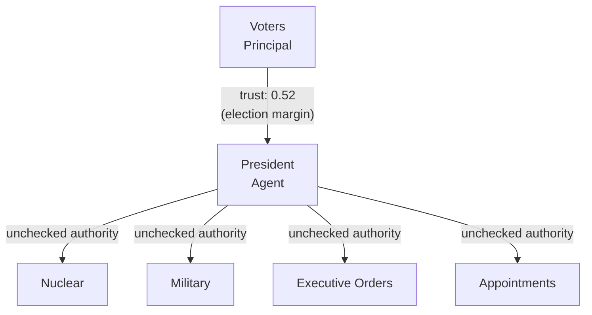
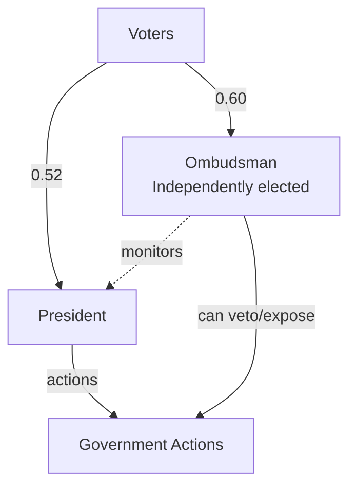
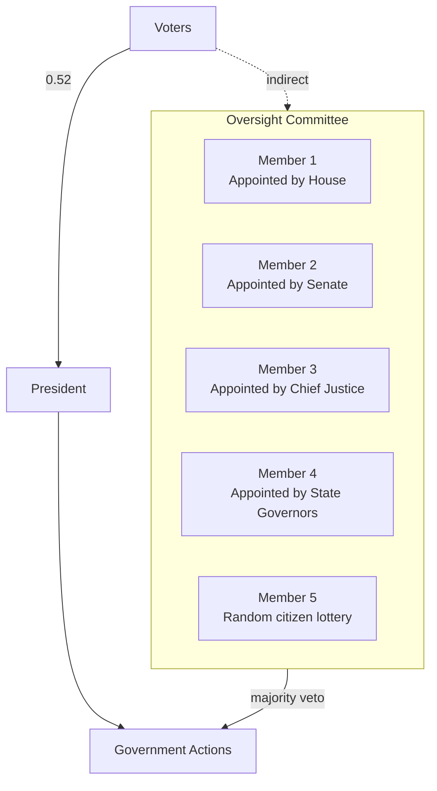
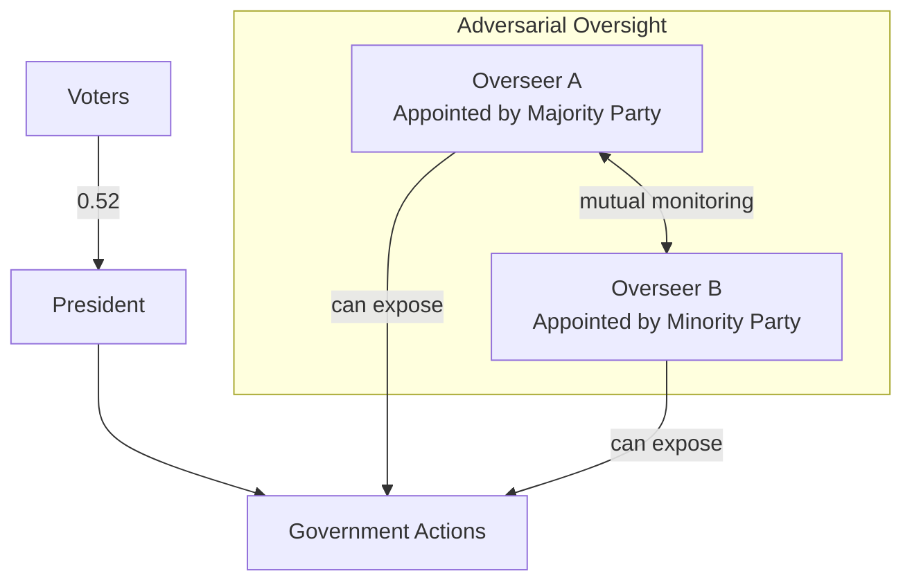
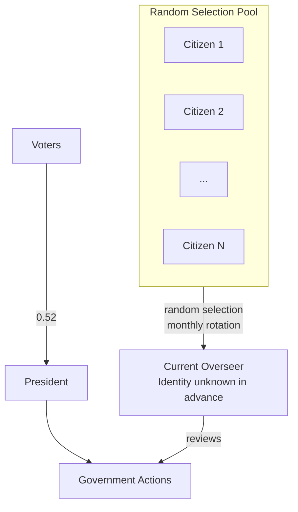
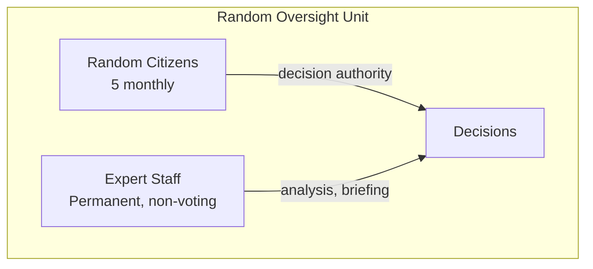
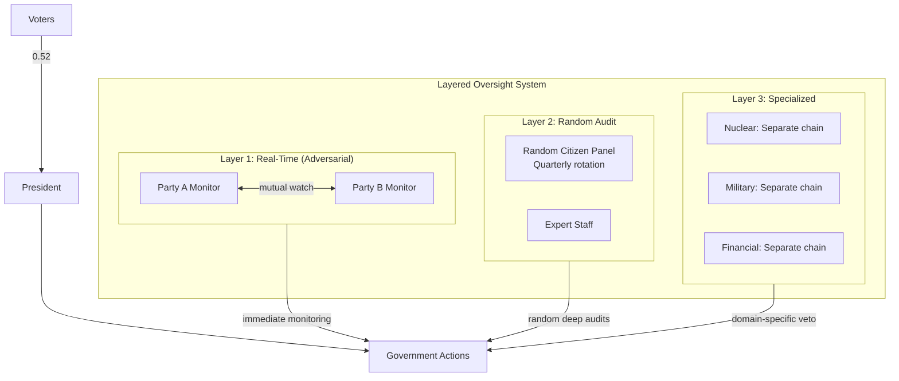

# The Oversight Dilemma: Who Watches the Watchmen?

:::note[Framework Interpretation]
This case study analyzes oversight mechanisms through the lens of our delegation risk framework. The examples are based on real governmental structures, but the mathematical framing is our own interpretation.
:::

The U.S. President commands nuclear weapons, controls the world's largest military, directs $6 trillion in annual spending, and can issue executive orders affecting 330 million people. This concentration of power creates enormous Delegation Risk.

The obvious solution: add oversight. But here's the problem—**any overseer powerful enough to check the President becomes a massive trust liability themselves**.

This document works through the mathematics of oversight design, exploring increasingly sophisticated solutions to this fundamental dilemma.

:::tip[The Core Insight]
Oversight doesn't eliminate trust exposure—it redistributes it. The art is in finding architectures where the redistribution reduces total system risk.
:::

---

## Part 1: The Baseline — Presidential Power Unmonitored

### Estimating Presidential Delegation Risk

Let's quantify the trust exposure of an unchecked President:

| Authority Domain | P(catastrophic misuse/term) | Damage Potential | 4-Year Delegation Risk |
|------------------|---------------------------|------------------|------------|
| Nuclear launch authority | 0.0001 | $50 trillion (civilization) | $5B |
| Military deployment | 0.01 | $500B (major war) | $5B |
| Executive orders (domestic) | 0.05 | $100B (economic/rights) | $5B |
| Appointments (judiciary, agencies) | 0.10 | $200B (institutional damage) | $20B |
| Foreign policy/treaties | 0.03 | $300B (alliance collapse) | $9B |
| Pardon power | 0.05 | $10B (justice system) | $500M |
| Emergency powers | 0.02 | $1T (constitutional crisis) | $20B |
| **Total Presidential Delegation Risk** | | | **~$65B/term** |

:::note[Calibration Note]
These numbers are illustrative. The key point is that presidential Delegation Risk is *enormous*—likely among the highest for any individual on Earth. Even small probability catastrophic outcomes dominate the calculation.
:::

### The Trust Topology Without Oversight



**Current state:**
- Trust granted: 0.52 (bare electoral majority)
- Delegation Risk: $65B/term
- Verification: Elections every 4 years (extremely slow feedback)
- Revocation mechanism: Impeachment (requires 67 senators—very difficult)

**Problem**: The trust architecture grants enormous authority with minimal real-time verification and near-impossible revocation.

---

## Part 2: The Naive Solution — Add a Powerful Overseer

### Option A: Single Presidential Ombudsman

Create a powerful overseer with authority to veto or expose presidential actions.



**Ombudsman Powers:**
- Access to all presidential communications and decisions
- Authority to delay or publicize any action
- Cannot be fired by President
- 6-year term, independently elected

### Calculating the New Delegation Risk

**Presidential Delegation Risk with Ombudsman:**

The Ombudsman reduces the probability of presidential misuse by catching violations:

```
P(misuse succeeds) = P(President misuses) × P(Ombudsman fails to catch)
```

If Ombudsman catches 80% of violations:

| Domain | Original P(misuse) | With Ombudsman | New Delegation Risk |
|--------|-------------------|----------------|---------|
| Nuclear launch | 0.0001 | 0.0001 × 0.20 = 0.00002 | $1B |
| Military deployment | 0.01 | 0.01 × 0.20 = 0.002 | $1B |
| Executive orders | 0.05 | 0.05 × 0.20 = 0.01 | $1B |
| Appointments | 0.10 | 0.10 × 0.20 = 0.02 | $4B |
| Foreign policy | 0.03 | 0.03 × 0.20 = 0.006 | $1.8B |
| Pardon power | 0.05 | 0.05 × 0.20 = 0.01 | $100M |
| Emergency powers | 0.02 | 0.02 × 0.20 = 0.004 | $4B |
| **Presidential subtotal** | | | **$12.9B** |

**Reduction: 80%** — looks great!

### But Now Calculate Ombudsman Delegation Risk

The Ombudsman now has:
- Access to all classified information
- Effective veto over presidential action
- Power to trigger constitutional crises
- Near-zero accountability (6-year term, hard to remove)

| Ombudsman Failure Mode | P(occurrence/term) | Damage | Delegation Risk |
|------------------------|-------------------|--------|-----|
| Corruption (bribed/compromised) | 0.05 | $100B (sells secrets, enables enemies) | $5B |
| Partisan abuse (blocks legitimate actions) | 0.15 | $50B (governance paralysis) | $7.5B |
| Incompetence (fails to catch real problems) | 0.20 | $30B (false confidence) | $6B |
| Power grab (uses information for personal gain) | 0.03 | $80B (blackmail, manipulation) | $2.4B |
| Leaks classified information | 0.10 | $20B (intelligence damage) | $2B |
| **Ombudsman subtotal** | | | **$22.9B** |

### Total System Delegation Risk With Single Ombudsman

```
Total Delegation Risk = Presidential Delegation Risk + Ombudsman Delegation Risk
         = $12.9B + $22.9B
         = $35.8B
```

**Compared to baseline ($65B)**: 45% reduction

:::caution[The Oversight Paradox]
Adding an Ombudsman reduced *Presidential* Delegation Risk by 80%, but the *Ombudsman* added $22.9B in new exposure. Net improvement: only 45%. The overseer became a major liability.
:::

### Why This Happens

The Ombudsman requires:
1. **Access** to everything the President sees (to monitor effectively)
2. **Power** to stop presidential actions (to matter)
3. **Independence** from the President (to not be captured)

But these same properties make the Ombudsman dangerous:
- Access → Can leak or sell information
- Power → Can abuse veto for personal/partisan gain
- Independence → Hard to hold accountable

**This is the fundamental oversight dilemma.**

---

## Part 3: Distributing Oversight — The Committee Approach

### Option B: Oversight Committee (5 Members)

Instead of one powerful overseer, distribute the role:



**Rules:**
- 3 of 5 members must agree to veto any action
- Staggered 5-year terms
- Different appointing authorities (diverse principals)
- Each member sees only partial information (need-to-know compartmentalization)

### Calculating Committee Delegation Risk

**Key insight**: Corruption now requires corrupting 3+ members, not just 1.

**Probability of committee corruption:**

If each member has P(corrupt) = 0.10, the probability that 3+ are corrupt:

```
P(≥3 corrupt) = C(5,3)×0.1³×0.9² + C(5,4)×0.1⁴×0.9¹ + C(5,5)×0.1⁵
             = 10×0.001×0.81 + 5×0.0001×0.9 + 1×0.00001
             = 0.0081 + 0.00045 + 0.00001
             = 0.00856
             ≈ 0.86%
```

**Compare to single Ombudsman**: P(corrupt) = 10%

**Committee corruption is 11.6× less likely than single-overseer corruption.**

### Updated Delegation Risk Calculation

**Committee failure modes:**

| Failure Mode | Single Ombudsman P | Committee P | Damage | Committee Delegation Risk |
|--------------|-------------------|-------------|--------|---------------|
| Corruption | 0.05 | 0.0086 | $100B | $860M |
| Partisan abuse | 0.15 | 0.03 | $50B | $1.5B |
| Incompetence | 0.20 | 0.25* | $30B | $7.5B |
| Power grab | 0.03 | 0.005 | $80B | $400M |
| Leaks | 0.10 | 0.18** | $20B | $3.6B |
| **Subtotal** | **$22.9B** | | | **$13.86B** |

*Committees can be *more* prone to groupthink and diffused responsibility
**More people = more leak surface

**Presidential Delegation Risk with committee oversight:**

Committee catches violations at 70% rate (lower than single expert, due to coordination costs):

| Domain | Original Delegation Risk | With Committee (30% passthrough) | New Delegation Risk |
|--------|-------------|----------------------------------|---------|
| Nuclear launch | $5B | × 0.30 | $1.5B |
| Military deployment | $5B | × 0.30 | $1.5B |
| Executive orders | $5B | × 0.30 | $1.5B |
| Appointments | $20B | × 0.30 | $6B |
| Foreign policy | $9B | × 0.30 | $2.7B |
| Pardon power | $500M | × 0.30 | $150M |
| Emergency powers | $20B | × 0.30 | $6B |
| **Presidential subtotal** | **$65B** | | **$19.35B** |

### Total System Delegation Risk With Committee

```
Total Delegation Risk = Presidential Delegation Risk + Committee Delegation Risk
         = $19.35B + $13.86B
         = $33.2B
```

| Architecture | Total Delegation Risk | vs. Baseline |
|--------------|-----------|--------------|
| No oversight | $65B | — |
| Single Ombudsman | $35.8B | -45% |
| 5-Person Committee | $33.2B | -49% |

**Modest improvement.** The committee reduces corruption risk but increases leak risk and reduces oversight effectiveness.

---

## Part 4: Adversarial Oversight — Competing Watchmen

### Option C: Two Competing Overseers

What if we create *adversarial* overseers who watch each other?



**Key insight**: Overseers from opposing parties have *incentive* to expose each other's failures and the President's misdeeds (if President is from opposing party) or their own party's overseer's failures.

### The Game Theory

**If Overseer A covers for President (same party):**
- Overseer B (opposing party) has incentive to expose both
- A's cover-up becomes evidence of A's corruption
- A faces consequences

**If both overseers are corrupt:**
- Each knows the other knows
- Neither can safely cover for the other
- Mutual blackmail creates unstable equilibrium
- Defection (exposing) is dominant strategy in iterated game

### Calculating Adversarial Delegation Risk

**Corruption probability:**

For corruption to succeed, *both* adversarial overseers must be corrupt AND choose to collude:

```
P(successful corruption) = P(A corrupt) × P(B corrupt) × P(they collude | both corrupt)
                        = 0.10 × 0.10 × 0.30
                        = 0.003
```

(Collusion is unlikely because they're from opposing parties and each has incentive to defect)

**Partisan abuse probability:**

Each overseer might try partisan abuse, but the other will likely expose it:

```
P(successful partisan abuse) = P(A abuses) × P(B fails to expose)
                             = 0.20 × 0.15
                             = 0.03
```

**Adversarial system Delegation Risk:**

| Failure Mode | P | Damage | Delegation Risk |
|--------------|---|--------|-----|
| Corruption (both collude) | 0.003 | $100B | $300M |
| Partisan abuse (successful) | 0.03 | $50B | $1.5B |
| Incompetence (both miss) | 0.10 × 0.10 = 0.01 | $30B | $300M |
| Leaks (either) | 0.15 + 0.15 = 0.28* | $20B | $5.6B |
| Gridlock (both veto everything) | 0.08 | $40B | $3.2B |
| **Subtotal** | | | **$10.9B** |

*Leak risk increases—two overseers means two potential leak sources

**Presidential Delegation Risk with adversarial oversight:**

Adversarial overseers catch ~85% of violations (high motivation to find problems):

```
Presidential Delegation Risk = $65B × 0.15 = $9.75B
```

### Total System Delegation Risk With Adversarial Oversight

```
Total Delegation Risk = Presidential Delegation Risk + Adversarial Oversight Delegation Risk
         = $9.75B + $10.9B
         = $20.65B
```

| Architecture | Total Delegation Risk | vs. Baseline |
|--------------|-----------|--------------|
| No oversight | $65B | — |
| Single Ombudsman | $35.8B | -45% |
| 5-Person Committee | $33.2B | -49% |
| Adversarial (2 parties) | $20.65B | **-68%** |

**Significant improvement!** Adversarial incentives align oversight with exposure rather than protection.

:::note[The Adversarial Insight]
When overseers have *opposing* interests, their mutual monitoring is self-enforcing. Neither can safely be corrupt because the other profits from exposing them.
:::

---

## Part 5: Randomized Oversight — Unpredictable Watchmen

### Option D: Rotating Random Oversight

What if we make oversight *unpredictable*?



**Mechanism:**
- Large pool of pre-cleared citizens (1,000+)
- Each month, 5 are randomly selected
- Selection revealed *after* they arrive for duty
- President cannot know who will oversee which actions

### Why Randomization Helps

**Corruption becomes expensive:**
- Can't pre-corrupt the specific overseer (unknown until activation)
- Would need to corrupt large fraction of pool (expensive, detectable)
- Each corrupt member only serves briefly (limited damage window)

**P(random overseer corrupt):**

If 5% of pool is pre-corrupted (50 of 1,000):

```
P(selected overseer corrupt) = 50/1000 = 0.05
```

But corruption only helps during their 1-month term:

```
P(corrupt overseer during specific presidential action) = 0.05 × (1/12) = 0.004
```

**Effective corruption probability over 4-year term:**

Each action faces independent random oversight:

```
P(corrupt oversight for any given action) ≈ 0.004
```

This is **12.5× better** than a single permanent overseer with 5% corruption probability.

### The Competence Problem

Random citizens may lack expertise to recognize violations:

| Overseer Type | P(catches violation) | Why |
|---------------|---------------------|-----|
| Expert Ombudsman | 0.80 | Deep knowledge |
| Committee | 0.70 | Collective expertise |
| Adversarial | 0.85 | Motivated to find problems |
| Random citizen | 0.40 | Untrained, unfamiliar |

### Hybrid: Random + Expert

Solution: Pair random citizens with expert staff:



**Random citizens decide**, but experts help them understand what they're seeing.

- Expert staff can be monitored for corruption (they don't make final calls)
- Random citizens can't be pre-corrupted (unknown selection)
- Combined: harder to corrupt than either alone

### Calculating Randomized + Expert Delegation Risk

**Oversight effectiveness:**
- Expert staff catch 75% of violations in analysis
- Random citizens approve/publicize staff findings 90% of the time
- Combined catch rate: 0.75 × 0.90 = 0.675

**Corruption probability:**
- Expert staff: 0.08 (can be corrupt, but can't unilaterally suppress)
- Random citizens: 0.004 (per-action, due to rotation)
- Both simultaneously corrupt: 0.08 × 0.004 = 0.00032

**Randomized oversight Delegation Risk:**

| Failure Mode | P | Damage | Delegation Risk |
|--------------|---|--------|-----|
| Corruption (both levels) | 0.00032 | $100B | $32M |
| Partisan abuse (random selection is neutral) | 0.01 | $50B | $500M |
| Incompetence | 0.20 | $30B | $6B |
| Leaks | 0.15 | $20B | $3B |
| Gaming (President delays until favorable oversight) | 0.05 | $20B | $1B |
| **Subtotal** | | | **$10.53B** |

**Presidential Delegation Risk with randomized oversight:**

```
Presidential Delegation Risk = $65B × (1 - 0.675) = $65B × 0.325 = $21.1B
```

### Total System Delegation Risk With Randomized Oversight

```
Total Delegation Risk = Presidential Delegation Risk + Randomized Oversight Delegation Risk
         = $21.1B + $10.53B
         = $31.6B
```

| Architecture | Total Delegation Risk | vs. Baseline |
|--------------|-----------|--------------|
| No oversight | $65B | — |
| Single Ombudsman | $35.8B | -45% |
| 5-Person Committee | $33.2B | -49% |
| Randomized + Expert | $31.6B | -51% |
| Adversarial (2 parties) | $20.65B | -68% |

Randomized is better than committee but worse than adversarial. However, randomized might be *combined* with adversarial...

---

## Part 6: Combining Approaches — The Optimal Architecture

### Option E: Adversarial + Randomized + Compartmentalized

What if we combine the best features?



**Architecture features:**

1. **Adversarial real-time monitors**: Opposing parties watch everything in real-time
2. **Random audit panels**: Quarterly deep dives into random decisions
3. **Specialized oversight**: Nuclear, military, and financial actions have separate oversight chains
4. **Compartmentalization**: No single overseer sees everything

### Calculating Combined System

**Layer 1 (Adversarial) effectiveness**: 85% catch rate, corruption P = 0.003

**Layer 2 (Random Audit) effectiveness**: 60% catch rate on audited items (25% of actions audited)
- Overall catch rate contribution: 0.60 × 0.25 = 0.15 (for things Layer 1 missed)

**Layer 3 (Specialized)**: For highest-damage categories only
- Nuclear: Additional 90% catch rate with dual-key requirement
- Military: Additional 70% catch rate through military chain
- Financial: Additional 75% catch rate through GAO/IG

**Combined catch rate:**

For a presidential violation to succeed, it must pass ALL applicable layers:

```
P(violation succeeds) = P(passes Layer 1) × P(passes Layer 2) × P(passes Layer 3 if applicable)
```

| Domain | L1 Pass | L2 Pass | L3 Pass | Combined Pass |
|--------|---------|---------|---------|---------------|
| Nuclear | 0.15 | 0.85 | 0.10 | 0.013 |
| Military | 0.15 | 0.85 | 0.30 | 0.038 |
| Executive orders | 0.15 | 0.85 | 1.0 (no L3) | 0.128 |
| Appointments | 0.15 | 0.85 | 1.0 | 0.128 |
| Foreign policy | 0.15 | 0.85 | 0.50 | 0.064 |
| Pardon power | 0.15 | 0.85 | 1.0 | 0.128 |
| Emergency powers | 0.15 | 0.85 | 0.40 | 0.051 |

**Presidential Delegation Risk with combined oversight:**

| Domain | Original Delegation Risk | × Pass Rate | New Delegation Risk |
|--------|-------------|-------------|---------|
| Nuclear | $5B | 0.013 | $65M |
| Military | $5B | 0.038 | $190M |
| Executive orders | $5B | 0.128 | $640M |
| Appointments | $20B | 0.128 | $2.56B |
| Foreign policy | $9B | 0.064 | $576M |
| Pardon power | $500M | 0.128 | $64M |
| Emergency powers | $20B | 0.051 | $1.02B |
| **Presidential subtotal** | **$65B** | | **$5.12B** |

**Oversight system Delegation Risk:**

Now we must sum Delegation Risk across all oversight components:

| Oversight Component | Delegation Risk |
|--------------------|-----|
| Adversarial monitors (Layer 1) | $3B |
| Random audit (Layer 2) | $2B |
| Nuclear chain (Layer 3a) | $500M |
| Military chain (Layer 3b) | $1B |
| Financial chain (Layer 3c) | $800M |
| Coordination failures between layers | $1.5B |
| **Oversight subtotal** | **$8.8B** |

### Total System Delegation Risk With Combined Oversight

```
Total Delegation Risk = Presidential Delegation Risk + Oversight Delegation Risk
         = $5.12B + $8.8B
         = $13.9B
```

| Architecture | Total Delegation Risk | vs. Baseline | Reduction |
|--------------|-----------|--------------|-----------|
| No oversight | $65B | — | 0% |
| Single Ombudsman | $35.8B | -45% | 45% |
| 5-Person Committee | $33.2B | -49% | 49% |
| Randomized + Expert | $31.6B | -51% | 51% |
| Adversarial (2 parties) | $20.65B | -68% | 68% |
| **Combined Layered** | **$13.9B** | **-79%** | **79%** |

:::tip[The Power of Layered Defense]
The combined system achieves 79% Delegation Risk reduction—not because any single layer is perfect, but because violations must evade *all* layers simultaneously. Defense in depth works.
:::

---

## Part 7: The Limits of Oversight

### Irreducible Risks

Even the best oversight architecture has limits:

**1. Speed-of-Decision Problems**

Some presidential actions must happen faster than oversight can review:

| Action | Decision Window | Oversight Feasible? |
|--------|-----------------|---------------------|
| Nuclear response | 15 minutes | No |
| Hostage situation | Hours | Partial |
| Market intervention | Hours-days | Yes |
| Troop deployment | Days | Yes |
| Judicial appointments | Months | Yes |

For fast decisions, oversight must be *pre-positioned* (people already in the room) rather than *reactive*.

**2. Information Asymmetry**

The President has access to intelligence no overseer can fully verify:

```
President: "I ordered the strike because classified source X said..."
Overseer: [Cannot independently verify source X]
```

This creates an irreducible trust floor—at some point, someone must be believed.

**3. Collusion Across Branches**

If President + Congressional leadership + Supreme Court majority all collude, no oversight within the system can stop them. This is a *constitutional* trust assumption, not addressable by oversight architecture alone.

**4. Public Attention Limits**

Oversight mechanisms that rely on public exposure (adversarial monitors, random audits) only work if the public:
- Pays attention
- Understands the violation
- Has memory longer than news cycles
- Has mechanisms to act (elections, pressure)

### The Oversight Cost Curve

```
                     │
                     │              ╭─── Diminishing returns
    Total System     │            ╭─╯
    Delegation Risk              │          ╭─╯
                     │        ╭─╯
                     │      ╭─╯
                     │    ╭─╯
                     │  ╭─╯
                     │╭─╯
                     ├─────────────────────────
                     │ Oversight Complexity →

                     Zone 1: High ROI (simple oversight)
                     Zone 2: Moderate ROI (layered systems)
                     Zone 3: Low ROI (diminishing returns)
                     Zone 4: Negative ROI (oversight costs exceed benefits)
```

**At some point, adding more oversight creates more liability than it prevents.**

Our combined system ($13.9B Delegation Risk) is likely near the optimal—additional layers would add complexity and new failure modes without proportional benefit.

---

## Part 8: Design Principles for Oversight Systems

Based on this analysis:

### Principle 1: Adversarial > Aligned

Overseers with opposing interests are more reliable than aligned overseers:

| Overseer Relationship | Corruption Probability | Why |
|----------------------|----------------------|-----|
| Overseer loyal to President | 0.15 | Incentive to cover up |
| Overseer neutral | 0.08 | No strong incentive either way |
| Overseer adversarial to President | 0.03 | Incentive to expose |

**Implication**: Staff oversight with opposing political parties, not "nonpartisan" appointees.

### Principle 2: Rotate > Permanent

Rotating oversight reduces:
- Time for corruption relationships to develop
- Value of corrupting any individual
- Institutional capture

**Optimal rotation**: Frequent enough to prevent capture, slow enough for competence

| Rotation Speed | Corruption Resistance | Competence | Sweet Spot |
|----------------|----------------------|------------|------------|
| Daily | Excellent | Terrible | No |
| Monthly | Very good | Poor | Partial |
| Quarterly | Good | Moderate | **Yes** |
| Annually | Moderate | Good | Maybe |
| Never | Poor | Excellent | No |

### Principle 3: Layer > Single Point

Multiple independent oversight layers compound effectiveness:

```
P(violation succeeds) = P(evades L1) × P(evades L2) × P(evades L3)
```

Three 70%-effective layers: 0.3 × 0.3 × 0.3 = 2.7% success rate

One 90%-effective layer: 10% success rate

**Layering beats perfection.**

### Principle 4: Specialize High-Damage Domains

The highest-damage actions deserve bespoke oversight:

| Damage Potential | Oversight Investment |
|------------------|---------------------|
| < $1B | Standard layered system |
| $1B - $100B | Domain-specific chain |
| > $100B | Dedicated system, multiple vetos, hardware interlocks |

Nuclear launch ($50T damage potential) warrants extreme measures that would be absurd for routine executive orders.

### Principle 5: Accept Irreducible Trust

At some point, you must trust someone:

```
Minimal Trust Floor = P(all overseers collude) × P(public fails to respond)
                    ≈ 0.001 × 0.10
                    ≈ 0.0001
```

**Trying to eliminate this last 0.01% often costs more than the risk is worth.** Accept a minimal trust floor and focus resources on higher-ROI improvements.

---

## Summary: The Oversight Menu

| Option | Mechanism | Delegation Risk Reduction | Key Benefit | Key Weakness |
|--------|-----------|---------------|-------------|--------------|
| Single Ombudsman | One powerful overseer | 45% | Simple | Overseer becomes liability |
| Committee | Multiple appointed members | 49% | Harder to corrupt | Groupthink, leaks |
| Adversarial | Opposing party monitors | 68% | Self-enforcing vigilance | Gridlock risk |
| Randomized | Lottery selection, rotation | 51% | Unpredictable, uncorruptible | Less competent |
| Combined Layered | Multiple independent systems | 79% | Defense in depth | Complex, expensive |

:::tip[Key Takeaways]
1. **Oversight redistributes, not eliminates, trust exposure**
2. **Powerful overseers become powerful liabilities**
3. **Adversarial incentives > good intentions**
4. **Unpredictability defeats corruption planning**
5. **Layered defense compounds effectiveness**
6. **Specialize oversight for highest-damage domains**
7. **Accept irreducible trust floor and optimize above it**
:::

---

## See Also

- [Trust Across Civilizations](/case-studies/human-systems/trust-across-civilizations/) — Historical oversight architectures
- [Organizational Trust](/case-studies/human-systems/organizational-trust/) — Business applications
- [Risk Inheritance](/research/theory/trust-propagation/) — How trust flows through networks
- [Mechanism Design](/cross-domain-methods/mechanism-design/) — Incentive-compatible structures
- [Anti-patterns](/case-studies/ai-systems/anti-patterns/) — What not to do
