# Trust Across Civilizations

:::note[Framework Interpretation]
This case study analyzes historical organizational forms through the lens of our delegation risk framework. The historical examples are drawn from organizational history, but the specific framing as "trust architectures" is our own interpretation.
:::

Long before AI agents, humans invented a technology for scaling trust: **bureaucracy**. Every organizational form—from pirate ships to the Papacy, from startups to the Soviet Politburo—is a solution to the same fundamental problem: how do you get things done when you can't do everything yourself and can't fully trust anyone else?

This page applies delegation risk framework to human organizations. No AI, just the oldest delegation problem in existence.

:::tip[The Insight]
Organizations aren't just structures for coordination—they're **trust architectures**. Every org chart is a risk budget. Every management layer is a risk inheritance function. Every scandal is a trust violation that exceeded containment.
:::

---

## Part 1: Trust Topologies Across Civilization

Different organizational forms solve the trust problem differently. Let's analyze some unexpected examples.

### The Pirate Ship: Surprisingly Democratic Trust

18th-century pirate ships had remarkably sophisticated trust architecture:

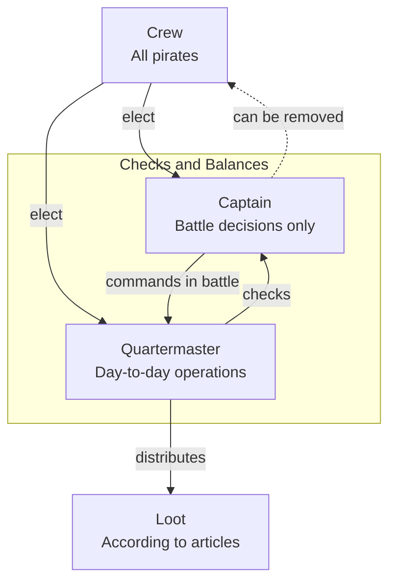

**Trust innovations:**
- **Elected leadership**: Captain could be voted out at any time, keeping trust accountable
- **Separation of powers**: Captain for combat, Quartermaster for everything else
- **Written contracts**: "Articles of Agreement" specified exact Delegation Risk bounds—loot distribution, injury compensation, punishment for violations
- **Radical transparency**: All loot displayed publicly before division

**Delegation Risk Analysis of a Pirate Captain:**

| Authority | P(abuse) | Damage | Delegation Risk |
|-----------|----------|--------|-----|
| Battle command | 0.05 | 50 lives × $50K = $2.5M | $125,000 |
| Loot distribution | 0.01 (public, audited) | $100K | $1,000 |
| Discipline | 0.03 | $20K (crew morale) | $600 |
| Route decisions | 0.10 | $500K (bad hunt) | $50,000 |
| **Total Captain Delegation Risk** | | | **$176,600/voyage** |

Compare to the Royal Navy captain of the same era: **~$2M Delegation Risk** (absolute authority, no accountability, press-ganged crews with no exit option).

:::note[The Democracy Discount]
Pirate ships achieved **10x lower Delegation Risk** than naval vessels through democratic accountability. The "lawless" pirates had better trust architecture than the "civilized" navy.
:::

---

### The Monastery: Eternal Trust Through Ritual

Benedictine monasteries have operated continuously for 1,500 years. Their trust architecture:

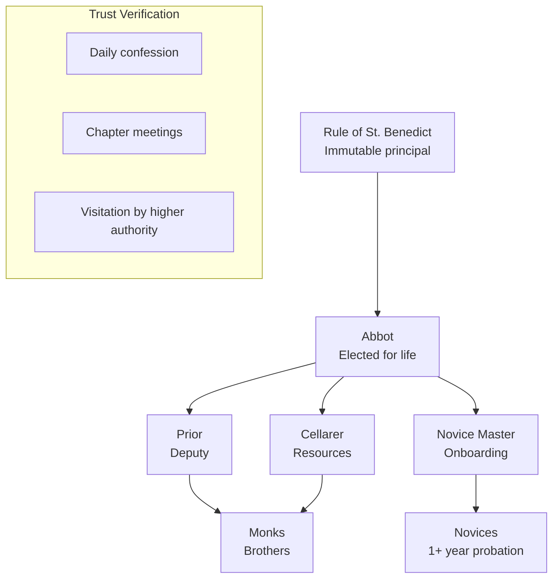

**Trust innovations:**
- **Slow trust**: 1+ year novitiate before any commitment; vows only after years
- **Ritual verification**: Daily confession, weekly chapter meetings—continuous trust recalibration
- **Poverty as trust mechanism**: Monks own nothing; no economic motive for violation
- **Lifetime stakes**: Can't leave without severe social/spiritual cost
- **External audit**: Periodic visitation by bishop or order superior

**Why monasteries survive:**

| Organization Type | Median Lifespan | Trust Decay Rate |
|-------------------|-----------------|------------------|
| Startup | 3 years | λ = 0.8/year |
| Corporation | 15 years | λ = 0.15/year |
| University | 200 years | λ = 0.01/year |
| Monastery | 500+ years | λ = 0.002/year |

The secret: **extreme trust verification frequency** (daily) combined with **extreme trust stakes** (eternal salvation). Most organizations verify trust quarterly at best; monasteries verify it every 24 hours.

---

### The Manhattan Project: Compartmentalized Trust for Catastrophic Stakes

100,000+ people kept the atomic bomb secret. How?

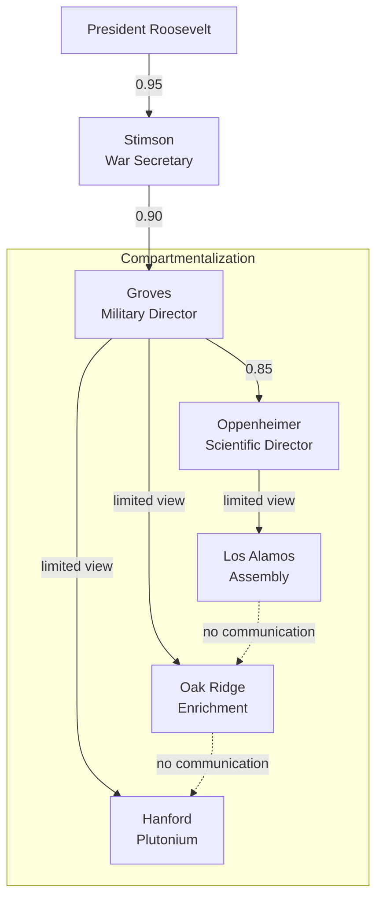

**Key insight**: Workers at Oak Ridge didn't know they were enriching uranium. Workers at Hanford didn't know they were making plutonium. Only ~dozen people understood the full picture.

**Trust topology properties:**
- **Need-to-know**: Each component had minimum context for their task
- **Physical isolation**: Sites geographically separated
- **Internal security**: 500+ security officers, mail censorship, travel restrictions
- **Misdirection**: Cover stories ("agricultural research") reduced even the motivation to inquire

**Delegation Risk of the Manhattan Project:**

| Failure Mode | P(occurrence) | Damage | Delegation Risk |
|--------------|---------------|--------|-----|
| Leak to Germany | 0.001 | Nuclear arms race during WWII, $100B+ | $100M |
| Leak to USSR | 0.01 | Earlier Soviet bomb (happened: Fuchs) | $50B? | $500M |
| Technical failure | 0.20 | $2B wasted, war prolonged | $400M |
| Workplace accident | 0.30 | $10M (radiation, criticality) | $3M |

**Actual outcome**: The USSR got the bomb 2-4 years earlier due to Klaus Fuchs (British physicist) passing secrets. The trust architecture failed at a node that had atypically high context—Fuchs worked in the theoretical division and understood the full design.

:::caution[The Fuchs Failure]
Classic "trusted lieutenant" failure: background checks (British had cleared him) substituted for verification. His Delegation Risk was massive ($500M+) but treated as minimal because "our ally vouched for him."
:::

---

### The Startup: Trust Phase Transitions

Startups undergo dramatic trust architecture changes:

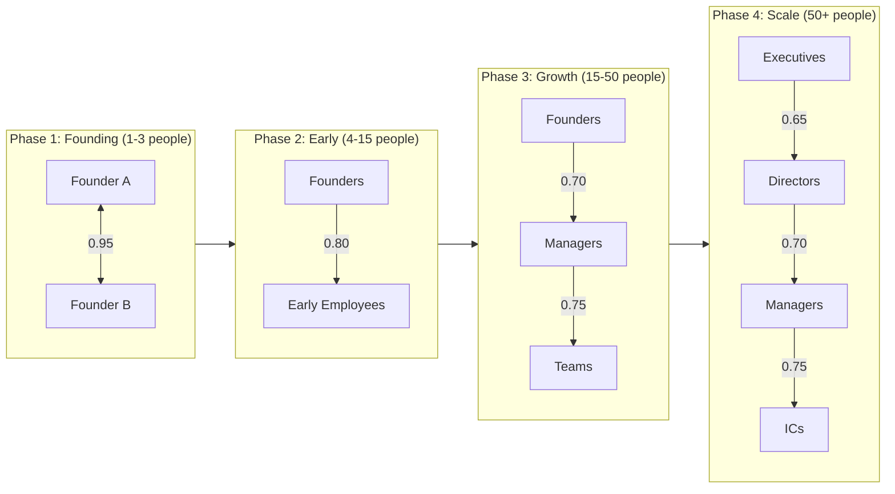

**The trust math changes:**

| Phase | People | Trust per Person | Total System Delegation Risk | Delegation Risk per Person |
|-------|--------|------------------|------------------|----------------|
| Founding | 2 | 0.95 | $50K | $25K |
| Early | 10 | 0.80 | $200K | $20K |
| Growth | 40 | 0.65 | $600K | $15K |
| Scale | 150 | 0.50 | $1.5M | $10K |

**Interpretation**: As startups grow, per-person trust decreases but total trust exposure increases. The architecture must become more defensive.

**The "Series B Betrayal"**: Many startups experience trust violations around 30-50 employees—the point where personal relationships no longer suffice and formal structures don't exist yet. This is a **trust architecture gap**.

---

## Part 2: Historical Trust Failures as Case Studies

### Case Study: Enron — The Trust Laundering Machine

Enron's collapse wasn't just fraud—it was systematic exploitation of trust architecture.

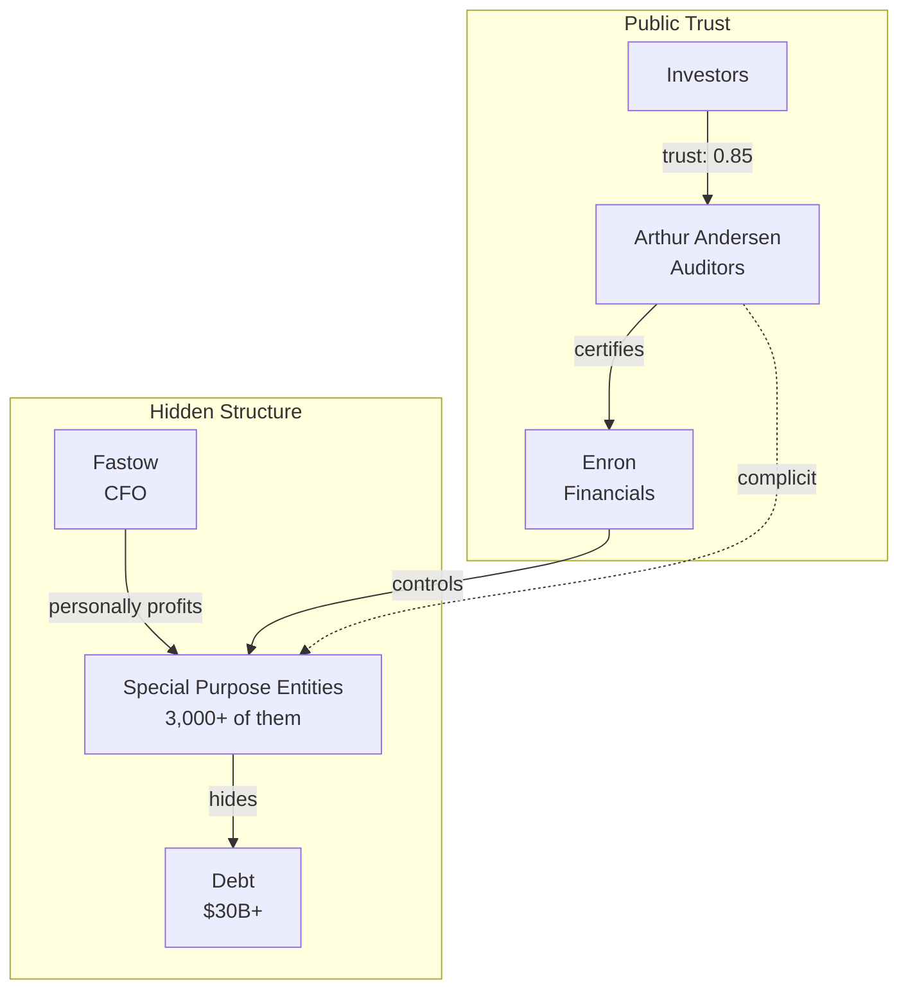

**Trust Laundering**: Enron used its auditor's reputation to "launder" trust. Investors trusted Arthur Andersen → Andersen "certified" Enron → Investors trusted Enron. But Andersen was compromised.

**The Trust Exploit:**

| Trust Relationship | Claimed Level | Actual Level | Trust Gap |
|--------------------|---------------|--------------|-----------|
| Investors → Andersen | 0.90 | 0.90 | 0 |
| Andersen → Enron (audit) | 0.85 | 0.30 | 0.55 |
| Investors → Enron (effective) | 0.77 | 0.27 | **0.50** |

**Damage calculation:**
- Market cap loss: $74 billion
- P(fraud this scale given architecture): ~0.001/year
- Implied Delegation Risk that should have been priced: **$74M/year**
- Actual risk premium demanded by investors: ~$0

:::danger[Trust Laundering Pattern]
**Trust laundering** occurs when a trusted intermediary's reputation is used to vouch for an untrustworthy principal. The intermediary's trust is "spent" to generate false trust in another party. Common in: auditing, credit ratings, due diligence, references.
:::

---

### Case Study: Theranos — Trust Through Mystification

Elizabeth Holmes exploited trust through **deliberate opacity**:

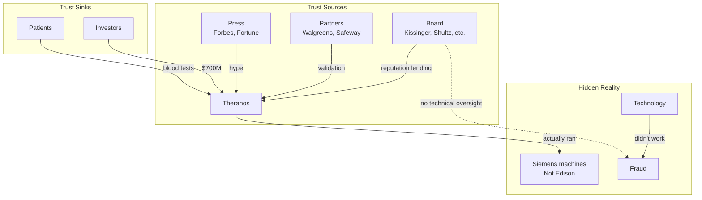

**The Trust Architecture Failure:**

| Board Member | Domain Expertise | Technical Verification | Trust Contribution |
|--------------|------------------|----------------------|-------------------|
| Henry Kissinger | Diplomacy | None | Reputation lending |
| George Shultz | Politics | None | Reputation lending |
| James Mattis | Military | None | Reputation lending |
| William Perry | Defense | None | Reputation lending |

**Zero board members had medical device or diagnostics expertise.** The board provided **trust without verification capacity**.

**Counterfactual**: If the board included one skeptical medical device expert with authority to inspect:

| Scenario | P(fraud continues) | Duration | Damage |
|----------|-------------------|----------|--------|
| Actual board | 0.95 | 10 years | $700M+ investors, patient harm |
| With expert | 0.20 | 2 years | ~$50M |

**Trust reduction: 93%** from one architectural change.

---

### Case Study: Nixon's White House — Cascading Trust Corruption

Watergate shows how trust violations cascade:

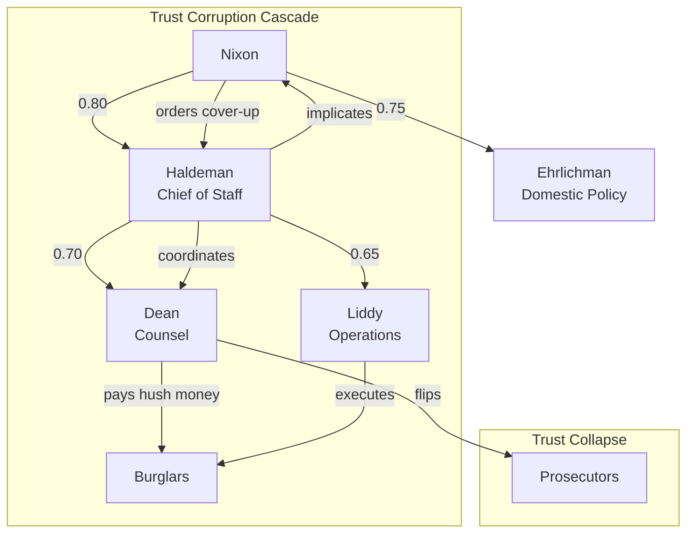

**The Loyalty Trap:**

Nixon built his team on **loyalty as the primary trust metric**. This created a trust architecture optimized for concealment, not accountability:

| Metric | Nixon's System | Accountable Alternative |
|--------|---------------|------------------------|
| Hiring criteria | Loyalty to Nixon | Competence + ethics |
| Information flow | Up to Nixon only | Multiple channels |
| Dissent handling | Punished ("enemies list") | Encouraged |
| Verification | None (trust = loyalty) | Independent checks |

**Delegation Risk of the Nixon Trust Architecture:**

| Failure Mode | P(in accountable system) | P(in Nixon system) | Damage |
|--------------|--------------------------|-------------------|--------|
| Minor scandal | 0.20 | 0.05 (concealed) | $1M |
| Major scandal | 0.05 | 0.40 (grows until explosion) | $100M |
| Constitutional crisis | 0.001 | 0.15 | $10B |

**System Delegation Risk**: Nixon's architecture had **30x higher Delegation Risk** than a standard administration because it optimized for concealment, which meant problems grew rather than getting fixed.

:::note[The Concealment Premium]
Organizations that punish whistleblowing don't eliminate violations—they ensure violations stay hidden until they're catastrophic. This is **paying for low variance with high tail risk**.
:::

---

## Part 3: Organizational Trust Anti-Patterns

### Anti-Pattern 1: Trust Theater

**Definition**: Visible trust mechanisms that don't actually verify anything.

**Examples:**
- Annual performance reviews that always rate everyone "meets expectations"
- Audit committees that receive pre-filtered information
- "Open door policies" where using them damages your career
- Ethics hotlines that report to the people being reported

**The Math:**

```
Claimed Trust = Verification × Trust_if_verified + (1-Verification) × Trust_if_not
Actual Trust = Trust_if_not (because Verification ≈ 0)

If: Trust_if_verified = 0.90, Trust_if_not = 0.50, Verification = 0.05
Claimed: 0.05 × 0.90 + 0.95 × 0.50 = 0.52
Actual: 0.50

Theater contribution: 0.02 claimed trust for $100K annual cost = $50K per trust point
```

**Detection**: Ask "when did this mechanism last surface a problem?" If never, it's probably theater.

---

### Anti-Pattern 2: Trust Dilution Through Layers

**Pattern**: Each management layer claims to add oversight but actually dilutes accountability.

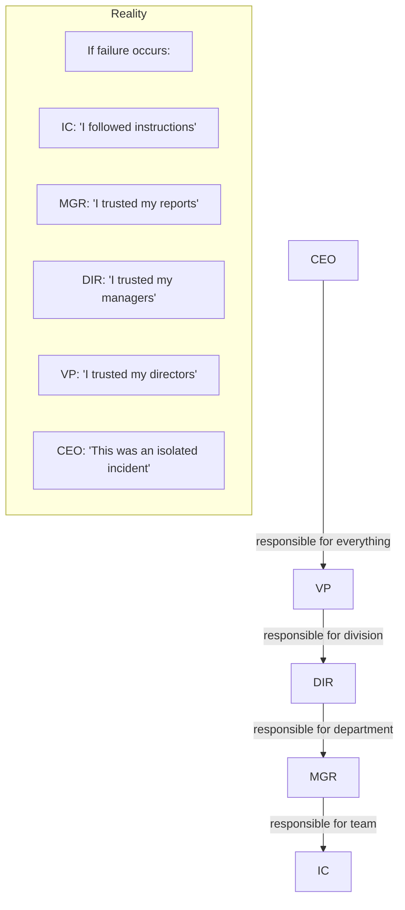

**The Accountability Diffusion Equation:**

```
Accountability(level n) = Total_Accountability × (1/n)

With 5 levels: Each level feels 20% accountable
Sum of felt accountability: 100%
Actual total accountability: 100%
Gap: 0% ... but each individual takes minimal responsibility
```

**Result**: Everyone is "accountable" but no one feels responsible enough to act.

---

### Anti-Pattern 3: Credentials as Trust Proxies

**Pattern**: Substituting credentials for verification.

| Proxy | What It's Supposed to Mean | What It Actually Means |
|-------|---------------------------|----------------------|
| Harvard MBA | Good judgment | Passed exams 10 years ago |
| Former McKinsey | Strategic thinking | Was hired by McKinsey once |
| Board member | Provides oversight | Attends 4 meetings/year |
| 20 years experience | Deep expertise | Did something for 20 years |
| Published author | Thought leader | Wrote a book |

**The Credential Decay Function:**

```
Trust_value(credential) = Initial_value × e^(-λt) × Relevance(context)

PhD in physics from 1990 for a software company in 2024:
= 0.8 × e^(-0.05 × 34) × 0.3
= 0.8 × 0.18 × 0.3
= 0.04

That credential contributes almost nothing to current trustworthiness.
```

---

### Anti-Pattern 4: The Loyalty-Competence Inversion

**Pattern**: Promoting based on loyalty until loyal-but-incompetent people control verification.

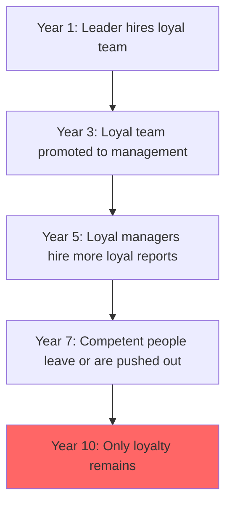

**Trust Topology Corruption:**

| Year | % Loyal-First Hires | % Competence-First Hires | Verification Quality |
|------|--------------------|--------------------------|--------------------|
| 1 | 30% | 70% | High |
| 3 | 50% | 50% | Medium |
| 5 | 70% | 30% | Low |
| 7 | 85% | 15% | Minimal |
| 10 | 95% | 5% | Theater only |

**Famous examples**: Enron, Theranos, WeWork, late-stage Uber, most authoritarian regimes.

---

## Part 4: Trust Dynamics During Crises

### The Crisis Trust Spike

During crises, trust architecture transforms:

```
Normal: Trust flows through hierarchy
Crisis: Trust concentrates in whoever has information/capability
```

**Example: Cuban Missile Crisis Trust Topology**

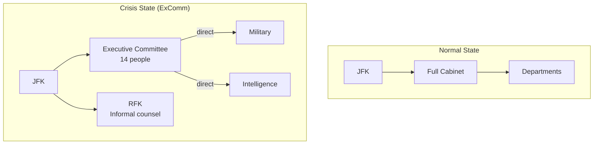

**Trust changes during Cuban Missile Crisis:**

| Role | Normal Trust Level | Crisis Trust Level | Change |
|------|-------------------|-------------------|--------|
| Secretary of State (Rusk) | 0.85 | 0.70 | -18% |
| SecDef (McNamara) | 0.80 | 0.90 | +13% |
| RFK (no formal role) | 0.60 | 0.95 | +58% |
| Joint Chiefs | 0.85 | 0.60 | -29% |
| Soviet Ambassador (Dobrynin) | 0.20 | 0.40 | +100% |

**Interpretation**: Crisis trust flows to whoever has:
1. Relevant real-time information
2. Aligned incentives for survival
3. Capacity for independent judgment

The formal hierarchy matters less; competence and alignment matter more.

---

### The Trust Recovery Function

After trust violations, how quickly does trust rebuild?

```
Trust(t) = Trust_baseline + (Trust_pre - Trust_baseline) × (1 - e^(-recovery_rate × t)) × Recovery_actions

Where:
- Trust_baseline: Minimum trust for strangers (~0.1-0.3)
- Trust_pre: Trust level before violation
- recovery_rate: How fast trust can rebuild (typically 0.1-0.3 per year)
- Recovery_actions: Multiplier for demonstrated change (0.5-2.0)
```

**Recovery times by violation type:**

| Violation Type | Trust Drop | Recovery Rate | Time to 80% Recovery |
|----------------|------------|---------------|---------------------|
| Honest mistake, acknowledged | -10% | 0.5/year | 6 months |
| Mistake, initially denied | -25% | 0.2/year | 3 years |
| Deliberate deception | -50% | 0.1/year | 8 years |
| Betrayal of core values | -80% | 0.05/year | 20+ years (if ever) |

**Example**: Arthur Andersen's trust recovery after Enron
- Trust drop: ~95%
- Recovery actions: Firm dissolved—no recovery possible
- Time to recovery: Never (brand abandoned)

---

## Part 5: Speculative Trust Economics

### Trust as Currency

What if organizations explicitly traded trust?

**Trust Exchange Rate:**

```
1 Trust Point = Capacity to delegate $X in expected damage
At 95% reliability, 1 Trust Point ≈ $20 Delegation Risk capacity
At 99% reliability, 1 Trust Point ≈ $100 Delegation Risk capacity
```

**Trust Inflation**: When organizations grant trust faster than they verify it, trust becomes worthless (everyone is "trusted" but verification is zero).

**Trust Deflation**: When verification is so strict that no one gets trust, nothing gets done. The organization seizes up.

**Optimal Trust Supply**: Just enough trust to enable necessary delegation, verified frequently enough to catch violations before they're catastrophic.

---

### The Trust Balance Sheet

Organizations have implicit trust balance sheets:

**Trust Assets** (trust granted to us by others):
- Customer trust
- Investor trust
- Regulator trust
- Employee trust
- Partner trust

**Trust Liabilities** (trust we've granted to others):
- Employee authority
- Vendor dependencies
- Outsourced operations
- Automated systems

**Net Trust Position:**

| Company | Trust Assets | Trust Liabilities | Net Position |
|---------|-------------|-------------------|--------------|
| Apple | $500B (brand) | $50B (supply chain) | +$450B |
| Wells Fargo (2016) | $100B → $30B | $40B | -$10B → crisis |
| New Startup | $1M (investors) | $0.5M (founders) | +$0.5M |

**Trust Insolvency**: When trust liabilities exceed trust assets, the organization faces a run—stakeholders withdraw faster than trust can be rebuilt.

---

### The Trust Market Failure

Why don't trust markets clear efficiently?

1. **Information Asymmetry**: Trustees know their own trustworthiness better than principals
2. **Adverse Selection**: Most eager-to-be-trusted are least trustworthy
3. **Moral Hazard**: Behavior changes after trust is granted
4. **Trust is Sticky**: Hard to revoke (severance, lawsuits, reputation)
5. **Verification Costs**: Checking trust is expensive; easier to assume
6. **Trust is Relational**: Can't be transferred—Alice's trust in Bob doesn't help Carol

**Implication**: Organizations systematically misprice trust. They either:
- Over-trust (most common): Insufficient verification, catastrophic failures
- Under-trust (rare): Excessive process, nothing gets done

---

## Part 6: Quantified Organizational Trust Examples

### Example 1: A 50-Person Law Firm

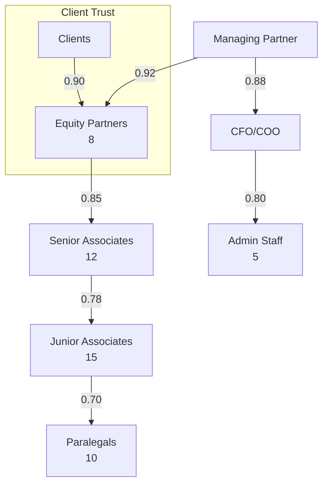

**Delegation Risk by Role:**

| Role | Key Trust Exposure | P(violation/year) | Damage | Delegation Risk |
|------|-------------------|-------------------|--------|-----|
| Equity Partner | Malpractice, client funds | 0.01 | $5M | $50K |
| Senior Associate | Case errors, missed deadlines | 0.03 | $500K | $15K |
| Junior Associate | Research errors | 0.05 | $100K | $5K |
| Paralegal | Document handling | 0.02 | $50K | $1K |
| CFO | Financial mismanagement | 0.005 | $3M | $15K |

**Firm Total Delegation Risk**: ~$500K/year

**Trust Insight**: Partners have high per-person Delegation Risk but strong alignment (they own the firm). Associates have lower Delegation Risk but weaker alignment (employees). The highest-risk role is actually CFO—single person with access to client trust accounts.

---

### Example 2: A City Police Department (500 officers)

**Trust Topology:**

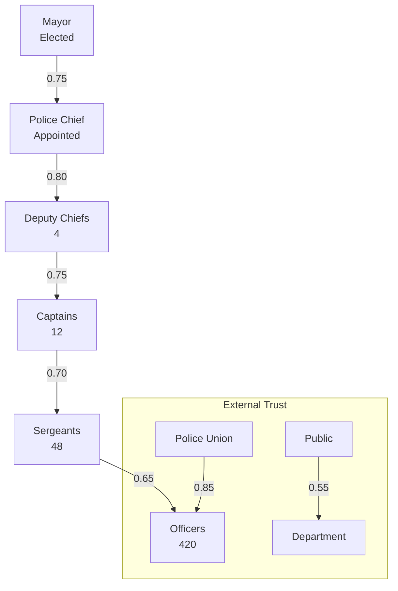

**The Dual Principal Problem:**

Officers have two principals with conflicting interests:

| Principal | Wants | Trust Mechanism |
|-----------|-------|-----------------|
| Public (via Chief) | Accountability, restraint | Policy, discipline |
| Union | Protection, job security | Grievance process, legal defense |

When an officer violates public trust, the union trust mechanism activates to protect them. This is **trust architecture conflict**.

**Delegation Risk Analysis:**

| Failure Mode | Officers Involved | P(year) | Damage per Incident | Annual Delegation Risk |
|--------------|-------------------|---------|---------------------|------------|
| Excessive force (lawsuit) | 420 | 0.02 | $300K | $2.5M |
| False arrest (lawsuit) | 420 | 0.01 | $150K | $630K |
| Corruption (criminal) | 420 | 0.002 | $1M | $840K |
| Fatal shooting (lawsuit + unrest) | 420 | 0.0005 | $10M | $2.1M |
| **Total Department Delegation Risk** | | | | **$6.0M/year** |

**Comparison**: The department budget is ~$100M. Delegation Risk is 6% of budget—but settlements often come from the city general fund, hiding the true cost.

---

### Example 3: A Presidential Administration

**First-term Presidential Delegation Risk Budget:**

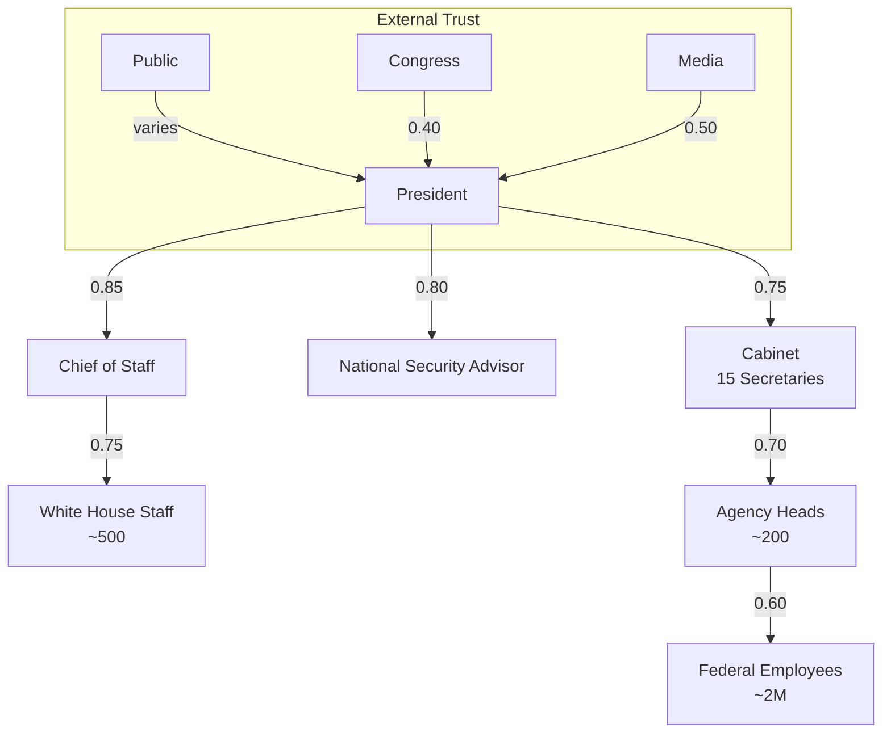

**Trust Delegation Risk by Cabinet Position:**

| Secretary | Authority Domains | P(major failure/term) | Damage | 4-Year Delegation Risk |
|-----------|------------------|----------------------|--------|------------|
| Defense | Military operations, $800B | 0.15 | $100B | $15B |
| State | Foreign policy, alliances | 0.10 | $50B | $5B |
| Treasury | Economy, financial system | 0.05 | $500B | $25B |
| Justice | Law enforcement, civil rights | 0.20 | $20B | $4B |
| HHS | Healthcare, pandemics | 0.10 | $200B | $20B |
| Homeland Security | Borders, disasters | 0.15 | $30B | $4.5B |

**Total Cabinet Delegation Risk**: ~$100B per 4-year term

:::caution[Scale of Political Trust]
A presidential administration places more expected trust exposure in 4 years than most corporations will in their entire existence. The stakes of political trust architecture are civilization-scale.
:::

**Trust Architecture Comparison Across Administrations:**

| Administration | Trust Style | Key Feature | Outcome |
|----------------|------------|-------------|---------|
| Eisenhower | Hierarchical | Trusted Chiefs of Staff | Stable but slow |
| Kennedy | Collegial | ExComm during crisis | Adaptive but chaotic |
| Nixon | Loyalty-based | Inner circle | Corruption |
| Reagan | Delegative | Cabinet government | Mixed results |
| Clinton | Policy wonk | President in details | Micromanagement |
| Obama | No-drama | Process-oriented | Consistent but slow |
| Trump | Transactional | Loyalty tests | High turnover, violations |

---

## Key Takeaways

:::tip[Key Takeaways]
1. **Organizations are trust architectures**: Every org chart is really a trust topology
2. **Historical organizations solved trust problems creatively**: Pirate ships, monasteries, and the Manhattan Project all had sophisticated trust mechanisms
3. **Trust failures follow patterns**: Laundering, theater, dilution, loyalty-inversion
4. **Crisis transforms trust**: Formal hierarchy matters less; competence and alignment matter more
5. **Trust is implicitly traded**: Organizations have trust balance sheets even if they don't track them
6. **Political trust is civilization-scale**: Presidential administrations have $100B+ Delegation Risk per term
7. **Trust architecture predicts outcomes**: Nixon's loyalty-based architecture made Watergate almost inevitable
:::

---

## See Also

- [Organizational Trust (Practical)](/case-studies/human-systems/organizational-trust/) — Small business and political examples with ROI calculations
- [Delegation Risk Overview](/delegation-risk/overview/) — The mathematical foundations
- [Risk Inheritance](/research/theory/trust-propagation/) — Algorithms for trust networks
- [Historical Failures](/cross-domain-methods/lessons-from-failures/) — Financial and technical failures
- [Anti-patterns](/case-studies/ai-systems/anti-patterns/) — What not to do (AI version)
- [Trust Economics](/research/theory/trust-economics/) — Markets and incentives
- [Case Study: Sydney](/case-studies/ai-systems/case-study-sydney/) — Trust failure in AI (contrast with organizational failures)
