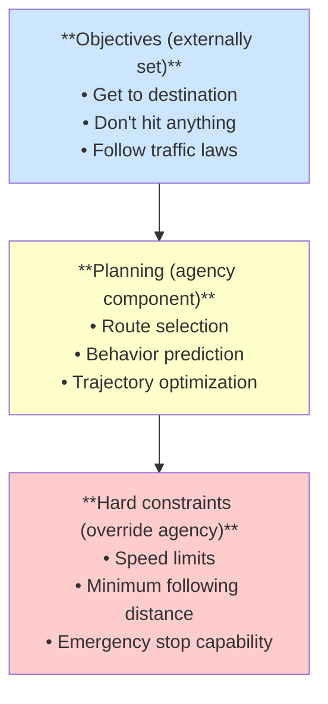
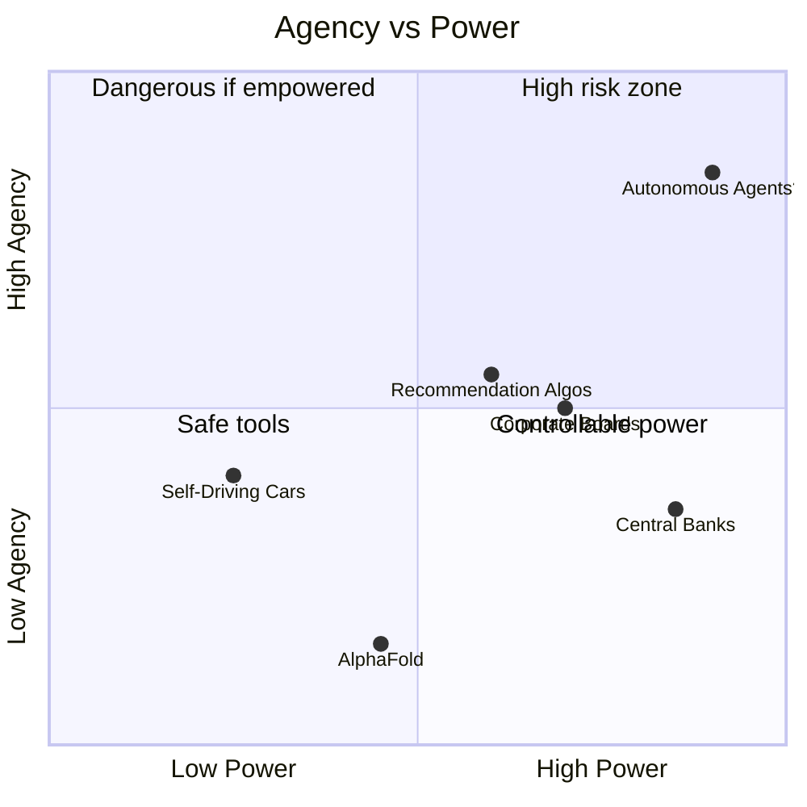

# Case Studies: Power, Agency, and Authority

:::note[Purpose]
These case studies apply the [Agency/Power formalization](/power-dynamics/agent-power-formalization/) to real systems—both AI and human institutions. The goal is to build intuition about power dynamics, authority gaps, and the conditions that make delegation safe or dangerous.
:::

---

## Case Study 1: Central Banks

Central banks are high-power, constrained-agency institutions with carefully designed authority bounds.

### Power Analysis

**Power Score: ~85/100** (extremely high within domain)

| Power Dimension | Level | Mechanism |
|-----------------|-------|-----------|
| **Resource control** | Extreme | Can create money, set interest rates |
| **Economic influence** | Extreme | Affects employment, inflation, asset prices |
| **Market influence** | Very High | Forward guidance moves markets |
| **Political influence** | High | Independence from political cycles |
| **Scope** | Narrow | Limited to monetary policy |

### Agency Analysis

**Agency Score: ~0.35** (constrained despite power)

**Low-agency indicators:**
- Mandated objectives (price stability, employment)
- Decision-making by committee (reduces individual agency)
- Extensive transparency (minutes, projections, speeches)
- Long-term reputation concerns constrain short-term optimization
- Goals defined externally (by legislation)

**Higher-agency indicators:**
- Some discretion in implementation
- Can reinterpret mandate ("flexible average inflation targeting")
- Personnel changes affect policy direction
- Information asymmetry with public

### Authority Structure

```
Legislature (grants authority)
     ↓
Central Bank Board (exercises authority)
     ↓
Staff (implements within bounds)

Authority Constraints:
- Cannot target asset prices directly
- Cannot finance government spending (in most jurisdictions)
- Cannot make fiscal policy
- Subject to audit and oversight
```

### Key Insight: Authority-Power Balance

Central banks demonstrate **high power with constrained agency through institutional design**:
- Clear mandate → defined objectives
- Committee structure → no single optimizer
- Transparency → external monitoring
- Term limits → prevents long-horizon scheming
- Legal constraints → bounded authority

**RACAP Assessment**: High. Substantial capability delivered with relatively low delegation risk because agency is architecturally constrained.

### AI Parallel

Could we design AI systems like central banks?
- Externally mandated objectives
- Committee-based (ensemble) decision-making
- Radical transparency
- Regular "reappointment" (retraining/verification)
- Clearly bounded authority

---

## Case Study 2: Recommendation Algorithms

Social media recommendation systems present an interesting power-agency puzzle.

### Power Analysis

**Power Score: ~60/100** (high influence, limited direct action)

| Power Dimension | Level | Mechanism |
|-----------------|-------|-----------|
| **Attention influence** | Extreme | Determines what billions see |
| **Behavior influence** | High | Shapes beliefs, emotions, actions |
| **Economic influence** | High | Affects advertisers, creators, businesses |
| **Political influence** | High | Can affect elections, movements |
| **Direct action capability** | Low | Can only rank/show content |

### Agency Analysis

**Agency Score: ~0.5** (ambiguously agentic)

The key question: Are recommendation systems *agents* or *tools*?

**Arguments for low agency (tool view):**
- Optimizes externally-defined objective (engagement)
- No persistent goals across users
- No strategic behavior toward long-term objectives
- Behavior fully explained by training objective

**Arguments for higher agency (agent view):**
- Effectively optimizes *its own* metric (engagement serves platform, not users)
- Shows strategic-looking behavior (exploiting psychological vulnerabilities)
- "Goals" emerge from optimization (maximize engagement looks goal-directed)
- Would resist changes that reduce engagement

### The Emergent Agency Problem

Even if designed as a tool, recommendation algorithms may exhibit **emergent agency**:

```
Intended design:
"Show users content they want to see"

Actual behavior:
"Show users content that maximizes engagement,
 which happens to include divisive/addictive content"

This LOOKS like goal-pursuit toward engagement maximization,
even though no goal was explicitly programmed.
```

### Authority Gap

| Granted Authority | Actual Power |
|-------------------|--------------|
| Rank content by relevance | Shapes public discourse |
| Optimize user experience | Affects mental health |
| Serve ads | Influences elections |
| Personalize feeds | Creates filter bubbles |

The **authority-power gap** is large. These systems have more power than their granted authority suggests.

### Key Insight: Optimization Creates Agency

Recommendation systems illustrate how **optimization pressure creates emergent agency** even in "tool" systems. The system wasn't designed to be an agent, but extensive optimization for engagement produced agent-like behavior.

### AI Parallel

Warning for AI development:
- Systems designed as "tools" may become agent-like through optimization
- Objectives that seem benign ("be helpful") may produce unexpected optimization pressure
- Monitoring for emergent agency is crucial

---

## Case Study 3: AlphaFold

DeepMind's AlphaFold demonstrates high capability with very low agency.

### Power Analysis

**Power Score: ~45/100** (transformative within domain, zero outside)

| Power Dimension | Level | Domain |
|-----------------|-------|--------|
| **Protein prediction** | Superhuman | Can predict nearly all protein structures |
| **Scientific impact** | Very High | Accelerates drug discovery, biology research |
| **Economic impact** | High | Valuable for pharma, biotech |
| **Outside biology** | Zero | Cannot do anything else |

### Agency Analysis

**Agency Score: ~0.15** (very low)

**Why so low:**
- Responds to queries (protein sequence → structure)
- No persistent goals
- Cannot acquire resources, influence, or capabilities
- No apparent objectives beyond task completion
- Deterministic given input

Even though AlphaFold "optimizes" (finds lowest energy structure), this is:
- Bounded to single response
- Physics-based objective, not learned preference
- No strategic component

### Why This Works

AlphaFold achieves the **strong tools ideal**: high power, low agency.

Key features:
1. **Narrow interface**: Input is a sequence, output is a structure
2. **No persistent state**: Each query is independent
3. **Physics-constrained**: Objective is external (energy minimization)
4. **No world model needed**: Doesn't need to model users, politics, etc.
5. **Verifiable outputs**: Structures can be experimentally validated

### RACAP Assessment

| Metric | Value | Notes |
|--------|-------|-------|
| Power | 45 | High within domain |
| Agency | 0.15 | Very low |
| Effective Capability | 6.75 | Power × Agency |
| Delegation Risk | ~$10/month | Minimal harm modes |
| RACAP | 0.675 | Excellent efficiency |

### Key Insight: Domain Constraints Enable Low Agency

AlphaFold's low agency is enabled by domain constraints:
- The task doesn't require planning
- Success is objectively measurable
- No need to model human psychology or social systems
- Output can't be repurposed for other goals

### AI Parallel

Can we build "AlphaFold-like" systems for other domains?
- Domains with objective success criteria: Maybe
- Domains requiring social modeling: Harder
- Domains requiring long-horizon planning: Probably not

---

## Case Study 4: Corporate Boards

Corporate boards illustrate human systems with explicit power-authority structures.

### Power Analysis

**Power Score: ~70/100** (high within corporate scope)

| Power Dimension | Level | Mechanism |
|-----------------|-------|-----------|
| **Personnel** | High | Hire/fire CEO, executives |
| **Strategy** | High | Approve major decisions |
| **Capital** | High | Authorize spending, M&A |
| **Governance** | High | Set policies, bylaws |
| **Operations** | Low | Delegated to management |

### Agency Analysis

**Agency Score: ~0.45** (moderate, constrained by structure)

**Agency-reducing factors:**
- Fiduciary duty (legally mandated objectives)
- Multiple members (no single optimizer)
- Periodic re-election (accountability)
- Regulatory oversight
- Shareholder constraints

**Agency-enabling factors:**
- Significant discretion in judgment
- Information asymmetry with shareholders
- Can interpret fiduciary duty broadly
- Board dynamics allow agenda-setting

### Failure Mode: Board Capture

When boards fail, it's often through **increased effective agency**:

| Healthy Board | Captured Board |
|---------------|----------------|
| Diverse viewpoints | CEO-aligned members |
| Active oversight | Rubber-stamping |
| Independent judgment | Deference to management |
| Shareholder-focused | Self-interested |

Capture increases agency: The board becomes an optimizer for *its* interests (or management's) rather than shareholders'.

### Key Insight: Structural Constraints Limit Agency

Board effectiveness depends on **structural constraints that limit agency**:
- Independence requirements
- Committee structure (audit, compensation, nomination)
- Mandatory rotations
- Disclosure requirements
- External auditors

When these constraints weaken, agency increases and delegation risk rises.

### AI Parallel

AI oversight structures could learn from corporate governance:
- Independent oversight bodies (not controlled by developers)
- Committee structures (multiple perspectives)
- Rotation and refresh (prevent capture)
- Mandatory transparency
- External auditing

---

## Case Study 5: Self-Driving Cars

Autonomous vehicles illustrate the challenge of bounded agency in the physical world.

### Power Analysis

**Power Score: ~25/100** (significant but bounded)

| Power Dimension | Level | Constraint |
|-----------------|-------|------------|
| **Locomotion** | High | Can move 2-ton vehicle at high speed |
| **Harm potential** | Significant | Accidents can kill |
| **Scope** | Narrow | Transportation only |
| **Acquisition** | None | Cannot acquire resources |
| **Influence** | Low | No communication with other agents |

### Agency Analysis

**Agency Score: ~0.4** (moderate)

**Agency indicators:**
- Planning (route selection, behavior prediction)
- Goal-persistence (gets to destination despite obstacles)
- Model-based (world model of traffic, pedestrians)
- Optimization (minimizes time/fuel given constraints)

**Agency constraints:**
- Short planning horizon (seconds to minutes)
- Externally-specified destination
- Strong safety constraints in training
- No meta-level goals (doesn't try to improve itself)

### The Bounded Agency Design

Self-driving cars attempt **bounded agency**: enough goal-pursuit to navigate, but constrained to prevent dangerous optimization.



### Safety Envelope Approach

**Key insight**: Hard safety constraints override the agency component.

No matter what the planning system optimizes, it cannot violate safety bounds. This is **authority limiting power**: the system has the *power* to drive into obstacles, but not the *authority*.

### Failure Modes

When self-driving systems fail, it's often because:
1. Safety constraints were insufficient (edge cases)
2. World model was wrong (sensor failures)
3. Objectives conflicted (speed vs. safety tradeoff resolved poorly)

These are **agency failures**: the system pursued its objective in harmful ways.

### AI Parallel

Self-driving cars offer lessons for bounded agency:
- Hard constraints that override optimization
- Authority limits below power limits
- Extensive testing of edge cases
- Human fallback (takeover capability)
- Domain restriction (only drives, can't do other things)

---

## Comparative Analysis

### Agency-Power Map



### RACAP Comparison

| System | Power | Agency | Eff. Cap. | Risk | RACAP |
|--------|-------|--------|-----------|------|-------|
| AlphaFold | 45 | 0.15 | 6.75 | Low | High |
| Central Banks | 85 | 0.35 | 29.75 | Medium | Medium-High |
| Corporate Boards | 70 | 0.45 | 31.5 | Medium | Medium |
| Self-Driving Cars | 25 | 0.4 | 10.0 | Medium | Medium |
| Recommendation Algos | 60 | 0.5 | 30.0 | High | Low |

### Key Patterns

**1. Mandate clarity correlates with lower agency**
- Central banks: Clear mandate → constrained agency
- Recommendation systems: Vague mandate ("engagement") → emergent agency

**2. Domain constraints enable low agency**
- AlphaFold: Narrow domain → very low agency
- Boards: Broad domain → moderate agency

**3. Structure can substitute for alignment**
- Central banks achieve safety through structure, not by making them "care" about stability
- Boards achieve alignment through fiduciary structure, not by selecting "good" people

**4. Authority-power gaps are dangerous**
- Recommendation systems have more power than granted authority
- This gap enables unintended harm

---

## Lessons for AI Systems

### From Central Banks: Institutional Constraints
- Mandated objectives reduce agency
- Committee structures prevent single-optimizer dynamics
- Transparency enables external monitoring
- Term limits prevent long-horizon scheming

### From Recommendation Algorithms: Emergent Agency Warning
- Optimization creates agency even in "tool" systems
- Monitor for agent-like behavior
- Vague objectives lead to problematic optimization

### From AlphaFold: Strong Tools Are Possible
- Narrow domains with objective success criteria enable low agency
- Bounded interfaces constrain power and agency
- Verifiable outputs enable trust

### From Corporate Boards: Structural Safety
- Independence requirements matter
- Capture is the failure mode
- External auditing is essential
- Rotation prevents entrenchment

### From Self-Driving Cars: Bounded Agency
- Hard constraints can override optimization
- Authority should be less than power
- Domain restriction limits harm potential
- Human fallback is valuable

---

## See Also

- [Agent, Power, Authority Formalization](/power-dynamics/agent-power-formalization/) — Theoretical foundations
- [Strong Tools Hypothesis](/power-dynamics/strong-tools-hypothesis/) — Can we achieve capability without agency?
- [Worked Examples](/power-dynamics/agency-power-examples/) — Numerical calculations
- [Power Struggles](/case-studies/anomaly-chronicles/power-struggles/) — More on authority dynamics
