# Access Control Systems

:::note[Transferability]
Access control systems have decades of real-world experience managing trust and delegation at scale. The intelligence community handles genuinely adversarial threats; enterprise software handles organizational complexity. Both offer battle-tested patterns and well-documented failure modes directly applicable to AI delegation—though AI systems introduce novel challenges around capability assessment and behavioral unpredictability.
:::

Access control is delegation formalized into policy. When the CIA grants Top Secret clearance, when AWS assigns an IAM role, when a database administrator creates a service account—each is a delegation decision with trust assumptions, scope limitations, and failure modes.

This page examines two mature access control domains:
1. **Intelligence Community** — Clearances, compartments, and need-to-know
2. **Enterprise Software** — RBAC, OAuth, and identity federation

Both illuminate patterns and pitfalls for AI delegation architecture.

---

## Part I: Intelligence Community Access Control

### The Clearance Hierarchy

Security clearances establish a baseline trust level:


**Key insight**: Clearance is necessary but not sufficient. Having Top Secret clearance doesn't grant access to all Top Secret information—it only makes you *eligible* for access.

### Compartmentalization: Beyond Clearance

Sensitive Compartmented Information (SCI) implements **need-to-know** enforcement:


**Compartmentalization properties**:
- **Horizontal isolation**: Same clearance level, different access
- **Codeword protection**: You may not know a compartment exists
- **Read-in ceremonies**: Formal acknowledgment of access and responsibilities
- **Read-out procedures**: Access revocation when no longer needed

### The Need-to-Know Principle

Even within a compartment, access requires operational justification:

$$\text{Access} = \text{Clearance Level} \cap \text{Compartment Access} \cap \text{Need-to-Know}$$

This three-factor model prevents both:
- **Horizontal sprawl**: Cleared person accessing unrelated programs
- **Curiosity browsing**: Accessing information without operational purpose

### Two-Person Integrity (TPI)

Critical operations require multiple people:


**TPI prevents**:
- Single points of compromise
- Unilateral malicious action
- Accidental critical errors

Used for nuclear weapons handling, cryptographic key management, and highly sensitive operations.

### Continuous Evaluation

Trust isn't static—it requires ongoing verification:

| Evaluation Type | Frequency | Purpose |
|-----------------|-----------|---------|
| **Periodic Reinvestigation** | 5-6 years (TS), 10 years (S) | Comprehensive review |
| **Continuous Evaluation** | Ongoing | Automated monitoring of records |
| **Lifestyle Polygraph** | Periodic for some access | Deterrence and detection |
| **Financial Review** | Ongoing | Vulnerability indicators |
| **Foreign Contact Reporting** | As occurs | Potential compromise vectors |

**Key insight**: Initial vetting is insufficient. Circumstances change, loyalties shift, vulnerabilities emerge. The IC treats trust as requiring continuous maintenance.

### Famous Failures

Despite sophisticated controls, major breaches occurred:

| Case | Clearance | Failure Mode | Lesson |
|------|-----------|--------------|--------|
| **Aldrich Ames** (CIA) | TS/SCI | Insider with legitimate access sold secrets | Access ≠ loyalty; financial monitoring critical |
| **Robert Hanssen** (FBI) | TS/SCI | 22 years of espionage | Compartmentalization worked—damage was contained |
| **Edward Snowden** (NSA) | TS/SCI | System administrator with broad access | Privileged roles need extra scrutiny |
| **Chelsea Manning** (Army) | TS/SCI | Mass exfiltration from classified network | Access exceeded need-to-know; audit trails insufficient |
| **Reality Winner** (NSA) | TS/SCI | Single document leak | Even small breaches matter; printer forensics helped |

**Pattern**: Most failures involved insiders with legitimate access acting outside their authorized scope. The system correctly granted access; it failed to detect misuse.

---

## Part II: Enterprise Software Access Control

### The RBAC Model

Role-Based Access Control (RBAC) maps users to roles to permissions:


**RBAC advantages**:
- Scalable: Manage roles, not individual permissions
- Auditable: Clear mapping from user to capabilities
- Principle of least privilege: Assign minimal necessary role

**RBAC limitations**:
- Role explosion: Organizations accumulate hundreds of roles
- Coarse granularity: Roles may grant more than needed
- Static: Doesn't adapt to context

### Attribute-Based Access Control (ABAC)

ABAC adds dynamic, contextual evaluation:

```
IF subject.department == "Engineering"
   AND resource.classification <= "Internal"
   AND environment.time BETWEEN 9:00 AND 18:00
   AND environment.location == "Office"
THEN ALLOW read
```

**ABAC enables**:
- Time-based access (business hours only)
- Location-based restrictions (on-premises only)
- Data classification alignment
- Dynamic risk assessment

### OAuth and Delegated Authorization

OAuth enables controlled delegation to third parties:


**OAuth principles for AI delegation**:
- **Scoped tokens**: Access limited to specific capabilities
- **Time-limited**: Tokens expire, requiring renewal
- **Revocable**: User can revoke at any time
- **Auditable**: Token usage is logged

### Service Accounts: The Hidden Risk

Service accounts (non-human identities) often have:
- **Over-privileged access**: "Just make it work" leads to admin rights
- **Shared credentials**: Multiple systems use same account
- **No expiration**: Set up once, forgotten forever
- **Poor auditing**: Actions attributed to account, not initiating user


**Service accounts are proto-agents**—non-human entities with delegated authority. The problems organizations face with service accounts preview the challenges of AI agent management.

### The Messiness: Permission Sprawl

Real enterprise access control degrades over time:


**Causes of sprawl**:
- **Emergency access persists**: Granted for incident, never revoked
- **Project access outlives projects**: Teams dissolve, permissions remain
- **Role accumulation**: Promotions add roles without removing old ones
- **Merger debris**: Acquired company's access model layered on top
- **"Just give them access"**: Path of least resistance in urgent situations

### Access Review Theater

Organizations attempt to address sprawl through access reviews:

| Review Type | Intended Purpose | Actual Practice |
|-------------|------------------|-----------------|
| **Quarterly certification** | Managers verify reports' access | Rubber-stamp approval to clear queue |
| **Privileged access review** | Security validates admin accounts | "Still needed" without verification |
| **Dormant account cleanup** | Remove unused accounts | Exclude service accounts (too risky to touch) |
| **Separation of duties audit** | Verify no conflicting access | Exceptions granted for "business need" |

**The fundamental problem**: Reviews are retrospective and high-volume. Reviewers lack context to make good decisions, so they approve by default.

---

## Part III: Comparative Analysis

### Mapping Across Domains

| Concept | Intelligence Community | Enterprise Software | AI Delegation |
|---------|----------------------|---------------------|---------------|
| **Trust level** | Security clearance | Role assignment | Trust score |
| **Scope limitation** | Compartment/SCI | Permission set | Capability constraints |
| **Need-to-know** | Operational justification | Data classification | Task-specific access |
| **Continuous evaluation** | Lifestyle polygraph, monitoring | Access reviews, UEBA | Behavioral monitoring |
| **Two-person integrity** | Dual-key systems | Separation of duties | Voting tribunal |
| **Revocation** | Read-out, clearance suspension | Account disable, token revoke | Trust reset, capability removal |

### What Works

Both domains successfully implement:

1. **Layered access**: Multiple factors required (clearance + compartment + need-to-know; authentication + authorization + context)

2. **Explicit delegation ceremonies**: Read-in procedures; OAuth consent flows; onboarding provisioning

3. **Audit trails**: Who accessed what, when, from where

4. **Revocation mechanisms**: Ability to remove access when trust changes

5. **Separation of duties**: Critical actions require multiple parties

### What Fails

Both domains struggle with:

1. **Insider threat**: Authorized users acting maliciously
2. **Access creep**: Permissions accumulate faster than they're revoked
3. **Privileged account management**: Admin/service accounts are high-risk
4. **Review fatigue**: Volume overwhelms meaningful evaluation
5. **The "business need" escape hatch**: Urgency overrides controls
6. **Static trust in dynamic contexts**: Clearance/role doesn't capture current risk

---

## Part IV: Lessons for AI Delegation

### Principle 1: Access ≠ Trust

**IC lesson**: Clearance is eligibility, not entitlement. Need-to-know is evaluated per-request.

**Enterprise lesson**: Role assignment doesn't mean every permission is appropriate.

**AI application**: An AI agent's base capabilities don't determine what it should access for a specific task. Implement per-task capability evaluation.

```typescript
// Bad: Static capability assignment
const agent = new Agent({ capabilities: ["read", "write", "execute"] });

// Good: Per-task capability request
const result = await agent.execute(task, {
  requestedCapabilities: ["read:specific-file"],
  justification: "Need to analyze config for user's question",
  ttl: "5 minutes"
});
```

### Principle 2: Compartmentalize by Default

**IC lesson**: Even at the same clearance level, information is compartmented.

**Enterprise lesson**: Data classification enables granular access control.

**AI application**: Different AI components should have different information access. A code-writing agent doesn't need access to financial data; a summarization agent doesn't need write access.


### Principle 3: Continuous Evaluation, Not Point-in-Time

**IC lesson**: Periodic reinvestigation catches changed circumstances.

**Enterprise lesson**: Access reviews (when done properly) catch sprawl.

**AI application**: Trust scores should decay and require reinforcement. Behavioral monitoring should be continuous, not just at deployment.

$$\text{EffectiveTrust}(t) = \text{InitialTrust} \cdot e^{-\lambda t} + \text{AccumulatedEvidence}(t)$$

### Principle 4: Two-Person Integrity for Critical Operations

**IC lesson**: Nuclear and cryptographic operations require multiple people.

**Enterprise lesson**: Separation of duties prevents fraud.

**AI application**: High-stakes AI actions should require confirmation from independent agents or humans.


### Principle 5: Plan for Insider Threat

**IC lesson**: Ames, Hanssen, Snowden all had legitimate access. Detection, not prevention, caught them.

**Enterprise lesson**: Privileged users are the highest-risk accounts.

**AI application**: Assume AI agents may act against interests despite passing initial checks. Design for detection and containment, not just prevention.

| Layer | Prevention | Detection | Containment |
|-------|-----------|-----------|-------------|
| **Access control** | Capability limits | Anomaly detection | Automatic revocation |
| **Data protection** | Compartmentalization | Exfiltration monitoring | Information isolation |
| **Action control** | Approval workflows | Audit logging | Rollback capability |

### Principle 6: Avoid the Service Account Anti-Pattern

**Enterprise lesson**: Non-human accounts with broad access and poor oversight are the highest-risk entities.

**AI application**: AI agents are service accounts with agency. They need:
- **Individual identity**: Each agent instance is distinguishable
- **Scoped credentials**: Minimum necessary for current task
- **Expiring access**: Tokens with short TTL
- **Attributed actions**: Audit trail links to initiating request
- **Regular review**: Automated capability audits

### Principle 7: Design for Access Revocation

**IC lesson**: Read-out procedures ensure clean termination.

**Enterprise lesson**: Account deprovisioning is often incomplete, leaving orphaned access.

**AI application**: Build revocation into the architecture:

```typescript
class AgentSession {
  private capabilities: Set<Capability>;
  private expiresAt: Date;
  private revoked: boolean = false;

  async executeAction(action: Action): Promise<Result> {
    // Check revocation before every action
    if (this.revoked) throw new RevokedSessionError();
    if (Date.now() > this.expiresAt) throw new ExpiredSessionError();
    if (!this.capabilities.has(action.requiredCapability)) {
      throw new InsufficientCapabilityError();
    }

    return await this.doExecute(action);
  }

  revoke(): void {
    this.revoked = true;
    this.capabilities.clear();
    this.notifyAgent("Session revoked");
  }
}
```

---

## Part V: Common Failure Modes

### The Permission Explosion

As systems grow, permissions multiply:

| System Age | Users | Roles | Permissions | Combinations |
|------------|-------|-------|-------------|--------------|
| Year 1 | 50 | 5 | 20 | 100 |
| Year 3 | 500 | 50 | 200 | 10,000 |
| Year 5 | 2,000 | 200 | 1,000 | 200,000 |

**Mitigation**: Regular role consolidation, permission mining to discover actual usage patterns, sunset unused permissions.

### The "Break Glass" That Never Heals

Emergency access procedures become permanent:

```mermaid
flowchart LR
    INCIDENT["🚨 Incident"] --> GRANT["Grant emergency access"]
    GRANT --> RESOLVE["Resolve incident"]
    RESOLVE --> FORGET["Forget to revoke"]
    FORGET --> PERSIST["Access persists indefinitely"]
    PERSIST --> NEXT["Next incident..."]

    style FORGET fill:#ffcdd2
    style PERSIST fill:#ffcdd2
```



**Mitigation**: Time-limited emergency access with automatic expiration; incident closure requires access review.

### The Approval Rubber Stamp

High-volume approval requests lead to automatic approval:

> "I get 200 access requests per week. I approve them all unless something looks obviously wrong. I don't have time to investigate each one."
> — Actual manager quote

**Mitigation**: Risk-based routing (low-risk auto-approved, high-risk human reviewed); approval quotas; random deep audits.

### The Orphaned Integration

Third-party integrations outlive their purpose:

- Vendor demo account still active 3 years later
- Former partner's API access never revoked
- Deprecated system's service account still has production access

**Mitigation**: Integration inventory with expiration dates; automated detection of unused credentials; regular third-party access audits.

---

## Summary: Access Control Principles

| # | Principle | IC Implementation | Enterprise Implementation | AI Delegation Implementation |
|---|-----------|-------------------|--------------------------|------------------------------|
| 1 | Layered access | Clearance + Compartment + Need-to-know | AuthN + AuthZ + Context | Trust + Capability + Task scope |
| 2 | Minimal scope | Compartmentalization | Least-privilege roles | Per-task capability grants |
| 3 | Continuous evaluation | Reinvestigation, monitoring | Access reviews, UEBA | Behavioral monitoring, trust decay |
| 4 | Multi-party control | Two-person integrity | Separation of duties | Voting tribunal, human oversight |
| 5 | Insider threat awareness | Counterintelligence | Privileged access management | Anomaly detection, honeypots |
| 6 | Explicit delegation | Read-in ceremonies | OAuth consent flows | Capability request/grant |
| 7 | Revocation capability | Read-out, suspension | Account disable, token revoke | Session termination, capability removal |
| 8 | Audit everything | Classified system logging | SIEM, access logs | Complete action trails |

---

## Key Takeaways

1. **Access control is delegation formalized** — Every permission grant is a trust decision with failure modes

2. **Clearance ≠ Access ≠ Trust** — Multiple layers are needed; no single check is sufficient

3. **Insider threat is the hardest problem** — Authorized users acting maliciously defeated both IC and enterprise controls

4. **Access sprawl is inevitable without active management** — Entropy increases; permissions accumulate

5. **Continuous evaluation beats point-in-time certification** — Trust changes; controls must adapt

6. **Service accounts preview AI agent challenges** — Non-human entities with delegated authority need special treatment

7. **Design for revocation from the start** — Access must be removable cleanly and completely

---

## See Also

- [Least X Principles](/design-patterns/least-x-principles/) — Minimizing capability and context
- [Capability Airlock](/design-patterns/structural/#capability-airlock) — Isolating dangerous capabilities
- [Need-to-Know Compartments](/design-patterns/information/) — Information access patterns
- [Trust Dynamics](/research/theory/trust-dynamics/) — How trust evolves over time
- [Separation of Powers](/design-patterns/structural/#separation-of-powers) — Multi-party control

## Further Reading

- NIST SP 800-53: Security and Privacy Controls (comprehensive access control guidance)
- NIST SP 800-162: Guide to Attribute Based Access Control (ABAC)
- Intelligence Community Directive 704: Personnel Security Standards
- OAuth 2.0 Security Best Current Practice (RFC 6819)
- "The Cuckoo's Egg" by Cliff Stoll — Classic insider threat detection case study
