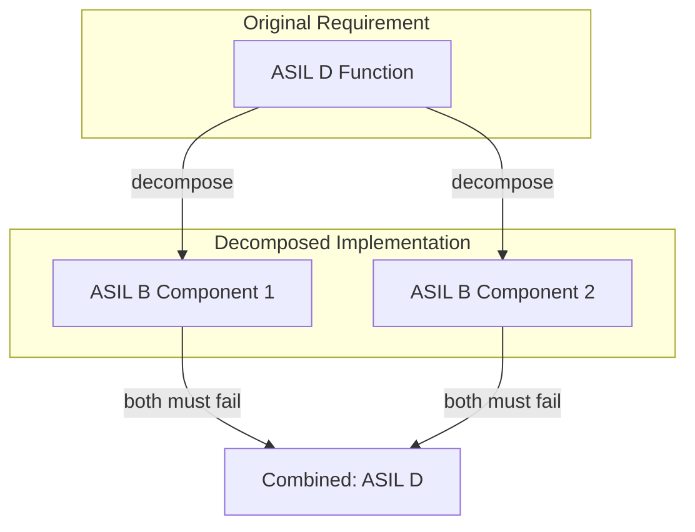
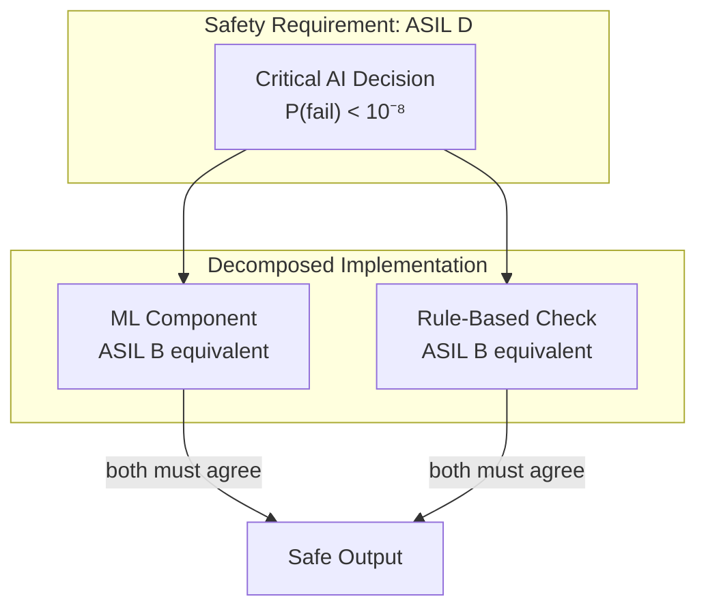

# ASIL Decomposition: Automotive Safety Lessons for AI

ISO 26262 defines Automotive Safety Integrity Levels (ASIL) and rigorous rules for decomposing safety requirements across components. These methods are directly applicable to AI system design.

## ASIL Levels

| Level | Description | Target Failure Rate | Example |
|-------|-------------|---------------------|---------|
| QM | Quality Management (no safety requirement) | Not specified | Comfort features |
| ASIL A | Lowest safety | 10⁻⁶ | Warning lights |
| ASIL B | Low safety | 10⁻⁷ | Cruise control |
| ASIL C | Medium safety | 10⁻⁷ with higher coverage | ABS system |
| ASIL D | Highest safety | 10⁻⁸ | Steering, braking |

**Key insight**: Higher ASIL requires not just lower failure rates, but more rigorous development processes, testing coverage, and independence requirements.

## ASIL Decomposition Rules

### The Decomposition Principle

A safety requirement at ASIL X can be decomposed across redundant components, where each component may have a lower ASIL—provided they are **sufficiently independent**.



### Valid Decomposition Patterns

| Original ASIL | Can Decompose To | Requirement |
|---------------|------------------|-------------|
| ASIL D | ASIL D + QM | Independent |
| ASIL D | ASIL C + ASIL A | Independent |
| ASIL D | ASIL B + ASIL B | Independent |
| ASIL C | ASIL B + ASIL A | Independent |
| ASIL C | ASIL A + ASIL A | Independent |
| ASIL B | ASIL A + ASIL A | Independent |

**The math**: For AND-gate decomposition (both must fail):
- P(system_fail) = P(component1_fail) × P(component2_fail)
- 10⁻⁸ = 10⁻⁴ × 10⁻⁴ (ASIL B × ASIL B ≈ ASIL D)

### Independence Requirements

Decomposition only works if components fail independently. ISO 26262 specifies criteria:

**1. Different design**:
- Different algorithms or approaches
- Not just "copy-paste with different variable names"

**2. Different implementation**:
- Different development teams
- Different programming languages (where practical)
- Different compilers and toolchains

**3. Physical separation**:
- Different processors or ECUs
- Separate power supplies
- Isolated communication channels

**4. Temporal separation**:
- Different execution timing
- Watchdog timers between components

**Common cause failure analysis** must verify that no single event (power spike, software bug, manufacturing defect) can cause both components to fail.

## Application to AI Systems

### ASIL-Style AI Decomposition

An AI function requiring ASIL D equivalent safety can be decomposed:



**For the decomposition to be valid**:

1. **Different design**: ML model vs. explicit rules
2. **Different implementation**: Neural network vs. deterministic code
3. **Independence verification**: Common failure analysis

### Independence Challenges for AI

AI systems face unique independence challenges:

| Challenge | Automotive Analog | AI-Specific Issue |
|-----------|-------------------|-------------------|
| Common training data | Common supplier | Both models learned same biases |
| Same architecture | Same design pattern | Same failure modes |
| Correlated inputs | Shared sensor | Same adversarial input fools both |
| Distribution shift | Environmental change | Both fail on novel inputs |

**Mitigation strategies**:

1. **Diverse architectures**: Transformer + Decision tree + Rule-based
2. **Diverse training**: Different datasets, different preprocessing
3. **Diverse modalities**: Vision + LIDAR + Radar (different sensors)
4. **Human in loop**: Fundamentally different failure modes than AI

### Worked Example: Autonomous Braking

**Safety requirement**: Emergency braking must not fail to activate when needed (ASIL D)

**Decomposition**:

| Component | ASIL | Implementation | Role |
|-----------|------|----------------|------|
| Primary detector | ASIL B | CNN on camera | Detect obstacles |
| Secondary detector | ASIL B | LIDAR point cloud | Confirm obstacles |
| Rule-based override | ASIL A | Deterministic code | Physics-based checks |
| Human override | QM | Driver brake pedal | Final authority |

**Independence analysis**:
- ✅ Different sensors (camera vs LIDAR)
- ✅ Different algorithms (CNN vs point cloud)
- ⚠️ Both could fail in heavy fog → add radar as third modality
- ✅ Rule-based and ML are fundamentally different
- ✅ Human override is independent of all AI components

**Combined ASIL**: B(B) = D equivalent (with verified independence)

## Decomposition Rules for Delegation Risk

Adapting ASIL decomposition to Delegation Risk:

### Rule 1: Multiplicative Decomposition

For components in series (AND-gate, both must fail for system failure):

```
DR_system = DR_component1 × DR_component2 / Damage_base
```

**Example**:
- Component 1: P(fail) = 0.01, Damage = $100K → Delegation Risk = $1,000
- Component 2: P(fail) = 0.01, Damage = $100K → Delegation Risk = $1,000
- Combined (both must fail): P = 0.0001, Damage = $100K → Delegation Risk = $10

### Rule 2: Additive Decomposition

For components in parallel (OR-gate, any failure causes system failure):

```
DR_system = DR_component1 + DR_component2
```

**Example**:
- Component 1: Delegation Risk = $500
- Component 2: Delegation Risk = $300
- Combined (any can fail): Delegation Risk = $800

### Rule 3: Coverage-Adjusted Decomposition

When a checker doesn't catch all failures:

```
DR_residual = DR_component × (1 - coverage)
```

**Example**:
- Component Delegation Risk: $10,000
- Checker coverage: 95%
- Residual Delegation Risk: $500

## ISO 26262 Verification Requirements

Higher ASIL requires more rigorous verification:

| Aspect | ASIL A | ASIL B | ASIL C | ASIL D |
|--------|--------|--------|--------|--------|
| Code coverage | Statement | Branch | MC/DC | MC/DC |
| Testing | Functional | + Fault injection | + Stress | + Formal |
| Review | Inspection | + Walkthrough | + Analysis | + Independent |
| Independence | Recommended | Recommended | Required | Required |

### Adapting to AI

| Aspect | Traditional | AI Equivalent |
|--------|-------------|---------------|
| Code coverage | Statement/Branch | Test set coverage |
| Functional testing | Requirements-based | Behavior specification |
| Fault injection | Hardware faults | Adversarial examples |
| Formal verification | Mathematical proof | Certified robustness |
| Independence | Different teams | Different architectures |

## Practical Application Checklist

When decomposing an AI safety requirement:

- [ ] **Define the original safety requirement** (target failure rate, damage)
- [ ] **Identify decomposition pattern** (AND-gate, OR-gate, hybrid)
- [ ] **Assign component-level requirements** (using ASIL math)
- [ ] **Verify independence**:
  - [ ] Different algorithms/architectures?
  - [ ] Different training data/processes?
  - [ ] Different failure modes?
  - [ ] Physical/temporal separation?
- [ ] **Analyze common cause failures**:
  - [ ] Same adversarial input affects both?
  - [ ] Same distribution shift affects both?
  - [ ] Same systematic bias?
- [ ] **Document decomposition rationale**
- [ ] **Test combined system** (not just components)

## Limitations for AI

ASIL decomposition assumes:
1. **Known failure modes** — AI can fail in novel ways
2. **Independent failures** — AI systems may have correlated failures
3. **Stable failure rates** — AI performance varies with input distribution
4. **Measurable coverage** — AI "coverage" is hard to define

**Conservative approach for AI**:
- Treat AI components as lower ASIL than calculation suggests
- Require more diverse redundancy than traditional systems
- Include non-AI fallbacks (rules, humans) in decomposition
- Assume independence is imperfect; add margin

---

## See Also

- [Nuclear Safety PRA](/cross-domain-methods/nuclear-safety-pra/) — Fault tree analysis methods
- [Euler Allocation](/cross-domain-methods/euler-allocation/) — Mathematical risk decomposition
- [Glossary](/getting-started/glossary/) — ASIL, SIL, and related terms
