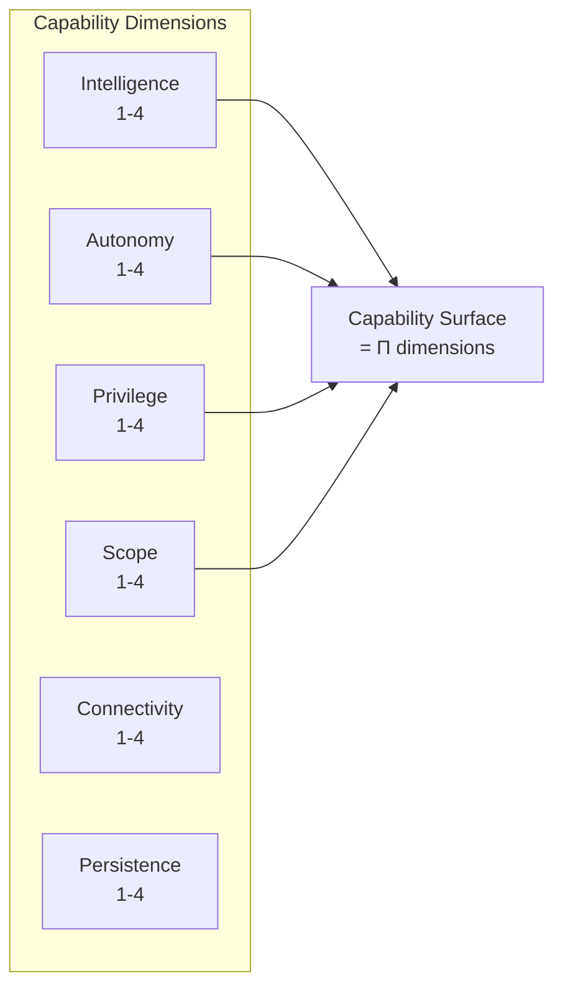

# Attack Surface and Capability Metrics

Cybersecurity's attack surface quantification provides a template for measuring AI "capability surface area."

## Attack Surface Quantification (Manadhata and Wing)

The attack surface is defined as a three-tuple: **Attack_Surface = ⟨SA, CA, DA⟩** representing system attackability across methods (entry/exit points), channels (communication pathways), and data (untrusted inputs). Each resource's attackability is computed as **damage_potential / effort**, with numeric values assigned via total orderings (e.g., root privilege = 4, non-root = 1). Resources are grouped into attack classes with shared attackability profiles, and total attack surface sums across classes.

:::note
This compositional structure—resources aggregating to classes aggregating to total surface area—directly parallels the hierarchical risk budget decomposition needed for AI safety.
:::

An AI capability surface area metric might similarly enumerate dangerous capabilities, weight them by harm potential and accessibility, and aggregate across system components.

## CVSS (Common Vulnerability Scoring System)

CVSS provides another model, though its composition properties are limited. Individual vulnerability scores (0-10) combine Base, Threat, Environmental, and Supplemental metrics. However, no standard aggregation method exists for multiple vulnerabilities—researchers have proposed arithmetic means, maximums, attack-graph-based multiplicative chains, and Bayesian network aggregation. The proposed formula **Γ(V) = 10 - (1/σ) × f(V)** uses correction factors for functionality, exploit chain position, environmental context, and exploit maturity. The lack of consensus on CVSS composition illustrates the difficulty of aggregating multi-dimensional risk metrics.

## CBRA (Capabilities-Based Risk Assessment)

The Cloud Security Alliance's Capabilities-Based Risk Assessment (CBRA) for AI systems offers a promising recent framework. It computes:

**System Risk = Criticality × Autonomy × Permission × Impact**

with each factor rated 1-4, producing composite scores 1-256 that map to Low (1-6), Medium (7-24), and High (25+) risk tiers. Higher scores require more stringent controls from the AI Controls Matrix. This multiplicative composition captures the intuition that risk increases superlinearly with capability.

## AI Capability Surface Area

An analogous metric for AI systems might include:

| Dimension | Low (1) | Medium (2) | High (3) | Critical (4) |
|-----------|---------|------------|----------|--------------|
| Intelligence | Task-specific | Domain expert | General reasoning | Superhuman |
| Autonomy | Human approval | Monitored | Bounded | Full |
| Privilege | Read-only | Write limited | System access | Admin |
| Scope | Single task | Domain | Cross-domain | Unbounded |
| Connectivity | Isolated | Limited API | Network | Internet |
| Persistence | Stateless | Session | Long-term | Self-modifying |

**Capability Surface = Π dimensions** or weighted sum depending on independence assumptions.

## Composition Challenges

The lack of consensus on CVSS composition illustrates the difficulty:

- **Arithmetic mean**: Underweights severe vulnerabilities
- **Maximum**: Ignores cumulative risk from many medium vulnerabilities
- **Multiplicative**: Assumes independence that may not hold
- **Attack graphs**: More accurate but computationally expensive

:::caution
For AI, similar challenges apply: how do you aggregate risks across components that may interact in complex ways? No consensus exists yet.
:::

## Key Takeaways

1. **Surface area is measurable** — Attack surface quantification shows how to systematically enumerate exposure
2. **Dimensions combine** — CBRA's multiplicative model (Criticality × Autonomy × Permission × Impact) captures superlinear risk growth
3. **Aggregation is hard** — No consensus exists on combining multiple risk scores
4. **Capability surface parallels attack surface** — The same dimensional thinking applies to AI capabilities

## Next Steps

- **Apply to AI systems** → [Least-X Principles](/design-patterns/least-x-principles/) systematically minimize capability surface
- **See decomposition** → [Risk Decomposition](/delegation-risk/risk-decomposition/) breaks down harm modes
- **Quantify your system** → [Delegation Risk Calculator](/design-patterns/tools/delegation-risk-calculator/)
- **Related approach** → [ASIL Decomposition](/cross-domain-methods/asil-decomposition/) from automotive
