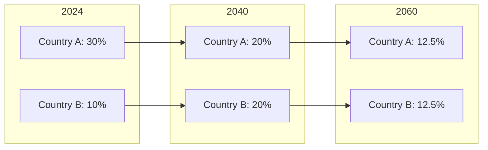
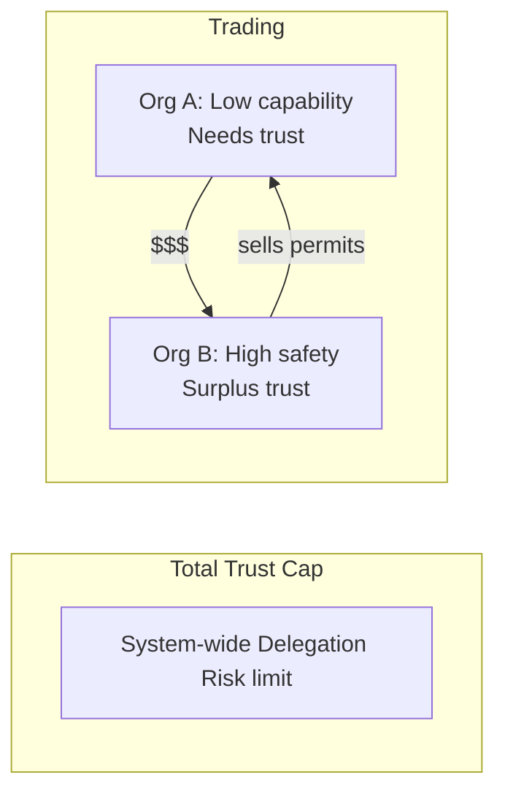
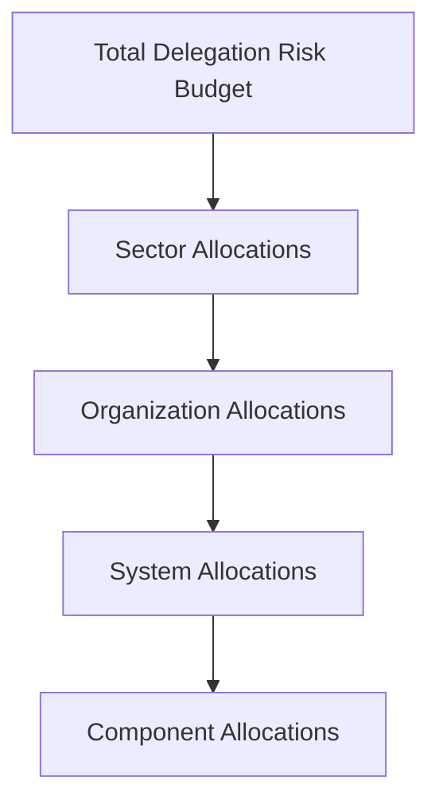

# Carbon Budgets: Lessons for AI Safety

Carbon budget frameworks manage a global constraint (total emissions) across millions of actors (countries, companies, individuals). The mechanisms for allocation, trading, and verification offer insights for AI delegation risk budgets at scale.

## The Carbon Budget Problem

**Global constraint**: To limit warming to 1.5°C, humanity can emit approximately 400 GtCO₂ more (from 2023).

**Allocation challenge**: How to divide this budget across:
- 195 countries
- Millions of companies
- Billions of individuals
- Current vs. future generations

This is structurally similar to allocating delegation risk budgets across:
- Organizations
- AI systems
- Components
- Current vs. future capabilities

## Allocation Approaches

### 1. Grandfathering

**Method**: Allocate based on historical emissions
- Country A emitted 20% historically → gets 20% of remaining budget

**Pros**: Simple, politically feasible
**Cons**: Rewards past polluters, penalizes developing nations

**AI parallel**: Allocating trust based on current deployment
- "You've deployed 20% of AI compute, you get 20% of delegation risk budget"
- Problem: Rewards incumbents, penalizes new entrants

### 2. Equal Per Capita

**Method**: Divide budget equally per person
- 400 GtCO₂ ÷ 8 billion people = 50 tonnes per person remaining

**Pros**: Fair, principle-based
**Cons**: Ignores development differences, hard to implement

**AI parallel**: Equal delegation risk budget per AI system
- Each AI system gets same Delegation Risk allocation
- Problem: Ignores differences in capability and use case

### 3. Capability-Based

**Method**: Allocate based on ability to reduce emissions
- Rich countries with technology get smaller budgets (can afford mitigation)
- Developing countries get larger budgets (need growth)

**Pros**: Acknowledges different circumstances
**Cons**: Complex, contentious definitions

**AI parallel**: Allocate based on safety capability
- Advanced safety teams get smaller delegation risk budgets (can afford verification)
- Early-stage projects get larger budgets (need flexibility to develop)

### 4. Contraction and Convergence

**Method**: Start from current allocations, converge to equal per capita over time

**AI parallel**: Start with current trust allocations, converge to principle-based allocation as safety methods mature.

## Trading Mechanisms

### Cap and Trade

**Mechanism**:
1. Total cap set (e.g., 100 Mt CO₂/year for region)
2. Allowances distributed or auctioned
3. Emitters can trade allowances
4. Penalties for exceeding owned allowances

**Key features**:
- Fixed total ensures environmental outcome
- Trading finds lowest-cost reductions
- Price signals incentivize innovation

**AI parallel: Trust permit trading**

- Total system Delegation Risk capped
- Organizations trade trust permits
- Price reflects safety investment vs. capability benefit

### Carbon Tax

**Mechanism**:
1. Tax per tonne of CO₂ emitted
2. No cap on total emissions
3. Price signal discourages emissions

**Pros**: Simple, predictable price
**Cons**: Uncertain total emissions

**AI parallel: Trust tax**
- Tax per unit of Delegation Risk
- Higher Delegation Risk → higher tax
- Revenue funds safety research

### Offset Markets

**Mechanism**: Fund projects that reduce emissions elsewhere to "offset" your emissions

**Challenges**:
- Additionality: Would reduction have happened anyway?
- Permanence: Will the offset last?
- Verification: How to confirm actual reduction?

**AI parallel: Trust offsets**
- Fund safety measures elsewhere to offset your system's Delegation Risk
- Challenges mirror carbon offsets:
  - Would safety measure have been implemented anyway?
  - Does it provide lasting protection?
  - How to verify effectiveness?

## Monitoring, Reporting, Verification (MRV)

### The MRV Framework

Any budget system requires:
1. **Monitoring**: Measure actual emissions/exposure
2. **Reporting**: Disclose to authorities
3. **Verification**: Independent confirmation

### Carbon MRV Methods

| Method | How It Works | Accuracy |
|--------|--------------|----------|
| Direct measurement | Sensors at emission points | High |
| Fuel-based | Calculate from fuel consumption | Medium |
| Activity-based | Estimate from activity levels | Low |
| Remote sensing | Satellite observation | Varies |

### AI Trust MRV

| Method | How It Works | Accuracy |
|--------|--------------|----------|
| Direct testing | Red-team, evals | High but incomplete |
| Architecture audit | Review system design | Medium |
| Self-reporting | Organization claims | Low without verification |
| Outcome monitoring | Track actual incidents | Lagging indicator |

**Key insight**: Carbon MRV works because emissions are physical and measurable. Trust exposure is harder to measure objectively, requiring:
- Standardized evaluation protocols
- Third-party auditors
- Outcome tracking over time
- Conservative estimates under uncertainty

## Lessons for AI Delegation Risk Budgets

### 1. Start with Total, Then Allocate

Carbon budgets work top-down:
1. Define global limit (science-based)
2. Allocate to countries
3. Countries allocate to sectors/companies
4. Companies allocate to facilities

**AI application**:
1. Define acceptable total AI risk (policy decision)
2. Allocate to sectors (healthcare, finance, etc.)
3. Sectors allocate to organizations
4. Organizations allocate to systems/components

### 2. Trading Improves Efficiency

Those who can reduce cheaply should reduce more; those facing high costs can buy permits.

**AI application**:
- Organizations with strong safety practices can "sell" trust margin
- Organizations needing high-capability AI can "buy" trust permits
- Market price reflects true cost of safety

### 3. Verification is Essential

Carbon markets failed when verification was weak (CDM criticisms, offset fraud).

**AI application**:
- Self-reported safety claims are insufficient
- Third-party auditing required
- Standardized evaluation protocols needed
- Penalties for misrepresentation

### 4. Allocation is Political

No allocation method is "objectively correct." Different methods favor different parties.

**AI application**:
- Early-mover advantage vs. level playing field
- Safety-capable vs. capability-focused organizations
- Current risks vs. future risks
- Geographic and jurisdictional differences

### 5. Ratcheting Mechanisms

Paris Agreement includes "ratchet" mechanism:
- Countries set initial commitments
- Every 5 years, commitments must increase
- No backsliding allowed

**AI application**:
- Initial delegation risk budgets based on current capabilities
- As safety methods improve, budgets tighten
- Cannot loosen budgets without justification
- Continuous improvement expectation

## Implementation Framework

### Phase 1: Measurement

1. Define Delegation Risk measurement methodology
2. Establish baseline for existing systems
3. Create reporting templates
4. Train auditors

### Phase 2: Cap Setting

1. Determine acceptable total system Delegation Risk
2. Consider current deployment vs. target
3. Set timeline for cap reduction
4. Build in safety margin

### Phase 3: Allocation

Options:
- Auction (efficient, but disadvantages small players)
- Grandfathering (simple, but rewards incumbents)
- Capability-based (fair, but complex)
- Hybrid approaches

### Phase 4: Trading

1. Establish trading platform
2. Define permit specifications
3. Set up clearing and settlement
4. Monitor for market manipulation

### Phase 5: Enforcement

1. Penalties for exceeding budget
2. Rewards for under-budget operation
3. Escalation for repeated violations
4. Public disclosure of compliance

## Challenges Specific to AI

### 1. Measurement Difficulty

CO₂ is measurable with sensors. Trust exposure requires:
- Subjective risk assessment
- Scenario analysis
- Expert judgment
- Conservative assumptions

### 2. Rapid Change

Carbon emissions change slowly. AI capabilities change quickly:
- New capabilities emerge unexpectedly
- Risk profiles shift with deployment scale
- Yesterday's safe system may be tomorrow's risk

### 3. Attribution

Clear who emits CO₂. Less clear who "owns" AI risk:
- Developer? Deployer? User?
- Infrastructure provider?
- Training data provider?

### 4. Global Coordination

Carbon budgets require international agreement. AI delegation risk budgets face:
- Jurisdictional arbitrage
- Different risk tolerances
- Varying enforcement capability

## Practical Starting Point

For organizations implementing delegation risk budgets today:

1. **Set internal cap**: "Our total Delegation Risk across all AI systems will not exceed $X/month"

2. **Allocate to teams**: Divide budget based on capability needs and safety capacity

3. **Allow internal trading**: Teams can transfer budget for business needs

4. **Track and report**: Monitor actual Delegation Risk, report to leadership quarterly

5. **Ratchet down**: Reduce total cap 10% annually as safety improves

6. **External audit**: Bring in third party annually to verify claims

---

## See Also

- [Euler Allocation](/cross-domain-methods/euler-allocation/) — Mathematical framework for budget decomposition
- [Mechanism Design](/cross-domain-methods/mechanism-design/) — Incentive-compatible reporting
- [Trust Accounting](/research/theory/trust-accounting/) — Ledgers and auditing
