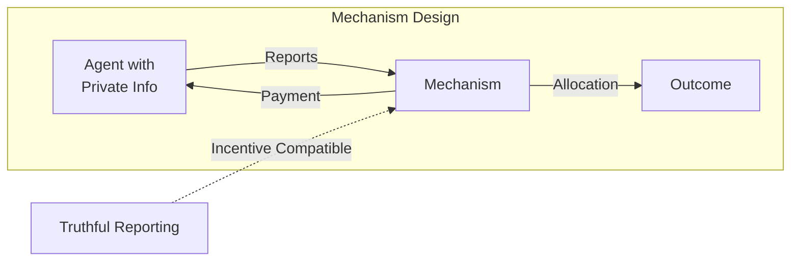

# Mechanism Design for Truthful Risk Reporting

The fundamental challenge in risk budgeting is that those closest to the work—development teams, subsystem engineers—have private information about actual risk levels that principals (management, regulators) cannot directly observe. Contract theory and mechanism design provide the theoretical tools to address this adverse selection and moral hazard.

## The Revelation Principle

The **Revelation Principle** (Gibbard 1973, Myerson 1979) dramatically simplifies mechanism design: for any mechanism achieving a social choice function in equilibrium, there exists an equivalent direct mechanism where truthful reporting is an equilibrium strategy.

:::tip
This means designers can restrict attention to incentive-compatible direct mechanisms where agents reveal true risk assessments, rather than searching over arbitrary indirect mechanisms.
:::

## VCG Mechanism

The **Vickrey-Clarke-Groves (VCG) mechanism** is the canonical approach ensuring both allocative efficiency and truthfulness. Under VCG, each agent's payment depends on how their presence affects others' welfare, creating dominant-strategy incentive compatibility where truthful reporting is optimal regardless of others' behavior. The payment formula is:

**p_i(v) = max_a Σ_{j≠i} v_j(a) - Σ_{j≠i} v_j(a*)**

Applied to risk budgeting, subsystems would report their risk requirements, and payments would penalize requests that impose costs on the broader system.

## Principal-Agent Theory

Principal-agent theory addresses the complementary problem of unobservable effort. The **Holmström-Milgrom informativeness principle** states that any performance measure revealing information about agent effort should be included in compensation contracts.

:::note[AI Safety Application]
For AI safety, this implies that safety metrics, audit results, and incident reports should all affect compensation for development teams.
:::

Optimal contracts balance risk-sharing against incentive provision—risk-averse agents prefer stable compensation, but efficiency requires performance-contingent payments.

The **Pareto-optimal fee schedule** satisfies:

**u'(w(x))/v'(w(x)) = λ + μ·f'(x|a)/f(x|a)**

where the likelihood ratio f'(x|a)/f(x|a) measures how informative the outcome is about effort.

## Shapley Values

Game-theoretic allocation using **Shapley values** provides another principled approach. The Shapley value uniquely satisfies efficiency (all risk distributed), symmetry (equal contributors get equal shares), additivity, and null player axioms. For risk allocation, it attributes total system risk to components based on their average marginal contribution across all possible coalitions:

**φ_i(v) = Σ_{S⊆N\{i}} |S|!(n-|S|-1)!/n! · [v(S∪{i}) - v(S)]**

This has been applied to VaR and Expected Shortfall attribution in finance, naturally handling non-orthogonal risk factors.

## Applications to AI Safety

| Mechanism | Application | Implementation |
|-----------|-------------|----------------|
| VCG payments | Risk budget allocation | Teams pay for risk they impose on others |
| Informativeness principle | Safety compensation | Include safety metrics in team compensation |
| Shapley values | Risk attribution | Attribute total harm potential to components |
| Revelation principle | Audit design | Design audits where truthful reporting is optimal |

## Practical Implementations

- **Safety-contingent procurement**: Contracts that pay more for demonstrably safer systems
- **Independent red teams**: Third parties with authority to block deployment
- **Liability frameworks**: Development teams financially responsible for safety failures
- **Whistleblower protections**: Incentives for reporting safety concerns

## Key Takeaways

1. **Truthful reporting is designable** — The Revelation Principle shows incentive-compatible mechanisms exist
2. **Payments can align interests** — VCG mechanisms make truthfulness dominant-strategy optimal
3. **All informative signals should matter** — The informativeness principle guides compensation design
4. **Fair attribution exists** — Shapley values provide principled risk allocation

## Next Steps

- **Apply to AI systems** → [The Insurer's Dilemma](/delegation-risk/insurers-dilemma/) shows these principles in action
- **See worked examples** → [Delegation Accounting](/delegation-risk/delegation-accounting/) uses similar incentive structures
- **Deeper theory** → [Trust Economics](/research/theory/trust-economics/) covers the economic foundations
- **Implementation** → [Quick Start](/design-patterns/tools/quick-start/) for practical application
