# Nuclear Safety: Probabilistic Risk Assessment

:::note[Transferability]
Nuclear PRA works well for physical systems with well-characterized failure modes. AI systems are less predictable—failure modes may be unknown or change with capability improvements. The methods here are *potentially* useful but their application to AI is novel and untested.
:::

Probabilistic Risk Assessment (PRA), developed after Three Mile Island and codified in NRC regulations, demonstrates how a single system-level risk target can be decomposed across thousands of components. U.S. nuclear plants operate to quantified safety goals: **Core Damage Frequency below 10⁻⁴ per reactor-year** and **Large Early Release Frequency below 10⁻⁵ per reactor-year**. Actual performance achieves an order of magnitude better—CDF around **10⁻⁵** and LERF around **10⁻⁶**—demonstrating that aggressive targets coupled with defense-in-depth create substantial safety margins.

:::note
Nuclear safety has decades of operational experience achieving 10⁻⁵ to 10⁻⁶ failure rates. This provides a calibration point for AI safety targets.
:::

## Decomposition Mechanism

```mermaid
flowchart TB
    subgraph "Fault Tree Gates"
        subgraph AND["AND Gate (all must fail)"]
            A1[P=0.01] --> AND1[×]
            A2[P=0.01] --> AND1
            AND1 --> AR[P=0.0001]
        end
        subgraph OR["OR Gate (any failure)"]
            O1[P=0.01] --> OR1[+]
            O2[P=0.01] --> OR1
            OR1 --> ORR[P≈0.02]
        end
    end
```

The decomposition mechanism uses fault tree and event tree analysis. Fault trees propagate failure probabilities upward: AND gates multiply component probabilities (P_output = Π P_inputs), while OR gates combine them (P_output ≈ Σ P_inputs for rare events). Importance measures then identify which components contribute most to total risk. **Fussell-Vesely importance** quantifies what fraction of total risk comes from cut sets containing a component; **Risk Achievement Worth (RAW)** measures how much risk increases if that component fails (RAW > 2 triggers NRC significance thresholds). These metrics guide resource allocation—components with high RAW receive more redundancy, testing, and maintenance budget.

### Example: AI System Fault Tree

How might this apply to an AI deployment system? Consider the goal: "Harmful code reaches production."

```mermaid
flowchart TB
    TOP["🎯 Harmful Code in Production<br/>Target: < 10⁻⁶/year"]

    TOP --- OR1[OR]

    OR1 --- PATH1["Path 1: Bypass All Checks"]
    OR1 --- PATH2["Path 2: Compromise Coordinator"]
    OR1 --- PATH3["Path 3: Human Error"]

    PATH1 --- AND1[AND]
    AND1 --- A1["Code Review Fails<br/>P = 10⁻²"]
    AND1 --- A2["Static Analysis Fails<br/>P = 10⁻²"]
    AND1 --- A3["Tests Pass Bad Code<br/>P = 10⁻²"]
    AND1 --- A4["Human Approves<br/>P = 10⁻¹"]
    AND1 --- R1["Path 1 Result<br/>P = 10⁻⁷"]

    PATH2 --- AND2[AND]
    AND2 --- B1["Coordinator Schemes<br/>P = 10⁻³"]
    AND2 --- B2["Defeats Redundancy<br/>P = 10⁻²"]
    AND2 --- B3["Evades Monitoring<br/>P = 10⁻²"]
    AND2 --- R2["Path 2 Result<br/>P = 10⁻⁷"]

    PATH3 --- AND3[AND]
    AND3 --- C1["Human Override<br/>P = 10⁻²"]
    AND3 --- C2["Malicious Intent<br/>P = 10⁻⁴"]
    AND3 --- R3["Path 3 Result<br/>P = 10⁻⁶"]

    R1 --- OR2[OR]
    R2 --- OR2
    R3 --- OR2
    OR2 --- TOTAL["Total: ~1.2 × 10⁻⁶/year"]
```

**Reading the tree**:
- **AND gates (×)**: All children must fail. Path 1 requires code review AND static analysis AND tests AND human all failing: 10⁻² × 10⁻² × 10⁻² × 10⁻¹ = 10⁻⁷
- **OR gates (+)**: Any child failing causes parent. Total ≈ 10⁻⁷ + 10⁻⁷ + 10⁻⁶ ≈ 1.2 × 10⁻⁶
- **Path 3 dominates**: Human error is the largest contributor—focus safety investment there

## Safety Integrity Levels (IEC 61508)

IEC 61508's Safety Integrity Levels provide an even more explicit budget framework. Each SIL corresponds to a Probability of Failure on Demand range: **SIL 4 requires PFD between 10⁻⁵ and 10⁻⁴**, representing a Risk Reduction Factor of 10,000-100,000×. When a Safety Instrumented Function requires SIL 3, its constituent sensor, logic solver, and actuator subsystems each receive allocated PFD targets that sum to the overall requirement: **PFD_system = PFD_sensor + PFD_logic + PFD_actuator**. This additive decomposition for series reliability is the direct analog of Euler allocation for independent failure modes.

## Aerospace Safety (ARP 4761, DO-178C)

Aerospace safety assessment extends this with an inverse relationship between severity and allowable probability. **Catastrophic failures must be "Extremely Improbable" at below 10⁻⁹ per flight hour**; hazardous failures below 10⁻⁷; major below 10⁻⁵. Since a transport aircraft has approximately 100 potential catastrophic failure conditions, the aggregate budget for catastrophic failures is around 10⁻⁷ per flight hour, with each condition allocated a fraction. Design Assurance Levels (A through E) then flow requirements to software and hardware components, with DAL A requiring **71 verification objectives including MC/DC structural coverage**.

## Key Concepts for AI Safety

| Concept | Definition | AI Safety Analog |
|---------|------------|------------------|
| Core Damage Frequency | System-level failure target | Catastrophic harm probability |
| Fault Tree | Logical decomposition of failure modes | Capability/failure decomposition |
| Fussell-Vesely Importance | Component contribution to total risk | Which AI components matter most |
| Risk Achievement Worth | Risk increase if component fails | Impact of component compromise |
| Safety Integrity Level | Quantified reliability requirement | AI capability/trust level |
| Defense in Depth | Multiple independent barriers | Layered AI safety mechanisms |

:::caution[Limitations for AI]
Assumes independent random failures. Historical failure rates inform future predictions. Components have well-characterized failure modes. AI exhibits systematic, not random, failures—the key gap this framework must address.
:::

## Key Takeaways

1. **Aggressive targets work** — Nuclear achieves 10⁻⁵ to 10⁻⁶ failure rates with quantified goals
2. **Fault trees decompose risk** — AND/OR logic enables principled allocation to components
3. **Importance measures guide investment** — Focus resources on high-RAW components
4. **Defense in depth creates margins** — Actual performance exceeds targets by 10×

## Next Steps

- **Apply to AI** → [Framework Overview](/delegation-risk/overview/) uses similar decomposition for AI systems
- **See worked example** → [Code Deployment Example](/design-patterns/examples/code-deployment-example/) shows fault tree thinking
- **Safety mechanisms** → [Safety Mechanisms](/design-patterns/safety-mechanisms/) implements defense in depth
- **Deep dive** → [Nuclear & Aerospace Deep Dive](/research/nuclear-aerospace-deep-dive/) for full analysis
