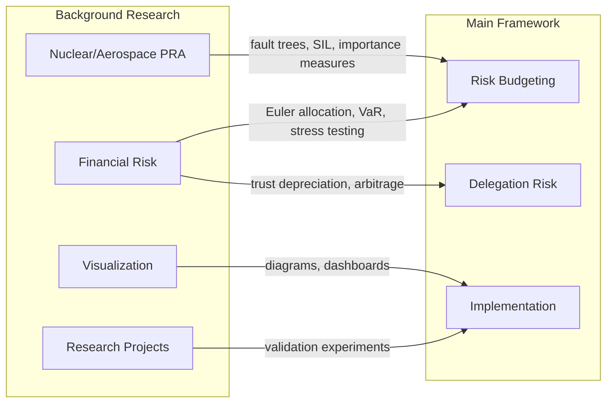

# Background Research

This section contains deeper research into the domains that inform the framework. While the main documentation focuses on practical application, these pages provide the theoretical foundation and empirical grounding.

## How This Section Connects to the Framework

## Contents

### [Nuclear & Aerospace PRA: Deep Dive](/deep-dives/research/system-design/nuclear-aerospace-deep-dive/)

Comprehensive research on how safety-critical industries achieve 10⁻⁹ failure rates:

- **Fault tree mechanics** — AND/OR gates, importance measures, sensitivity analysis
- **IEC 61508 SIL levels** — Quantified targets for safety-instrumented systems
- **Defense in depth** — Multiple independent barriers, IAEA principles
- **Major failures** — Lessons from Challenger, Columbia, Fukushima, Therac-25

**Relevance to framework**: The [Risk Budgeting](/cross-domain-methods/overview/) section adapts these methods for AI systems. Understanding the original domain helps you apply them correctly.

### [Financial Risk Budgeting](/deep-dives/research/risk-methods/financial-risk-budgeting/)

Deep dive into how finance manages quantified risk:

- **Euler allocation** — Mathematical decomposition of portfolio risk
- **VaR and Expected Shortfall** — Tail risk measures
- **RAROC** — Risk-adjusted performance metrics
- **Stress testing** — Scenario-based risk assessment

**Relevance to framework**: [Trust Economics](/deep-dives/theory/trust-economics/) and the Delegation Risk computation borrow heavily from financial risk concepts.

### [Fidelity Insurance: Pricing Defection Risk](/deep-dives/research/risk-methods/fidelity-insurance/)

How the insurance industry prices "bad actor" risk:

- **Product categories** — Fidelity bonds, D&O liability, cyber crime coverage
- **Control-premium relationship** — Better controls = lower premiums (30-70% reduction)
- **Political insurance** — Why it doesn't exist, and what that tells us about oversight
- **Novel structures** — Parametric triggers, prediction market hybrids, dynamic pricing

**Relevance to framework**: Insurance premiums provide **market prices** for defection risk, making delegation balance sheets more concrete. The control-premium relationship directly maps to exposure reduction.

### [Visualizing Delegation Hierarchies](/deep-dives/research/hierarchy-visualization/)

Survey of techniques for visualizing hierarchical task structures:

- **Node-link trees** — Traditional approach, intuitive but space-inefficient
- **Space-filling methods** — Treemaps, icicle plots, circle packing
- **Radial approaches** — Sunbursts, chord diagrams for cross-connections
- **Encoding risk** — Color, size, borders, badges for multi-dimensional data

**Relevance to framework**: Documentation and dashboards need effective ways to show delegation structure, risk levels, and permission boundaries simultaneously.

### [Potential Research Projects](/deep-dives/research/potential-projects/)

Research agenda for validating and extending the framework:

- **Empirical validation** — Does decomposition reduce scheming? Can AI forecast its own behavior?
- **Formal methods** — Type systems for trust, compositional safety proofs
- **Mechanism design** — Incentive-compatible safety reporting
- **Tools** — Trust simulators, budget calculators, monitoring dashboards

**Relevance to framework**: The [Implementation Roadmap](/reference/roadmap/) references these projects as next steps.

## Reading Guide

**If you're implementing the framework**: You probably don't need this section initially. Start with [Core Concepts](/getting-started/core-concepts/) and the worked examples.

**If you're adapting the framework**: Read the domain-specific pages to understand the original methods deeply before modifying them for your context.

**If you're validating the framework**: The [Potential Research Projects](/deep-dives/research/potential-projects/) page lists specific experiments that would strengthen or challenge the framework's assumptions.

**If you're skeptical**: The deep dives show the track record of these methods in other domains (nuclear, aerospace, finance). Nuclear/aerospace have strong records; financial risk management has a more mixed history (notably 2008). This grounds the framework in established practice rather than pure theory—though the AI-specific application is novel.

## Key Takeaways from Background Research

### From Nuclear/Aerospace

1. **10⁻⁹ is achievable** — But requires systematic decomposition, redundancy, and defense in depth
2. **Independence matters** — Common-cause failures defeat redundancy
3. **Importance measures guide investment** — Focus on high-RAW components
4. **Failures teach more than successes** — Every major accident reveals hidden assumptions

### From Finance

1. **Risk can be decomposed** — Euler allocation provides principled component budgets
2. **Tail risk requires special attention** — VaR misses the worst outcomes
3. **Incentives shape behavior** — RAROC makes risk-taking visible
4. **Models fail in crises** — Stress testing and conservatism are essential

### For AI Safety

1. **Borrow methods, not blind faith** — These domains have 10,000+ operating years; AI has ~10
2. **AI failures are systematic, not random** — Independence assumptions need extra scrutiny
3. **Human oversight remains critical** — Even mature industries rely on human judgment
4. **Start conservative, loosen with evidence** — Uncertainty factors should be large initially

### From Visualization Research

1. **Node-link trees are most intuitive** — But sacrifice space efficiency
2. **Icicle plots outperform treemaps** — For hierarchy understanding tasks
3. **Limit to 3 levels of any encoding** — Too many colors/sizes causes confusion
4. **Position for structure, color for risk** — Use the most salient variable for the most important dimension

---

## See Also

- [Risk Budgeting Overview](/cross-domain-methods/overview/) — How we apply these methods
- [Empirical Tests](/applying/tools/empirical-tests/) — Testable predictions from the framework
- [Glossary](/getting-started/glossary/) — Definitions of domain-specific terms
