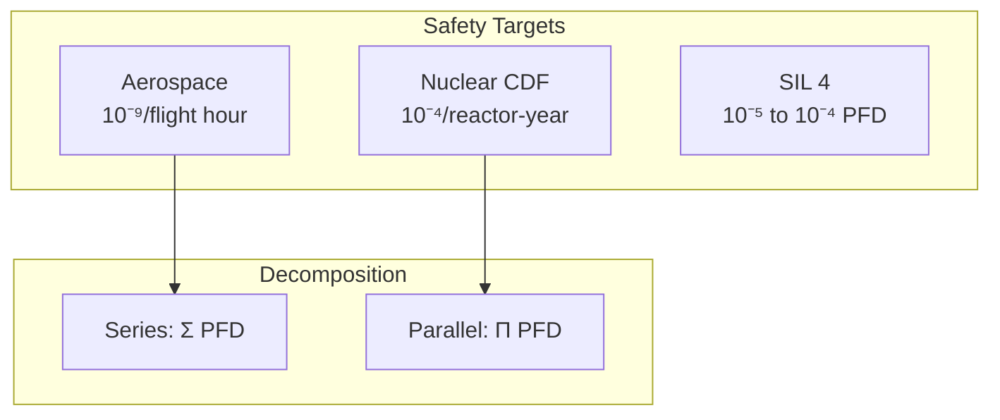

Deep research into how nuclear and aerospace industries decompose system-level safety targets to components, and what AI safety can learn from their successes and failures.

## Fault Tree Decomposition Mechanics

### Core Formulas

**OR Gate (any failure causes system failure):**
- P(output) ≈ Σ P(inputs) for rare events
- Full formula: P(A∪B) = P(A) + P(B) - P(A)·P(B)

**AND Gate (all must fail):**
- P(output) = Π P(inputs)
- This multiplication is key to redundancy benefits

### Real Decomposition Examples

**Aerospace 10⁻⁹ per flight hour:**
- ~100 catastrophic failure conditions per aircraft
- Aggregate budget: ~10⁻⁷ per flight hour total
- Each condition: ~10⁻⁹ allocation
- If 2 redundant channels (AND): each can be ~3.2×10⁻⁵ (since 3.2×10⁻⁵ × 3.2×10⁻⁵ ≈ 10⁻⁹)

**Nuclear 10⁻⁴ CDF:**
- Target: < 10⁻⁴ Core Damage Frequency per reactor-year
- Achieved: ~10⁻⁵ (10× better than target)
- LERF target: < 10⁻⁵, achieved ~10⁻⁶
- Budget split: Internal events (60-80%), external events (earthquakes, floods, fires)

### Importance Measures

| Measure | Formula | Use Case |
|---------|---------|----------|
| **Fussell-Vesely** | F(containing component) / F(total) | % contribution to total risk |
| **Risk Achievement Worth (RAW)** | Q(component failed) / Q(baseline) | Risk increase if component fails. RAW > 2 triggers NRC action |
| **Birnbaum** | ∂Q_system / ∂q_component | Sensitivity: where improvements have largest impact |

---

## IEC 61508 Safety Integrity Levels

### SIL Targets (Low Demand Mode)

| SIL | PFDavg Range | Risk Reduction Factor |
|-----|--------------|----------------------|
| SIL 1 | 10⁻² to 10⁻¹ | 10 to 100 |
| SIL 2 | 10⁻³ to 10⁻² | 100 to 1,000 |
| SIL 3 | 10⁻⁴ to 10⁻³ | 1,000 to 10,000 |
| SIL 4 | 10⁻⁵ to 10⁻⁴ | 10,000 to 100,000 |

### Series System Decomposition

For Sensor → Logic → Actuator chain targeting SIL 3 (PFDavg < 10⁻³):
- Sensor: 3×10⁻⁴
- Logic: 2×10⁻⁴
- Actuator: 5×10⁻⁴
- **Total: 10⁻³ (meets SIL 3)**

### ASIL Decomposition (ISO 26262)

**Key insight: High requirements can split across redundant elements**

| Original | Decomposition Options |
|----------|----------------------|
| ASIL D | D(D) or C(D)+A(D) or **B(D)+B(D)** |
| ASIL C | C(C) or B(C)+A(C) |
| ASIL B | B(B) or A(B)+A(B) |

**Critical requirements:**
1. **Sufficient independence** - no common cause failures
2. **Freedom from interference** - cascading failures prevented
3. **Dependent Failure Analysis** mandatory
4. Different hardware, software, teams, locations, power supplies

### Hardware Metrics

| ASIL | SPFM (Single Point Fault Metric) | LFM (Latent Fault Metric) | Max Failure Rate |
|------|----------------------------------|---------------------------|------------------|
| ASIL D | ≥99% | ≥90% | ≤10 FIT |
| ASIL C | ≥97% | ≥80% | ≤100 FIT |
| ASIL B | ≥90% | ≥60% | ≤100 FIT |

---

## Aerospace Standards

### Severity vs Probability Targets (ARP 4761)

| Severity | Effect | Target | Qualitative |
|----------|--------|--------|-------------|
| Catastrophic | Multiple fatalities | < 10⁻⁹/FH | Extremely Improbable |
| Hazardous | Serious injuries | < 10⁻⁷/FH | Extremely Remote |
| Major | Minor injuries | < 10⁻⁵/FH | Remote |
| Minor | Discomfort | < 10⁻³/FH | Probable |

### Design Assurance Levels (DO-178C)

| DAL | Failure Condition | Verification Objectives |
|-----|------------------|------------------------|
| DAL A | Catastrophic | 71 objectives, MC/DC coverage |
| DAL B | Hazardous | 69 objectives |
| DAL C | Major | 62 objectives |
| DAL D | Minor | 26 objectives |
| DAL E | No Effect | Minimal |

**DAL A requirements:**
- 100% statement coverage
- 100% decision coverage
- Modified Condition/Decision Coverage (MC/DC)
- Independence in verification (separate teams)
- Full traceability: requirements → design → code → tests

---

## Key Failures and Lessons

### Three Mile Island (1979)

**What PRA missed:**
- Human factors completely underestimated
- Control room design flawed (PORV indicator showed solenoid, not valve position)
- 11 previous PORV failures ignored
- Same sequence occurred 18 months earlier at Davis-Besse

**Lessons:**
- Full-scope simulators at every plant
- Symptom-based Emergency Operating Procedures
- Human factors engineering mandatory
- Resident inspectors at every plant

### Fukushima (2011)

**What PRA missed:**
- Beyond-design-basis external event (14m tsunami vs 5.7m design basis)
- Multi-unit common-cause failure not modeled (unit-by-unit PRA)
- "Independent" power sources all in same flood zone
- Station blackout scenarios assumed neighboring unit power available

**Lessons:**
- Beyond-design-basis events must be analyzed
- Multi-unit analysis required
- Physical separation of redundant systems
- Passive safety systems not requiring AC power

### Challenger (1986) - Normalization of Deviance

**Key concept:** Gradual process where unacceptable practice becomes acceptable through repetition without catastrophe.

- O-ring damage observed on multiple previous launches
- Each instance redefined as "acceptable risk"
- No rules broken - decision followed NASA protocol
- Columbia 2003: same pattern repeated ("problems never fixed")

**Lessons for AI safety:**
- Process compliance ≠ safety
- Financial/schedule pressure corrupts judgment
- Historical success ≠ future safety
- Organizational culture > technical systems

### Boeing 737 MAX (2018-2019)

**Regulatory capture indicators:**
- Self-certification through ODA program
- Engineer conflicts: employer vs safety responsibility
- Engineering-driven → finance-driven culture shift

---

## Practical Implementation Challenges

### Data Quality

**Uncertainty issues:**
- Databases contain legacy component data
- New technologies lack historical statistics
- MIL-HDBK-217 "do not produce meaningful or accurate quantitative predictions"
- Best use: relative comparison between designs, not absolute values

### Independence Assumptions

**Beta Factor (Common Cause Failure rate):**

| System Quality | Beta Factor |
|---------------|-------------|
| Well-engineered | 0.001 to 0.05 (0.1% to 5% CCF) |
| Typical redundant | 0.05 to 0.25 (5% to 25% CCF) |
| Poor engineering | up to 0.25 (25% CCF) |

**Violations of independence:**
- **Physical:** Common location, shared power, shared cooling
- **Design:** Same component type, same manufacturer, common software bugs
- **Operational:** Common maintenance errors, same calibration mistakes

### Safety Factors

| Domain | Typical Factor | Notes |
|--------|---------------|-------|
| Buildings | 2.0 | Well-understood loads |
| Pressure vessels | 3.5-4.0 | |
| Aerospace structures | 1.2-1.5 | Weight critical; compensate with QC, inspection |
| Pressurized fuselage | 2.0 | |

**Key insight:** "High value cannot guarantee no failures" - safety factors don't cover systematic errors, poor design, or unknown-unknowns. Better described as "ignorance factors."

### Regulatory Capture Countermeasures

1. **Structural:** Independent safety committees, cooling-off periods, whistleblower protections
2. **Cultural:** Psychological safety, "speak up" culture, consequences for violations
3. **Regulatory:** Defense-in-depth, independent verification, adversarial stance
4. **Learning:** Historical lessons processes, cross-industry sharing, precursor analysis

---

## Key Numbers Summary

### Target Probabilities
- Catastrophic aerospace: 10⁻⁹ per flight hour
- Nuclear CDF: 10⁻⁴ per reactor-year (achieved 10⁻⁵)
- SIL 4: 10⁻⁵ to 10⁻⁴ PFD

### Decomposition Math
- Series: PFD_total = Σ PFD_components
- Parallel (AND): PFD_total = Π PFD_components
- ASIL D = ASIL B + ASIL B (with independence)

### Common Cause
- Well-designed systems: 5% beta factor typical
- Independence requires: different hardware, software, teams, locations, power

### Safety Margins
- Aerospace: 1.2-1.5× (weight critical)
- Nuclear: defense-in-depth with multiple barriers
- Pharmacology: 100-1000× uncertainty factors

---

## Implications for AI Safety

### What Transfers Well

1. **Fault tree decomposition** - AND/OR gate math works for any system
2. **Importance measures** - identify where to focus safety investment
3. **SIL/ASIL decomposition** - splitting requirements across redundant components
4. **Hardware metrics** - SPFM, LFM concepts applicable to AI monitoring coverage

### What Doesn't Transfer

1. **Failure rate databases** - AI lacks historical failure statistics
2. **Random failure assumptions** - AI failures are systematic, not random
3. **Independence assumptions** - AI components may have correlated failures from training
4. **Physical separation** - doesn't prevent correlated AI behavior

### Key Adaptations Needed

1. **Systematic failure modeling** - not random hardware faults
2. **Capability-based targets** - not just failure probability
3. **Behavioral independence** - different training, architectures, not just physical separation
4. **Emergent capability handling** - unknown-unknowns more significant than nuclear/aerospace
5. **Organizational factors** - normalization of deviance, regulatory capture equally relevant

---

## Sources

- NRC NUREG documents (NUREG-0492, NUREG/CR-4639, NUREG/CR-5485)
- IEC 61508, ISO 26262 standards
- ARP 4761, DO-178C, DO-254 aerospace standards
- Accident investigation reports (TMI, Fukushima, Challenger, 737 MAX)
- Academic literature on PRA, importance measures, common cause failures
