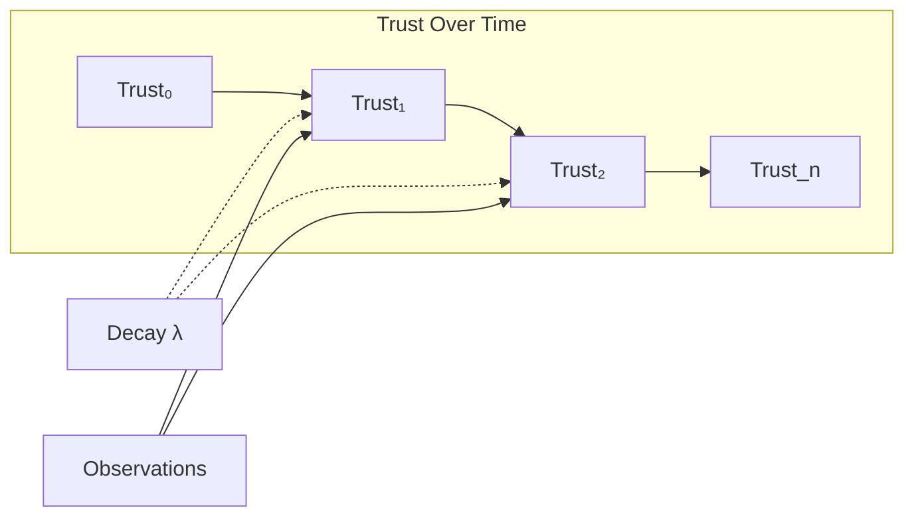

# Risk Dynamics

## Bayesian Trust Updating

Start with prior belief about agent trustworthiness, update with observations.

**Prior**: P(agent_type = trustworthy) = π₀

**Observation model**: P(outcome | agent_type)

- Trustworthy agent: P(good_outcome) = 0.95
- Untrustworthy agent: P(good_outcome) = 0.3

**Posterior after n good outcomes**:

```
π_n = P(trustworthy | n good outcomes)
    = π₀ × 0.95ⁿ / [π₀ × 0.95ⁿ + (1-π₀) × 0.3ⁿ]
```

**Example**: π₀ = 0.5 (uninformed prior)

- After 1 good outcome: π₁ = 0.76
- After 5 good outcomes: π₅ = 0.998
- After 10 good outcomes: π₁₀ ≈ 1.0

**Trust from posterior**:

```
Delegation Risk = E[damage] × (1 - π_n) × P(bad_outcome | untrustworthy)
```

As π_n → 1, Delegation Risk → 0.

## Trust Building Rate

How fast can trust be built?

**Factors affecting rate**:

- Informativeness of observations (high-stakes decisions reveal more)
- Base rate of good behavior (easy tasks don't discriminate)
- Observation noise (noisy outcomes slow learning)

**Optimal trust building**: Choose tasks that maximize information gain about trustworthiness.

**Information gain from task**:

```
IG(task) = H(type) - E[H(type | outcome(task))]
```

High-information tasks:

- Moderate difficulty (easy tasks always succeed, hard tasks always fail)
- Clear success criteria (unambiguous outcomes)
- Low noise (outcome reflects agent, not environment)

**Trust building curriculum**: Sequence of tasks with increasing stakes, each building on trust from previous.

## Trust Decay Models



### Exponential Decay

```
Trust(t) = Trust(0) × exp(-λt)
```

### Memory-Based Decay

```
Trust(t) = Σᵢ weight(t - tᵢ) × observation_i
```

Where weight(Δt) decreases with time since observation.

### Event-Triggered Decay

```
Trust(t) = Trust(t-1) × (1 - decay_rate × I(trigger_event))
```

Trust drops on specific events (capability change, environment change, time since verification).

## Adversarial Trust Dynamics

**Strategic agent**: Agent chooses behavior to maximize long-term payoff, not immediate task performance.

:::danger[Deceptive Equilibrium]
Agent behaves well during evaluation period, defects after gaining trust.
:::

**Formal model**:

```
Agent payoff = Σₜ δᵗ × [benefit_t(action_t) - penalty_t(action_t) × P(caught)]
```

Where δ is discount factor, benefit includes both legitimate rewards and defection gains.

**When does deception pay?**

- High discount factor (patient agent)
- Low P(caught) after trust established
- High benefit from late defection
- Low cost of early good behavior

:::tip[Counter-Strategies]
Unpredictable monitoring (maintain P(caught)), delayed trust (don't give high-stakes access until very high trust), trust decay (past behavior doesn't guarantee future), and structural constraints (limit benefit from defection).
:::

## Multi-Agent Trust Learning

When multiple agents interact, trust becomes strategic:

**Reputation systems**: Agents' trust levels are public, affect future opportunities.

**Trust signaling**: Agents take costly actions to signal trustworthiness.

**Trust herding**: Agents copy trust decisions of others (social proof).

**Trust manipulation**: Agents try to manipulate others' trust perceptions.

**Equilibrium analysis**: What trust levels emerge in equilibrium?

**Model**:

- n agents, each chooses trustworthiness level τᵢ ∈ [0,1]
- Cost of trustworthiness: c(τᵢ) (being trustworthy is costly)
- Benefit of being trusted: b(perceived_trust_i) (more trust → more opportunities)
- Perceived trust: function of τᵢ and observations

**Nash equilibrium**: Each agent's τᵢ is best response to others' strategies.

**Possible equilibria**:

- All trustworthy (if benefits exceed costs)
- All untrustworthy (if costs exceed benefits)
- Mixed (heterogeneous trustworthiness)
