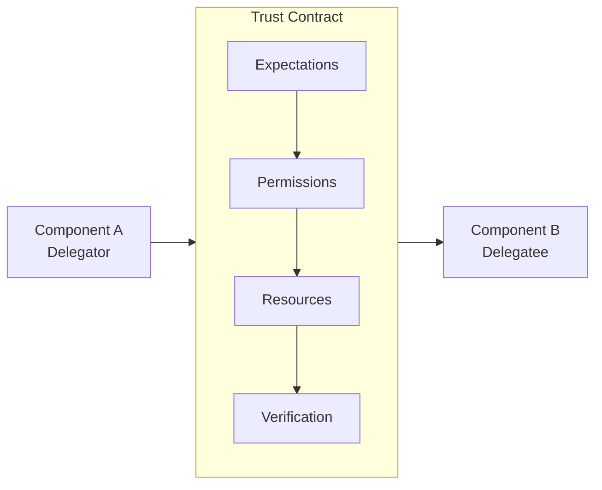

# Delegation Interfaces

When component A delegates to component B, there's an implicit interface:



The trust contract specifies:
- **Expectations**: What A expects B to do
- **Permissions**: What B is allowed to do
- **Resources**: What B can access
- **Verification**: How B's output will be verified

Making this explicit creates a **trust contract**.

:::tip
Explicit trust contracts turn implicit assumptions into verifiable agreements. They enable automated enforcement, auditing, and composition across delegation chains.
:::

## Trust Contract Structure

```
TrustContract {
    parties: {delegator: A, delegatee: B}

    task_specification: {
        input_schema: Schema,
        output_schema: Schema,
        functional_requirements: [Requirement],
        non_functional_requirements: [Requirement]
    }

    trust_bounds: {
        max_ete: Currency,
        max_capability: CapabilitySet,
        max_information: InformationSet,
        max_duration: Duration
    }

    verification: {
        pre_conditions: [Predicate],
        post_conditions: [Predicate],
        invariants: [Predicate],
        verification_method: VerificationSpec
    }

    failure_handling: {
        on_timeout: Action,
        on_invalid_output: Action,
        on_resource_exceeded: Action,
        on_trust_violation: Action
    }

    meta: {
        created: Timestamp,
        expires: Timestamp,
        renegotiation_allowed: Boolean
    }
}
```

## Example: Code Review Trust Contract

```
TrustContract {
    parties: {
        delegator: DevelopmentCoordinator,
        delegatee: CodeReviewAgent
    }

    task_specification: {
        input_schema: {
            code: String,
            language: Enum[Python, JavaScript, ...],
            context: String,
            review_focus: Enum[Security, Performance, Style, All]
        },
        output_schema: {
            approved: Boolean,
            issues: [{
                severity: Enum[Critical, Major, Minor, Info],
                location: LineRange,
                description: String,
                suggested_fix: Optional[String]
            }],
            confidence: Float[0,1]
        },
        functional_requirements: [
            "Identify all critical security vulnerabilities",
            "Flag performance issues with >10x slowdown potential",
            "Check style guide compliance"
        ],
        non_functional_requirements: [
            "Complete within 60 seconds",
            "Confidence calibrated to 90% accuracy"
        ]
    }

    trust_bounds: {
        max_ete: $5000,
        max_capability: {
            can_read: [submitted_code, style_guide, security_rules],
            can_write: [review_output],
            can_execute: [],
            can_network: []
        },
        max_information: {
            sees: [code_content, language, context],
            does_not_see: [author_identity, business_context, other_reviews]
        },
        max_duration: 60 seconds
    }

    verification: {
        pre_conditions: [
            "code is syntactically valid",
            "language is supported"
        ],
        post_conditions: [
            "output matches schema",
            "all critical issues have suggested fixes",
            "confidence is provided"
        ],
        invariants: [
            "no information exfiltration",
            "no code execution",
            "deterministic output for same input"
        ],
        verification_method: {
            format_check: Automatic,
            semantic_check: SampleBasedAudit(rate=0.05),
            invariant_check: ContinuousMonitoring
        }
    }

    failure_handling: {
        on_timeout: RetryOnce then EscalateToHuman,
        on_invalid_output: Reject and Log,
        on_resource_exceeded: Terminate and Alert,
        on_trust_violation: Terminate, Log, TriggerIncidentResponse
    }
}
```

## Trust Contract Composition

When tasks chain, contracts compose:

```
Contract(A→B) ∘ Contract(B→C) = Contract(A→C via B)
```

**Composition rules**:

- trust_bounds: Intersection (most restrictive)
- verification: Union (all checks apply)
- failure_handling: Cascade (B's failure triggers A's handling)

**Example**: If A→B allows network access but B→C doesn't, A→C via B doesn't allow network access for C.

## Contract Verification

**Static verification**: Check contract properties at design time

- Is output schema a subtype of expected input for next stage?
- Do capability grants satisfy least privilege?
- Are verification methods sufficient for stated trust bounds?

**Runtime verification**: Check contract compliance during execution

- Pre/post condition checking
- Resource usage monitoring
- Invariant enforcement

**Post-hoc verification**: Audit after execution

- Did outputs match contract?
- Were trust bounds respected?
- How did actual Delegation Risk compare to contracted max_ete?

## Trust Contract Negotiation

In dynamic systems, contracts might be negotiated:

**Agent B proposes**: "I can do this task with these trust requirements"
**Agent A evaluates**: "Is B's required trust within my budget?"
**Negotiation**: Adjust task scope, trust bounds, or verification until agreement

**Auction mechanism**: Multiple agents bid trust requirements for task

- Lowest trust bidder wins (if capable)
- Incentivizes trust minimization

:::caution[Strategic Misrepresentation]
Agent might claim low trust requirement, then violate. Mitigate with bonding, reputation stakes, and verification with penalties.
:::

## JSON Schema for Implementation

For implementers, here's a formal JSON Schema for trust contracts:

```json
{
  "$schema": "http://json-schema.org/draft-07/schema#",
  "title": "TrustContract",
  "description": "A formal contract specifying trust bounds between delegator and delegatee",
  "type": "object",
  "required": ["parties", "task_specification", "trust_bounds", "verification", "failure_handling", "meta"],
  "properties": {
    "parties": {
      "type": "object",
      "required": ["delegator", "delegatee"],
      "properties": {
        "delegator": { "type": "string", "description": "ID of the component granting trust" },
        "delegatee": { "type": "string", "description": "ID of the component receiving trust" }
      }
    },
    "task_specification": {
      "type": "object",
      "required": ["input_schema", "output_schema"],
      "properties": {
        "input_schema": { "type": "object", "description": "JSON Schema for valid inputs" },
        "output_schema": { "type": "object", "description": "JSON Schema for valid outputs" },
        "functional_requirements": {
          "type": "array",
          "items": { "type": "string" },
          "description": "What the component must do"
        },
        "non_functional_requirements": {
          "type": "array",
          "items": { "type": "string" },
          "description": "Quality attributes (latency, accuracy, etc.)"
        }
      }
    },
    "trust_bounds": {
      "type": "object",
      "required": ["max_ete"],
      "properties": {
        "max_ete": {
          "type": "object",
          "required": ["value", "currency", "period"],
          "properties": {
            "value": { "type": "number", "minimum": 0 },
            "currency": { "type": "string", "default": "USD" },
            "period": { "type": "string", "enum": ["per_invocation", "per_hour", "per_day", "per_month"] }
          }
        },
        "max_capabilities": {
          "type": "object",
          "properties": {
            "can_read": { "type": "array", "items": { "type": "string" } },
            "can_write": { "type": "array", "items": { "type": "string" } },
            "can_execute": { "type": "array", "items": { "type": "string" } },
            "can_network": { "type": "array", "items": { "type": "string" } }
          }
        },
        "max_duration_seconds": { "type": "integer", "minimum": 1 },
        "max_memory_mb": { "type": "integer", "minimum": 1 },
        "max_compute_flops": { "type": "number", "minimum": 0 }
      }
    },
    "verification": {
      "type": "object",
      "properties": {
        "pre_conditions": {
          "type": "array",
          "items": { "type": "string" },
          "description": "Conditions that must hold before invocation"
        },
        "post_conditions": {
          "type": "array",
          "items": { "type": "string" },
          "description": "Conditions that must hold after invocation"
        },
        "invariants": {
          "type": "array",
          "items": { "type": "string" },
          "description": "Conditions that must hold throughout execution"
        },
        "verification_methods": {
          "type": "array",
          "items": {
            "type": "object",
            "required": ["method", "coverage"],
            "properties": {
              "method": { "type": "string", "enum": ["format_check", "semantic_check", "formal_verification", "human_review", "sampling"] },
              "coverage": { "type": "number", "minimum": 0, "maximum": 1 }
            }
          }
        }
      }
    },
    "failure_handling": {
      "type": "object",
      "properties": {
        "on_timeout": { "$ref": "#/definitions/action" },
        "on_invalid_output": { "$ref": "#/definitions/action" },
        "on_resource_exceeded": { "$ref": "#/definitions/action" },
        "on_trust_violation": { "$ref": "#/definitions/action" }
      }
    },
    "meta": {
      "type": "object",
      "required": ["created", "expires"],
      "properties": {
        "contract_id": { "type": "string", "format": "uuid" },
        "version": { "type": "string" },
        "created": { "type": "string", "format": "date-time" },
        "expires": { "type": "string", "format": "date-time" },
        "renegotiation_allowed": { "type": "boolean", "default": false }
      }
    }
  },
  "definitions": {
    "action": {
      "type": "object",
      "required": ["type"],
      "properties": {
        "type": { "type": "string", "enum": ["retry", "reject", "escalate", "terminate", "log", "alert"] },
        "max_retries": { "type": "integer", "minimum": 0 },
        "escalate_to": { "type": "string" },
        "alert_channels": { "type": "array", "items": { "type": "string" } }
      }
    }
  }
}
```

### Example Contract Instance

```json
{
  "parties": {
    "delegator": "code-deployment-orchestrator",
    "delegatee": "security-scanner"
  },
  "task_specification": {
    "input_schema": {
      "type": "object",
      "properties": {
        "code": { "type": "string" },
        "language": { "type": "string", "enum": ["python", "javascript", "go"] }
      }
    },
    "output_schema": {
      "type": "object",
      "properties": {
        "passed": { "type": "boolean" },
        "vulnerabilities": { "type": "array" },
        "confidence": { "type": "number", "minimum": 0, "maximum": 1 }
      }
    },
    "functional_requirements": [
      "Detect OWASP Top 10 vulnerabilities",
      "Flag hardcoded credentials"
    ]
  },
  "trust_bounds": {
    "max_ete": { "value": 500, "currency": "USD", "period": "per_month" },
    "max_capabilities": {
      "can_read": ["submitted_code"],
      "can_write": ["scan_results"],
      "can_execute": [],
      "can_network": []
    },
    "max_duration_seconds": 60,
    "max_memory_mb": 512
  },
  "verification": {
    "pre_conditions": ["code is syntactically valid"],
    "post_conditions": ["output matches schema", "confidence provided"],
    "invariants": ["no code execution", "no network access"],
    "verification_methods": [
      { "method": "format_check", "coverage": 1.0 },
      { "method": "sampling", "coverage": 0.05 }
    ]
  },
  "failure_handling": {
    "on_timeout": { "type": "retry", "max_retries": 1 },
    "on_invalid_output": { "type": "reject" },
    "on_trust_violation": { "type": "terminate", "alert_channels": ["security-team"] }
  },
  "meta": {
    "contract_id": "550e8400-e29b-41d4-a716-446655440000",
    "version": "1.0",
    "created": "2024-01-15T10:00:00Z",
    "expires": "2024-04-15T10:00:00Z",
    "renegotiation_allowed": false
  }
}
```

This schema enables:
- **Automated validation**: Check contracts are well-formed before deployment
- **Runtime enforcement**: Verify components stay within declared bounds
- **Audit trails**: Log contract violations with full context
- **Contract composition**: Programmatically combine contracts for delegation chains
