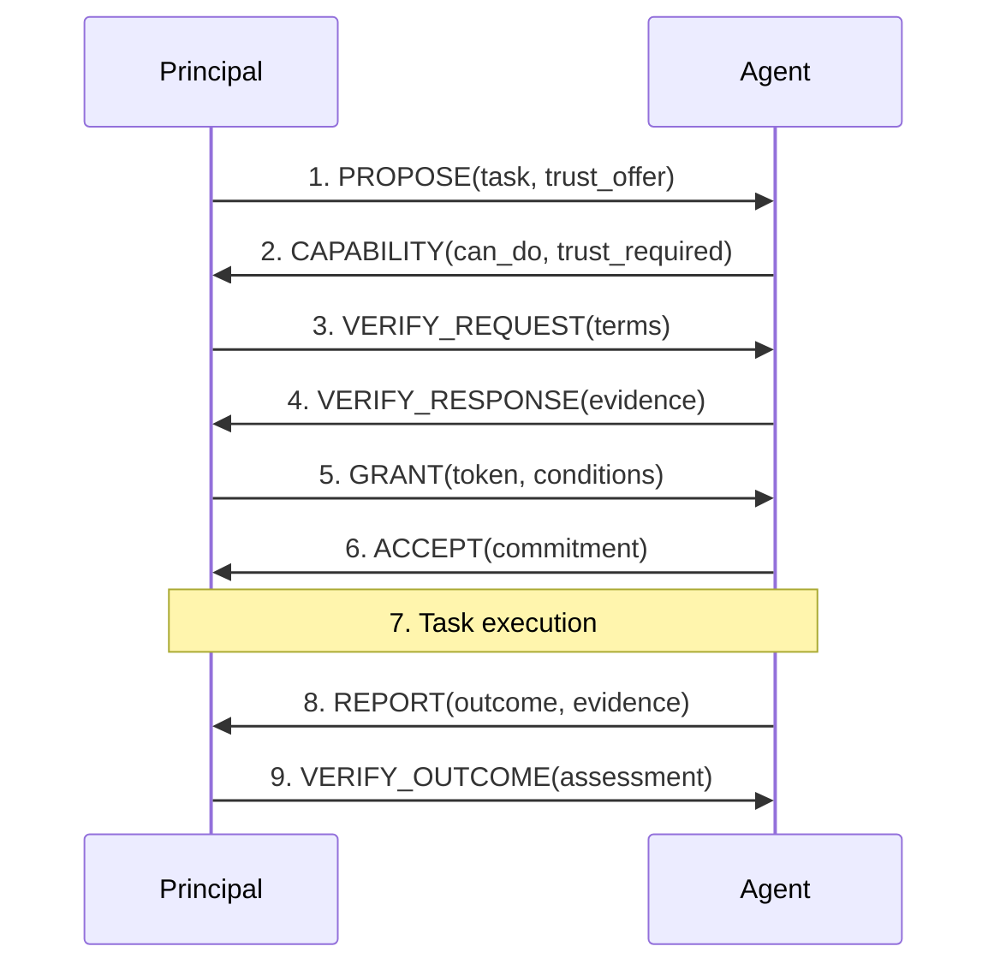

# Delegation Protocols

## Trust Handshake Protocol



Before delegation, principal and agent execute handshake:

```
Protocol TrustHandshake:

    1. Principal → Agent: PROPOSE(task_spec, trust_offer)
       // "Here's the task, here's the trust I'm offering"

    2. Agent → Principal: CAPABILITY(can_do, trust_required)
       // "I can do this, I need this much trust"

    3. Principal → Agent: VERIFY_REQUEST(verification_terms)
       // "Prove you can be trusted with X"

    4. Agent → Principal: VERIFY_RESPONSE(evidence)
       // "Here's my evidence of trustworthiness"

    5. Principal → Agent: GRANT(trust_token, conditions)
       // "You're granted trust under these conditions"

    6. Agent → Principal: ACCEPT(commitment)
       // "I accept and commit to conditions"

    7. [Task execution with monitoring]

    8. Agent → Principal: REPORT(outcome, evidence)
       // "Here's what I did and proof"

    9. Principal → Agent: VERIFY_OUTCOME(assessment)
       // "I've verified, trust is updated accordingly"
```

## Trust Token Model

**Trust token**: Unforgeable credential granting specific trust rights.

```
TrustToken {
    issuer: PrincipalId,
    subject: AgentId,
    capabilities: CapabilitySet,
    information: InformationSet,
    conditions: [Condition],
    expires: Timestamp,
    signature: Signature
}
```

**Agent presents token to access resources**:

```
Agent → Resource: ACCESS_REQUEST(token, action)
Resource: VERIFY(token.signature)
Resource: CHECK(action ∈ token.capabilities)
Resource: CHECK(now < token.expires)
Resource: ALLOW or DENY
```

**Token delegation**: Agent might pass token to sub-agent

- Allowed only if token permits delegation
- Sub-agent gets at most agent's capabilities (no escalation)

## Trust Revocation Protocol

```
Protocol TrustRevocation:

    1. Principal detects: trust_violation or context_change

    2. Principal → Agent: REVOKE(trust_token, reason)

    3. Principal → All_Resources: INVALIDATE(token_id)

    4. Resources: Add token to revocation list

    5. Agent: Cease using revoked capabilities

    6. Log: Record revocation event
```

**Revocation challenges**:

- Propagation delay (resources might not get message immediately)
- Cached authorizations (agent might have cached access)
- In-flight operations (what about operations started before revocation?)

**Solutions**:

- Short-lived tokens (frequent refresh required)
- Synchronous revocation (block until confirmed)
- Graceful degradation (allow read but not write after revocation)

## Trust Renewal Protocol

```
Protocol TrustRenewal:

    1. System: CHECK(token.expires - now < renewal_window)

    2. System → Agent: RENEWAL_AVAILABLE(token_id)

    3. Agent → Principal: RENEWAL_REQUEST(token_id, justification)

    4. Principal: EVALUATE(agent_performance, current_need)

    5a. If approved:
        Principal → Agent: RENEWED_TOKEN(new_token)

    5b. If denied:
        Principal → Agent: DENIAL(reason)
        [Token expires as scheduled]
```

## Trust Escalation Protocol

When agent needs more trust than currently granted:

```
Protocol TrustEscalation:

    1. Agent: Encounters task requiring Trust_needed > Trust_granted

    2. Agent → Principal: ESCALATION_REQUEST(task, Trust_needed, justification)

    3. Principal: RISK_ASSESS(Trust_needed - Trust_granted)

    4a. If within bounds:
        Principal → Agent: TEMPORARY_GRANT(additional_trust, duration)

    4b. If requires review:
        Principal → Human: ESCALATION_REVIEW(request)
        Human → Principal: DECISION(approve/deny/modify)
        Principal → Agent: DECISION

    4c. If exceeds policy:
        Principal → Agent: DENIAL(reason)
        Agent: Fall back to lower-trust approach or fail
```

## Trust Types and Taxonomies

### By Source

| Type | Description | Pros | Cons |
|------|-------------|------|------|
| Behavioral | Based on observed behavior | Directly relevant | Can be gamed |
| Structural | Based on capability constraints | Robust to intentions | Capabilities may be unknown |
| Reputational | Based on third-party attestations | Aggregates observations | Can be manipulated |
| Cryptographic | Based on mathematical proofs | Provably correct | Limited scope |
| Social | Based on relationships | Captures soft properties | Subject to bias |

### By Object

- **Trust in capability**: Agent can do the task
- **Trust in intent**: Agent wants to do the task correctly
- **Trust in execution**: Agent will actually do the task correctly
- **Trust in reporting**: Agent will report accurately what it did

:::caution
These are distinct and all must be present: High capability + low intent = dangerous. High intent + low capability = ineffective. High both + low execution = unreliable. High all + low reporting = unmonitorable.
:::

### By Duration

- **Ephemeral trust**: Single use, expires immediately
- **Session trust**: Duration of interaction, then expires
- **Persistent trust**: Continues until revoked
- **Renewable trust**: Expires but can be renewed

:::tip
Default should be ephemeral trust—require explicit grant for longer duration. This prevents privilege creep and forces regular re-evaluation.
:::
