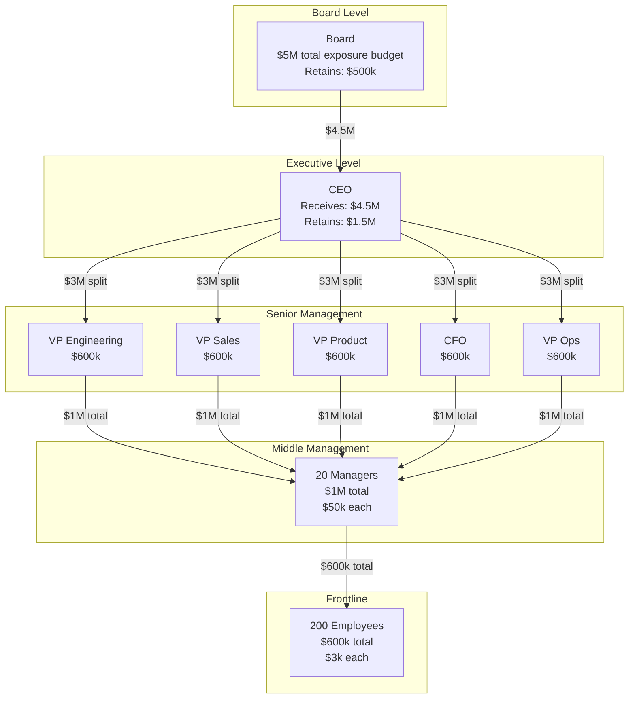
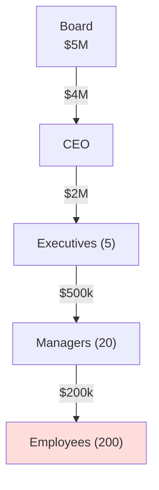
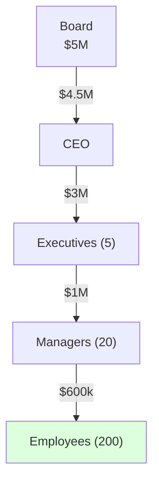
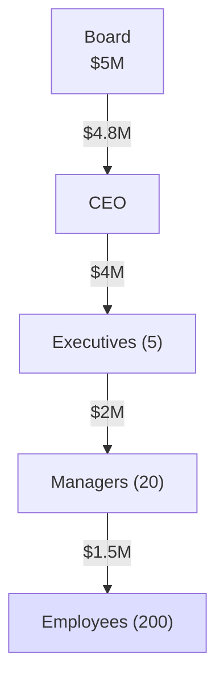

# Exposure Cascade: Hierarchical Risk Budgets

:::note[TL;DR]
**Child Exposure Budget = Parent Budget × Allocation Factor**. Each level in a hierarchy keeps some exposure for direct decisions and delegates the rest downward. Tighter oversight = more retained at top = less risk at edges.
:::

---

## The Setup

Consider a corporation with a standard hierarchy:

- **Board of Directors**: Sets total organizational risk tolerance
- **CEO**: Runs the company day-to-day
- **Executive Suite**: ~5 VPs/C-level executives
- **Managers**: ~20 middle managers
- **Employees**: ~200 frontline workers

The Board decides: "We're willing to accept **$5 million** in total delegation exposure for this organization."

This $5M is the **exposure budget**—the maximum expected harm from all delegation relationships combined. But how does it flow down through the hierarchy?

---

## The Cascade Principle

At each level, the principal (delegator) makes a choice:

1. **Retain** some exposure for direct decisions (things only they can do)
2. **Delegate** the rest to subordinates

```
Exposure_delegated = Exposure_received - Exposure_retained
```

Why retain exposure? Because some decisions are too important to delegate:
- Board retains authority over CEO compensation, major acquisitions
- CEO retains strategic pivots, executive hiring
- Managers retain performance reviews, team conflicts

---

## Visualization: Hierarchical Tree

Here's the standard oversight scenario flowing down:



### Reading the Diagram

- **Board** has $5M total budget, keeps $500k for board-level decisions
- **CEO** receives $4.5M, keeps $1.5M for CEO-level decisions, passes $3M to executives
- **Executives** (5 people) share $3M ($600k each), collectively pass $1M to managers
- **Managers** (20 people) share $1M ($50k each), collectively pass $600k to employees
- **Employees** (200 people) share $600k ($3k each)—this is their individual exposure budget

---

## Visualization: Exposure Flow

Another way to see this—how exposure is **consumed** vs **delegated** at each level:

| Level | People | Receives | Retains (direct) | Delegates | Per-Person |
|-------|--------|----------|------------------|-----------|------------|
| Board | 7 | $5.0M | $500k (10%) | $4.5M | $71k |
| CEO | 1 | $4.5M | $1.5M (33%) | $3.0M | $4.5M |
| Executives | 5 | $3.0M | $2.0M (67%) | $1.0M | $600k |
| Managers | 20 | $1.0M | $400k (40%) | $600k | $50k |
| Employees | 200 | $600k | $600k (100%) | $0 | $3k |

**Key observation**: Higher levels retain more proportionally. The CEO keeps 33% for direct decisions; managers keep 40%. This is because higher-level decisions tend to be more consequential.

```
$5M budget flows as:

Board    ████████████████████████████████████████████████████ $5.0M
         ██▓▓ retained ($500k)

CEO      ██████████████████████████████████████████████ $4.5M
         ███████████████▓▓▓▓▓▓ retained ($1.5M)

Execs    ██████████████████████████████ $3.0M
         ████████████████████▓▓▓▓▓▓▓▓▓▓ retained ($2.0M)

Managers ██████████ $1.0M
         ████▓▓▓▓ retained ($400k)

Employees ██████ $600k
          ██████ all retained (end of chain)
```

---

## Comparing Oversight Scenarios

Different organizations make different choices about how much exposure to retain at each level. Let's compare three styles:

### Scenario A: Tight Oversight (Conservative)

A risk-averse organization where senior leaders retain most exposure:



**Per-employee exposure**: $1,000

**Characteristics**:
- Heavy verification at every level
- Employees have minimal authority
- Slow but safe

### Scenario B: Standard Oversight (Balanced)

The example we've been using:



**Per-employee exposure**: $3,000

**Characteristics**:
- Balanced delegation and oversight
- Employees can make meaningful decisions
- Standard corporate structure

### Scenario C: Loose Oversight (High Delegation)

A flat, fast-moving organization:



**Per-employee exposure**: $7,500

**Characteristics**:
- Minimal verification overhead
- Employees empowered to act
- Fast but risky

---

## Comparison Table

| Scenario | Board | CEO | Execs | Managers | Employees | Per-Employee |
|----------|-------|-----|-------|----------|-----------|--------------|
| **Tight** | $5M | $4M | $2M | $500k | $200k | **$1,000** |
| **Standard** | $5M | $4.5M | $3M | $1M | $600k | **$3,000** |
| **Loose** | $5M | $4.8M | $4M | $2M | $1.5M | **$7,500** |

### What the Numbers Mean

**Per-employee exposure** is a key metric. It represents the expected harm budget for an individual frontline worker's decisions.

- **$1,000/person** (tight): Employees need approval for almost everything. Good for nuclear plants, bad for startups.
- **$3,000/person** (standard): Employees can handle routine decisions autonomously. Most organizations.
- **$7,500/person** (loose): Employees are trusted to make significant judgment calls. Tech companies, professional services.

---

## The Retention Decision

How much should each level retain? It depends on:

### 1. Consequence Magnitude
Higher levels make bigger decisions, so they need bigger exposure budgets for direct action.

| Level | Typical Decisions | Consequence Range |
|-------|-------------------|-------------------|
| Board | M&A, CEO selection | $10M - $1B |
| CEO | Strategy, reorgs | $1M - $100M |
| Executives | Department direction | $100k - $10M |
| Managers | Team operations | $10k - $500k |
| Employees | Daily tasks | $100 - $50k |

### 2. Verification Overhead
Each delegation relationship has overhead—time spent checking work. More retention = less overhead but less scale.

```
Effective capacity = Raw capacity - Verification overhead
```

### 3. Trust Level
Lower trust = retain more. If you don't trust your executives, keep more exposure at CEO level.

---

## Key Insights

:::tip[Key Insights]
1. **Exposure cascades multiplicatively**: Each level passes a fraction down, so the bottom gets the product of all fractions
2. **Per-person exposure shrinks at scale**: 200 employees sharing $600k = $3k each, while 1 CEO gets $4.5M
3. **Retention reflects control**: High retention = tight control, low retention = high delegation
4. **The total is conserved**: All exposure either gets retained or delegated—it doesn't disappear
5. **Structure determines risk**: Same people, different cascade = different risk profile
:::

---

## Worked Example: Adjusting the Cascade

Your company has been running with **Standard** oversight, but after a compliance incident, the board wants to tighten up.

**Current state** (Standard):
- Per-employee exposure: $3,000
- Total employee exposure: $600k
- Incidents last year: 3 (expected ~2 at this risk level)

**Proposed change**: Move to **Tight** oversight
- Per-employee exposure: $1,000 (67% reduction)
- Total employee exposure: $200k

**How to implement**:
1. Managers retain more (increase approval thresholds)
2. Executives take on decisions previously delegated to managers
3. CEO handles exceptions that executives used to approve

**Trade-off**:
- Risk reduction: 67%
- Velocity reduction: ~40% (more approvals = slower execution)
- Is this trade-off worth it? Depends on the cost of the compliance incident vs. the cost of slower execution.

---

## See Also

- [Delegation Accounting](/delegation-risk/delegation-accounting/) — Balance sheet view for individual delegations
- [Trust in Organizations](/case-studies/human-systems/organizational-trust/) — Detailed case studies with specific roles
- [Risk Inheritance](/research/theory/trust-propagation/) — The math of how trust flows through networks
- [Risk Budgeting Overview](/cross-domain-methods/overview/) — Cross-domain methods for allocating risk budgets
