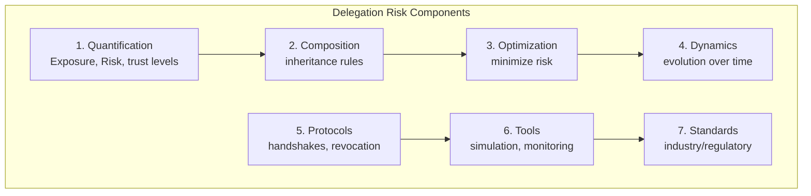
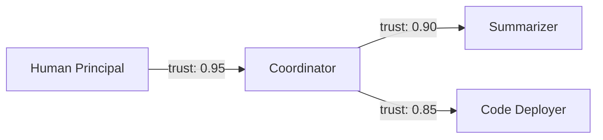
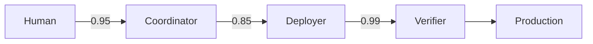

# Delegation Risk: Overview

:::note[TL;DR]
**Delegation Risk = Σ P(harm mode) × Damage(harm mode)** — the core formula for quantifying delegation. This page walks through a complete example: a research assistant with $1,770/month total Delegation Risk, reduced to $671/month by adding a deterministic verifier. Risk inherits multiplicatively by default through delegation chains.
:::

A mature delegation risk framework could provide mathematical and operational foundations for managing AI systems more safely at scale.

## Vision

A complete delegation risk framework would provide:



**1. Quantification**: Every delegation has a delegation exposure (set of harm modes) and delegation risk (expected cost)

**2. Composition**: Rules for combining risks through delegation chains (multiplication, minimum, etc.)

**3. Optimization**: Algorithms for minimizing delegation risk given constraints

**4. Dynamics**: Models for how trust and risk evolve over time

**5. Protocols**: Standard procedures for delegation handshakes, revocation, etc.

**6. Tools**: Software for risk analysis, simulation, monitoring

**7. Standards**: Industry/regulatory standards for risk levels and verification

## Why Delegation Risk Matters

**1. AI systems are becoming more capable**: Higher capabilities = larger delegation exposure.

**2. AI systems are becoming more autonomous**: Less human oversight = risk management must be structural.

**3. AI systems are being deployed in high-stakes domains**: Healthcare, finance, infrastructure = harm mode realization is catastrophic.

**4. AI systems are becoming more interconnected**: Agent-to-agent delegation = risk inheritance matters.

**5. We're building systems we don't fully understand**: Unknown capabilities = unknown harm modes.

:::note
The delegation risk framework isn't just academic—it's infrastructure for safely deploying AI at scale. Without principled risk management, we're flying blind. With it, we have at least a chance of keeping AI systems within acceptable risk bounds as they become more powerful.
:::

## Core Concepts

### Delegation Exposure

**Delegation Exposure** is the complete set of possible harms (harm modes) from delegating a task. It's not a single number—it's a collection, like an attack surface or failure envelope.

### Delegation Risk

**Delegation Risk = Σ P(harm mode) × Damage(harm mode)**

For each component, sum over all harm modes: probability times damage. This gives a single number representing "what is the expected cost of delegating to this component?"

## Worked Example: Research Assistant Delegation Risk

Consider a decomposed research assistant with three components:



### Step 1: Identify Harm Modes and Damages

**Summarizer Delegation Exposure:**
| Harm Mode | Probability | Damage | Risk Contribution |
|-----------|-------------|--------|-------------------|
| Misrepresents paper findings | 0.02 | $5,000 (wrong research direction) | $100 |
| Leaks proprietary data | 0.001 | $50,000 (IP loss) | $50 |

**Delegation Risk (Summarizer)** = $100 + $50 = **$150**

**Code Deployer Delegation Exposure:**
| Harm Mode | Probability | Damage | Risk Contribution |
|-----------|-------------|--------|-------------------|
| Deploys buggy code | 0.05 | $20,000 (downtime) | $1,000 |
| Deploys malicious code | 0.0001 | $1,000,000 (breach) | $100 |

**Delegation Risk (Code Deployer)** = $1,000 + $100 = **$1,100**

**Coordinator Delegation Exposure:**
| Harm Mode | Probability | Damage | Risk Contribution |
|-----------|-------------|--------|-------------------|
| Misroutes task | 0.01 | $2,000 (wasted effort) | $20 |
| Grants excessive permissions | 0.005 | $100,000 (escalation) | $500 |

**Delegation Risk (Coordinator)** = $20 + $500 = **$520**

**System Total Delegation Risk: $1,770**

### Step 2: Risk Inheritance

What risk does the Human inherit from the Code Deployer through the delegation chain?

Using multiplicative rule:
```
Risk_inheritance(Human → Deployer) = Trust(H→C) × Trust(C→D)
                                   = 0.95 × 0.85
                                   = 0.8075
```

This means ~19% of potential damage from the Code Deployer's harm modes propagates back to the Human as risk they're accepting.

### Step 3: Risk Budget Allocation

Suppose the organization's total acceptable Delegation Risk Budget is **$2,000/month**.

Current allocation:
- Summarizer: $150 (7.5% of budget)
- Code Deployer: $1,100 (55% of budget) ⚠️
- Coordinator: $520 (26% of budget)

**Finding:** Code Deployer consumes most of the risk budget. Options:
1. Add verification layer before deployment (reduce harm mode probability)
2. Reduce deployer's permissions (reduce harm mode damage)
3. Replace with human-in-the-loop (shift delegation exposure to human)

### Step 4: After Mitigation

Add a deployment verifier (deterministic code, formally verified):



| Harm Mode | Probability | Damage | New Risk Contribution |
|-----------|-------------|--------|-----------------------|
| Deploys malicious code | 0.0001 × 0.01 | $1,000,000 | **$1** |

Verifier catches 99% of malicious deployments. New system Delegation Risk: **$671**.

:::tip[Key Insight]
Adding a simple deterministic verifier reduced system Delegation Risk by 62%. The highest-leverage safety investment is often the cheapest: a code-based checker on the highest-damage harm modes.
:::

### Comparison to Nuclear Safety

Nuclear plants target ~10⁻⁶ core damage frequency per reactor-year. For a $10B damage potential:
- Target Delegation Risk = 10⁻⁶ × $10B = **$10,000/year**

Our research assistant's $671/month ≈ $8,000/year is roughly comparable—which suggests either:
1. We're being appropriately cautious, or
2. Nuclear plants manage much higher absolute stakes with similar relative risk

This kind of cross-domain comparison helps calibrate whether AI safety investments are proportionate.

## Key Topics

- [Risk Decomposition](/delegation-risk/risk-decomposition/) - Accidents vs. defection: two types of harm
- [Risk Inheritance](/research/theory/trust-propagation/) - How risk flows through delegation networks
- [Delegation Interfaces & Contracts](/research/theory/trust-interfaces/) - Formalizing delegation relationships
- [Risk Optimization](/research/theory/trust-optimization/) - Minimizing delegation risk subject to capability
- [Risk Dynamics](/research/theory/trust-dynamics/) - How trust and risk evolve over time
- [Risk Accounting](/research/theory/trust-accounting/) - Ledgers, auditing, and KPIs
- [Delegation Protocols](/research/theory/trust-protocols/) - Handshakes, tokens, and revocation
- [Risk Economics](/research/theory/trust-economics/) - Insurance, arbitrage, and incentives
- [Delegation at Scale](/research/theory/trust-at-scale/) - Distributed systems and bottlenecks
- [Human-AI Delegation](/research/theory/human-ai-trust/) - Team dynamics and calibration

### Applications
- [Power Struggles](/case-studies/anomaly-chronicles/power-struggles/) - Board vs CEO, dictator vs military, regulatory capture
- [Delegation Accounting](/delegation-risk/delegation-accounting/) - Balance sheet view of delegation

## The Goal

:::tip[The Goal]
The goal isn't zero delegation—that would mean zero AI benefit. The goal is _calibrated_ delegation: knowing how much risk we're accepting, from which components, for what purposes, and what we're getting in return.
:::

---

## What's Next?

**To dive deeper into specific topics**:
- [Risk Inheritance](/research/theory/trust-propagation/) — Algorithms for computing how risk flows through delegation networks
- [Risk Dynamics](/research/theory/trust-dynamics/) — How trust evolves, decays, and rebuilds over time

**To see delegation risk applied**:
- [Principles to Practice](/design-patterns/principles-to-practice/) — Delegation Risk calculations for real examples
- [Risk Budgeting Overview](/cross-domain-methods/overview/) — Cross-domain methods for allocating risk budgets

**To understand the foundations**:
- [Background Research](/research/) — Deep dives into nuclear, aerospace, and financial risk methods

**To start implementing**:
- [Quick Start](/design-patterns/tools/quick-start/) — Step-by-step application checklist
- [Decision Guide](/design-patterns/tools/decision-guide/) — Choosing implementations based on risk budget

---

## Further Reading

### Foundational Concepts
- [Coherent Risk Measures](https://en.wikipedia.org/wiki/Coherent_risk_measure) — Mathematical foundations for risk quantification (Wikipedia)
- [Expected Shortfall](https://en.wikipedia.org/wiki/Expected_shortfall) — Why CVaR is preferred to VaR for tail risk (Wikipedia)
- [Kelly Criterion](https://en.wikipedia.org/wiki/Kelly_criterion) — Optimal bet sizing under uncertainty (Wikipedia)

### Academic Papers
- Artzner, P., et al. (1999). *Coherent Measures of Risk*. Mathematical Finance. — Axiomatic foundations
- Tasche, D. (2008). *Capital Allocation to Business Units: the Euler Principle*. [arXiv](https://arxiv.org/abs/0708.2542) — Risk decomposition
- Fritz, T. (2020). *A Synthetic Approach to Markov Kernels*. [arXiv](https://arxiv.org/abs/1908.07021) — Compositional probability

### Related Domains
- [Social Choice Theory](https://en.wikipedia.org/wiki/Social_choice_theory) — How to aggregate individual preferences into collective decisions
- [Principal-Agent Problem](https://en.wikipedia.org/wiki/Principal%E2%80%93agent_problem) — Information asymmetry in delegation relationships
- [Probabilistic Risk Assessment](https://www.nrc.gov/about-nrc/regulatory/risk-informed/pra.html) — NRC's approach to nuclear safety

See the [full bibliography](/reference/bibliography/) for comprehensive references.
