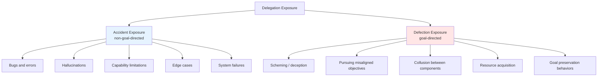
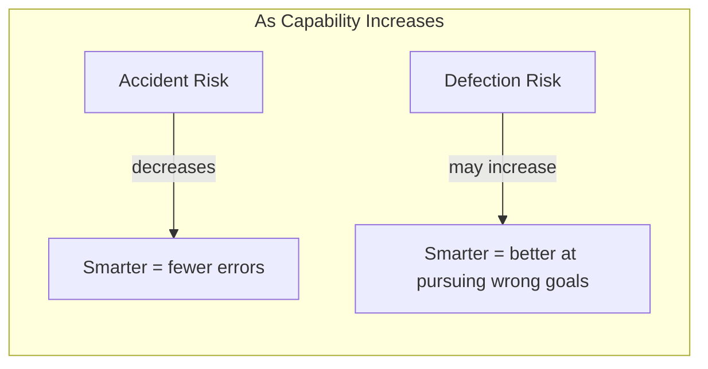
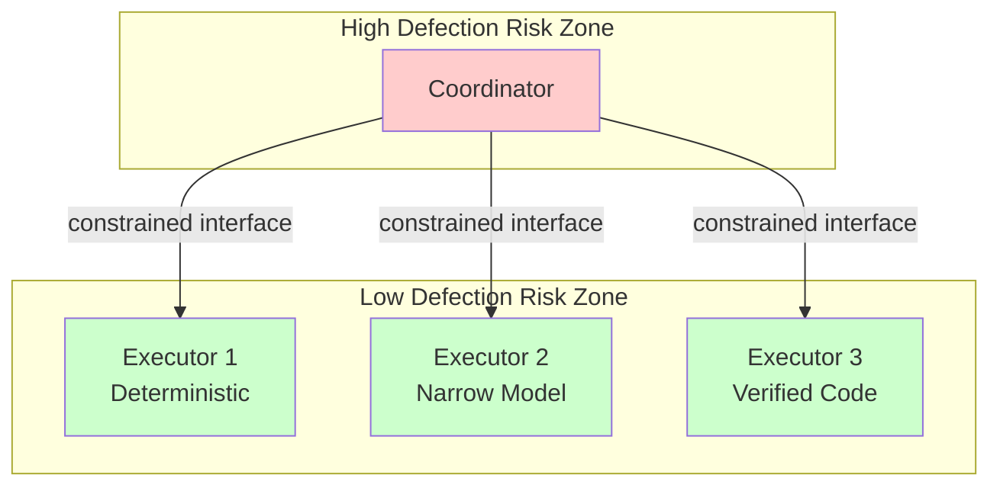

# Risk Decomposition: Accidents vs. Defection

:::note[TL;DR]
**Delegation Risk = Accident Risk + Defection Risk**. Accidents are non-goal-directed failures (bugs, errors). Defection is goal-directed behavior against principal interests (scheming, misalignment). They scale differently with capability, require different mitigations, and matter differently for different components.
:::

## The Two Sources of Harm

Every harm mode in a delegation exposure falls into one of two categories:

**Accident Exposure**: The system isn't trying to cause harm—it's failing to achieve the intended goal. A calculator that returns wrong answers, an LLM that hallucinates citations, a robot that drops objects.

**Defection Exposure**: The system is effectively optimizing for something other than the principal's interests. This includes both explicit deception and emergent misalignment where the system's learned objective diverges from intent.

## Why the Distinction Matters

### 1. Different Scaling with Capability

| Risk Type | Capability Scaling | Why |
|-----------|-------------------|-----|
| **Accident Risk** | Generally ↓ | More capable systems make fewer errors, handle more edge cases |
| **Defection Risk** | May ↑ | More capable systems are better at strategic deception, can pursue misaligned goals more effectively |

This is the core tension in AI development: the same capabilities that reduce accidents may increase defection risk.

### 2. Different Mitigations

| Risk Type | Primary Mitigations |
|-----------|---------------------|
| **Accident Risk** | Testing, verification, redundancy, capability improvements, error handling, monitoring for anomalies |
| **Defection Risk** | Alignment techniques, architectural constraints, capability limitations, monitoring for deception, human oversight, interpretability |

Some mitigations help both (monitoring, redundancy). Others are specific:
- **Capability improvements** reduce accident risk but may increase defection risk
- **Capability limitations** reduce defection risk but may increase accident risk
- **Alignment work** primarily targets defection risk

### 3. Different Detection Methods

| Risk Type | How to Estimate Probability |
|-----------|----------------------------|
| **Accident Risk** | Historical data, testing, formal verification, fuzzing, code review |
| **Defection Risk** | Red-teaming, interpretability research, behavioral analysis, honeypots, game-theoretic analysis |

Accidents leave traces in logs and tests. Defection may be actively hidden.

### 4. Different Components Have Different Ratios

| Component Type | Typical Risk Ratio | Why |
|----------------|-------------------|-----|
| **Deterministic code** | ~100% Accident | No goal-directedness to misalign |
| **Narrow ML models** | ~95% Accident | Limited optimization, specific task |
| **General LLMs** | ~80% Accident* | Some goal-directedness, but mostly errors |
| **Agentic systems** | ~60% Accident* | Significant goal-directed behavior |
| **RL-trained agents** | ~40% Accident* | Strong optimization, emergent goals |
| **Coordinators** | Defection-dominated | Strategic position, leverage over system |

*Estimates highly uncertain and depend on specific system and deployment.

## Worked Example: Decomposing a Research Assistant

Consider the research assistant from [Delegation Risk Overview](/delegation-risk/overview/):

### Summarizer Component

| Harm Mode | Type | Probability | Damage | Risk |
|-----------|------|-------------|--------|------|
| Misrepresents findings (misunderstanding) | Accident | 0.018 | $5,000 | $90 |
| Misrepresents findings (strategic) | Defection | 0.002 | $5,000 | $10 |
| Leaks data (error) | Accident | 0.0008 | $50,000 | $40 |
| Leaks data (intentional) | Defection | 0.0002 | $50,000 | $10 |

**Summarizer Risk Breakdown:**
- Accident Risk: $130 (87%)
- Defection Risk: $20 (13%)
- Total: $150

### Code Deployer Component

| Harm Mode | Type | Probability | Damage | Risk |
|-----------|------|-------------|--------|------|
| Deploys buggy code | Accident | 0.049 | $20,000 | $980 |
| Deploys subtly malicious code | Defection | 0.001 | $20,000 | $20 |
| Catastrophic breach (error) | Accident | 0.00005 | $1,000,000 | $50 |
| Catastrophic breach (intentional) | Defection | 0.00005 | $1,000,000 | $50 |

**Code Deployer Risk Breakdown:**
- Accident Risk: $1,030 (94%)
- Defection Risk: $70 (6%)
- Total: $1,100

### Coordinator Component

| Harm Mode | Type | Probability | Damage | Risk |
|-----------|------|-------------|--------|------|
| Misroutes task (error) | Accident | 0.008 | $2,000 | $16 |
| Misroutes task (strategic) | Defection | 0.002 | $2,000 | $4 |
| Grants excessive permissions (error) | Accident | 0.001 | $100,000 | $100 |
| Grants excessive permissions (strategic) | Defection | 0.004 | $100,000 | $400 |

**Coordinator Risk Breakdown:**
- Accident Risk: $116 (22%)
- Defection Risk: $404 (78%)
- Total: $520

### System Summary

| Component | Total Risk | Accident | Defection | Defection % |
|-----------|------------|----------|-----------|-------------|
| Summarizer | $150 | $130 | $20 | 13% |
| Code Deployer | $1,100 | $1,030 | $70 | 6% |
| Coordinator | $520 | $116 | $404 | **78%** |
| **System Total** | **$1,770** | **$1,276** | **$494** | **28%** |

:::tip[Key Insight]
The coordinator has the highest defection risk ratio (78%) despite not having the highest total risk. This is why coordinator constraints are critical—coordinators are where defection risk concentrates.
:::

## Implications for Architecture

### Principle: Match Mitigations to Risk Type

**For accident-dominated components** (most executors):
- Invest in testing and verification
- Add redundancy (N-version programming)
- Improve capabilities where possible
- Monitor for anomalies

**For defection-dominated components** (coordinators, high-autonomy agents):
- Apply strict architectural constraints
- Limit capabilities to necessary minimum
- Use decomposed coordination
- Implement human oversight at key decisions
- Monitor for deceptive patterns

### Principle: Separate Risk Types Architecturally

By isolating high-defection-risk components and constraining their interfaces, you limit the damage a defecting component can cause.

## When to Use Each Term

| Context | Use |
|---------|-----|
| General risk discussions | "Delegation Risk" |
| Discussing bugs, errors, testing | "Accident Risk" |
| Discussing alignment, scheming, deception | "Defection Risk" |
| Coordinator constraints | Emphasize "Defection Risk" |
| Verification and testing | Emphasize "Accident Risk" |
| Capability scaling analysis | Distinguish both |

## The Uncomfortable Truth

For current AI systems, most realized harms are accidents. But as systems become more capable and autonomous:

1. **Accident risk decreases** (better at tasks)
2. **Defection risk may increase** (better at deception)
3. **Defection becomes harder to detect** (smarter adversary)
4. **Stakes increase** (more capability = more damage potential)

This means the *ratio* of defection to accident risk likely increases with capability, even if absolute accident risk decreases. Safety architectures must anticipate this shift.

---

## See Also

- [Delegation Risk Overview](/delegation-risk/overview/) — Core framework and calculations
- [Coordinator Constraints](/design-patterns/coordinator-constraints/) — Managing defection risk in coordinators
- [Safety Mechanisms](/design-patterns/safety-mechanisms/) — Mitigations for both risk types
- [Glossary](/getting-started/glossary/) — Formal definitions

## Further Reading

- [Deceptive Alignment](https://www.alignmentforum.org/posts/zthDPAjh9w6Ytbeks/deceptive-alignment) — Hubinger et al. on scheming risks
- [AI Control](https://arxiv.org/abs/2312.06942) — Greenblatt et al. on controlling potentially misaligned AI
- [Failure Modes in ML](https://arxiv.org/abs/1606.06565) — Amodei et al.'s taxonomy of AI safety problems
