# A Walk-Through: The $1,000 Delivery

:::note[TL;DR]
This walk-through builds up delegation risk concepts step by step using a simple scenario: transporting $1,000. We start with basic exposure calculation, add risk-reduction measures, introduce an overseer, and show how visibility into delegation risk changes incentives.
:::

This page walks through delegation risk concepts progressively, using a concrete example that grows in complexity.

---

## Part 1: The Simplest Delegation

### Setup

**Alice** (the Delegator) needs $1,000 transported across town. She gives the cash to **Bob** (the Delegate) to deliver it.


### What Is the Delegation Exposure?

The moment Alice hands Bob the $1,000, she has created a **Delegation Exposure**—the set of possible harms from this delegation.

**Bob's Delegation Exposure (Alice's perspective):**

| Harm Mode | Description |
|-----------|-------------|
| Loss | Bob loses the money |
| Theft | Bob steals the money |
| Delay | Bob delivers late, causing problems |
| Partial | Bob delivers only part of the amount |

This is NOT a number—it's the *surface area* of what can go wrong.

### What Is the Delegation Risk?

**Delegation Risk** converts the exposure into a single expected-cost number:

```
Delegation Risk = Σ P(harm mode) × Damage(harm mode)
```

Let's estimate for Bob:

| Harm Mode | Probability | Damage | Risk Contribution |
|-----------|-------------|--------|-------------------|
| Loss (accident) | 2% | $1,000 | $20 |
| Theft | 1% | $1,000 | $10 |
| Delay (causes missed deal) | 5% | $200 | $10 |
| Partial delivery | 0.5% | $500 | $2.50 |

**Total Delegation Risk = $42.50**

:::tip[Interpretation]
Alice's delegation to Bob carries an expected cost of $42.50. This is the "price" of trusting Bob with this task, expressed as expected harm.
:::

### Exposure Lifecycle

Delegation exposure has a **lifecycle**:

```mermaid
timeline
    title Exposure Lifecycle
    section OPENED
        Alice hands Bob $1,000 : Exposure begins
    section ACTIVE
        Bob has the money : Exposure is LIVE
        : Risk: $42.50/delivery × duration
    section CLOSED
        Recipient confirms delivery : Exposure ends
```



**Key insight**: Exposure exists *in time*. If Bob takes 2 hours to deliver, Alice has $42.50 of risk exposure for 2 hours. If he takes 20 minutes, the exposure window is much shorter.

### Closing the Exposure

The exposure closes when:

1. **Success**: Recipient confirms delivery → exposure closes with no harm realized
2. **Failure**: A harm mode occurs → exposure closes with harm realized
3. **Cancellation**: Alice retrieves the money → exposure closes with no task completed

```mermaid
flowchart LR
    Alice["Alice"] -->|"$1k"| Bob["Bob"]
    Bob -->|"$1k"| Recipient["Recipient"]
    Recipient -->|"✓ Confirmed"| Success["Exposure Closed<br/>Realized Harm: $0"]

    style Success fill:#90EE90
```



In this case: **Delegation Risk: $42.50 → Realized Harm: $0**

---

## Part 2: Reducing Exposure

Alice realizes $42.50 per delivery adds up. She designs **risk reduction measures**.

### Measure 1: Escrow Lock

Instead of handing Bob cash, Alice uses a locked bag that only the recipient can open.

```mermaid
flowchart LR
    Alice["Alice"] -->|"🔒 Locked Bag"| Bob["Bob"]
    Bob -->|"🔒 Delivers"| Recipient["Recipient<br/>(has key)"]

    style Bob fill:#ffffcc
```



*Only the recipient can unlock the bag—Bob transports but cannot access the contents.*

**Effect on harm modes:**

| Harm Mode | Old P | New P | Why |
|-----------|-------|-------|-----|
| Theft | 1% | 0.1% | Bob can't access the cash |
| Partial delivery | 0.5% | 0% | All-or-nothing lock |

**New Delegation Risk:**

| Harm Mode | Probability | Damage | Risk Contribution |
|-----------|-------------|--------|-------------------|
| Loss | 2% | $1,000 | $20 |
| Theft | 0.1% | $1,000 | $1 |
| Delay | 5% | $200 | $10 |
| Partial delivery | 0% | $500 | $0 |

**New Total: $31** (reduced from $42.50)

### Measure 2: GPS Tracking

Alice adds GPS to the locked bag, with geofence alerts.

```mermaid
flowchart LR
    Alice["Alice"] -->|"🔒📍 Tracked Bag"| Bob["Bob"]
    Bob -.->|"📍 GPS"| Alice

    style Bob fill:#ffffcc
```



*Alice monitors Bob's location in real-time and can intervene if the bag goes off-route.*

**Effect:**

| Harm Mode | Old P | New P | Why |
|-----------|-------|-------|-----|
| Loss | 2% | 0.5% | Alice can intervene if off-route |
| Theft | 0.1% | 0.05% | Theft attempts are visible |

**New Total: $16.50**

### Measure 3: Bonded Courier

Alice requires Bob to post a $1,000 bond that he forfeits if delivery fails.

**Effect:**

| Harm Mode | Old P | New P | Why |
|-----------|-------|-------|-----|
| All intentional harms | varies | ~0% | Bob's incentives now aligned |

**New Total: $5.25** (only accidental losses remain)

### Summary of Risk Reduction

Each measure targets specific harm modes, progressively reducing total delegation risk:


:::note[Cost-Benefit]
Each measure has a cost. Locks cost money. GPS requires infrastructure. Bonds require Bob to have capital. The optimal setup balances risk reduction against implementation cost.
:::

---

## Part 3: Enter the Overseer

Now we introduce **Carol** (the Overseer)—a third party who monitors all delegations in the organization.

```mermaid
graph TB
    subgraph Oversight["🔭 Oversight"]
        Carol["Carol (Overseer)"]
    end

    subgraph Delegators["📋 Delegators"]
        Alice["Alice"]
        Dave["Dave"]
        Eve["Eve"]
    end

    subgraph Delegates["🚚 Delegates"]
        Bob["Bob"]
        Frank["Frank"]
        Grace["Grace"]
    end

    Carol --> Alice
    Carol --> Dave
    Carol --> Eve

    Alice --> Bob
    Dave --> Frank
    Eve --> Grace
```



### What Carol Sees

Carol maintains a **Delegation Risk Dashboard**:

**Active Delegations**

| Delegator | Delegate | Amount | Risk | Duration |
|-----------|----------|--------|------|----------|
| Alice | Bob | $1,000 | $16.50 | 0:45 active |
| Dave | Frank | $5,000 | $180.00 | 2:15 active |
| Eve | Grace | $500 | $8.25 | 0:12 active |

- **Total Active Exposure:** $6,500
- **Total Active Delegation Risk:** $204.75

:::caution[Alert]
Dave→Frank exposure exceeds 2hr guideline
:::

### Carol's Analysis

Carol can compute several useful metrics:

**1. Risk-Weighted Exposure Time**

For each delegation:
```
Risk-Weighted Exposure = Delegation Risk × Duration (hours)
```

| Delegation | Risk | Duration | Risk-Weighted |
|------------|------|----------|---------------|
| Alice→Bob | $16.50 | 0.75 hr | $12.38 |
| Dave→Frank | $180 | 2.25 hr | $405.00 |
| Eve→Grace | $8.25 | 0.2 hr | $1.65 |

**Finding**: Dave→Frank is 97% of the organization's risk-weighted exposure!

**2. Delegate Risk Profiles**

Carol tracks historical performance:

**Bob** (30 deliveries)
- Success rate: 97%
- Average duration: 42 min
- Incidents: 1 minor delay
- Estimated Delegation Risk: **$12.00/delivery** (↓ from $16.50)

**Frank** (15 deliveries)
- Success rate: 87%
- Average duration: 2.1 hr
- Incidents: 2 losses ($800 total)
- Estimated Delegation Risk: **$220.00/delivery** (↑ from $180)

**3. Organizational Risk Budget**

Carol sets limits:

```
Total Delegation Risk Budget: $500/day
Current Usage: $204.75 (41% of budget)
```

If Dave wants to delegate another $10,000 to Frank, Carol's system would flag:
- Frank's estimated risk: $440
- Would push total to $644.75 (129% of budget)
- **BLOCKED** until Frank's risk profile improves or measures are added

---

## Part 4: Bob Sees the Numbers

Now we make the delegation risk visible to **Bob** (the Delegate).

#### Bob's Risk Profile

| Metric | Value |
|--------|-------|
| **Delegation Risk** | $12.00/delivery |
| **Rank** | 3rd best of 12 delegates |
| **Trend** | ↓ 27% (improving!) |

#### What Affects Bob's Risk Score

| Factor | Score | Rating |
|--------|-------|--------|
| Delivery Time | 42 min avg | Good |
| Success Rate | 97% | Excellent |
| Route Compliance | 98% | Excellent |
| Incident History | 1 minor | Good |

#### Opportunities to Reduce Risk Score

- Reduce avg delivery time to <30 min: **-$2.00 risk**
- Complete certification course: **-$1.50 risk**
- 10 more clean deliveries: **-$1.00 risk**

### Why Bob Cares

Bob now has incentives to reduce his delegation risk score:

**1. More Assignments**

```
Alice's decision:
  - Need to send $5,000
  - Bob's risk: $12/delivery → $60 for this amount
  - Frank's risk: $220/delivery → $1,100 for this amount

Alice chooses Bob. Bob gets more work.
```

**2. Higher Value Assignments**

Carol's rules:
```
Delegation limits by Delegate risk score:
  - Risk < $15: Can handle up to $10,000
  - Risk $15-50: Can handle up to $2,000
  - Risk > $50: Can handle up to $500 only
```

Lower risk score = access to larger deliveries = more fees.

**3. Faster Exposure Closure**

Bob realizes: *exposure × time* is the real cost to the organization.

```
Two deliveries of $1,000:

Bob (42 min avg):
  Exposure time: 0.7 hr
  Risk-weighted: $12 × 0.7 = $8.40

Frank (2.1 hr avg):
  Exposure time: 2.1 hr
  Risk-weighted: $220 × 2.1 = $462.00
```

Bob's deliveries impose 55× less risk-weighted exposure than Frank's!

### Bob's Optimization

Bob actively works to minimize his delegation risk:

**1. SPEED** — Take shortest routes, minimize exposure window
- Before: scenic route (longer exposure)
- After: direct route (shorter exposure)

**2. TRANSPARENCY** — Provide real-time updates
- "Package picked up"
- "En route, ETA 15 min"
- "Arrived, awaiting confirmation"
- "Delivered and confirmed"

**3. PROACTIVE RISK REDUCTION** — Request verification measures
- Bob to Alice: *"Can we use the GPS bag? It'll lower my risk score and your exposure."*

---

## Part 5: The Full Picture

With all parties seeing the same delegation risk framework:

```mermaid
graph TB
    subgraph Oversight["🔭 Oversight Layer"]
        Carol["Carol<br/>Sets budgets, monitors, alerts"]
    end

    subgraph Delegators["📋 Delegator Layer"]
        Alice["Alice<br/>Chooses low-risk delegates"]
        Dave["Dave<br/>Improves measures"]
        Eve["Eve<br/>Rewards best performers"]
    end

    subgraph Delegates["🚚 Delegate Layer"]
        Bob["Bob<br/>Optimizes speed"]
        Frank["Frank<br/>Invests in improvement"]
        Grace["Grace<br/>Maintains low risk"]
    end

    Carol --> Alice
    Carol --> Dave
    Carol --> Eve

    Alice --> Bob
    Dave --> Frank
    Eve --> Grace

    style Bob fill:#90EE90
    style Grace fill:#90EE90
    style Frank fill:#ffcccc
```



### Aligned Incentives

The framework creates alignment:

| Party | Wants | Achieves by |
|-------|-------|-------------|
| Carol (Overseer) | Low org-wide risk | Setting budgets, monitoring, intervening |
| Alice (Delegator) | Low exposure on her tasks | Choosing low-risk delegates, adding measures |
| Bob (Delegate) | More/better assignments | Reducing his risk score through performance |

**Everyone benefits from lower delegation risk.**

---

## Summary: Key Concepts

| Concept | Definition | In Our Example |
|---------|------------|----------------|
| **Delegation Exposure** | Set of possible harms from a delegation | {Loss, Theft, Delay, Partial} |
| **Delegation Risk** | Σ P(harm) × Damage(harm) | $42.50 baseline, reduced to $5.25 |
| **Exposure Window** | Time during which exposure is active | Pickup to confirmed delivery |
| **Risk-Weighted Exposure** | Risk × Duration | $12 × 0.7hr = $8.40 |
| **Risk Reduction Measures** | Controls that lower harm probabilities | Lock, GPS, Bond |
| **Delegation Risk Budget** | Org-wide limit on total active risk | $500/day |
| **Delegate Risk Score** | Estimated risk per task for a specific delegate | Bob: $12, Frank: $220 |

---

## Next Steps

- [Delegation Risk Overview](/delegation-risk/overview/) — The full framework and formulas
- [Risk Decomposition](/delegation-risk/risk-decomposition/) — Accidents vs. defection: two types of harm
- [Trust Interfaces](/research/theory/trust-interfaces/) — Formalizing the delegation contract
- [Trust Accounting](/research/theory/trust-accounting/) — Ledgers, dashboards, and auditing
