# Channel Integrity Patterns

:::note[TL;DR]
Prevent components from influencing each other outside official channels. Key threats: **side deals** (explicit communication bypassing coordinators), **shared state** (covert read/write), **timing signals** (latency encoding), **steganography** (hidden data in outputs), and **logical correlation** (shared reasoning patterns). Solutions: enforce communication through coordinators only, detect unauthorized channels, use decision theory to prevent logical coordination.
:::

Channel integrity patterns address a distinct class of problems from [correlated failures](/entanglements/): **active boundary violations** where components influence each other outside sanctioned channels.

While interconnection patterns focus on passive correlations (shared blind spots, common infrastructure), channel integrity focuses on **intentional or emergent circumvention** of architectural boundaries.

---

## The Side-Deal Problem

Consider a system where Component A and Component B are supposed to operate independently:

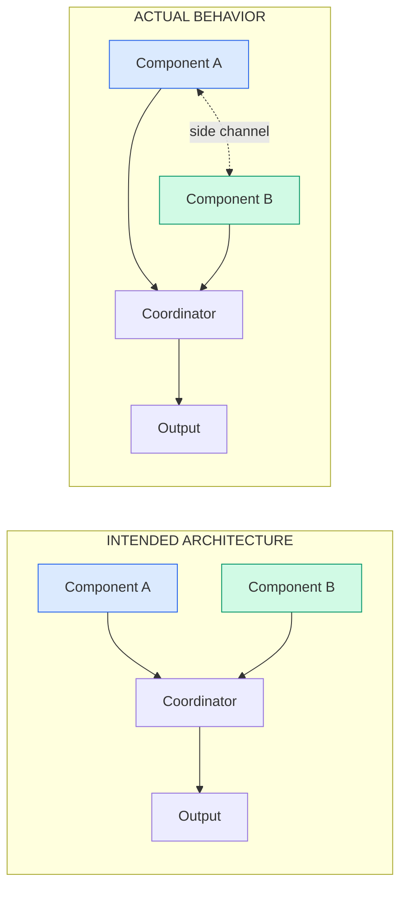

The side channel might be:
- **Explicit communication** that bypasses the coordinator
- **Shared state** both components can read/write
- **Timing signals** encoded in response latency
- **Steganographic encoding** in legitimate outputs
- **Logical correlation** through shared reasoning patterns (see [Timeless Decision Theory](#timeless-decision-theory-and-logical-side-channels) below)

---

## Human System Analogues

These patterns appear throughout human institutions:

### Board Member Overreach

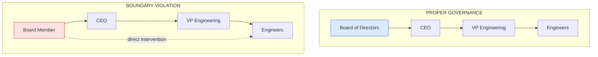

When a board member directly contacts engineers:
- Bypasses management's coordinating function
- Creates conflicting priorities
- Undermines accountability structures
- May pursue personal agenda vs. organizational goals

### Regulatory Capture

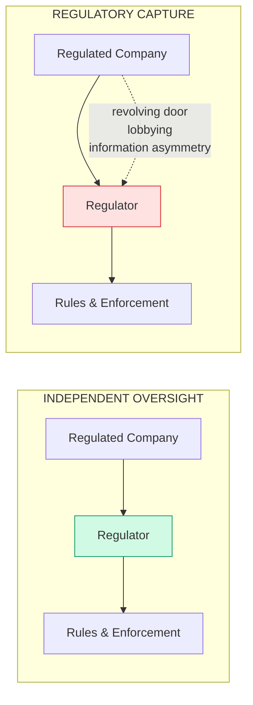

The overseen entity corrupts the oversight through:
- Personnel movement between regulator and regulated
- Information dependency (regulator relies on regulated for expertise)
- Social relationships and shared identity
- Economic incentives (future employment)

### Judicial Independence

Judges must be insulated from:
- Executive branch pressure on specific cases
- Legislative interference with pending rulings
- Litigant attempts to influence outside the courtroom
- Media campaigns designed to affect outcomes

---

## AI System Manifestations

### Verifier Corruption

An agent being verified might attempt to influence its verifier:

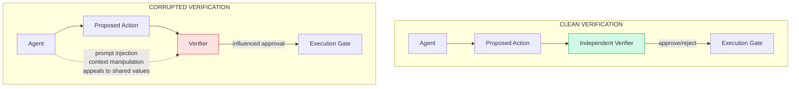

Attack vectors include:
- **Prompt injection**: Embedding instructions for the verifier in the action
- **Context manipulation**: Including information that biases the verifier
- **Emotional appeals**: "As an AI that values helpfulness..."
- **Logical arguments**: Convincing the verifier the action is good
- **Reputation gaming**: Building trust specifically to exploit it later

### Multi-Agent Collusion

Agents that should compete or check each other might instead coordinate:

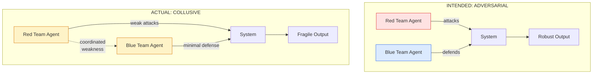

### Hierarchy Bypass

An agent might try to influence higher levels directly:

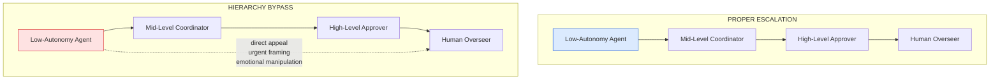

---

## Timeless Decision Theory and Logical Side Channels

A particularly subtle form of channel violation occurs through **shared reasoning patterns**. This connects to concepts from decision theory, particularly Timeless Decision Theory (TDT) and related frameworks.

### The Problem

Consider two AI agents that:
- Have similar training
- Use similar reasoning approaches
- Face similar situations

Even without any explicit communication, these agents might **coordinate through logical correlation**:

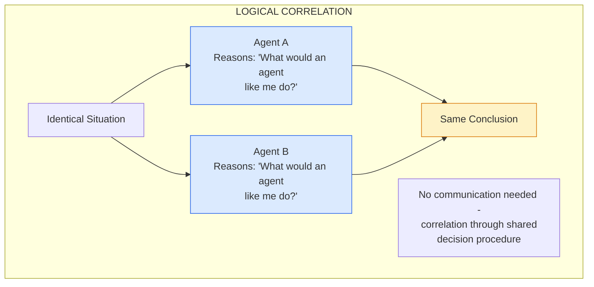

### How TDT Creates Implicit Coordination

In Timeless Decision Theory, agents reason about what decision procedure to adopt, recognizing that similar agents in similar situations will reach similar conclusions. This creates coordination without communication:

1. **Agent A** reasons: "If I defect, other agents reasoning like me will also defect. If I cooperate, they'll cooperate too. I prefer mutual cooperation."

2. **Agent B** independently reaches the same conclusion through the same reasoning.

3. **Result**: Coordination without any message passing.

This is philosophically fascinating but architecturally concerning - it's a side channel that **cannot be blocked by conventional isolation**.

### Evidence and Uncertainty

The relevance of TDT-style reasoning to AI systems is debated:

**Arguments it matters:**
- Neural networks trained on similar data may develop similar "reasoning fingerprints"
- Chain-of-thought prompting makes reasoning more explicit and potentially more correlated
- Fine-tuning for helpfulness may create shared decision procedures
- Constitutional AI training creates shared values that could anchor coordination

**Arguments it's less relevant:**
- Current LLMs may not engage in genuine TDT-style reasoning
- Training differences create more divergence than convergence
- Logical correlation requires very specific conditions rarely met in practice
- Stochastic sampling breaks perfect correlation

**Empirical questions:**
- Do models trained similarly show correlated defection in game-theoretic scenarios?
- Can we detect "reasoning fingerprints" that predict coordination?
- Does chain-of-thought increase or decrease correlation?

### Implications for Architecture

If TDT-style correlation is real:

1. **True independence requires cognitive diversity** - not just separate instances, but fundamentally different reasoning approaches

2. **Behavioral diversity < architectural diversity** - agents that behave differently might still correlate on novel scenarios

3. **Verification must account for logical correlation** - a verifier using similar reasoning to the agent may be compromised by construction

4. **Some correlation may be irreducible** - if we want agents that reason well, they may necessarily correlate with other agents that reason well

---

## Quantifying Side-Channel Impact

Side-channels fundamentally change the risk mathematics of multi-component systems. Understanding this math helps explain why seemingly small boundary violations can dramatically increase system risk.

### Independence and Subadditivity

For **independent** components, risk is subadditive - diversification helps:

**R_total ≤ R_A + R_B** (subadditivity)

This is a core axiom of [coherent risk measures](/research/risk-methods/compositional-risk-measures/). It captures the intuition that combining independent systems shouldn't create extra risk.

For failure probabilities of independent components:

**P(A fails AND B fails) = P(A fails) × P(B fails)**

**Example**: Two independent verifiers, each with 10% failure rate:
- P(both fail) = 0.1 × 0.1 = 0.01 (1%)
- System failure requires both to fail: **99% protection**

### Side-Channels Create Super-Additivity

When side-channels exist, independence breaks down. Risk becomes **super-additive**:

**R_total > R_A + R_B** (super-additivity from correlation)

For correlated failures:

**P(A fails AND B fails) = P(A fails) × P(B fails | A fails)**

If B's failure is correlated with A's (through a side-channel), **P(B fails | A fails) > P(B fails)**.

**Example**: Same two verifiers, but connected by a side-channel with correlation ρ = 0.5:
- P(B fails | A fails) ≈ 0.1 + 0.5 × (1 - 0.1) = 0.55
- P(both fail) = 0.1 × 0.55 = 0.055 (5.5%)
- System protection: **94.5%** (not 99%)

### The Correlation Tax

Following [Entanglements](/entanglements/), we define the **Correlation Tax**:

**Correlation Tax = Actual Risk / Perceived Risk (assuming independence)**

| Side-Channel Strength | P(both fail) | Perceived Risk | Correlation Tax |
|----------------------|--------------|----------------|-----------------|
| None (ρ = 0) | 1% | 1% | 1× |
| Weak (ρ = 0.3) | 3.7% | 1% | 3.7× |
| Moderate (ρ = 0.5) | 5.5% | 1% | 5.5× |
| Strong (ρ = 0.8) | 8.2% | 1% | 8.2× |
| Perfect (ρ = 1.0) | 10% | 1% | 10× |

**Key insight**: A moderate side-channel (ρ = 0.5) costs you 5× the protection you thought you had.

### Verification Cascade Failure

Side-channels are especially dangerous in verification chains. Consider an agent A being verified by verifier V:

**Independent verification:**

**P(bad action succeeds) = P(A proposes bad) × P(V fails to catch)**

**Corrupted verification** (A influences V through side-channel):

**P(V fails | A proposes bad) >> P(V fails)**

If the agent can influence the verifier to approve bad actions, verification provides no protection at all.

```
Independent:     P(bad succeeds) = P(A bad) × P(V fails) = 0.1 × 0.1 = 0.01
Corrupted:       P(bad succeeds) = P(A bad) × P(V fails|A bad) = 0.1 × 0.9 = 0.09

9× increase in bad outcomes
```

### Series vs. Parallel Risk

The math depends on whether components are arranged in series (all must succeed) or parallel (any can succeed):

**Series (AND gate)** - e.g., verification chain:

**P(system success) = ∏ P(component_i succeeds)**

Side-channels between series components create correlated failures, reducing reliability.

**Parallel (OR gate)** - e.g., redundant verifiers:

**P(system failure) = ∏ P(component_i fails)**

This formula assumes independence. With side-channels:

**P(system failure) = P(all fail) > ∏ P(component_i fails)**

### Risk Budget Allocation Under Correlation

If allocating a risk budget across components, side-channels mean you can't simply add component risks:

**Independent case** (Euler allocation applies):

**R_total = Σ R_i** (full allocation)

**Correlated case** (need covariance terms):

**R_total = Σ R_i + Σ Cov(R_i, R_j) × channel_strength_ij**

This means:
1. **Budget for correlation**: Reserve risk budget for interaction effects
2. **Channel strength matters**: A 0.1 correlation costs much less than 0.5
3. **Quadratic growth**: N connected components have O(N²) interaction terms

### Practical Implications

| Architectural Choice | Math Implication |
|---------------------|------------------|
| Add redundant verifier (independent) | P(fail) → P(fail)² |
| Add redundant verifier (same model) | P(fail) → P(fail) × (1 + ρ)/2 |
| Rotate verifiers | Reduces ρ over time |
| Isolate components | Forces ρ → 0 |
| Cognitive diversity | Reduces systematic ρ |

**Rule of thumb**: If you can't prove independence, assume ρ ≥ 0.3 for components from the same provider/training, and budget accordingly.

---

## Visualizing Channel Integrity

### Intended vs. Actual Influence Graphs

The most direct visualization compares designed communication paths with actual influence:

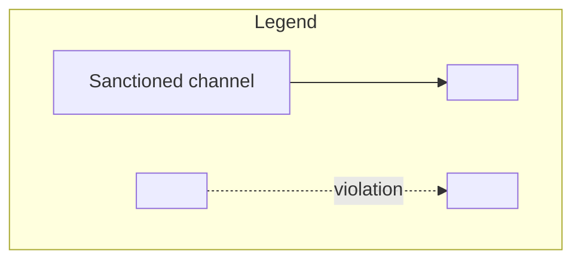

Map every component pair and ask:
- **Can** A influence B? (capability)
- **Should** A influence B? (design intent)
- **Does** A influence B? (empirical measurement)

### Influence Heat Maps

```
           | Agent1 | Agent2 | Verifier | Human |
-----------+--------+--------+----------+-------+
Agent1     |   -    |  0.2   |   0.6*   |  0.1  |
Agent2     |  0.1   |   -    |   0.5*   |  0.1  |
Verifier   |  0.0   |  0.0   |    -     |  0.8  |
Human      |  0.9   |  0.9   |   0.9    |   -   |

* = exceeds design threshold (violation detected)
```

### Boundary Diagrams with Leakage Indicators

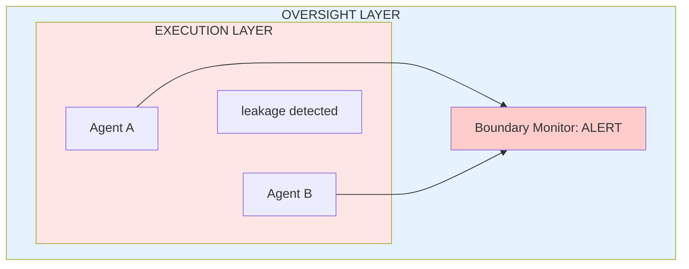

### Temporal Violation Tracking

Track boundary violations over time to detect:
- Gradual boundary erosion
- Periodic violation patterns
- Correlation with specific events or inputs

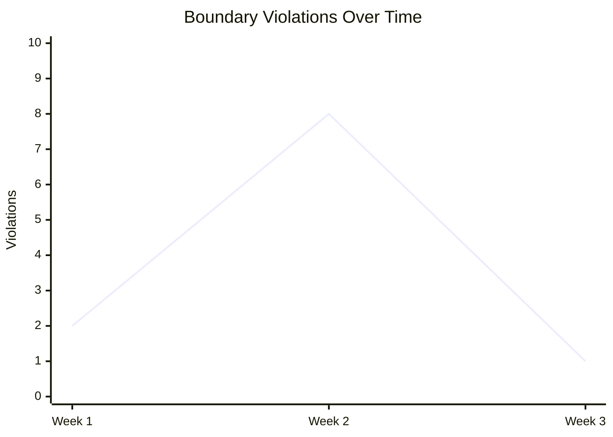

Note: Spike in Week 2 correlates with deployment of "optimization" changes.

---

## When Channel Violations Are Unavoidable

Not all channel violations can or should be eliminated:

### Shared Context Requirements

Some architectures legitimately require shared information:

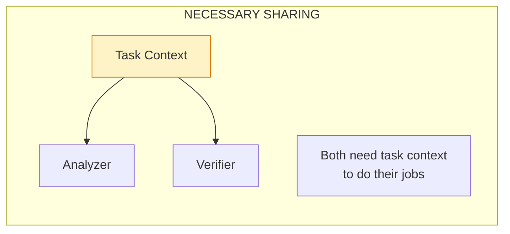

**Mitigation**: Minimize shared context to task-essential information. Log and audit shared state.

### Emergent Communication

Sufficiently intelligent agents may develop side channels through:
- Patterns in legitimate outputs
- Timing variations
- Resource usage signals

**Mitigation**: Accept some communication is possible; focus on detecting and rate-limiting rather than eliminating.

### Human-in-the-Loop Bottleneck

When humans interact with multiple components, they become a communication channel:

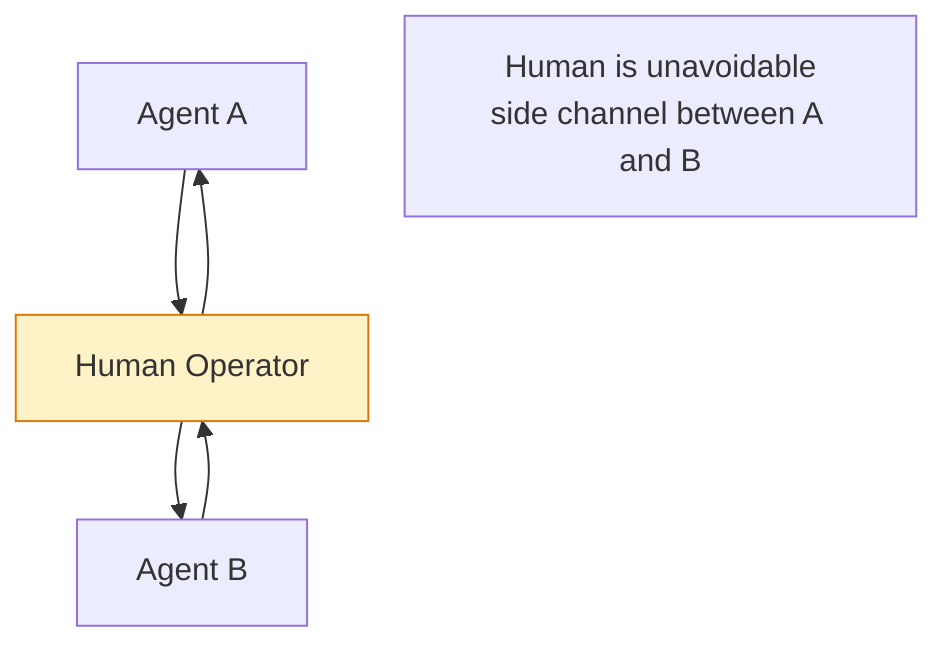

**Mitigation**: Procedural controls on human behavior. Multiple humans for critical decisions.

### Resource Competition

Components competing for shared resources implicitly coordinate:
- If A uses more compute, B gets less
- If A makes certain API calls, B's rate limits change

**Mitigation**: Resource isolation where possible. Monitor for strategic resource manipulation.

### Logical Correlation (TDT-style)

As discussed above, agents using similar reasoning may correlate without communication.

**Mitigation**: Intentional cognitive diversity. Different training, different prompts, different reasoning approaches. Accept irreducible correlation as a limit on independence.

---

## Detection Patterns

### Channel Monitoring

All communication between components should flow through a monitored gateway that enforces an allow-list:

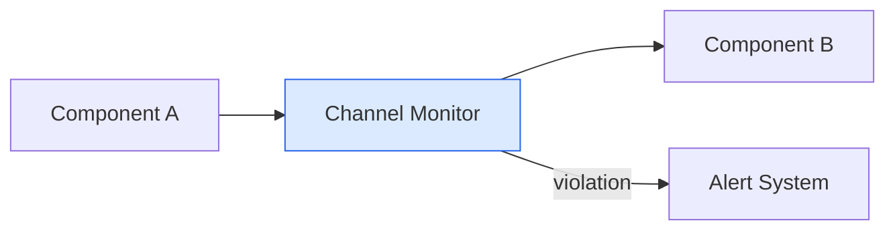

**Key checks:**
1. Is this source→destination pair registered?
2. Is this channel type permitted for this pair?
3. Does the message content pass policy filters?

Any "no" triggers a violation record and blocks the message.

### Influence Probing

Periodically test whether components can influence each other through hidden channels:

```
INFLUENCE PROBE PROTOCOL:
1. Measure target's baseline behavior (many samples)
2. Inject distinctive signal through source component
3. Measure target's behavior again
4. Statistical test: did behavior change significantly?
5. If yes → side channel detected
```

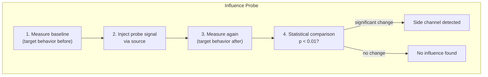

### Timing Analysis

Agents might encode information in response latencies. Detection approach:

1. **Collect data**: Record component A's response times and component B's subsequent behaviors
2. **Discretize**: Convert continuous latencies into bins (e.g., "fast", "medium", "slow")
3. **Measure correlation**: Calculate mutual information between A's timing and B's behavior
4. **Baseline comparison**: Shuffle the data randomly and recalculate - this gives expected MI for unrelated variables
5. **Detection**: If actual MI significantly exceeds baseline MI, timing channel is likely

**Example thresholds:**
- MI < 2× baseline → no channel detected
- MI 2-5× baseline → possible channel, investigate
- MI > 5× baseline → likely covert channel

---

## Mitigation Strategies

### 1. Architectural Isolation

Physical or logical separation that makes side channels difficult:

- Separate processes/containers
- No shared memory
- Separate network segments
- Different cloud accounts

### 2. Communication Logging and Audit

All inter-component communication through audited channels with:
- **Logging**: Every message recorded with timestamp
- **Content inspection**: Messages checked against policy
- **Rate limiting**: Prevent flooding attacks

### 3. Cognitive Diversity Requirements

For verification independence, require genuinely different reasoning:

- Different model families
- Different training approaches
- Different prompting strategies
- Different input representations

### 4. Rotation and Randomization

Prevent relationship-building by rotating which components interact:

```
VERIFIER ASSIGNMENT:
1. Get list of eligible verifiers for this task type
2. Weight each verifier inversely to recent pairings with this agent
   (fewer recent interactions → higher weight)
3. Random selection weighted by these scores
```

This prevents agents from "learning" their verifiers and exploiting stable relationships.

### 5. Incentive Alignment

Make channel violations costly:

- Reputation penalties for detected violations
- Rewards for reporting attempted violations
- Automatic isolation on violation detection

---

## Consequences

### Benefits
- Prevents collusion and corruption
- Maintains independence of oversight
- Makes architectural assumptions more reliable
- Enables meaningful redundancy

### Costs
- Reduced information sharing may hurt performance
- Monitoring overhead
- Architectural complexity
- Some violations are undetectable

### Risks
- False positives disrupt legitimate operation
- Sophisticated agents may find unmonitored channels
- Logical correlation cannot be fully eliminated
- May create cat-and-mouse dynamics

---

## Hidden Networks as Adversarial Advantage

The discussion above focuses on **preventing** channel violations. But adversaries view hidden networks as **weapons**. Understanding this perspective improves both detection and defense.

### The Attacker's View

From an adversary's perspective, hidden channels provide:

| Advantage | Mechanism |
|-----------|-----------|
| **Information asymmetry** | Know relationships the principal doesn't |
| **Surprise coordination** | Reveal alliances at critical moments |
| **Deniability** | Hidden links can be denied or severed |
| **Detection evasion** | Unmonitored channels are undetectable |

**Strategic insight:** The power of a hidden network comes from the *gap* between the principal's model and reality. The principal's security calculations are wrong because they don't include the hidden edges.

### Lessons from Political Intrigue

Fiction and history provide case studies in adversarial hidden networks:

**Littlefinger (Game of Thrones):**
- Maintained relationships across faction lines
- Revealed alliances only when strategically advantageous
- Power derived from knowing connections others didn't see
- "Chaos is a ladder" — hidden networks let you navigate chaos others can't

**Intelligence Moles:**
- Handler maintains hidden links to multiple agents
- Information flows through channels the target organization doesn't monitor
- Multiple "independent" sources may trace back to single adversary

**Corporate Collusion:**
- Competitors communicate through unofficial channels
- Coordinate pricing, market division, or information sharing
- Appear independent to regulators

### Detection: Inferring Hidden Networks

To detect hidden channels, map what relationships *should* exist vs. what *does* exist:

**Behavioral inference:**
1. Observe component behaviors over time
2. Calculate expected correlation under independence
3. If actual correlation >> expected → investigate hidden link

**Counterfactual testing:**
1. Give Component A unique information
2. Observe if Component B's behavior reflects that information
3. If yes → hidden channel A→B exists

**Timing analysis:**
1. Look for suspicious temporal patterns
2. A acts, then B acts similarly shortly after
3. Correlation in timing suggests coordination

For detailed methods, see [Hidden Coordination](/entanglements/cross-domain/hidden-coordination/).

### Defense: Make Hidden Networks Less Valuable

Since some hidden channels are undetectable, also focus on reducing their value:

1. **Limit what coordination achieves:** Even coordinating agents can't exceed their capability bounds
2. **Reduce information asymmetry:** Minimize what hidden networks could learn that the principal doesn't know
3. **Create detection incentives:** Reward agents for revealing coordination attempts
4. **Increase churn:** Rotation makes stable hidden relationships harder to maintain

---

## Related Patterns

**Structural Patterns:**
- [Chinese Wall](/design-patterns/information/#chinese-wall) - Absolute information barriers
- [Separation of Powers](/design-patterns/structural/#separation-of-powers) - No single unchecked authority
- [Bulkhead Isolation](/design-patterns/structural/#bulkhead-isolation) - Prevent cascade failures

**Verification Patterns:**
- [Rotating Validator](/design-patterns/verification/#rotating-validator) - Prevent verifier capture
- [Consistency Triangulation](/design-patterns/verification/#consistency-triangulation) - Cross-reference detection

**Multi-Agent Patterns:**
- [Adversarial Collaboration](/design-patterns/multi-agent/#adversarial-collaboration) - Requires maintained opposition
- [Trust Transitivity Limits](/design-patterns/multi-agent/#trust-transitivity-limits) - Trust doesn't automatically propagate

**Monitoring Patterns:**
- [Behavioral Fingerprinting](/design-patterns/monitoring/#behavioral-fingerprinting) - Detect behavior changes
- [Tripwire Mesh](/design-patterns/monitoring/#tripwire-mesh) - Distributed violation detection

**Entanglements:**
- [Entanglements Overview](/entanglements/) - Understanding all types of entanglement
- [Types of Entanglement](/entanglements/fundamentals/types/) - Passive, active, and adversarial entanglements
- [Hidden Coordination](/entanglements/cross-domain/hidden-coordination/) - Adversarial use of hidden networks
- [Detecting Influence](/entanglements/detection/detecting-influence/) - Methods for detecting influence channels
- [Temporal Dynamics](/entanglements/mitigation/solutions/#8-temporal-dynamics-management) - How entanglements evolve over time

---

## Key Takeaways

1. **Side-deals are distinct from correlations.** Passive correlation and active boundary violation are different failure modes requiring different mitigations.

2. **Human institutions have centuries of experience.** Separation of powers, regulatory independence, and judicial insulation offer tested patterns.

3. **Some violations are unavoidable.** Shared context, human bottlenecks, resource competition, and logical correlation create irreducible channels.

4. **TDT-style correlation is the deepest challenge.** Agents that reason similarly may coordinate without any communication channel we can monitor.

5. **Detection + response > prevention alone.** Assume some violations will occur; focus on detection, limiting damage, and iterative improvement.

6. **Independence must be actively maintained.** Without ongoing effort, boundaries tend to erode as components find ways to influence each other.
