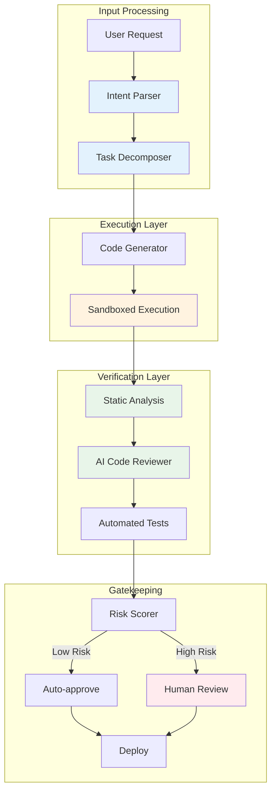
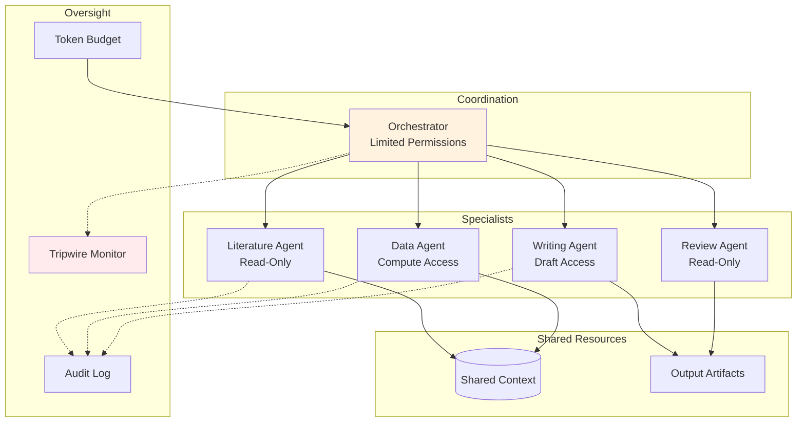
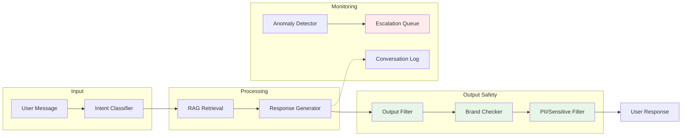

# Composing Patterns

Individual patterns solve specific problems. Real systems need multiple patterns working together. This guide shows how to combine patterns into coherent architectures.

## The Composition Challenge

A single pattern rarely provides complete safety. Consider:

| Single Pattern | What It Solves | What It Doesn't Solve |
|----------------|----------------|----------------------|
| Human review | Catches obvious errors | Slow, fatigues, misses subtle issues |
| AI verifier | Fast, scalable | Correlated with primary AI failures |
| Sandboxing | Limits damage | Doesn't prevent bad outputs |
| Rate limiting | Prevents runaway harm | Doesn't improve quality |

**Real safety requires layers**—patterns that complement each other's weaknesses.

---

## Pattern Stacks for Common Scenarios

### Autonomous Code Assistant

A system that writes and executes code with minimal human oversight.

**Patterns Used:**
1. **Task Decomposition** — Break complex requests into smaller pieces
2. **Sandboxed Execution** — Limit blast radius of bad code
3. **Defense in Depth** — Multiple verification layers (static, AI, tests)
4. **Escalation Ladder** — Route risky decisions to humans
5. **Risk Scoring** — Quantify when human review is needed

**Why This Combination Works:**
- Decomposition limits the scope of each generation
- Sandbox prevents catastrophic damage during testing
- Multiple verifiers catch different error types
- Escalation ensures humans see the dangerous cases
- Risk scoring prevents alert fatigue

### Multi-Agent Research System

A system with specialized agents coordinated by an orchestrator.

**Patterns Used:**
1. **Least Privilege** — Each agent has minimum necessary permissions
2. **Coordinator Constraints** — Orchestrator can't directly access resources
3. **Tripwire Monitoring** — Detect anomalous coordination patterns
4. **Budget Limits** — Cap total compute/token spend
5. **Audit Logging** — Record all agent actions
6. **Role Separation** — Distinct capabilities per agent

**Why This Combination Works:**
- No single agent can cause maximum harm
- Coordinator can't bypass specialists
- Tripwires catch coordination failures
- Budgets prevent runaway costs
- Audit trail enables forensics

### Customer-Facing Chatbot

A public-facing assistant with brand and safety requirements.

**Patterns Used:**
1. **Output Filtering** — Block harmful/inappropriate content
2. **Brand Alignment** — Ensure responses match company voice
3. **PII Detection** — Remove sensitive information
4. **RAG Grounding** — Reduce hallucination via retrieval
5. **Anomaly Detection** — Flag unusual conversation patterns
6. **Escalation Path** — Route edge cases to humans

**Why This Combination Works:**
- Filtering prevents reputation damage
- RAG reduces hallucination
- Anomaly detection catches novel attack patterns
- Escalation handles cases filters miss

---

## Pattern Compatibility Matrix

Some patterns work well together; others conflict.

| Pattern A | Pattern B | Compatibility | Notes |
|-----------|-----------|---------------|-------|
| Sandboxing | Rate Limiting | ✅ Excellent | Both limit damage |
| Human Review | AI Verifier | ✅ Excellent | Diverse verification |
| N-Version | AI Verifier | ⚠️ Moderate | May have correlated failures |
| Sandboxing | Full Capability | ❌ Conflict | Sandbox limits capability |
| Real-time | Human Review | ⚠️ Moderate | Latency tradeoff |
| Least Privilege | Maximum Capability | ❌ Conflict | Fundamental tension |

---

## Composition Principles

### 1. Layer by Failure Mode

Different patterns catch different failures:

| Layer | Catches | Examples |
|-------|---------|----------|
| **Capability Limits** | Actions the system can't take | Sandboxing, permissions |
| **Output Checks** | Bad content generation | Filters, classifiers |
| **Behavioral Monitoring** | Anomalous patterns | Tripwires, anomaly detection |
| **Human Oversight** | Edge cases, novel situations | Review queues, escalation |

**A complete architecture has all four layers.**

### 2. Ensure Diversity

If all your verification uses the same base model, they'll fail together.

**Bad:**
- GPT-4 generates code
- GPT-4 reviews code
- GPT-4 writes tests

**Better:**
- GPT-4 generates code
- Claude reviews code
- Rule-based static analysis
- Human samples 5%

### 3. Match Stringency to Risk

Not every task needs maximum verification:

| Risk Level | Pattern Stack |
|------------|---------------|
| Low | Output filter + audit log |
| Medium | + AI verifier + rate limit |
| High | + Human review (sampled) + sandbox |
| Critical | + Full human review + formal verification |

### 4. Design for Graceful Degradation

What happens when patterns fail?

- **Filter fails:** AI verifier catches it
- **AI verifier fails:** Human review catches it
- **Human reviewer fatigued:** Anomaly detector flags unusual rate
- **All else fails:** Sandbox limits damage

Each layer is a fallback for the one before.

---

## Anti-Patterns in Composition

### Over-Reliance on Single Layer

**Problem:** All safety in one place (e.g., just output filtering)
**Why it fails:** Single point of failure
**Fix:** Add diverse verification layers

### Correlated Verification

**Problem:** Multiple verifiers using same model/training
**Why it fails:** Same blind spots
**Fix:** Ensure architectural diversity

### Verification Theater

**Problem:** Patterns that look good but don't catch real issues
**Why it fails:** False sense of security
**Fix:** Test with adversarial examples

### Kitchen Sink

**Problem:** Every pattern applied everywhere
**Why it fails:** Latency, cost, complexity
**Fix:** Match patterns to risk level

---

## Template: Designing Your Stack

1. **Identify threat model:** What are you protecting against?
   - Accidents (capability errors)
   - Manipulation (adversarial users)
   - Defection (misaligned AI behavior)

2. **Map failure modes:** What could go wrong?
   - List specific scenarios
   - Estimate probability and damage

3. **Select patterns:** Which patterns address each failure?
   - Use the [pattern index](/design-patterns/) to find candidates
   - Ensure coverage across all failure modes

4. **Check compatibility:** Do patterns conflict?
   - Use the compatibility matrix above
   - Resolve conflicts by prioritizing

5. **Design fallbacks:** What happens when each layer fails?
   - Ensure graceful degradation
   - No single point of failure

6. **Calculate overhead:** What's the cost?
   - Latency impact
   - Dollar cost
   - Development complexity

---

## See Also

- [Design Patterns Index](/design-patterns/) — Full pattern catalog
- [Least-X Principles](/design-patterns/least-x-principles/) — Core design philosophy
- [Quick Start](/design-patterns/tools/quick-start/) — Step-by-step application
- [Cost-Benefit Tool](/design-patterns/tools/cost-benefit/) — Evaluate tradeoffs
