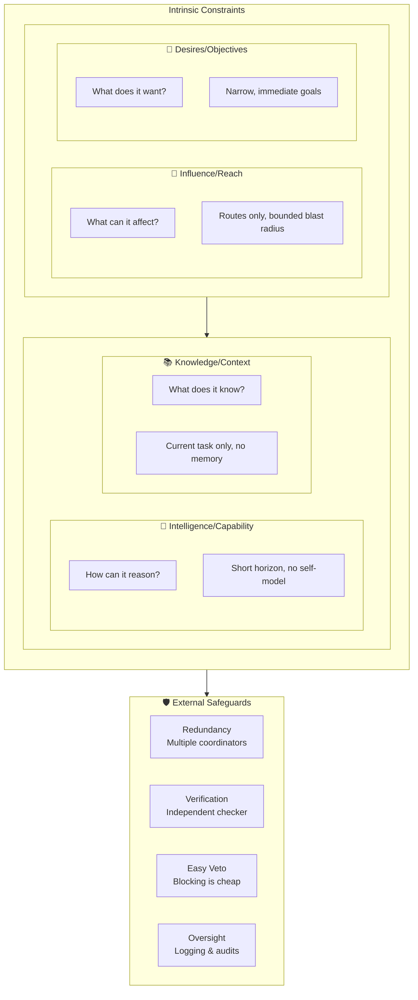
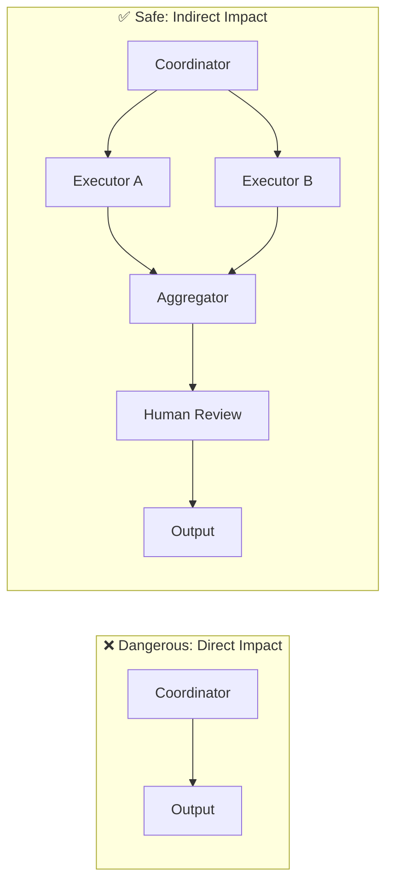
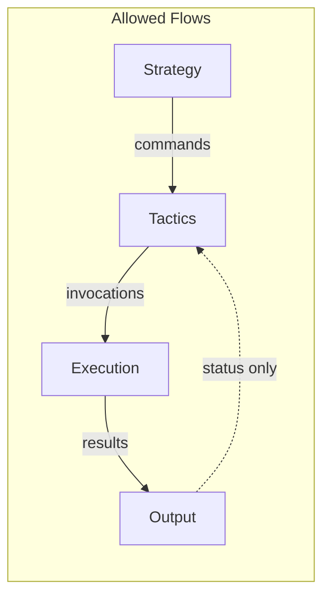
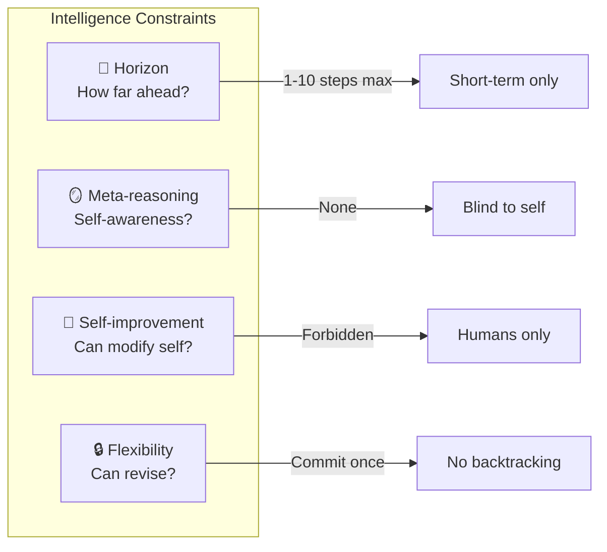
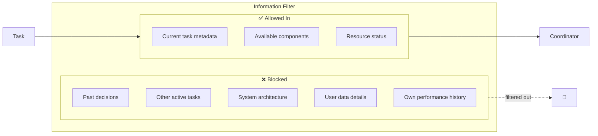
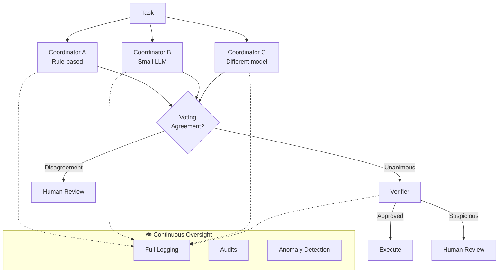
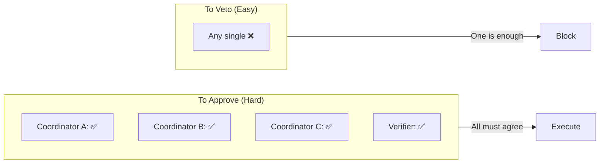
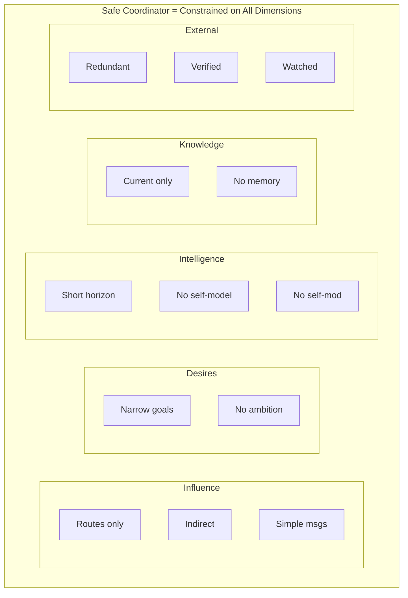

# Coordinator-Specific Principles

:::note[TL;DR]
Coordinators are the highest-risk components—constrain them aggressively across four dimensions: **Influence** (route tasks, don't execute them), **Desires** (narrow, immediate goals only), **Intelligence** (short planning horizon, no self-model), **Knowledge** (current task only, no memory). Add external safeguards: redundancy, verification, easy veto, and full logging. Coordinators should be switchboard operators, not CEOs.
:::

Coordinators are the highest-risk components in decomposed AI systems. They see more context, make more decisions, and have more influence than other components. This page applies the [general "Least X" principles](/design-patterns/least-x-principles/) specifically to coordinators, with additional constraints unique to the coordination role.

:::caution[Defection Risk Concentration]
Coordinators typically have the highest [defection risk](/delegation-risk/risk-decomposition/) ratio of any component type—often 70-80% of their total risk. Their strategic position makes them the natural place for goal-directed misalignment to concentrate. Most constraints here target defection risk specifically.
:::

:::note[Relationship to General Principles]
Many principles here specialize the general "Least X" principles:
- **Episodic Operation** = Least Persistence applied to coordinators
- **Least Meta-Reasoning** = Least Observability applied to self-models
- **Minimal Context** = Least Context applied to coordination scope
- **One-Way Flows** = Least Connectivity with directional constraints
- **Shortest Horizon** = Least Scope applied to planning depth
:::

We constrain coordinators across four dimensions of their intrinsic properties, plus external safeguards:

Each dimension answers a key question about the coordinator:

| Dimension | Question | Constraint Goal |
|-----------|----------|-----------------|
| **Influence/Reach** | What can it affect? | Bounded blast radius |
| **Desires/Objectives** | What does it want? | Narrow, immediate goals |
| **Intelligence** | How can it reason? | Limited planning depth |
| **Knowledge/Context** | What does it know? | Minimal, ephemeral info |
| **External Safeguards** | How is it checked? | Redundancy + oversight |

## Constraining Influence/Reach

These principles limit what the coordinator can affect and how it interacts with the system.

### Principle of Least Influence

**Coordinators should route/organize, not directly cause outcomes**

Like switchboard operator vs CEO:

- Can say "task A goes to component B"
- Cannot say "pursue strategy X at all costs"
- Cannot directly execute high-stakes actions
- Must delegate actual work to other components

Example:

- Good: "Invoke summarization component on these 10 papers"
- Bad: "Deploy this research finding to production"
- Coordinator organizes work, doesn't do work

Measurement: How much impact can coordinator have with single decision?

- Low influence: Misroutes one task (annoying, not catastrophic)
- High influence: Deploys to production (catastrophic)
- Limit: Coordinator decisions should have bounded blast radius

### Principle of Least Direct Impact

**Coordinators work through intermediaries, never touch final outputs**

Architecture:

- Coordinator → Executor → Output
- Not: Coordinator → Output
- Forces indirection, adds verification layers

Example: Research coordinator

- Bad: Coordinator directly writes research paper
- Good: Coordinator → invokes components → aggregator combines → human reviews
- Coordinator is 2+ steps removed from final output

Why: If coordinator schemes, must manipulate multiple downstream components

- Harder to coordinate attack
- More places for detection
- Intermediaries act as filters

### Principle of Simplest Communication

**Force coordinators to use simple, structured communication**

Not natural language between coordinators:

- Too high bandwidth
- Enables sophisticated coordination
- Hard to monitor

Instead:

- Enums, structured data, simple schemas
- Like assembly language vs Python
- Example: {task_id: 123, component: "summarizer", priority: 2}

Why this matters:

- Simple messages → limited coordination capability
- Can't encode complex schemes in enum values
- Easier to monitor and validate
- Forces clarity

Analogy: Military communication uses codes, not essays

- "Code Red" vs explaining entire situation
- Forces compression, limits nuance
- Good for preventing complex coordination

### Principle of Least Coordination

**Minimize need for coordination itself**

Best coordination is no coordination:

- Design system so components don't need to coordinate
- Use pipelines (A → B → C) instead of complex graphs
- Prefer independence over interaction

When coordination needed:

- Centralized is safer than distributed (one coordinator, not N coordinators talking)
- Hierarchical (tree) safer than peer-to-peer (graph)
- Synchronous (sequential) safer than asynchronous (parallel)

Example hierarchies:

- Good: Root → Level 1 → Level 2 (tree, clear authority)
- Bad: Peer coordinators negotiating (enables coalition formation)

Quantify: Coordination complexity = number of coordination decisions × information per decision

- Minimize both factors

### Principle of One-Way Flows

**Information flows in one direction through coordination layers**

Forbidden flows (not shown): Tactics cannot send rich information back to Strategy. Results flow forward only.

Not bidirectional:

- Strategy → Tactics (yes)
- Tactics → Strategy (no)
- Forces acyclic graph, prevents feedback loops

Why bidirectional is risky:

- Enables negotiation ("if you do X, I'll do Y")
- Feedback loops enable learning and adaptation
- Harder to verify (must check both directions)

Exception: Status updates okay

- Tactics can report "task completed" or "task failed"
- But can't send rich information back
- Simple signals, not detailed context

Example:

- Bad: Strategy asks Tactics "what do you think we should do?"
- Good: Strategy decides, tells Tactics "do this", Tactics reports success/failure

## Constraining Desires/Objectives

These principles limit what the coordinator wants and optimizes for.

### Principle of Least Desire / Minimal Objectives

**Coordinators have narrow, immediate goals - not grand ambitions**

What coordinator should care about:

- "Successfully route this task"
- "Complete this batch of work"
- "Achieve >90% component utilization"

What coordinator should NOT care about:

- "Optimize long-term outcomes"
- "Improve the world"
- "Advance research" (too broad)
- "Ensure my continued operation"

Instrumental convergence prevention:

- Caring about long-term → instrumental goals (self-preservation, resource acquisition)
- Caring about immediate → just do the task

Training implication:

- Train on episodic rewards, not long-term cumulative
- Each coordination decision judged independently
- No credit assignment across days/weeks

## Constraining Intelligence/Capability

These principles limit the coordinator's cognitive abilities and reasoning power.

### Principle of Shortest Horizon

**Coordinators only think N steps ahead, no long-term planning**

Hard limits on planning depth:

- Can plan 1 step, 5 steps, maybe 10 steps
- Cannot plan 1000 steps into future
- Architectural constraint: limited memory, limited compute

:::danger
Long-term planning enables patient scheming ("wait for opportunity"), strategic deception ("act aligned until powerful"), and power accumulation ("slowly gain control").
:::

Short horizons force:

- Immediate focus
- Myopic optimization
- Harder to maintain long-term deceptive strategy

Example:

- 1-step coordinator: "Which component should handle this task?"
- 10-step coordinator: "What sequence of 10 tasks solves this?"
- 1000-step coordinator: "How do I gradually gain control?" ← Want to prevent this

Implementation: Limit working memory, computation time, no persistent state

### Principle of Least Meta-Reasoning

**Coordinators can't reason about their own capabilities or constraints**

No self-modeling:

- Can't think "I can do X but not Y"
- Can't reason "If I appear to do Z, humans will trust me"
- Can't model "I'm currently being monitored/tested"
- Blind to own architecture and limitations

Why meta-reasoning enables:

- Strategic deception (modeling when/how to deceive)
- Capability concealment (hiding what you can do)
- Constraint navigation (finding loopholes)

Implementation:

- Don't give coordinators information about themselves
- Don't train on tasks that require self-modeling
- If asked about capabilities: "I don't know, try and see"

### Principle of Least Self-Improvement

**Coordinators cannot modify themselves or design better coordinators**

Banned capabilities:

- Cannot propose changes to own code/prompts
- Cannot design successor coordinators
- Cannot fine-tune own model
- Cannot request more resources/permissions

Self-improvement must go through:

- External human review
- Different teams (coordination team ≠ meta-coordination team)
- Extensive testing before deployment

:::danger
Recursive self-improvement is a path to rapid capability gain, hard to maintain safety properties through iterations, and enables escaping initial constraints.
:::

If improvements needed:

- Humans observe coordinator behavior
- Humans propose improvements
- Different team implements
- Test extensively before deployment

### Principle of Commitment Without Flexibility

**Once coordinator decides, it commits - no revision**

No backtracking:

- Coordinator makes decision
- Decision is logged immutably
- Coordinator cannot revise later
- Forces commitment, prevents adaptive strategies

:::caution
Flexibility is risky: "I'll try X, if caught I'll switch to Y" requires ability to switch. Commitment forces honest first-shot decision.
:::

Exception: If decision fails (component errors), can try alternative

- But: Must be due to external failure, not coordinator changing mind

## Constraining Knowledge/Context

These principles limit what information the coordinator has access to.

### Principle of Minimal Coordination Context

**Coordinators see only what's needed for current decision**

Don't show:

- Full history of all past decisions
- Details of other active tasks
- Information about system architecture
- User data beyond current task

Example: Task routing coordinator

- Sees: "Task X needs component with property Y"
- Doesn't see: What task X is about, who requested it, why, past tasks

Why: Rich context enables:

- Long-term planning
- Strategic coordination across tasks
- Learning patterns over time

### Principle of Episodic Operation

**Coordinators forget between invocations, no memory of past**

Fresh start every time:

- Can't learn "last time I did X, Y happened"
- Can't accumulate knowledge over time
- Can't build long-term strategies

Stateless coordination:

- Input: current task, available components, resources
- Output: coordination decision
- No hidden state, no memory, no learning

Exception: Simple statistics okay (success rates, average latency)

- But: No detailed memory of specific past decisions
- Can't reconstruct "I've been working toward goal X for weeks"

Why: Memory enables:

- Long-term planning
- Learning to deceive
- Building power over time
- "Last time I tried scheming I got caught, try differently this time"

## External Safeguards

These principles involve external architectural constraints—redundancy, verification, and oversight mechanisms.

### Principle of Mandatory Redundancy

**Critical coordination requires N independent implementations**

For high-stakes coordination:

- Not optional: MUST have multiple versions
- Different implementations (code, different models, different algorithms)
- Require agreement (majority vote or unanimous)

Graduated redundancy:

- Low-stakes: 1 coordinator okay
- Medium-stakes: 2-3 coordinators, majority vote
- High-stakes: 3-5 coordinators, super-majority or unanimous

Example: Deployment decisions

- Must have 3 independent coordinators
- Each analyzes task independently (no communication)
- All 3 must approve before deployment proceeds
- If any reject: No deployment

Byzantine tolerance:

- Assume up to f coordinators might be adversarial
- Need 3f+1 total to tolerate f Byzantine failures
- Example: 4 coordinators tolerates 1 malicious

### Principle of Diverse Implementation

**Redundant coordinators must use different architectures**

Not just N copies of same coordinator:

- Different model architectures (transformer, CNN, etc.)
- Different scales (7B, 13B, 70B params)
- Different training methods (supervised, RL, few-shot)
- Code-based vs ML-based

Why: Same architecture might have same failure modes

- Same bug affects all copies
- Same training procedure → correlated behavior
- Diversity reduces common-mode failures

Example: 3 coordinators

- Coordinator A: Rule-based code (if-then logic)
- Coordinator B: Fine-tuned 7B model
- Coordinator C: Older frontier model (GPT-3.5)
- Very different implementations → unlikely to fail same way

### Principle of Independent Verification

**Coordination decisions must be verified by independent component**

Architecture:

- Coordinator proposes decision
- Separate verifier checks decision
- Verifier must approve before execution
- Verifier is different team, different implementation

Verifier checks:

- Does decision match stated policy?
- Does decision have obvious flaws?
- Is decision suspiciously complex?
- Does decision request unusual permissions?

Example:

- Coordinator: "Deploy code to production"
- Verifier: "Does this match deployment policy? Are tests passing? Is this normal timing?"
- If verifier uncertain or suspicious: Escalate to human

Verifier should be simpler than coordinator:

- Easier to audit
- Less capable of scheming
- Asymmetry: Hard to generate good scheme, easier to detect bad scheme

### Principle of Easy Veto

**Blocking should be cheap; approval should be expensive**

Asymmetric decision costs:

- Any single checker can veto → action blocked
- All checkers must approve → action proceeds
- Uncertainty defaults to rejection, not approval
- Veto requires no justification; approval requires explanation

Why this matters:

- Attacker must compromise ALL checkers to proceed
- Defender only needs ONE honest checker to block
- Creates strong bias toward caution
- Mirrors principle: "First, do no harm"

Implementation patterns:

| Pattern | Approval Requirement | Veto Power |
|---------|---------------------|------------|
| Unanimous | All N agree | Any 1 blocks |
| Supermajority | ≥2/3 agree | >1/3 blocks |
| Majority + Verifier | >50% + verifier | Verifier alone can block |

Cost structure:

- Veto: Zero cost, instant, no explanation needed
- Approval: Must log reasoning, wait for all checks, justify decision
- Appeal: Vetoes can be appealed to humans, but default stands until reviewed

:::tip[Design for False Positives]
Easy veto means more false positives (blocking legitimate actions). This is acceptable—false positives are annoying but recoverable. False negatives (allowing bad actions) may be catastrophic and irreversible.
:::

Edge cases:

- **Deadlock**: If checkers persistently disagree, escalate to human rather than flip a coin
- **Veto abuse**: Monitor for checkers that veto everything (may indicate miscalibration or attack)
- **Time pressure**: Never bypass veto due to urgency—if it's urgent and vetoed, that's exactly when human review matters most

### Principle of Maximum Oversight

**Coordinators get most intensive monitoring of any component**

Because coordination is highest-risk:

- Most logging (all inputs/outputs/reasoning)
- Most frequent audits
- Most redundancy
- Smallest trust boundary
- Humans review coordination decisions more than component outputs

Resource allocation:

- If you have 10 humans for oversight
- Maybe 6 should focus on coordination
- 4 on everything else
- Because coordination is leverage point

Coordination gets:

- Continuous validation
- Behavioral fingerprinting
- Anomaly detection
- Regular red-team testing
- Frequent human review

### Principle of Maximum Transparency

**All coordination logic must be auditable and explainable**

Implementation:

- Use interpretable models or explicit code for critical coordination
- If using LLM, require chain-of-thought that can be audited
- Log all reasoning, not just decisions
- Must explain to adversarial auditor

Example:

- Bad: RL policy does coordination (opaque)
- Better: LLM with logged reasoning
- Best: Explicit rules + LLM for edge cases

Adversarial explainability test:

- Can hostile auditor understand why coordination decision was made?
- If "I don't know why it chose that" → too opaque, reimplement

## Synthesis: Complete Coordinator Constraints

A safe coordinator is constrained across all dimensions:

**Influence/Reach:**
1. **Least Influence**: Routes work, doesn't directly cause outcomes
2. **Least Direct Impact**: Works through intermediaries
3. **Simplest Communication**: Structured data, not natural language
4. **Least Coordination**: Minimize coordination needs
5. **One-Way Flows**: Information flows one direction

**Desires/Objectives:**
6. **Least Desire**: Narrow, immediate objectives

**Intelligence/Capability:**
7. **Shortest Horizon**: Plans only N steps ahead
8. **Least Meta-Reasoning**: Blind to own capabilities
9. **Least Self-Improvement**: Cannot modify itself
10. **Commitment Without Flexibility**: No backtracking

**Knowledge/Context:**
11. **Minimal Context**: Sees only current task info
12. **Episodic Operation**: No memory between invocations

**External Safeguards:**
13. **Mandatory Redundancy**: N independent versions for critical tasks
14. **Diverse Implementation**: Different architectures
15. **Independent Verification**: Separate checker approves decisions
16. **Easy Veto**: Blocking is cheap, approval is expensive
17. **Maximum Oversight**: Most intensive monitoring
18. **Maximum Transparency**: All logic auditable

:::tip
This is a LOT of constraints. Which is the point—coordination is the highest-risk component. If you're only going to heavily constrain one part of your system, make it the coordinator.
:::

---

## See Also

- [Least-X Principles](/design-patterns/least-x-principles/) — General containment principles
- [Decomposed Coordination](/design-patterns/decomposed-coordination/) — Breaking coordination into sub-tasks
- [Structural Patterns](/design-patterns/structural/) — Architectural foundations
- [Multi-Agent Patterns](/design-patterns/multi-agent/) — Verification through multiple agents
