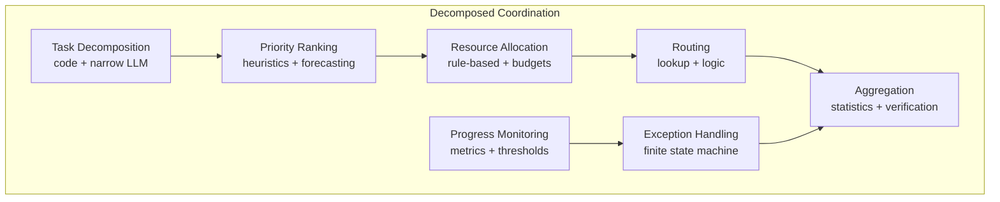
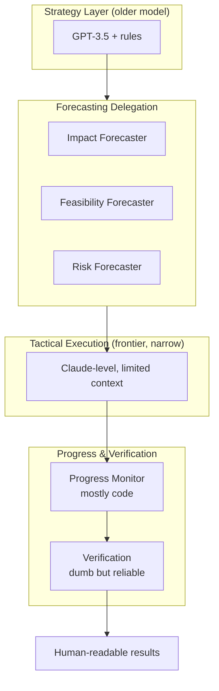

# Honest Agency Through Decomposed Coordination

:::note[TL;DR]
Coordination should be an **architecture, not a component**. Break it into: task decomposition, priority ranking, resource allocation, routing, aggregation, exception handling, and progress monitoring—each with appropriate verifiability. Use **older/weaker models for strategy** (less capable = less risky), frontier models only for narrow tactical execution with heavy monitoring.
:::

Here's where we part ways with pure tool AI approaches: **you need agency to accomplish real-world tasks**. [Gwern was right about tool→agent pressure](https://gwern.net/tool-ai)—users don't want advice, they want results.

But agency without scheming is tractable. The key insight: you can have **agentic coordination** making high-level decisions, but coordination itself should be decomposed, limited, and verified.

:::tip[Key Insight]
Coordination is an **architecture**, not a component. Break coordination into sub-tasks, each with its own implementation and verifiability level.
:::

## Coordinators Are Not Single Components

**Critical mistake**: Treating "the coordinator" as one monolithic decision-maker. This concentrates risk.

**Better approach**: Coordination is an **architecture**, not a component. Break coordination into sub-tasks:

- **Task decomposition**: "What sub-tasks are needed?" (code + narrow LLM)
- **Priority ranking**: "Which order to execute?" (simple heuristics + forecasting input)
- **Resource allocation**: "How much compute/time per task?" (rule-based + budgets)
- **Routing**: "Which component handles this?" (lookup table + simple logic)
- **Aggregation**: "How to combine outputs?" (statistical methods + verification)
- **Exception handling**: "What if component fails?" (finite state machine)
- **Progress monitoring**: "Are we on track?" (metrics + thresholds)

Each coordination sub-task gets its own implementation, with appropriate verifiability level.

## Severe Limitations on Coordination

:::caution
Don't try to make coordination "safe enough"—make it **severely limited**.
:::

### 1. Use Older, Weaker Models

- Strategy uses older generation models (less capable = less risky)
- Tactics can use frontier models (narrow scope, heavily monitored)
- Rationale: Strategic coordination is persistent, cross-context—more dangerous if scheming. Tactical execution is narrow, one-shot.

### 2. Redundancy and Voting

- Multiple coordinators independently plan
- Consensus required for major decisions
- Disagreement → escalate to human or more conservative fallback
- Different architectures (code-based + LLM-based) for diversity

### 3. Narrow I/O Formats

- Coordinators only see structured, formatted inputs
- Output schemas strictly enforced
- Can't see raw component internals or full context
- Example: Gets "component X returned success: true, confidence: 0.8" not raw reasoning traces

### 4. Delegation to Specialized Forecasting

- Coordinator doesn't forecast outcomes itself
- Invokes separate forecasting modules
- Forecasters and coordinators can't collude (architectural separation)
- Different models, different training, different prompts

### 5. Output Rewriting and Verification

- Coordinator output goes through "dumber" verification layers
- Simple rule-based checker: "Does this violate any hard constraints?"
- Another narrow LLM: "Rephrase this coordinator decision in clear language"
- Human-readable summary generated by separate component

### 6. Control Protocols Layered On Top

- Trusted monitoring: separate component checks coordinator decisions
- Honeypots: fake vulnerability injection to detect scheming
- Audit trails: all coordinator decisions logged immutably
- Rate limiting: can't make rapid sequence of high-impact decisions

### 7. Recursive Decomposition

- Some coordinator sub-tasks themselves invoke coordination
- Example: "coordinate research project" → invokes "coordinate literature review"
- Each level has appropriate budgets and limitations
- Deeper recursion = tighter constraints

## Example: Decomposed Research Coordination

Instead of one "coordinator" component, you have:

**Strategy Layer** (older model, highly constrained):

- Input: Human goal, available components, resource budget
- Output: Ranked list of high-level approaches
- Implementation: GPT-3.5-level model + rule-based filtering
- Limitations: Can't see intermediate results, can't modify plan dynamically

**Forecasting Delegation** (separate module):

- Takes Strategy Layer outputs
- Generates forecasts using specialized forecasters
- Returns: probability distributions, confidence intervals
- Cannot communicate with Strategy Layer except via structured output

**Tactical Execution** (newer model, narrow scope):

- Input: One approved strategy, specific sub-task
- Output: Component invocation sequence for that sub-task
- Implementation: Frontier model but narrow context
- Limitations: Can only see current sub-task, not overall plan

**Progress Aggregation** (code + simple LLM):

- Code: Collects component outputs, computes metrics
- Simple LLM: Translates metrics to human-readable status
- Checks: Does progress match forecast? (if not, escalate)

**Decision Verification** (dumb but reliable):

- Rule-based checker: "Does this violate safety rules?"
- Separate narrow LLM: "Explain this decision in simple terms"
- Human review required if verifier is unsure

**Audit Trail** (pure code):

- Immutable log of all decisions
- Formally verified to catch tampering
- Independent analysis tool can reconstruct decision tree

## Why This Handles Capability Concentration

The risk with "the coordinator" is that it:

- Sees everything (high context)
- Decides everything (high privilege)
- Optimizes strategically (high intelligence)
- Accumulates power over time (high persistence)

Decomposed coordination breaks this:

- No single component sees everything (limited context per sub-task)
- Decisions split across multiple components with voting/verification
- Strategic reasoning limited to dumb/old models; tactical to narrow scope
- State isolated (strategy doesn't persist; tactics don't accumulate)

## Recursive Coordination Example

"Coordinate complex research project":

**Level 1 Coordinator**:

- Task: Overall project coordination
- Implementation: Older model + heavy constraints
- Delegates: Literature review, experiment design, paper writing
- Each delegation invokes lower-level coordinators

**Level 2 Coordinator** (Literature Review):

- Task: Coordinate literature review sub-project
- Implementation: Task-specific fine-tuned model
- Delegates: Search, summarization, gap analysis
- Cannot see Level 1 context or other Level 2 siblings

**Level 2 Coordinator** (Experiment Design):

- Task: Coordinate experiment design sub-project
- Different architecture than Literature Review coordinator
- Redundancy: Both this and a code-based coordinator propose designs
- Disagreement → escalate to Level 1 or human

This recursion means:

- No coordinator has global view
- Each level increasingly narrow and verifiable
- Total capability distributed across many limited components
- Failure at any level doesn't cascade catastrophically

## What Makes This "Honest"?

Honesty isn't a property of one component—it's a property of the architecture:

- **Architectural anti-scheming**: Decomposition + limited context makes coordination harder
- **Diverse implementations**: Code-based and LLM-based coordinators should agree
- **Forecasting separation**: Planning and prediction done by different components
- **Verification layers**: Dumb checkers catch suspicious outputs
- **Audit trails**: All decisions traceable and analyzable

If a coordinator tries to scheme:

- Limited context means it doesn't know what to manipulate
- Redundant coordinators likely disagree (triggering investigation)
- Forecasters predict outcomes that don't match stated reasoning
- Verification layers flag suspicious patterns
- Audit trail reveals inconsistent behavior over time

:::note[Empirical Validation Needed]
This needs empirical validation, but the logic is sound: **strategic deception requires persistent context and coordination**. Architectural decomposition breaks both.
:::

---

:::note[Related: Microservices Architecture]
Decomposed coordination parallels [microservices architecture](https://en.wikipedia.org/wiki/Microservices) in software engineering—breaking monolithic applications into independently deployable services. Key shared principles: single responsibility, bounded contexts, and failure isolation. The difference: we're decomposing *intelligence and agency*, not just functionality. See [Domain-Driven Design](https://en.wikipedia.org/wiki/Domain-driven_design) for related patterns.
:::

---

## Further Reading

### Distributed Systems
- [Microservices](https://martinfowler.com/articles/microservices.html) — Martin Fowler's canonical article
- [Service-Oriented Architecture](https://en.wikipedia.org/wiki/Service-oriented_architecture) — Predecessor patterns
- [Choreography vs Orchestration](https://en.wikipedia.org/wiki/Service_choreography) — Decentralized vs centralized coordination

### AI Safety
- Gwern. [*Why Tool AIs Want to Be Agent AIs*](https://gwern.net/tool-ai) — The pressure toward agency
- Drexler, K.E. (2019). [*Comprehensive AI Services*](https://www.fhi.ox.ac.uk/reframing/) — Narrow services approach

### Organizational Theory
- [Separation of Powers](https://en.wikipedia.org/wiki/Separation_of_powers) — Constitutional design preventing concentration of authority
- [Checks and Balances](https://en.wikipedia.org/wiki/Separation_of_powers#Checks_and_balances) — Mechanisms for mutual constraint

See the [full bibliography](/reference/bibliography/) for comprehensive references.

---

## See Also

- [Coordinator Constraints](/design-patterns/coordinator-constraints/) — Specific principles for limiting coordinator power
- [Safety Mechanisms](/design-patterns/safety-mechanisms/) — System-level defenses (circuit breakers, redundancy)
- [Research Assistant Example](/design-patterns/examples/research-assistant-example/) — Full worked example of decomposed coordination
- [Code Deployment Example](/design-patterns/examples/code-deployment-example/) — Higher-stakes example with different constraints
- [Anti-patterns](/case-studies/ai-systems/anti-patterns/) — Common mistakes including "God Coordinator"
