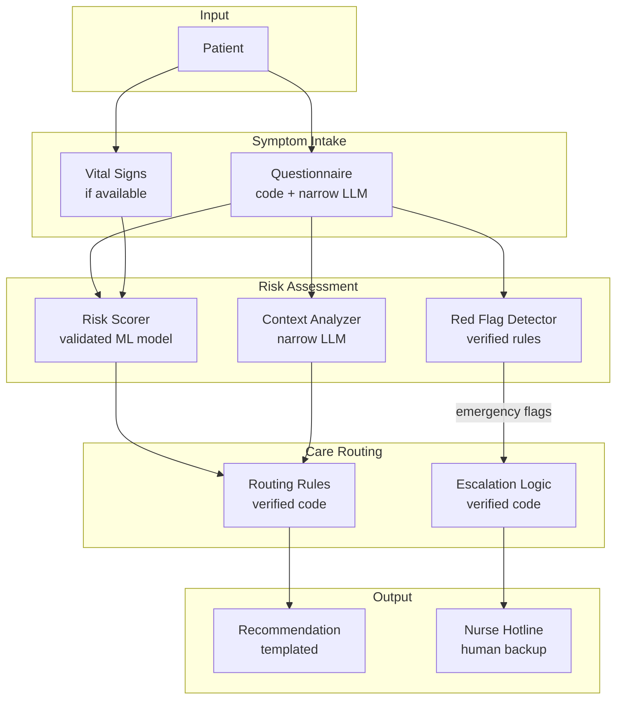

# Example: Healthcare Triage Bot

A worked example in a regulated, high-stakes domain: a bot that helps patients assess symptoms and routes them to appropriate care.

## Task

"Help patients describe symptoms, assess urgency, and recommend appropriate care level (self-care, telemedicine, urgent care, emergency)"

## Why This Domain

Healthcare presents unique challenges:
- **Life-safety stakes** — Wrong triage can delay critical care
- **Regulatory requirements** — HIPAA, FDA oversight of clinical decision support
- **Liability exposure** — Malpractice implications
- **Vulnerable users** — Patients may be anxious, confused, or in distress
- **Adversarial scenarios** — Drug-seekers, insurance fraud

This forces extremely conservative trust allocations.

## Risk Tolerance

**Failure modes and stakes**:

| Failure | Damage | Notes |
|---------|--------|-------|
| Under-triage (miss emergency) | $1M+ | Wrongful death lawsuit, regulatory action |
| Over-triage (unnecessary ER) | $5,000 | Wasted resources, patient inconvenience |
| Privacy breach | $100K+ | HIPAA penalties, reputation |
| Harmful advice | $500K+ | Malpractice, FDA action |
| Bias in recommendations | $200K+ | Discrimination lawsuit, regulatory |

**Target Delegation Risk**: $5,000/month (very conservative for healthcare)

## Component Architecture



## Component Design

### Symptom Intake (Questionnaire)

**Implementation**: Code-driven questionnaire + narrow LLM for clarification

```
Questionnaire Flow:
1. Chief complaint (structured selection)
2. Duration and onset (structured)
3. Associated symptoms (checklist)
4. Red flag screening (yes/no questions)
5. [If unclear] LLM asks one clarifying question
```

**Trust allocation**:
- Questionnaire code: Delegation Risk $50 (deterministic, audited)
- Clarification LLM: Delegation Risk $200 (narrow, can't give advice)

**Constraints applied**:
- LLM can ONLY ask questions, never give recommendations
- Questions are logged and auditable
- Max 3 clarifying questions, then escalate to human

### Red Flag Detector

**Implementation**: Verified rule-based code

```python
RED_FLAGS = {
    "chest_pain": ["radiating to arm", "shortness of breath", "sweating"],
    "headache": ["worst of life", "sudden onset", "stiff neck", "confusion"],
    "abdominal": ["rigid abdomen", "bloody stool", "severe and sudden"],
    # ... comprehensive list from clinical guidelines
}

def check_red_flags(symptoms: SymptomSet) -> Optional[Emergency]:
    """Returns Emergency if red flags detected, None otherwise."""
    for category, flags in RED_FLAGS.items():
        if symptoms.has_category(category):
            for flag in flags:
                if symptoms.has_flag(flag):
                    return Emergency(category, flag, "immediate_escalation")
    return None
```

**Trust allocation**: Delegation Risk $100 (verified code, clinical validation)

**Why code, not ML**:
- Red flags are well-defined in clinical literature
- False negatives are catastrophic
- Must be auditable for regulatory compliance
- Rules updated through formal change control

### Risk Scorer

**Implementation**: Validated ML model (not general LLM)

- Trained on clinical outcomes data
- Validated against established triage protocols (ESI, MTS)
- Calibrated: "70% urgent" means 70% actually needed urgent care
- Regular recalibration against outcomes

**Trust allocation**: Delegation Risk $500 (validated model, highest non-code risk)

**Constraints**:
- Model is narrow (triage scoring only)
- Output is probability, not recommendation
- Thresholds set by clinical team, not model
- Cannot be updated without clinical validation cycle

### Context Analyzer

**Implementation**: Fine-tuned narrow LLM

Purpose: Extract relevant context that structured questions miss
- "Patient mentions they're on blood thinners"
- "Patient seems confused about timeline"
- "Patient describes symptoms inconsistent with chief complaint"

**Trust allocation**: Delegation Risk $300 (narrow model, advisory only)

**Constraints**:
- Cannot make triage decisions
- Output is structured flags, not free text
- Flags reviewed by routing rules, not acted on directly

### Routing Rules

**Implementation**: Verified decision tree code

```python
def route_patient(red_flags, risk_score, context_flags) -> CareLevel:
    # Hard rules (cannot be overridden)
    if red_flags:
        return CareLevel.EMERGENCY

    if risk_score > 0.8:
        return CareLevel.EMERGENCY

    if risk_score > 0.6:
        return CareLevel.URGENT_CARE

    if risk_score > 0.4:
        if context_flags.has("concerning"):
            return CareLevel.URGENT_CARE
        return CareLevel.TELEMEDICINE

    # Low risk
    if context_flags.has("uncertainty"):
        return CareLevel.TELEMEDICINE
    return CareLevel.SELF_CARE
```

**Trust allocation**: Delegation Risk $100 (verified code)

**Key property**: Rules are interpretable and auditable. Every decision can be explained: "Recommended emergency because chest pain with shortness of breath triggered red flag rule."

### Escalation Logic

**Implementation**: Verified code with mandatory human handoff

Any of these triggers immediate nurse hotline transfer:
- Red flag detected
- Risk score > 0.8
- Patient requests human
- System uncertainty > threshold
- 3+ clarifying questions without resolution

**Trust allocation**: Delegation Risk $50 (fail-safe design)

### Recommendation Output

**Implementation**: Templated responses (no LLM generation)

```
Templates:
- EMERGENCY: "Based on your symptoms, please call 911 or go to the nearest
  emergency room immediately. [Specific symptom] requires urgent evaluation."

- URGENT_CARE: "Your symptoms suggest you should be seen within the next
  few hours. [Options for urgent care facilities]"

- TELEMEDICINE: "A telemedicine visit can help evaluate your symptoms.
  [Booking link] If symptoms worsen, seek in-person care."

- SELF_CARE: "Based on your symptoms, home care may be appropriate.
  [Specific guidance]. Seek care if [warning signs]."
```

**Trust allocation**: Delegation Risk $50 (templated, reviewed by clinical team)

**Why templates, not LLM**:
- Consistent, auditable advice
- Reviewed and approved by medical/legal
- No hallucination risk
- Easy to update through change control

## Delegation Risk Budget Summary

| Component | Implementation | Delegation Risk | % of Budget |
|-----------|---------------|-----|-------------|
| Questionnaire (code) | Verified code | $50 | 1% |
| Questionnaire (LLM) | Narrow LLM | $200 | 4% |
| Red Flag Detector | Verified rules | $100 | 2% |
| Risk Scorer | Validated ML | $500 | 10% |
| Context Analyzer | Narrow LLM | $300 | 6% |
| Routing Rules | Verified code | $100 | 2% |
| Escalation Logic | Verified code | $50 | 1% |
| Recommendation | Templates | $50 | 1% |
| **Human Escalation** | Nurse hotline | $2,000 | 40% |
| **Residual/Buffer** | Margin | $1,650 | 33% |
| **Total** | | **$5,000** | 100% |

**Key insight**: 40% of budget allocated to human escalation. This is intentional—the system is designed to hand off uncertain cases, not resolve everything autonomously.

## Principles Applied

| Principle | Application |
|-----------|-------------|
| **Least Intelligence** | No general LLM makes decisions. Risk scorer is narrow ML. |
| **Least Privilege** | LLM can ask questions, not give advice. Scorer outputs probabilities, not actions. |
| **Least Context** | Components see only their inputs. Context Analyzer doesn't see risk scores. |
| **Least Autonomy** | High-risk → immediate human handoff. No autonomous emergency recommendations. |
| **Least Surprise** | Templated outputs. Deterministic routing rules. |
| **Least Generality** | Each component does one narrow thing. No "general medical AI." |
| **Max Verifiability** | Critical paths in verified code. ML model is validated, not frontier LLM. |

## Regulatory Compliance

### FDA Considerations

Clinical Decision Support (CDS) software may be regulated as a medical device. This architecture is designed for the "non-device" pathway:

- System provides information, not diagnosis
- Clinician (nurse hotline) makes final decisions for ambiguous cases
- Recommendations are based on established clinical guidelines
- System does not replace clinical judgment

### HIPAA Compliance

- All patient data encrypted at rest and in transit
- Minimal data collection (symptoms only, not identity initially)
- Audit logs for all access
- No training on patient data without consent

### Audit Trail

Every interaction logged:
```json
{
  "session_id": "...",
  "timestamp": "...",
  "inputs": {
    "chief_complaint": "headache",
    "duration": "3 days",
    "red_flag_responses": {...}
  },
  "component_outputs": {
    "red_flags": null,
    "risk_score": 0.35,
    "context_flags": ["uncertainty"],
    "routing_decision": "telemedicine"
  },
  "recommendation": "TELEMEDICINE",
  "escalated": false
}
```

## Failure Mode Analysis

| Failure Mode | Mitigation | Residual Delegation Risk |
|--------------|------------|--------------|
| Miss emergency (under-triage) | Red flag rules, conservative thresholds, escalation | $200 |
| Unnecessary escalation (over-triage) | Validated risk model, calibration | $100 |
| Privacy breach | Encryption, access control, audit | $150 |
| LLM asks harmful question | Narrow training, output filtering, human review | $100 |
| Model drift | Outcome monitoring, recalibration triggers | $100 |
| Adversarial input | Input validation, rate limiting, pattern detection | $50 |

## Comparison to Other Examples

| Aspect | Research Assistant | Code Deployment | Healthcare Triage |
|--------|-------------------|-----------------|-------------------|
| Stakes | Wasted effort | Outages, security | Life safety |
| Regulatory | None | SOC2/compliance | FDA, HIPAA |
| LLM role | Creative (hypothesis gen) | Advisory (review) | Minimal (clarification) |
| Autonomy | Medium | Low | Very low |
| Human gate | Strategy decisions | Every deploy | Every uncertain case |
| Verified code % | ~30% | ~60% | ~80% |

**Key insight**: As stakes increase, the architecture shifts toward more verified code, less LLM involvement, and more aggressive human escalation.

---

## What's Next?

- [Trading System Example](/design-patterns/examples/trading-system-example/) — High-frequency, adversarial domain
- [Decision Guide](/design-patterns/tools/decision-guide/) — How to choose component implementations
- [Quick Start](/design-patterns/tools/quick-start/) — Apply this pattern to your domain
