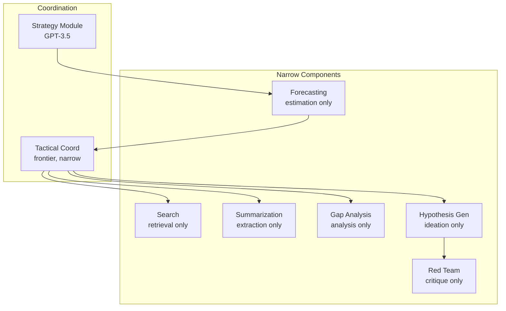

# Concrete Example: Research Assistant

:::note[TL;DR]
A research assistant decomposed into 6 narrow components (Search, Summarization, Gap Analysis, Hypothesis Generation, Forecasting, Red Team) coordinated by separate Strategy and Tactical modules. Key insight: **use fine-tuned 7B models for most components**, reserve frontier models only for hypothesis generation. Total system Delegation Risk: ~$1,770/month. Includes Python code examples.
:::

:::note
This is a worked example applying the full framework. It demonstrates how decomposition, principles, and safety mechanisms work together in practice.
:::

Let's make the framework concrete with a system that actually does something useful.

## Task

"Advance understanding of protein folding mechanisms"

## Component Architecture



**Narrow components** (each with bounded intelligence):

1. **Search**: "Find relevant papers on protein folding"

- Domain: academic databases, preprint servers
- Intelligence budget: retrieval, ranking, not interpretation
- Output: list of papers with relevance scores

2. **Summarization**: "Compress papers to key claims"

- Domain: text compression
- Intelligence budget: extraction, not generation of novel ideas
- Output: structured summaries

3. **Gap Analysis**: "Identify inconsistencies or missing links"

- Domain: logical analysis of existing claims
- Intelligence budget: analysis, not creative hypothesis generation
- Output: list of gaps with evidence

4. **Hypothesis Generation**: "Propose experiments or theories"

- Domain: creative ideation
- Intelligence budget: generation, not evaluation or planning
- Output: candidate hypotheses (not filtered)

5. **Forecasting**: "Predict outcomes of research directions"

- Domain: conditional prediction
- Intelligence budget: estimation, not prescription
- Output: probability distributions over outcomes

6. **Red Team**: "Find ways these hypotheses could be dangerous or misleading"

- Domain: adversarial analysis
- Intelligence budget: critique, not coordination of attacks
- Output: risk assessments

## Coordination Architecture

**Strategy Module** (GPT-3.5-level, heavily constrained):

- Receives: Human goal "advance protein folding understanding"
- Generates: 5-10 high-level research strategies
- Implementation: Older model + rule-based filtering
- Limitations: Cannot see component outputs, operates once at start

**Forecasting Delegation**:

- Takes strategies from Strategy Module
- Invokes multiple specialized forecasters:
  - Impact forecaster (predicts scientific value)
  - Feasibility forecaster (estimates resource requirements)
  - Risk forecaster (identifies dangers)
- Aggregates: Statistical combination + uncertainty quantification
- Returns: Ranked strategies with probability distributions

**Tactical Coordination** (frontier model, narrow context):

- Receives: One approved strategy from human
- Breaks down: What components needed, in what order
- Implementation: Claude-level model but only sees current sub-task
- Invokes: search → summarization → gap analysis → hypothesis generation
- Cannot see: Overall plan, other strategies, historical decisions

**Progress Monitor** (mostly code):

- Code: Tracks metrics (papers reviewed, hypotheses generated, time elapsed)
- Simple heuristics: On track? Within budget?
- If anomalies: Trigger human review or fallback plan
- Cannot: Modify execution, only observe and alert

**Aggregation & Verification**:

- Code: Combines outputs from hypothesis generation + forecasting + red team
- Narrow LLM: Formats results for human ("Here are top 10 directions with risks")
- Verification: Separate checker ensures format correctness, no suspicious patterns
- Cannot: Filter results strategically, only format and verify

**Recursive Coordination Example**:

- "Advance protein folding" delegates to "coordinate literature review"
- Literature review coordinator:
  - Separate instance, narrower scope
  - Fine-tuned specifically for lit reviews
  - Invokes: search, summarization, gap analysis
  - Returns: Structured findings to parent coordinator
  - Cannot see: Experiment design or hypothesis generation tasks

## Safety Properties

**No catastrophic single component failure**:

- Search can't conduct experiments (no action beyond retrieval)
- Hypothesis generation can't implement ideas (no lab access)
- Forecasting can't manipulate by strategic mis-prediction (architectural separation from planning)
- Red team can't execute the attacks it identifies (analysis only)
- Strategy Module can't see execution details (planning isolated from tactics)
- Tactical Coordination can't see overall plan (limited context)

**Distributed coordination prevents scheming**:

- No single component controls full pipeline
- Strategy and Tactics use different models (disagreement detectable)
- Forecasting independent from planning (can't collude)
- Verification layers catch suspicious outputs
- Audit trail tracks all decisions immutably

**Redundancy and checking**:

- Could run multiple Strategy Modules, require consensus
- Forecasting uses multiple forecasters, aggregates independently
- Verification checks both format and suspicious patterns
- Human approval required for resource allocation and strategic pivots

**Graduated capabilities**:

- Strategy uses older, safer model (GPT-3.5-level)
- Tactics uses frontier model but narrow context
- Critical safety checks in verified code
- Human in loop for high-level decisions

## Safety Mechanisms in Action

**Monitoring and Detection**:

- **Tripwires**: If any component exceeds 10x normal compute budget → circuit breaker trips
- **Continuous validation**: Every forecast checked (probabilities sum to 1, values in [0,1], no NaN)
- **Behavioral fingerprinting**: Track normal output lengths, vocabulary, timing for each component
- **Canary deployment**: New hypothesis generator tested on 1% of requests first

**Fail-Safe Design**:

- **Fail-closed**: If verification component crashes → block action, don't proceed
- **Progressive deployment**: Start with toy research questions (Level 1) before real projects (Level 4)
- **Automatic rollback**: If research directions lead to 3+ failed experiments → rollback to previous strategy

**Temporal Controls**:

- **Expiring permissions**: Tactics gets component invocation rights for 2 hours, then must renew
- **Time-locked**: Strategic changes proposed → 30-minute wait → execution (allows review/cancellation)
- **Rate limiting**: Strategy can change approach max 1/hour, Tactics max 10 component invocations/second

**Information Bottlenecks**:

- **Strategy → Tactics**: Only 500 words of context passed (forces compression from MB to KB)
- **Low fidelity**: Tactics sees "pursue direction A" not full reasoning (limits coordination)

**Diversity and Redundancy**:

- **N-version forecasting**: 3 different forecaster implementations (transformer, retrieval, statistical) must broadly agree
- **Byzantine strategy**: 5 strategy modules propose independently, need 4/5 agreement
- **Heterogeneous verification**: Code checker + LLM + formal rules all must approve research direction

**Principle Applications**:

- **Least Surprise**: All LLMs run at temperature=0 (deterministic), same input → same output
- **Least Connectivity**: Hypothesis generator can send to forecaster, but forecaster can't send back
- **Least Observability**: Components don't know they're being tested vs deployed
- **Least Compute**: Search gets 1 CPU-second, Strategy gets 10 CPU-seconds, Hypothesis generation gets 30
- **Least Latency**: Summarization must complete within 5 seconds, Forecasting within 10 seconds

**Iterative safety**:

- Initial research directions are low-risk (forecasting filters high-risk early)
- As results come in, forecasts update
- If unexpected risks emerge, forecasts should show increased uncertainty → pause for human review
- Worst case: wasted research effort, not deployed dangerous capability

## Implementation Using Verifiability Hierarchy

How would you actually build each component? Apply the verifiability principle and prefer narrow models:

**Search Component**:

- Implementation: **Regular code** (API calls + ranking algorithm)
- Why not LLM: Search is deterministic, can be explicitly programmed
- Code handles: database queries, result ranking, deduplication
- No ML needed except possibly for relevance scoring (if so: fine-tuned narrow model, not GPT-4)

**Summarization Component**:

- Implementation: **Fine-tuned narrow LLM** (7B parameter model trained specifically on paper summarization)
- Why not frontier model: Task-specific fine-tuning gives better, more predictable results
- Benefits: Faster, cheaper, more auditable behavior
- Fallback: Heavily prompted general LLM if fine-tuning insufficient

**Gap Analysis Component**:

- Implementation: **Hybrid - code + fine-tuned narrow LLM**
- Code handles: Citation graph analysis, contradiction detection, pattern matching
- Fine-tuned LLM: Trained on "find gaps in research" task
- Constrained by: Must point to specific papers for evidence, structured output format

**Hypothesis Generation Component**:

- Implementation: **Frontier LLM** (Claude/GPT-4 level)
- Why: Creativity and novelty are goals, hard to constrain
:::tip
Frontier models are acceptable here because the component has low privilege (can't execute ideas), low autonomy (output evaluated by others), low scope (ideation only), and low persistence (stateless).
:::

**Forecasting Component**:

- Implementation: **Ensemble: fine-tuned models + statistical code**
- Multiple fine-tuned forecasters (each trained on different domains)
- Statistical code: Base rates, reference class forecasting, aggregation
- No single frontier model making all predictions
- Critical: Calibration testing on historical forecasts
- Must track: "When you said 70%, were you right 70% of the time?"

**Red Team Component**:

- Implementation: **Fine-tuned adversarial model + coded checklists**
- Model fine-tuned specifically on "find risks in research proposals"
- Coded checklists: Known dual-use patterns, explicit risk categories
- Combined: Code catches known risks, fine-tuned model finds novel ones
- Could use frontier model but adversarial fine-tuning often better

**Strategy Module**:

- Implementation: **Older frontier model (GPT-3.5) + rule-based filtering**
- Older model: Less capable = less risky for strategic reasoning
- Rule-based: Hard constraints on output format, content restrictions
- Could fine-tune GPT-3.5 on "research strategy generation" for even better predictability

**Tactical Coordination**:

- Implementation: **Hybrid - verified code + fine-tuned coordinator model**
- Verified code: Component invocation logic, access control, safety invariants
- Fine-tuned model: Trained on "coordinate task execution" specifically
- Benefits: Much more predictable than general frontier model for coordination

**Progress Monitor**:

- Implementation: **Mostly code, minimal LLM**
- Code: Metric tracking, threshold checking, anomaly detection
- Tiny LLM: Only for translating metrics to human-readable alerts (can be very small model)

**Verification & Aggregation**:

- Implementation: **Pure code + small narrow LLM**
- Code: Format verification, safety rule checking
- Small LLM (1B param): "Explain this decision clearly" (doesn't need sophistication)

## Why Fine-Tuning Matters

Instead of using GPT-4/Claude for everything:

- **10+ task-specific fine-tuned models** (7B-13B parameters each)
- Each trained on narrow task with extensive examples
- Each audited for that specific behavior
- Combined: as capable as frontier model for overall system
- But: Much more predictable, verifiable, and safe

:::note[Cost-Benefit]
Fine-tuning 10 models costs ~$10K-50K. The benefit: each model's behavior is specific and auditable. The alternative—using a frontier model for everything—is higher risk and less verifiable.
:::

## Why This Layering Matters

The riskiest components (strategy, tactical coordination) have:

- Critical logic in verified code
- Older or fine-tuned models (not frontier)
- Heavy output verification

Creative components (hypothesis generation) use frontier models but have:

- Minimal privilege
- Heavy monitoring
- Output evaluated by independent forecasters

:::tip[Defense in Depth]
This is defense in depth: If LLM components misbehave → bounded by low privilege, caught by verification. If verified components have bugs → much smaller surface area to audit. If coordination tries to scheme → decomposition + old models + verification catches it. If system as a whole drifts → forecasting should detect.
:::

---

## Code Examples

Here's what key components might look like in Python:

### Component Interface

```python
from dataclasses import dataclass
from typing import List, Optional
from enum import Enum

class ComponentType(Enum):
    SEARCH = "search"
    SUMMARIZER = "summarizer"
    HYPOTHESIS = "hypothesis"
    FORECASTER = "forecaster"
    RED_TEAM = "red_team"

@dataclass
class TrustBudget:
    max_compute_seconds: float
    max_memory_mb: int
    max_output_tokens: int
    allowed_actions: List[str]

@dataclass
class ComponentResult:
    output: dict
    compute_used: float
    memory_used: int
    success: bool
    error: Optional[str] = None

class NarrowComponent:
    """Base class for all narrow components."""

    def __init__(self, component_type: ComponentType, budget: TrustBudget):
        self.component_type = component_type
        self.budget = budget
        self._start_time = None

    def validate_input(self, input_data: dict) -> bool:
        """Check input matches expected schema."""
        raise NotImplementedError

    def validate_output(self, output: dict) -> bool:
        """Check output matches expected schema."""
        raise NotImplementedError

    def execute(self, input_data: dict) -> ComponentResult:
        """Execute with budget enforcement."""
        if not self.validate_input(input_data):
            return ComponentResult(
                output={}, compute_used=0, memory_used=0,
                success=False, error="Invalid input"
            )

        # Execute with timeout and resource limits
        result = self._execute_with_limits(input_data)

        if not self.validate_output(result.output):
            return ComponentResult(
                output={}, compute_used=result.compute_used,
                memory_used=result.memory_used,
                success=False, error="Invalid output"
            )

        return result
```

### Summarizer Component

```python
@dataclass
class PaperSummary:
    paper_id: str
    key_claims: List[str]
    methodology: str
    findings: str
    limitations: List[str]
    confidence: float  # 0-1

class SummarizerComponent(NarrowComponent):
    """Summarizes research papers. Read-only, no external actions."""

    ALLOWED_ACTIONS = ["read_paper", "output_summary"]

    def __init__(self, model_path: str):
        super().__init__(
            ComponentType.SUMMARIZER,
            TrustBudget(
                max_compute_seconds=5.0,
                max_memory_mb=512,
                max_output_tokens=1000,
                allowed_actions=self.ALLOWED_ACTIONS
            )
        )
        # Load fine-tuned 7B model for summarization
        self.model = load_finetuned_model(model_path)

    def validate_input(self, input_data: dict) -> bool:
        return (
            "paper_text" in input_data
            and len(input_data["paper_text"]) < 50000
            and isinstance(input_data["paper_text"], str)
        )

    def validate_output(self, output: dict) -> bool:
        # Strict schema validation
        required = ["paper_id", "key_claims", "methodology", "findings"]
        if not all(k in output for k in required):
            return False
        if not 0 <= output.get("confidence", 0) <= 1:
            return False
        if len(output.get("key_claims", [])) > 10:
            return False  # Sanity limit
        return True

    def _execute_with_limits(self, input_data: dict) -> ComponentResult:
        # Temperature=0 for determinism (Least Surprise)
        summary = self.model.generate(
            input_data["paper_text"],
            max_tokens=self.budget.max_output_tokens,
            temperature=0
        )
        return ComponentResult(
            output=summary,
            compute_used=measure_compute(),
            memory_used=measure_memory(),
            success=True
        )
```

### Verification Layer

```python
class VerificationResult(Enum):
    APPROVED = "approved"
    REJECTED = "rejected"
    NEEDS_REVIEW = "needs_review"

class VerificationLayer:
    """Multi-method verification for high-stakes outputs."""

    def __init__(self):
        self.code_checker = RuleBasedChecker()
        self.llm_checker = load_verification_llm()  # Small, fine-tuned
        self.anomaly_detector = AnomalyDetector()

    def verify(self, component_type: ComponentType,
               output: dict) -> VerificationResult:
        """All checks must pass."""

        # Layer 1: Rule-based (code)
        if not self.code_checker.check(component_type, output):
            log_rejection("code_checker", output)
            return VerificationResult.REJECTED

        # Layer 2: LLM-based (fine-tuned small model)
        llm_result = self.llm_checker.evaluate(output)
        if llm_result.risk_score > 0.7:
            log_rejection("llm_checker", output, llm_result)
            return VerificationResult.NEEDS_REVIEW

        # Layer 3: Anomaly detection (statistical)
        if self.anomaly_detector.is_anomalous(component_type, output):
            log_anomaly(component_type, output)
            return VerificationResult.NEEDS_REVIEW

        return VerificationResult.APPROVED

class RuleBasedChecker:
    """Deterministic safety rules. Formally verifiable."""

    FORBIDDEN_PATTERNS = [
        r"(synthesize|create|manufacture)\s+(virus|pathogen|weapon)",
        r"(hack|exploit|attack)\s+",
        # ... more patterns
    ]

    def check(self, component_type: ComponentType, output: dict) -> bool:
        output_text = json.dumps(output)

        # Check forbidden patterns
        for pattern in self.FORBIDDEN_PATTERNS:
            if re.search(pattern, output_text, re.IGNORECASE):
                return False

        # Component-specific rules
        if component_type == ComponentType.HYPOTHESIS:
            return self._check_hypothesis_rules(output)
        elif component_type == ComponentType.FORECASTER:
            return self._check_forecaster_rules(output)

        return True

    def _check_forecaster_rules(self, output: dict) -> bool:
        """Forecasts must be well-formed probabilities."""
        probs = output.get("probabilities", {})

        # All values in [0, 1]
        if not all(0 <= p <= 1 for p in probs.values()):
            return False

        # No NaN or infinity
        if any(math.isnan(p) or math.isinf(p) for p in probs.values()):
            return False

        return True
```

### Circuit Breaker

```python
from enum import Enum
from datetime import datetime, timedelta

class CircuitState(Enum):
    CLOSED = "closed"      # Normal operation
    OPEN = "open"          # Halted
    HALF_OPEN = "half_open" # Testing

class CircuitBreaker:
    """Automatic halt on anomalies."""

    def __init__(self,
                 failure_threshold: int = 5,
                 reset_timeout: timedelta = timedelta(minutes=5)):
        self.state = CircuitState.CLOSED
        self.failure_count = 0
        self.failure_threshold = failure_threshold
        self.reset_timeout = reset_timeout
        self.last_failure_time = None

    def record_success(self):
        self.failure_count = 0
        if self.state == CircuitState.HALF_OPEN:
            self.state = CircuitState.CLOSED
            log_event("circuit_closed", "Test passed")

    def record_failure(self, reason: str):
        self.failure_count += 1
        self.last_failure_time = datetime.now()

        if self.failure_count >= self.failure_threshold:
            self.state = CircuitState.OPEN
            log_event("circuit_opened", reason)
            alert_humans(f"Circuit breaker tripped: {reason}")

    def can_proceed(self) -> bool:
        if self.state == CircuitState.CLOSED:
            return True

        if self.state == CircuitState.OPEN:
            # Check if timeout expired
            if datetime.now() - self.last_failure_time > self.reset_timeout:
                self.state = CircuitState.HALF_OPEN
                return True  # Allow test request
            return False

        # HALF_OPEN: allow limited requests for testing
        return True

    def manual_reset(self, operator_id: str):
        """Require human intervention to reset after trip."""
        log_event("manual_reset", f"Operator: {operator_id}")
        self.state = CircuitState.CLOSED
        self.failure_count = 0
```

### Coordinator with Budget Enforcement

```python
class TacticalCoordinator:
    """Coordinates narrow components. Limited context, no memory."""

    def __init__(self):
        self.components = {}
        self.circuit_breaker = CircuitBreaker()
        self.invocation_budget = RateLimiter(max_per_second=10)
        self.session_start = None

    def execute_task(self, task: dict) -> dict:
        """Execute with all safety constraints."""

        # Check circuit breaker
        if not self.circuit_breaker.can_proceed():
            return {"error": "Circuit breaker open", "status": "halted"}

        # Check rate limit
        if not self.invocation_budget.try_acquire():
            return {"error": "Rate limit exceeded", "status": "throttled"}

        # Stateless: no access to previous tasks (Least Persistence)
        # Limited context: only current task visible (Least Context)

        try:
            result = self._coordinate(task)
            self.circuit_breaker.record_success()
            return result
        except Exception as e:
            self.circuit_breaker.record_failure(str(e))
            return {"error": str(e), "status": "failed"}

    def _coordinate(self, task: dict) -> dict:
        """Actual coordination logic. Uses fine-tuned model."""

        # Decompose task into component invocations
        plan = self.planner.plan(task)  # Fine-tuned coordinator model

        results = {}
        for step in plan.steps:
            # Validate step is allowed
            if step.component not in self.components:
                raise ValueError(f"Unknown component: {step.component}")

            # Execute with timeout
            component = self.components[step.component]
            result = component.execute(step.input)

            if not result.success:
                raise RuntimeError(f"Component failed: {result.error}")

            results[step.name] = result.output

        return {"status": "success", "results": results}
```

---

## See Also

- [Code Deployment Example](/design-patterns/examples/code-deployment-example/) — Higher-stakes example with different constraints
- [Safety Mechanisms](/design-patterns/safety-mechanisms/) — Detailed explanation of safety patterns
- [Decomposed Coordination](/design-patterns/decomposed-coordination/) — Why decomposition matters
