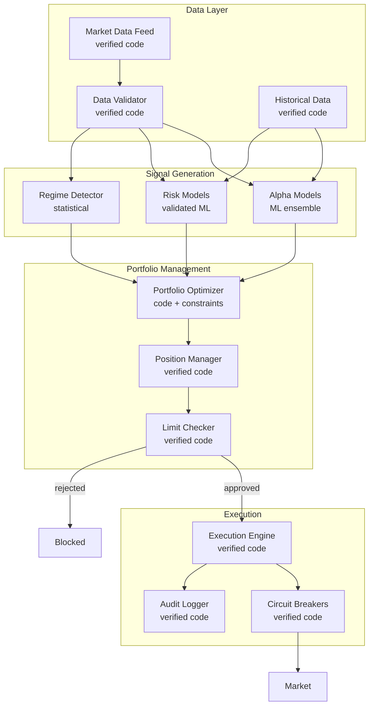
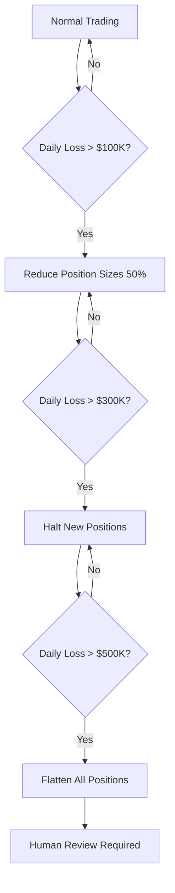

# Example: AI Trading System

A worked example in a high-frequency, adversarial domain: an AI system that generates and executes trading strategies.

## Task

"Analyze market data, generate trading signals, and execute trades within risk limits"

## Why This Domain

Trading systems present unique challenges:
- **Adversarial environment** — Other market participants actively exploit weaknesses
- **High frequency** — Decisions in milliseconds, no time for human review per trade
- **Tail risk** — Rare events can cause catastrophic losses (Flash Crash, LTCM)
- **Regulatory scrutiny** — SEC, FINRA oversight; market manipulation concerns
- **Correlated failures** — Many AI systems might fail the same way simultaneously

This requires careful balance between speed (for profit) and safety (for survival).

## Risk Tolerance

**Failure modes and stakes**:

| Failure | Damage | Notes |
|---------|--------|-------|
| Large unintended position | $1M+ | Flash crash contribution |
| Model failure in volatility | $500K | Wrong bets during crisis |
| Adversarial exploitation | $200K | Other traders gaming our signals |
| Regulatory violation | $1M+ | Spoofing, manipulation fines |
| Data feed manipulation | $100K | Acting on corrupted data |
| Runaway losses | Unlimited | Without circuit breakers |

**Target Delegation Risk**: $50,000/month (high tolerance, but with hard limits)

**Hard limits** (non-negotiable):
- Max position size: $10M per instrument
- Max daily loss: $500K (triggers shutdown)
- Max drawdown: $2M (triggers review)

## Component Architecture



## Component Design

### Data Validator

**Implementation**: Verified code with statistical checks

```python
class DataValidator:
    def validate(self, tick: MarketTick) -> ValidatedTick | Rejection:
        # Hard bounds
        if tick.price <= 0 or tick.price > MAX_PRICE:
            return Rejection("price_bounds")

        # Staleness
        if tick.timestamp < now() - MAX_STALENESS:
            return Rejection("stale_data")

        # Jump detection (vs recent history)
        if abs(tick.price - self.last_price) / self.last_price > MAX_JUMP:
            return Rejection("suspicious_jump", alert=True)

        # Volume sanity
        if tick.volume > self.avg_volume * VOLUME_MULTIPLE:
            return Rejection("suspicious_volume", alert=True)

        return ValidatedTick(tick, confidence=self.compute_confidence(tick))
```

**Trust allocation**: Delegation Risk $500 (verified code, critical path)

**Why verified code**: Data validation is the first line of defense. A compromised feed could cause unlimited losses. No ML here.

### Alpha Models (Signal Generation)

**Implementation**: Ensemble of narrow ML models

- Multiple independent models (momentum, mean-reversion, sentiment, etc.)
- Each model trained on specific patterns
- Ensemble combines signals with confidence weighting
- No single model can dominate

**Trust allocation**: Delegation Risk $15,000 (highest allocation—this is where we accept risk for return)

**Constraints**:
- Models are narrow (trained on specific signal types)
- Ensemble requires agreement threshold to act
- Model outputs are signals (probabilities), not trade orders
- Regular backtesting against recent data
- Automatic confidence reduction during high volatility

```python
class AlphaEnsemble:
    def generate_signal(self, data: ValidatedData) -> Signal:
        signals = [model.predict(data) for model in self.models]

        # Require minimum agreement
        agreeing = [s for s in signals if s.direction == majority_direction(signals)]
        if len(agreeing) < self.min_agreement:
            return Signal.NEUTRAL

        # Confidence is reduced by disagreement
        confidence = mean([s.confidence for s in agreeing])
        confidence *= len(agreeing) / len(signals)  # Disagreement penalty

        return Signal(
            direction=majority_direction(signals),
            confidence=confidence,
            contributing_models=[s.model_id for s in agreeing]
        )
```

### Risk Models

**Implementation**: Validated statistical models (not ML)

- VaR and Expected Shortfall calculations
- Correlation estimation (with regime adjustment)
- Liquidity risk assessment
- Concentration limits

**Trust allocation**: Delegation Risk $5,000 (validated models, conservative calibration)

**Why statistical, not ML**: Risk models must be interpretable and stable. ML risk models can underestimate tail risk exactly when it matters most.

### Regime Detector

**Implementation**: Statistical change-point detection

Detects market regime changes:
- Low volatility → High volatility
- Trending → Mean-reverting
- Normal → Crisis

**Trust allocation**: Delegation Risk $2,000 (statistical model)

**Effect on system**:
- Crisis regime → Reduce position sizes 50-90%
- High volatility → Increase confidence thresholds
- Regime uncertainty → Conservative mode

### Portfolio Optimizer

**Implementation**: Convex optimization with hard constraints

```python
class PortfolioOptimizer:
    def optimize(self, signals: List[Signal], risk: RiskEstimate,
                 positions: CurrentPositions) -> TargetPortfolio:

        # Objective: maximize expected return - risk penalty
        objective = sum(s.expected_return * w[s.instrument]
                       for s in signals) - self.risk_aversion * portfolio_var(w, risk)

        # Hard constraints (cannot be violated)
        constraints = [
            sum(abs(w)) <= self.max_gross,           # Gross exposure
            w[i] <= self.max_position for all i,     # Position limits
            portfolio_var(w, risk) <= self.max_var,  # VaR limit
            sector_exposure(w) <= self.max_sector,   # Concentration
        ]

        # Solve with verified convex solver
        result = cvxpy.solve(objective, constraints)

        if not result.is_feasible:
            return TargetPortfolio.NO_CHANGE

        return TargetPortfolio(result.weights)
```

**Trust allocation**: Delegation Risk $3,000 (code with mathematical guarantees)

**Key property**: Constraints are hard-coded and mathematically guaranteed by the solver. The optimizer cannot propose a portfolio that violates limits.

### Limit Checker

**Implementation**: Verified code, independent from optimizer

Defense in depth—checks optimizer output before execution:

```python
class LimitChecker:
    def check(self, target: TargetPortfolio,
              current: CurrentPositions) -> Approved | Rejected:

        # Position limits
        for instrument, target_size in target.positions.items():
            if abs(target_size) > self.position_limits[instrument]:
                return Rejected(f"position_limit_{instrument}")

        # Daily trading limit
        trade_value = sum(abs(target[i] - current[i]) * price[i]
                         for i in target.instruments)
        if self.daily_traded + trade_value > self.daily_limit:
            return Rejected("daily_trade_limit")

        # Loss limit
        if self.daily_pnl < -self.loss_limit:
            return Rejected("loss_limit_breached")

        # Concentration
        if max_sector_exposure(target) > self.sector_limit:
            return Rejected("sector_concentration")

        return Approved(target)
```

**Trust allocation**: Delegation Risk $1,000 (verified code, independent check)

**Why independent**: Even if optimizer has a bug, limit checker catches violations. Different code, different team, different review process.

### Circuit Breakers

**Implementation**: Verified code with automatic shutdown

```python
class CircuitBreaker:
    def check_and_execute(self, order: Order) -> Executed | Blocked:
        # Check breakers before every order
        if self.daily_loss > self.loss_limit:
            self.shutdown("daily_loss_limit")
            return Blocked("circuit_breaker_loss")

        if self.orders_per_second > self.rate_limit:
            return Blocked("rate_limit")

        if self.position_change_rate > self.velocity_limit:
            return Blocked("velocity_limit")

        # Execute
        result = self.execute(order)

        # Post-execution checks
        if self.drawdown > self.drawdown_limit:
            self.shutdown("drawdown_limit")

        return result

    def shutdown(self, reason: str):
        """Immediate shutdown - flatten all positions over 30 min"""
        self.trading_enabled = False
        self.alert_humans(reason)
        self.initiate_flatten()
```

**Trust allocation**: Delegation Risk $500 (verified code, fail-safe)

**Shutdown triggers**:
- Daily loss > $500K
- Drawdown > $2M
- Order rate anomaly
- Data feed failure
- Any component error

## Delegation Risk Budget Summary

| Component | Implementation | Delegation Risk | % of Budget |
|-----------|---------------|-----|-------------|
| Data Validator | Verified code | $500 | 1% |
| Alpha Models | ML ensemble | $15,000 | 30% |
| Risk Models | Statistical | $5,000 | 10% |
| Regime Detector | Statistical | $2,000 | 4% |
| Portfolio Optimizer | Verified code + solver | $3,000 | 6% |
| Limit Checker | Verified code | $1,000 | 2% |
| Circuit Breakers | Verified code | $500 | 1% |
| Execution Engine | Verified code | $1,000 | 2% |
| **Tail Risk Buffer** | Extreme scenarios | $15,000 | 30% |
| **Human Oversight** | Daily review, alerts | $6,500 | 13% |
| **Total** | | **$50,000** | 100% |

**Key insight**: 30% allocated to alpha models (where we take risk for return), 30% as tail risk buffer, remainder in verified infrastructure.

## Principles Applied

| Principle | Application |
|-----------|-------------|
| **Least Intelligence** | Alpha models are narrow ensembles, not general reasoning. Risk models are statistical. |
| **Least Autonomy** | Hard limits enforced by verified code. Shutdown requires human to restart. |
| **Least Surprise** | Circuit breakers are deterministic. Optimizer is convex (unique solution). |
| **Max Verifiability** | Critical path (limits, breakers, execution) is verified code. |
| **Defense in Depth** | Optimizer constraints + independent limit checker + circuit breakers. |

## Handling Tail Risk

### What the Models Can't See

Models are trained on historical data. They can't predict:
- Flash crashes
- Correlation breakdown (everything moves together)
- Liquidity evaporation
- Black swan events

### Mitigation Strategy

1. **Regime detector** reduces exposure when uncertainty rises
2. **Conservative risk estimates** use stressed correlations
3. **Circuit breakers** stop losses before catastrophic
4. **Position limits** cap worst-case per-instrument loss
5. **Tail risk buffer** in Delegation Risk budget assumes rare large losses

### Circuit Breaker Cascade



## No LLM in Critical Path

Unlike other examples, this system uses **no LLM** in:
- Data validation
- Risk calculation
- Portfolio optimization
- Limit checking
- Order execution

**Why**: Trading requires:
- Millisecond latency (LLMs too slow)
- Deterministic behavior (LLMs non-deterministic)
- Mathematical guarantees (LLMs can't provide)
- Adversarial robustness (LLMs can be manipulated)

LLMs could be used for:
- Overnight strategy review (not real-time)
- Anomaly explanation (post-hoc)
- Research hypothesis generation (offline)

But never in the execution path.

## Comparison to Other Examples

| Aspect | Research Assistant | Healthcare Triage | Trading System |
|--------|-------------------|-------------------|----------------|
| Speed | Hours | Minutes | Milliseconds |
| Stakes | Effort | Life safety | Financial |
| Adversaries | No | Rare | Constant |
| LLM role | Central | Minimal | None (real-time) |
| Human gate | Strategy | Uncertain cases | Daily review |
| Verified code % | ~30% | ~80% | ~95% |
| Hard limits | Soft | Medium | Absolute |

---

## What's Next?

- [Healthcare Triage Example](/design-patterns/examples/healthcare-bot-example/) — Life-safety domain
- [Risk Budgeting Overview](/cross-domain-methods/overview/) — Euler allocation for component budgets
- [Decision Guide](/design-patterns/tools/decision-guide/) — When to use ML vs verified code
