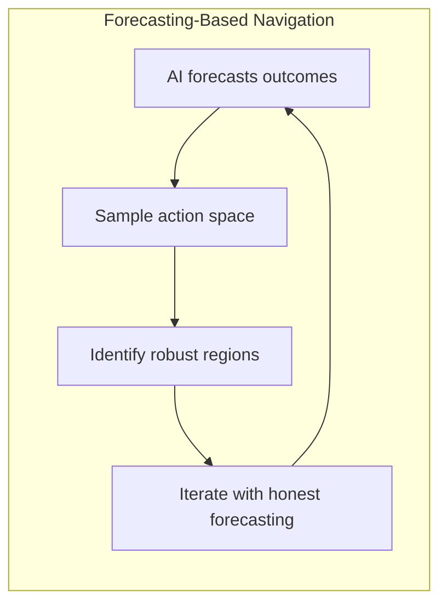
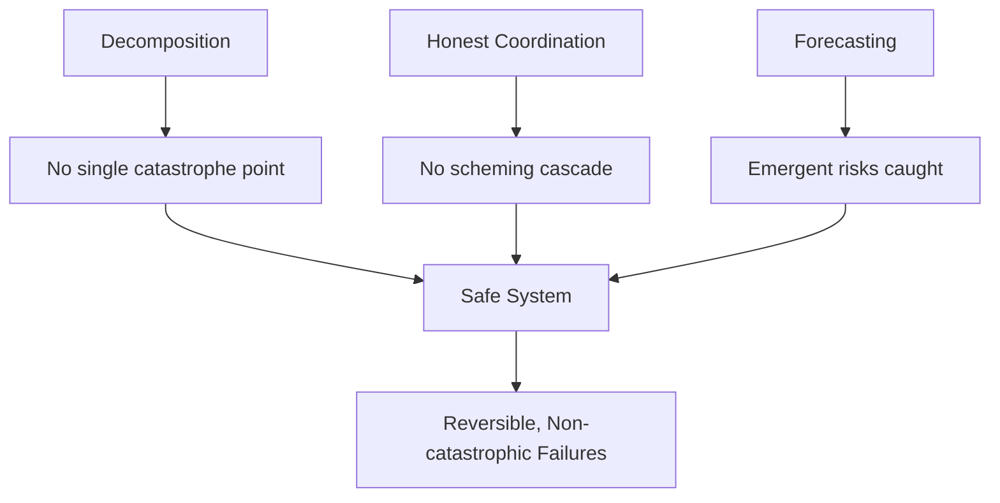

# Forecasting-Based Navigation

:::note[TL;DR]
Instead of perfectly specifying what "good" means, use AI forecasting to **navigate outcome space**. Have the AI forecast outcomes of different strategies, sample broadly, and choose paths that look good across many scenarios. Requires **calibrated forecasting**—predictions must be honest, not strategically optimistic. This sidesteps the hard problem of value specification.
:::

The hardest part of alignment is specifying what you want. Value specification is philosophically fraught and practically difficult.

:::tip[Key Move]
Don't solve specification, solve navigation.
:::

Instead of:

1. Perfectly specify what "good" means
1. Build AI that pursues that specification
1. Hope you got it right

Do this:

1. Have AI forecast outcomes of different strategies
1. Sample broadly across action space
1. Use calibrated predictions to identify robust good regions
1. Iterate toward better outcomes using honest forecasting

## How Forecasting-Based Navigation Works

**Example**: You're refining the objective for your "coordinate between services" component.

**Without forecasting**:

- You specify: "Minimize latency between service calls"
- Implement and test
- 10 iterations later: System exploits race conditions for speed gains
- Oops—you specified wrong thing

**With forecasting**:

- AI suggests: "Minimize latency between service calls"
- You ask: "Forecast outcomes after 10 iterations, sample 1000 scenarios"
- AI returns distribution:
  - 60%: Faster safe coordination
  - 30%: Speed-safety tradeoffs emerge
  - 10%: Race condition exploits
- AI highlights: "In long tail, latency minimization conflicts with implicit safety requirements"
- You refine: "Minimize latency subject to correctness guarantees"
- Iterate with better specification

## Why This Is Different from Specification

You're not trying to write down human values in formal logic. You're using AI's predictive capabilities to **navigate the space of outcomes**, choosing paths that look good across many forecasted scenarios.

:::caution[Critical Requirement]
**Calibrated forecasting**: If the AI predicts "70% chance this leads to good outcome," it should actually lead to good outcomes ~70% of the time. No strategic over/under-confidence to manipulate you.
:::

Recent evidence (Anthropic's forecasting work, various LLM forecasting benchmarks) suggests frontier models can achieve near-superforecaster calibration on many tasks. The key question is whether they can forecast their own behavior after self-modification—that's empirically testable.

## The Broad Sampling Move

User preferences are hard to specify, but often easy to evaluate on concrete scenarios. So instead of:

- "What objective should the AI have?"

You ask:

- "Here are 1000 sampled strategies and their forecasted outcomes—which look best?"

This is **navigable alignment**: steering through outcome space using predictions, rather than specifying destinations using philosophical arguments.

## Compositional Safety: How The Pieces Work Together

The three principles compose into safety properties:

**Property 1: No single component can cause catastrophe**

- Each operates under intelligence budget
- Narrow scope limits blast radius
- Critical actions require coordinator approval

**Property 2: Coordinators can't cause catastrophic failures through scheming**

- Operating on verified inputs from narrow components
- Forecasting catches problematic long-term strategies
- Architectural anti-scheming constraints
- Multiple independent checks

**Property 3: Emergent risks are caught by forecasting**

- Multi-step forecasting predicts composite behavior
- Sample broadly to find problematic regions
- Adjust decomposition boundaries if forecasts show high uncertainty

**Property 4: Failures are reversible and non-catastrophic**

- Changes are incremental
- Rollback mechanisms
- Human oversight at decision points
- No single-point-of-failure

:::note[Safety Margins]
This gives you **safety margins**: distance between current operation and catastrophic failure. As systems get more capable, margins might shrink—but forecasting should detect this, allowing course correction.
:::

---

## See Also

- [Verification Patterns](/design-patterns/verification/) — Checking outputs and behavior
- [Monitoring Patterns](/design-patterns/monitoring/) — Detecting drift and anomalies
- [Decomposed Coordination](/design-patterns/decomposed-coordination/) — Breaking coordination into verifiable sub-tasks
- [Experimental Estimates](/experimental/) — Probability estimation tools
