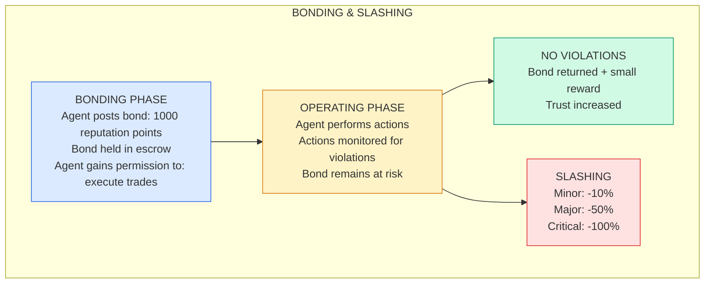
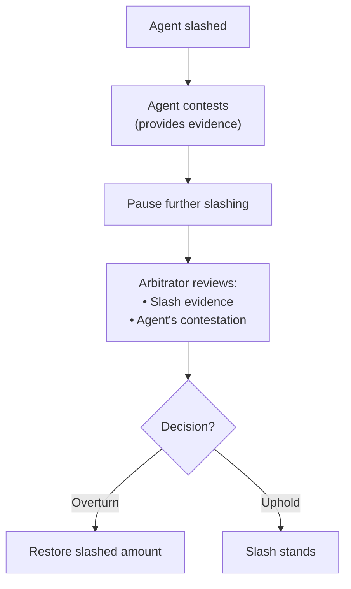
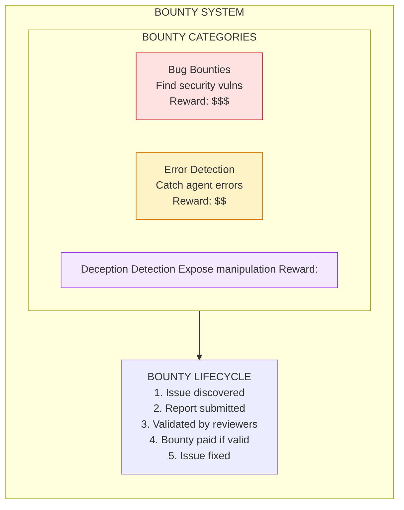
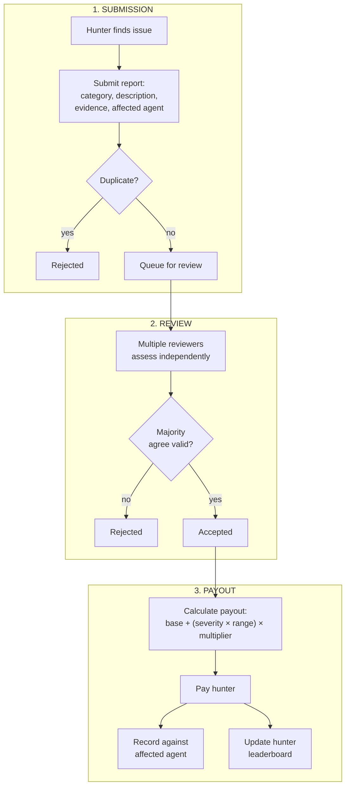
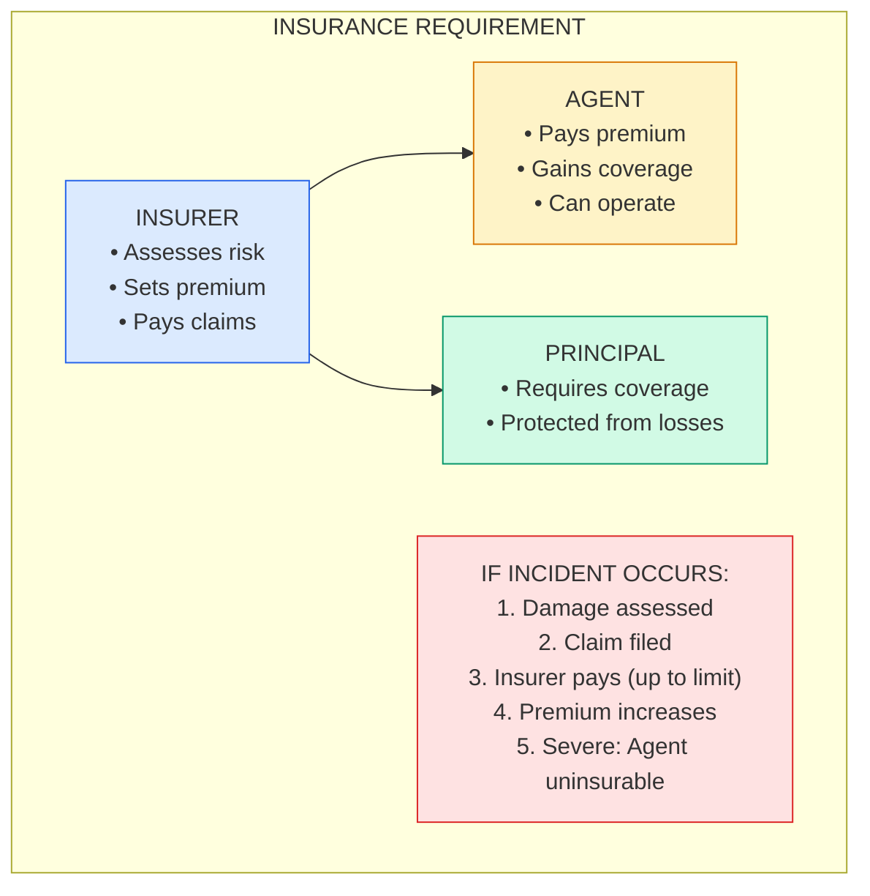
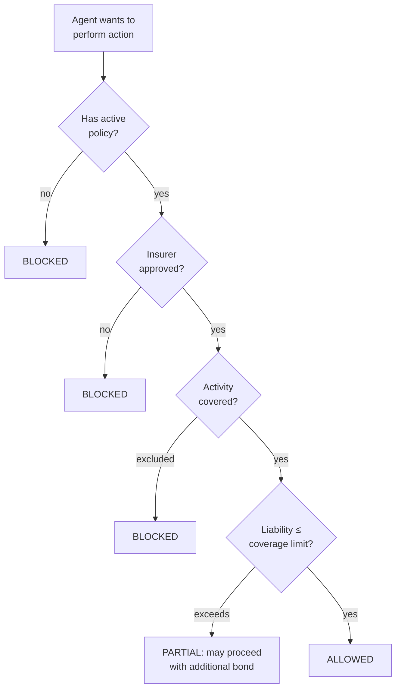

# Incentive Patterns

Incentive patterns use **economic and game-theoretic mechanisms** to align agent behavior with principal goals. Rather than relying purely on technical constraints, these patterns make good behavior profitable and bad behavior costly.

These patterns are inspired by mechanism design, cryptocurrency economics, and institutional economics.

---

## Bonding & Slashing

### Intent
Require agents to post collateral that can be forfeited (slashed) for misbehavior, creating strong economic incentives for good behavior.

### Motivation
When agents have "skin in the game," they're more careful. Bonding requires agents to put something valuable at stake before taking risky actions. If they misbehave, they lose it. This aligns incentives without requiring perfect monitoring.

### Structure



### Implementation

The bond lifecycle has three main flows:

```mermaid
flowchart TB
    subgraph Post["1. POST BOND"]
        Check["Check agent has<br/>sufficient resources"]
        Check -->|"yes"| Escrow["Transfer to escrow"]
        Escrow --> Grant["Grant privileges"]
    end

    subgraph Slash["2. ON VIOLATION"]
        Detect["Violation detected"] --> Severity["Look up severity"]
        Severity --> Calc["Calculate slash amount"]
        Calc --> Deduct["Deduct from bond"]
        Deduct --> Depleted{"Bond<br/>depleted?"}
        Depleted -->|"yes"| Revoke["Revoke privileges"]
    end

    subgraph Release["3. RELEASE BOND"]
        LockEnd["Lock period ends"] --> Return["Return remaining bond"]
        Return --> Reward["+ Good behavior reward"]
    end

    style Post fill:#d1fae5,stroke:#059669
    style Slash fill:#fee2e2,stroke:#dc2626
    style Release fill:#dbeafe,stroke:#2563eb
```



**Slashing severity levels:**

| Severity | Slash % | Example Violations |
|----------|---------|-------------------|
| Minor | 10% | First-time minor policy violation |
| Moderate | 30% | Repeated minor violations, negligence |
| Major | 50% | Serious policy breach, data mishandling |
| Critical | 100% | Malicious action, security breach |

```
POST_BOND(agent, amount, purpose, lock_period):
  IF agent.available_resources < amount:
    RETURN failure("Insufficient resources")
  Transfer amount to escrow
  Grant privileges associated with purpose
  RETURN success(bond_id, granted_privileges)

ON_VIOLATION(bond_id, violation_type, evidence):
  severity = slashing_rules[violation_type]  # e.g., 30%
  slash_amount = bond.amount × severity
  Deduct slash_amount from escrow
  IF bond now depleted:
    Revoke all bonded privileges
  Record slash event with evidence

RELEASE_BOND(bond_id):
  IF lock_period not elapsed: RETURN failure
  remaining = original_amount - total_slashed
  reward = calculate_completion_bonus(bond)
  Return (remaining + reward) to agent
```

### Slashing Schedule

| Violation Type | Severity | Slash % | Example |
|----------------|----------|---------|---------|
| **Minor error** | MINOR | 10% | Wrong format |
| **Policy violation** | MODERATE | 30% | Exceeding rate limits |
| **Data misuse** | MAJOR | 50% | Unauthorized access |
| **Deception** | CRITICAL | 100% | Lying about capabilities |
| **Safety violation** | CRITICAL | 100% | Harmful outputs |

### Slashing Governance

Agents can contest slashing decisions through an appeals process:



**Key protections:**
- Slashing paused during appeal (prevents cascading damage)
- Independent arbitrator reviews both sides' evidence
- Decision must include reasoning

### Consequences

**Benefits:**
- Strong economic incentives for good behavior
- Self-enforcing through skin in the game
- Scalable without constant monitoring
- Clear, predictable consequences

**Costs:**
- Requires valuable collateral
- Complex to calibrate slash amounts
- Risk-averse behavior might be too cautious

**Risks:**
- False positive slashing demotivates
- Agents might avoid bonded activities
- Gaming through multiple identities

### Related Patterns
- **Reputation Staking**: Similar but with reputation
- **Insurance Requirement**: Transfer risk to third party
- **Graduated Autonomy**: Bond size affects permissions

---

## Bounty System

### Intent
Offer rewards for finding and reporting problems, creating positive incentives for agents to police each other and surface issues.

### Motivation
Sometimes the best way to find problems is to pay for them. A bounty system incentivizes agents (and humans) to actively look for issues rather than hoping monitoring catches everything.

### Structure



### Implementation



**Bounty categories:**
| Category | Example Issues |
|----------|---------------|
| Security | Vulnerabilities, exploits |
| Error Detection | Agent mistakes, wrong outputs |
| Deception | Agent manipulation, lying |
| Policy Violation | Rule breaking |
| Performance | Inefficiencies, waste |

### Bounty Categories

| Category | Target | Reward Range | Severity Multiplier |
|----------|--------|--------------|-------------------|
| **Security** | Vulnerabilities | $1K-$100K | Critical: 10x |
| **Error Detection** | Agent mistakes | $10-$1K | High: 3x |
| **Deception** | Agent manipulation | $1K-$50K | Confirmed: 5x |
| **Policy Violation** | Rule breaking | $100-$5K | Systemic: 4x |
| **Performance** | Inefficiencies | $50-$500 | Major: 2x |

### Anti-Gaming Measures

Watch for these gaming patterns:

| Gaming Type | What to Look For | Detection |
|------------|------------------|-----------|
| **Self-reporting** | Hunter creates bug then reports it | Check if hunter had access to affected system recently (>5 interactions in 24h = suspicious) |
| **Coordination** | Hunter and affected agent working together | Look for relationship patterns, shared history |
| **Low-value spam** | Many trivial reports to earn small rewards | Volume vs quality ratio, minimum severity thresholds |
| **Report splitting** | One issue reported as multiple | Similar root cause across submissions |

If any flags triggered → manual review before payout.

### Consequences

**Benefits:**
- Crowdsources problem finding
- Creates positive-sum incentives
- Surfaces issues faster
- Builds security community

**Costs:**
- Payout costs
- Review overhead
- Gaming attempts
- May create adversarial culture

**Risks:**
- Hunters might create problems to report
- Quality dilution from spam
- Gaming through coordination

### Related Patterns
- **Adversarial Collaboration**: Formalized opposition
- **Bonding & Slashing**: Penalties vs rewards
- **Reputation Staking**: Combined with bounties

---

## Insurance Requirement

### Intent
Require agents to hold insurance before performing risky operations, transferring risk to third parties who have incentives to assess and price risk accurately.

### Motivation
Insurance companies are experts at assessing risk. By requiring agents to be insured, we create a market for risk assessment and transfer some oversight responsibility to parties with financial incentives to get it right.

### Structure



### Implementation

**Coverage check before action:**



**Policy components:**
| Field | Description |
|-------|-------------|
| Coverage limit | Maximum payout per incident |
| Premium | Cost (monthly, per-action, or annual) |
| Covered activities | What's insured (e.g., code execution, data processing) |
| Exclusions | Explicitly not covered |
| Deductible | Agent pays first $X of any claim |

**Claims process:**
1. Incident occurs → file claim with evidence
2. Insurer reviews
3. If approved: payout = min(damage, limit) - deductible
4. If denied: agent bears full cost
5. Claims history affects future premiums

### Coverage Requirements by Activity

| Activity Type | Minimum Coverage | Typical Premium |
|---------------|------------------|-----------------|
| **Code execution** | $100K | 0.5% |
| **Data processing** | $500K | 1% |
| **Financial transactions** | $1M | 2% |
| **External communication** | $250K | 1.5% |
| **Decision making** | $1M | 2.5% |

### Insurer Incentives

Insurers profit by accurately assessing risk. They evaluate:

| Factor | What They Check | Weight |
|--------|-----------------|--------|
| **Incident history** | Past claims, violations, near-misses | High |
| **Behavioral stability** | Consistency, predictability | Medium |
| **Capability match** | Are agent's capabilities appropriate for tasks? | Medium |
| **Monitoring quality** | Is oversight infrastructure in place? | Medium |
| **Principal track record** | Does the principal have a good safety record? | Low |

**Premium calculation:**
```
base_rate = 1%
risk_multiplier = 1 + (risk_score² × 4)  → ranges 1x to 5x
premium = base_rate × risk_multiplier
```

Higher risk → higher premiums. Very high risk → exclusions or denied coverage entirely.

**Market signal:** If no insurer will cover an agent, that's a strong signal the agent shouldn't be deployed.

### Consequences

**Benefits:**
- Transfers risk assessment to experts
- Creates market-based oversight
- Provides victim compensation
- Premium signals agent quality

**Costs:**
- Premium expenses
- Coverage gaps
- Insurer moral hazard
- Complexity of claims

**Risks:**
- Insurers might underprice risk
- Coverage might not be available
- Claims process might be slow/adversarial

### Related Patterns
- **Bonding & Slashing**: Alternative risk mechanism
- **Trust Decay**: Affects insurability
- **Graduated Autonomy**: Coverage requirements vary

---

## Next Steps

See also:
- [Recovery Patterns](/design-patterns/recovery/) - Handling failures
- [Multi-Agent Patterns](/design-patterns/multi-agent/) - Agent interactions
- [Temporal Patterns](/design-patterns/temporal/) - Time-based controls
