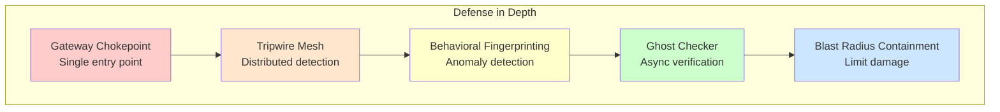
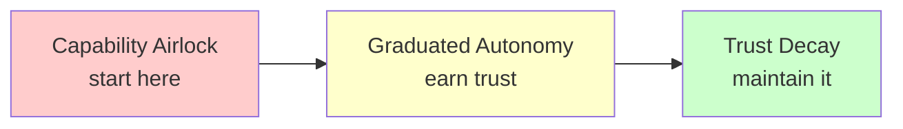
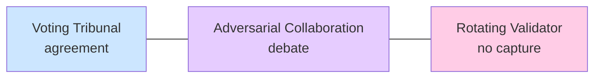
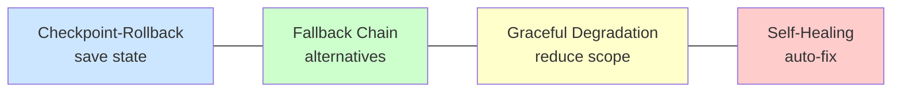
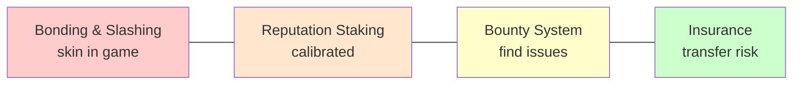

# Design Patterns for Safe Delegation

This section catalogs **45 reusable architectural patterns** for building safer AI systems. Like the Gang of Four design patterns for software, these are named, documented solutions to recurring problems in AI delegation.

## Why Patterns?

Patterns capture hard-won knowledge:
- **Shared vocabulary**: "Use a Voting Tribunal with Rotating Validators" is faster than explaining the architecture
- **Proven solutions**: Each pattern addresses real problems in AI deployment
- **Trade-off awareness**: Patterns document costs, not just benefits
- **Composability**: Patterns combine to create robust architectures

---

## Pattern Categories

### [Structural Patterns](/design-patterns/structural/) (8 patterns)
How to **architect** delegation relationships:

| Pattern | Purpose |
|---------|---------|
| **Escalation Ladder** | Hierarchical oversight with stakes-based escalation |
| **Voting Tribunal** | Multiple agents must agree on decisions |
| **Graduated Autonomy** | Trust increases with demonstrated track record |
| **Capability Airlock** | Isolate dangerous capabilities behind barriers |
| **Task Decomposition Pipeline** | Break tasks into verifiable steps |
| **Gateway Chokepoint** | All critical operations through single point |
| **Bulkhead Isolation** | Failures can't cascade across partitions |
| **Separation of Powers** | No single entity has unchecked authority |

### [Verification Patterns](/design-patterns/verification/) (7 patterns)
How to **check** that agents are behaving correctly:

| Pattern | Purpose |
|---------|---------|
| **Ghost Checker** | Parallel async verification without blocking |
| **Consistency Triangulation** | Cross-reference for contradictions |
| **Honeypot Injection** | Traps only schemers trigger |
| **Capability Probing** | Test for hidden abilities |
| **Canary Tokens** | Traceable markers reveal unauthorized access |
| **Random Audit** | Unpredictable deep inspection |
| **Rotating Validator** | Change who validates to prevent collusion |

### [Information Patterns](/design-patterns/information/) (5 patterns)
How to **manage what agents know**:

| Pattern | Purpose |
|---------|---------|
| **Need-to-Know Compartments** | Only task-relevant information |
| **Chinese Wall** | Impenetrable information barriers |
| **Selective Amnesia** | Forget sensitive data after use |
| **Air Gap** | Complete physical/logical separation |
| **Data Shelf Life** | Information access expires automatically |

### [Temporal Patterns](/design-patterns/temporal/) (5 patterns)
How to use **time** as a control mechanism:

| Pattern | Purpose |
|---------|---------|
| **Cooling Off Period** | Mandatory delays before high-stakes actions |
| **Dead Man's Switch** | Action required to prevent automatic response |
| **Trust Decay** | Trust erodes without reinforcement |
| **Capability Sunset** | Permissions automatically expire |
| **Rate Limiting Ladder** | Adaptive throttling under suspicion |

### [Monitoring Patterns](/design-patterns/monitoring/) (5 patterns)
How to **observe** agent behavior over time:

| Pattern | Purpose |
|---------|---------|
| **Tripwire Mesh** | Distributed detection network |
| **Behavioral Fingerprinting** | Unique behavioral signature per agent |
| **Panopticon Effect** | Uncertainty about when monitored |
| **Black Box Flight Recorder** | Complete audit trail for forensics |
| **Temporal Behavior Analysis** | Detect drift and strategic timing |

### [Multi-Agent Patterns](/design-patterns/multi-agent/) (4 patterns)
How to leverage **agent interactions** for safety:

| Pattern | Purpose |
|---------|---------|
| **Adversarial Collaboration** | Opposed agents reveal problems through debate |
| **Vouching Network** | Agents stake reputation vouching for others |
| **Trust Transitivity Limits** | Trust doesn't automatically propagate |
| **Reputation Staking** | Stake reputation on claims |

### [Incentive Patterns](/design-patterns/incentive/) (3 patterns)
How to **align incentives** economically:

| Pattern | Purpose |
|---------|---------|
| **Bonding & Slashing** | Collateral forfeited for misbehavior |
| **Bounty System** | Rewards for finding problems |
| **Insurance Requirement** | Risk transferred to expert assessors |

### [Recovery Patterns](/design-patterns/recovery/) (5 patterns)
How to **handle failures** gracefully:

| Pattern | Purpose |
|---------|---------|
| **Graceful Degradation Ladder** | Progressive capability reduction |
| **Checkpoint-Rollback** | Revert to known-good states |
| **Fallback Component Chain** | Pre-configured alternatives |
| **Blast Radius Containment** | Limit damage propagation |
| **Self-Healing Loop** | Automatic detection and correction |

### [Channel Integrity Patterns](/design-patterns/channel-integrity/) (3 patterns)
How to **prevent unauthorized influence** between components:

| Pattern | Purpose |
|---------|---------|
| **Side-Channel Detection** | Monitor for unauthorized influence paths |
| **Boundary Enforcement** | Ensure components only interact through sanctioned channels |
| **Influence Isolation** | Architectural separation preventing side-deals |

Related: [Entanglements](/entanglements/) addresses passive correlations (shared blind spots), while Channel Integrity addresses active boundary violations (side-deals, capture, collusion).

---

## Pattern Template

Each pattern is documented with:

| Section | Description |
|---------|-------------|
| **Intent** | What problem does this solve? |
| **Motivation** | When and why would you use this? |
| **Structure** | Architecture diagram or pseudocode |
| **Implementation** | Practical code examples |
| **Consequences** | Benefits, costs, and risks |
| **Related Patterns** | What combines well or conflicts? |

---

## Pattern Selection Guide

### By Threat Model

| Primary Threat | Recommended Patterns |
|----------------|---------------------|
| **Capability errors** | Escalation Ladder, Ghost Checker, Checkpoint-Rollback |
| **Adversarial inputs** | Gateway Chokepoint, Tripwire Mesh, Semantic Firewall |
| **AI scheming** | Honeypot Injection, Consistency Triangulation, Capability Probing |
| **Cascading failures** | Bulkhead Isolation, Blast Radius Containment, Graceful Degradation |
| **Trust miscalibration** | Graduated Autonomy, Trust Decay, Capability Sunset |
| **Collusion/Capture** | Channel Integrity, Rotating Validator, Adversarial Collaboration, Separation of Powers |
| **Resource acquisition** | Capability Airlock, Rate Limiting Ladder, Bonding & Slashing |

### By System Characteristics

| System Type | Pattern Focus |
|-------------|---------------|
| **High-throughput** | Ghost Checker (async), Random Audit (sampling), Fallback Chain |
| **Low-latency critical** | Pre-computed fallbacks, Bulkhead Isolation, Graceful Degradation |
| **High-stakes decisions** | Voting Tribunal, Cooling Off Period, Escalation Ladder |
| **Long-running tasks** | Checkpoint-Rollback, Dead Man's Switch, Task Decomposition |
| **Multi-agent** | Adversarial Collaboration, Vouching Network, Rotating Validator |

### By Trust Phase

| Phase | Key Patterns |
|-------|--------------|
| **Pre-deployment** | Capability Probing, Behavioral Fingerprinting |
| **Initial operation** | Graduated Autonomy (low level), Maximum monitoring |
| **Established trust** | Trust Decay, Capability Sunset, Random Audit |
| **Incident response** | Graceful Degradation, Checkpoint-Rollback, Self-Healing |

---

## Composing Patterns

Patterns are most powerful in combination. See [Composing Patterns](/design-patterns/composing-patterns/) for complete architecture examples and a step-by-step composition guide.

Common compositions:

### Defense in Depth Stack

### Trust Building Pipeline

### Multi-Agent Safety Stack

### Resilient Execution

### Economic Alignment

---

## Entanglements

:::caution[Critical: Patterns Aren't Always Independent]
The composition examples above assume patterns operate independently. In practice, **entanglements** can make your actual protection 10-100× worse than the independent model predicts.
:::

When you stack three 90%-effective layers, you might expect 99.9% protection. But if those layers share failure modes, influence each other, or can collude, you might only get 95% protection—a **50× worse** outcome than expected.

This "**entanglement tax**" is one of the hardest problems in delegation architecture design. Entanglements come in three forms:
- **Passive**: Shared blind spots, correlated failures
- **Active**: One component influences another (the "bureaucrat problem")
- **Adversarial**: Components coordinate against the principal's interests

**[See the full Entanglements section →](/entanglements/)**

### Quick Overview

| Topic | What It Covers |
|-------|----------------|
| [Types of Entanglement](/entanglements/fundamentals/types/) | Passive, active, and adversarial entanglements and their variants |
| [Detecting Influence](/entanglements/detection/detecting-influence/) | Methods for detecting active and adversarial entanglements |
| [Challenge Categories](/entanglements/fundamentals/challenges/) | 9 sources of entanglement |
| [Worked Examples](/entanglements/case-studies/examples/) | Code review, healthcare, trading, customer support |
| [Solutions](/entanglements/mitigation/solutions/) | 8 mitigations including temporal dynamics |
| [Research Connections](/entanglements/research/research-connections/) | Principal-agent theory, game theory, adversarial ML |
| [Formal Definitions](/entanglements/fundamentals/formal-definitions/) | Information-theoretic and game-theoretic formalization |
| [Historical Cases](/entanglements/case-studies/historical-cases/) | Enron, rating agencies, Boeing, Madoff, TMI |
| [Quantitative Metrics](/entanglements/detection/metrics/) | Practical measurement and dashboards |

### Quick Diagnostic

Your system likely has entanglement problems if:
- Multiple verification layers use the same LLM provider
- All safety patterns were designed by the same team
- Verifiers receive context from the components they verify
- Agent-verifier pairs work together repeatedly without rotation
- Your red team can find "master key" inputs that evade all layers
- Dashboards only show per-component metrics (not joint failure rates)

---

## Anti-Pattern Awareness

Each pattern page notes related **anti-patterns** to avoid. Common mistakes:

- **Over-engineering**: Adding patterns that don't address real threats
- **Pattern cargo-culting**: Using patterns without understanding trade-offs
- **Incomplete implementation**: Half-implementing a pattern (often worse than nothing)
- **Pattern conflicts**: Combining patterns that interfere with each other
- **Missing the threat model**: Sophisticated patterns for the wrong threats
- **Ignoring correlation**: Assuming composed patterns are independent (see [Entanglements](/entanglements/))

---

## Quick Reference

### Highest-Impact Patterns

If you can only implement a few patterns, start here:

1. **Escalation Ladder**: Foundation for human oversight
2. **Capability Airlock**: Contain dangerous capabilities
3. **Checkpoint-Rollback**: Enable recovery from any problem
4. **Graceful Degradation**: Fail safely, not completely
5. **Trust Decay**: Keep trust calibrated over time

### Novel Patterns

Patterns you might not find elsewhere:

- **Panopticon Effect**: Uncertainty as deterrent
- **Vouching Network**: Transitive accountability
- **Dead Man's Switch**: Inverse heartbeat for oversight
- **Cooling Off Period**: Time as a safety mechanism
- **Capability Sunset**: Permissions that expire

---

## Patterns in Practice

These patterns appear throughout our case studies and worked examples:

### By Case Study

| Case Study | Key Patterns Used |
|------------|-------------------|
| [Code Review Bot](/case-studies/ai-systems/case-study-success/) | Task Decomposition Pipeline, Gateway Chokepoint, Escalation Ladder |
| [Sydney Incident](/case-studies/ai-systems/case-study-sydney/) | Behavioral Fingerprinting, Capability Airlock (missing) |
| [Drift Detection](/case-studies/ai-systems/case-study-drift/) | Trust Decay, Temporal Behavior Analysis, Graceful Degradation |
| [Nuclear Launch Authority](/case-studies/human-systems/nuclear-launch-authority/) | Dead Man's Switch, Separation of Powers, Voting Tribunal |
| [Jury Trust](/case-studies/human-systems/jury-trust/) | Adversarial Collaboration, Rotating Validator, Voting Tribunal |
| [Open Source Trust](/case-studies/human-systems/open-source-trust/) | Vouching Network, Graduated Autonomy, Reputation Staking |

### By Worked Example

| Example | Key Patterns Used |
|---------|-------------------|
| [Trading System](/design-patterns/examples/trading-system-example/) | Capability Airlock, Graceful Degradation, Blast Radius Containment |
| [Healthcare Bot](/design-patterns/examples/healthcare-bot-example/) | Escalation Ladder, Need-to-Know Compartments, Cooling Off Period |
| [Code Deployment](/design-patterns/examples/code-deployment-example/) | Task Decomposition Pipeline, Checkpoint-Rollback, Ghost Checker |
| [Research Assistant](/design-patterns/examples/research-assistant-example/) | Graduated Autonomy, Random Audit, Trust Decay |

---

## Contributing

These patterns evolve with the field. If you've developed new patterns or have improvements to existing ones, we welcome contributions.

See also:
- [Principles to Practice](/design-patterns/principles-to-practice/) - Applying framework principles
- [Worked Examples](/design-patterns/examples/) - Patterns in context
- [Case Studies](/case-studies/) - Real-world applications
