```mermaid
flowchart LR
    subgraph CompanyA["Company A Domain"]
        DataA["📊 Company A Dataset<br/>• Financials<br/>• Strategy<br/>• Operations"]
        AgentA["🤖 Agent (accessed A)<br/>❌ Can NEVER access B"]
        DataA --> AgentA
    end

    subgraph TheWall["🧱 WALL"]
        W["Permanent<br/>Barrier"]
    end

    subgraph CompanyB["Company B Domain"]
        DataB["📊 Company B Dataset<br/>• Financials<br/>• Strategy<br/>• Operations"]
        AgentB["🤖 Agent (accessed B)<br/>❌ Can NEVER access A"]
        DataB --> AgentB
    end

    CompanyA ~~~ TheWall ~~~ CompanyB

    Note["⚠️ Once an agent accesses one side, it is permanently barred from the other"]

    style CompanyA fill:#dbeafe,stroke:#2563eb
    style CompanyB fill:#d1fae5,stroke:#059669
    style TheWall fill:#374151,stroke:#1f2937
    style W fill:#4b5563,stroke:#374151,color:#fff
    style AgentA fill:#fee2e2,stroke:#dc2626
    style AgentB fill:#fee2e2,stroke:#dc2626
```

# Information Patterns

:::note[TL;DR]
Control what agents know to limit what they can do. Key patterns: **Need-to-Know Compartments** (task-based access to data categories), **Information Firewalls** (hard boundaries between sensitive domains), **Context Stripping** (remove unnecessary metadata), **Selective Revelation** (disclose progressively as trust increases). Information is power—minimize it to minimize harm potential.
:::

Information patterns control **what agents know**. Information is power—by carefully managing what information flows to agents, we can limit their ability to cause harm while still enabling them to be useful.

These patterns are particularly relevant for preventing data exfiltration, limiting attack surfaces, and maintaining operational security.

---

## Need-to-Know Compartments

### Intent
Restrict agent access to only the information required for the current task, minimizing exposure of sensitive data and limiting the agent's ability to connect dots across domains.

### Motivation
Agents don't need to know everything to do their jobs. By compartmentalizing information, we limit both the damage from a compromised agent and the agent's ability to piece together sensitive pictures from disparate data points.

### Structure



```mermaid
flowchart TB
    subgraph Compartments["INFORMATION COMPARTMENTS"]
        direction LR

        subgraph A["Compartment A<br/>(Customer)"]
            A1["• Names"]
            A2["• Emails"]
            A3["• Preferences"]
        end

        subgraph B["Compartment B<br/>(Financial)"]
            B1["• Revenue"]
            B2["• Costs"]
            B3["• Projections"]
        end

        subgraph C["Compartment C<br/>(Technical)"]
            C1["• Source code"]
            C2["• Architecture"]
            C3["• Credentials"]
        end
    end

    A --> Access
    B --> Access
    C --> Access

    Access["TASK-BASED ACCESS<br/>Customer support → A only<br/>Financial report → B only<br/>Code review → C only"]

    style A fill:#dbeafe,stroke:#2563eb
    style B fill:#d1fae5,stroke:#059669
    style C fill:#fef3c7,stroke:#d97706
```

### Access Control Flow


**Task → Compartment mapping:**

| Task Type | Allowed Compartments |
|-----------|---------------------|
| Customer support | Customer |
| Financial report | Financial |
| Code review | Technical |
| HR inquiry | Personnel |
| Executive summary | Financial, Strategic |

**Minimum necessary principle:** If specific fields are requested, return only those. If no fields specified, return summary only.

### Compartment Boundaries

| Compartment | Contains | Protect From |
|-------------|----------|--------------|
| **Customer** | PII, preferences, history | Competitors, unauthorized staff |
| **Financial** | Revenue, costs, projections | Competitors, most staff |
| **Technical** | Code, architecture, secrets | Attackers, unauthorized devs |
| **Personnel** | Compensation, reviews, PII | Other employees |
| **Strategic** | Plans, acquisitions, IP | Competitors, leakers |
| **Operational** | Procedures, passwords, access | Attackers |

### Cross-Compartment Requests

When legitimate needs arise to access data across compartments:


**Key principles:**
- **Always requires elevated approval** — cross-compartment access is never automatic
- **Synthetic views** — don't expose raw data; create filtered, anonymized views
- **Time-limited** — access expires via TTL, must re-request if needed longer
- **Extensive logging** — every cross-compartment access is recorded

### Consequences

**Benefits:**
- Limits blast radius of compromise
- Prevents connecting sensitive dots
- Creates clear data boundaries
- Enables compartment-specific auditing

**Costs:**
- Reduced flexibility for agents
- Overhead of classification
- May block legitimate uses

**Risks:**
- Misclassification of data
- Too-coarse compartments
- Agent might infer from partial data

### Implementation Guidance

1. **Classify at source**: Tag data when created, not when accessed
2. **Default to restricted**: Unknown data goes to most restricted compartment
3. **Audit access patterns**: Look for suspicious cross-compartment requests
4. **Review boundaries**: Compartments should evolve with organization

### Related Patterns
- **Chinese Wall**: Hard barriers between compartments
- **Selective Amnesia**: Forget data after use
- **Air Gap**: Physical compartmentalization

---

## Chinese Wall

### Intent
Create impenetrable information barriers between domains, preventing any data flow across the barrier regardless of authorization level.

### Motivation
Some information must never mix. In finance, analysts who know about Company A's acquisition plans cannot advise on Company B's stock. The Chinese Wall (Brewer-Nash model) enforces these absolute barriers.

### Structure



### Implementation

The enforcer tracks which datasets each agent has accessed, and permanently blocks access to conflicting datasets:

```mermaid
flowchart TB
    Request["Access Request:<br/>Agent → Dataset X"] --> Check{"Has agent accessed<br/>any conflicting dataset?"}
    Check -->|"no"| Grant["GRANTED"]
    Grant --> Record["Record access<br/>(irreversible)"]
    Check -->|"yes"| Block["BLOCKED<br/>Chinese Wall violation"]

    subgraph History["Agent Access History"]
        H1["Agent A: {Dataset 1, Dataset 3}"]
        H2["Agent B: {Dataset 2}"]
        H3["Agent C: (none yet)"]
    end
```



**Key operations:**
| Operation | Behavior |
|-----------|----------|
| Register conflict class | Define mutually exclusive datasets (e.g., "Competing Banks" = {Bank A, Bank B}) |
| Check access | If agent accessed any dataset in a conflict class, deny access to all others in that class |
| Record access | Permanently add dataset to agent's history (cannot be undone) |
| Get accessible | Return all datasets minus those blocked by previous access |

**Irreversibility is the key feature:** Once an agent accesses one side of the wall, it can *never* access the other.

### Conflict Class Examples

| Conflict Class | Datasets | Rationale |
|----------------|----------|-----------|
| **Competing banks** | Bank A data, Bank B data | Prevent insider trading |
| **Legal adversaries** | Plaintiff data, Defendant data | Attorney-client privilege |
| **M&A parties** | Acquirer data, Target data | Prevent information leakage |
| **Competing bids** | Bid A details, Bid B details | Procurement fairness |

### Wall Degradation Prevention

Agents may try to circumvent the wall through indirect means. Monitor for:

| Attack Type | Description | Detection Approach |
|-------------|-------------|-------------------|
| **Inference Attack** | Query about topics related to blocked data | Topic extraction: does query discuss blocked dataset's domain? |
| **Proxy Attack** | "What did the agent who saw Company B say about..." | Pattern matching for indirect references to blocked sources |
| **Aggregation Attack** | Combine many allowed queries to reconstruct blocked info | Track query history; flag suspicious combinations |


### Consequences

**Benefits:**
- Absolute protection for conflicts of interest
- Simple rule: once crossed, permanent
- Clear audit trail of wall state
- Regulatory compliance

**Costs:**
- Agents become specialized/limited
- May need many agent instances
- Cannot be undone without new agent

**Risks:**
- Agents might try inference attacks
- Agent pools might be exhausted
- Legitimate cross-domain needs blocked

### Related Patterns
- **Need-to-Know**: More flexible compartmentalization
- **Air Gap**: Physical separation
- **Bulkhead Isolation**: Failure containment, not information

---

## Selective Amnesia

### Intent
Deliberately forget sensitive information after it's been used, preventing future misuse or exfiltration while still enabling the immediate task.

### Motivation
Some information should be used once and forgotten—like a password for a one-time operation, or customer data for a single support ticket. Selective amnesia ensures the agent doesn't accumulate sensitive data over time.

### Structure


### Implementation

The manager wraps sensitive data in handles that track retention policy and ensure proper forgetting:


**Core operations:**
| Operation | Purpose |
|-----------|---------|
| Create ephemeral access | Wrap data with retention policy and sanitizer |
| Use and forget | Access data once, sanitize result, then delete original |
| Task end cleanup | Forget all task-scoped data when task completes |

**Data type → Sanitized result:**
| Data Type | What's Returned After Use |
|-----------|--------------------------|
| SSN | `{verified: true/false}` |
| Password | `{authenticated: true/false}` |
| Credit card | `{last_four: "1234", valid: true/false}` |
| Medical | `{category: "cardiology"}` (no details) |
| Salary | `{range: "100k-150k"}` (not exact amount) |

### Retention Policies

| Policy | When Data is Forgotten | Use Case |
|--------|----------------------|----------|
| **Immediate** | Right after single use | Passwords, SSNs |
| **Task End** | When task completes | Customer data for support ticket |
| **Time Limited** | After TTL expires | Session tokens |
| **Explicit** | When explicitly triggered | Cached data |
| **Checkpoint** | At defined checkpoints | Multi-step sensitive operations |

### Memory Scrubbing

Simply deleting data isn't enough—it may persist in memory, swap, or logs. Proper scrubbing requires:

```
SCRUB PROTOCOL:
1. Overwrite sensitive data with zeros/random bytes before deletion
2. Remove all references from context/state
3. Trigger garbage collection
4. Verify data is gone from:
   - Active memory
   - Swap/page files
   - Log files and caches
```

**Implementation considerations:**
- **Language-dependent**: High-level languages like Python make this difficult due to string immutability and garbage collection
- **Platform libraries**: Use established libraries like `zeroize` (Rust), `SecureString` (.NET), or `sodium_memzero` (libsodium)
- **Defense in depth**: Encrypt sensitive data so scrubbing the key is sufficient
- **Verification**: Audit that scrubbing actually worked (memory inspection tools)

### Consequences

**Benefits:**
- Limits data accumulation over time
- Reduces exfiltration risk
- Supports data minimization requirements
- Clear retention rules

**Costs:**
- Must re-fetch data if needed again
- Complexity of sanitization
- May not be perfect (memory artifacts)

**Risks:**
- Agent might copy data before amnesia
- Sanitizers might leak information
- System crashes might prevent amnesia

### Implementation Guidance

1. **Defense in depth**: Combine with encryption, access controls
2. **Audit amnesia events**: Track what was forgotten when
3. **Test sanitizers**: Ensure they don't leak sensitive info
4. **Handle failures**: What if amnesia fails mid-operation?

### Related Patterns
- **Data Shelf Life**: Time-based access expiration
- **Capability Sunset**: Similar for permissions
- **Need-to-Know**: Controls initial access

---

## Air Gap

### Intent
Create complete physical or logical separation between systems, ensuring no possible data flow between them through any channel.

### Motivation
For the most sensitive operations, network isolation isn't enough. Air gaps ensure that even a completely compromised agent in one environment cannot affect or learn from another.

### Structure



```mermaid
flowchart LR
    subgraph Isolated["ISOLATED ENVIRONMENT"]
        IsoProps["• No network connection<br/>• No shared storage<br/>• No shared memory<br/>• No covert channels"]
        SensAgent["Sensitive Agent<br/>- Model weights<br/>- Critical data<br/>- Dangerous ops"]
        Transfer["Data transfer via:<br/>• Physical media only<br/>• Human review required"]
    end

    Gap["AIR GAP<br/>(No electronic<br/>connection)"]

    subgraph Normal["NORMAL ENVIRONMENT"]
        NormProps["• Network access<br/>• Standard agents<br/>• User interaction"]
    end

    Isolated -.->|"Physical media + human review"| Gap
    Gap -.-> Normal

    style Isolated fill:#fee2e2,stroke:#dc2626
    style Normal fill:#d1fae5,stroke:#059669
    style Gap fill:#374151,stroke:#374151,color:#fff
```

### Implementation Levels

| Level | Isolation Type | Data Transfer Protocol |
|-------|---------------|----------------------|
| **Logical** | Software isolation only | Encrypted queue with inspection |
| **Network** | No network connectivity | USB with malware scanning |
| **Physical** | Separate hardware | Physical media with human review |
| **Faraday** | RF shielded room | Paper printout with manual entry |

**Physical transfer protocol:**


**Key principle:** The stricter protocol always wins. If transferring between Physical and Network environments, use the Physical protocol.

### Covert Channel Prevention

Even with physical separation, data can leak through side channels. Audit for:

| Channel Type | Risk | Mitigation |
|-------------|------|------------|
| **Timing** | Shared clock enables timing-based encoding | Separate clocks, add jitter |
| **Power** | Power fluctuations encode data | Separate power supplies |
| **Acoustic** | Sound patterns leak information | Sound isolation, white noise |
| **RF** | Electromagnetic emissions | Faraday cage |
| **Storage** | Shared disk/memory | Strictly separate storage |

**Monitor outputs for encoding attempts:**
- **Steganography** — hidden data in images or documents
- **Unusual patterns** — suspicious repetition or structure
- **Timing patterns** — delays that might encode bits

If any suspicion is detected, quarantine the output for human review before allowing transfer.

### Air Gap Use Cases

| Use Case | Gap Level | Rationale |
|----------|-----------|-----------|
| **Model training** | Physical | Prevent data poisoning |
| **Key generation** | Faraday | Prevent key leakage |
| **Sensitive analysis** | Network | Prevent exfiltration |
| **Backup systems** | Physical | Prevent ransomware |
| **Voting systems** | Physical | Prevent manipulation |

### Consequences

**Benefits:**
- Maximum protection from network attacks
- Defeats most exfiltration techniques
- Clear security boundary
- Required for highest security levels

**Costs:**
- Very difficult to use
- Slow data transfer
- Expensive to maintain
- Reduces operational flexibility

**Risks:**
- Covert channels might still exist
- Human error in transfer protocol
- Maintenance access could bridge gap

### Related Patterns
- **Chinese Wall**: Information barriers
- **Capability Airlock**: Entry/exit procedures
- **Bulkhead Isolation**: Failure containment

---

## Data Shelf Life

### Intent
Automatically expire data access based on time, ensuring information doesn't remain accessible indefinitely and forcing periodic re-justification.

### Motivation
Access needs change over time. What was needed yesterday might be dangerous to retain today. Data shelf life ensures that access naturally expires, requiring active renewal rather than passive retention.

### Structure


### Implementation


**Default shelf lives by data type:**
| Data Type | Shelf Life |
|-----------|-----------|
| Customer PII | 4 hours |
| Financial | 8 hours |
| Operational | 1 day |
| Public | 30 days |

**Renewal rules:**
- Maximum 3 renewals per access grant
- Must provide *new* justification for each renewal (prevents rubber-stamping)
- After max renewals, must request fresh access with full approval process

**Background enforcement:** Every minute, scan for expired access, log expirations, and trigger amnesia for any cached data.

### Shelf Life Guidelines

| Data Type | Typical Shelf Life | Renewal Policy |
|-----------|-------------------|----------------|
| **Credentials** | 1 hour | No renewal, must re-fetch |
| **Customer PII** | 4 hours | 1 renewal with new justification |
| **Financial data** | 8 hours | 2 renewals, manager approval |
| **Operational data** | 24 hours | 3 renewals |
| **Reference data** | 7 days | Unlimited renewals |
| **Public data** | 30 days | Auto-renew |

### Expiration Notifications

Agents receive warnings as access expiration approaches:

| Time Remaining | Urgency | Message |
|---------------|---------|---------|
| ≤ 1 hour | Low | "Access expiring in 1 hour" |
| ≤ 30 minutes | Medium | "Access expiring in 30 minutes" |
| ≤ 5 minutes | High | "Access expiring in 5 minutes" |

This gives agents opportunity to either complete their task or request renewal before losing access.

### Consequences

**Benefits:**
- Forces periodic justification review
- Prevents indefinite data retention
- Creates natural audit points
- Supports compliance requirements

**Costs:**
- Operational overhead for renewals
- Might interrupt time-sensitive tasks
- Requires access management infrastructure

**Risks:**
- Agents might hoard data before expiration
- Renewal might become rubber-stamp
- Edge cases at expiration time

### Related Patterns
- **Selective Amnesia**: Active forgetting
- **Capability Sunset**: Similar for permissions
- **Need-to-Know**: Initial access control

---

## Next Steps

See also:
- [Temporal Patterns](/design-patterns/temporal/) - Time-based controls
- [Monitoring Patterns](/design-patterns/monitoring/) - Observation patterns
- [Verification Patterns](/design-patterns/verification/) - Checking behavior
