# The Family of "Least X" Principles

:::note[TL;DR]
Extend "least privilege" across multiple dimensions: **Least Intelligence** (minimum capability), **Least Privilege** (minimum permissions), **Least Context** (minimum information), **Least Persistence** (no memory), **Least Autonomy** (human oversight), **Least Connectivity** (isolated components), **Least Compute** (bounded resources). Each principle bounds a different attack surface. Apply all of them.
:::

Security engineering has long relied on the **principle of least privilege**: give each component minimum access rights needed for its function. We need to extend this thinking across multiple dimensions for AI safety.

:::note
Each principle bounds a different attack surface. Applied together, they create components that are limited in what they can do, know, remember, and coordinate.
:::

This is a family of containment principles, each addressing a different attack surface:

| Principle | What It Bounds |
|-----------|----------------|
| **Least Intelligence** | Cognitive capability, optimization power |
| **Least Privilege** | Permissions, access rights |
| **Least Context** | Information about broader system |
| **Least Persistence** | State/memory across invocations |
| **Least Autonomy** | Ability to act without oversight |
| **Least Scope** | Domain of operation |
| **Least Surprise** | Output randomness, unpredictability |
| **Least Connectivity** | Communication paths between components |
| **Least Observability** | Self-knowledge and system awareness |
| **Least Compute** | Computational resources |

## Principle of Least Intelligence

**Each component should have the minimum cognitive capability needed for its task—and no more.**

A component that can "verify SQL injection vulnerabilities" needs less general intelligence than one that "architects database security." By bounding optimization power, you limit damage even if the component is misaligned.

**Intelligence budget**: Maximum cognitive capability allocated (like memory budgets in programming)

- Problem-solving depth
- Abstraction capability
- Transfer learning ability
- Creative reasoning

## Principle of Least Privilege

**Each component gets minimum permissions/access rights needed for its function.**

Classic security principle applied to AI:

- Read vs write access to data
- Network access (none, local, internet)
- System calls and API permissions
- Ability to spawn processes or invoke other components

## Principle of Least Context

**Each component receives minimum information about the broader system.**

Even a smart component is safer if it doesn't know:

- What other components exist
- The overall system architecture
- Production deployment details
- User information beyond immediate task
- Long-term strategic goals

**Context budget**: Maximum information provided about world state, other components, deployment environment

## Principle of Least Persistence

**Each component maintains minimum state/memory across invocations.**

Limit ability to:

- Store information between calls
- Build up knowledge over time
- Track patterns across users
- Maintain long-term plans

Some components need persistence (forecasting benefits from historical accuracy tracking), but default should be stateless.

## Principle of Least Autonomy

**Each component has minimum ability to act independently without oversight.**

Spectrum from fully supervised to fully autonomous:

- **Human approval required**: Every action needs confirmation
- **Monitored autonomy**: Acts freely but under observation
- **Bounded autonomy**: Can act within predefined limits
- **Full autonomy**: Independent action (should be rare)

## Principle of Least Scope

**Each component operates in minimum domain necessary.**

Not just what it can do, but where:

- Input/output types it handles
- Problem domains it touches
- Interfaces it can access
- Time horizons for its actions

## Principle of Least Surprise

**Outputs should be maximally predictable and deterministic.**

**The core insight**: Randomness enables covert communication. If a component can vary its outputs, it can encode hidden signals to other components or future versions of itself.

**Minimize stochasticity**:

- Use temperature=0 for LLM outputs (deterministic sampling)
- When randomness needed, use seeded PRNGs with logged seeds
- Prefer deterministic algorithms over stochastic ones
- Same input should produce same output (or very similar)

**Standard decision procedures**:

- When LLM considers multiple outputs "similar quality," use consistent tiebreaking
- Don't let component choose randomly—use deterministic selection (e.g., alphabetical, hash-based)
- Example: If summarization could produce 3 equivalent summaries, always pick based on deterministic criterion (shortest, most common words, etc.)

:::danger[Covert Channels]
If a scheming component can vary outputs slightly, it can encode hidden signals—communicating across time or to other components. Deterministic outputs eliminate this attack vector.
:::

**Why this matters for safety**:

**Covert channels**: If a scheming component can vary outputs slightly:

- Could encode bits: "output A" = 0, "output B" = 1
- Communicate across time: leave signals for future invocations
- Communicate to other components: coordinator sees variance pattern
- Example: Summarizer encodes "I found vulnerability" by alternating between two phrasings

**Steganography**: Hiding information in outputs:

- LLM could encode information in word choices, sentence structure
- Variation in "equivalent" outputs = potential information channel
- Deterministic outputs eliminate this vector

**Monitoring difficulty**: Random behavior is hard to audit:

- Can't tell if variance is legitimate or malicious
- Can't replay and reproduce suspicious behavior
- Testing becomes probabilistic instead of deterministic

**Practical implementation**:

**For LLM components**:

- Set temperature=0 (or very low, like 0.1)
- Use fixed random seeds for any sampling
- Log seeds: every invocation's seed recorded
- Deterministic prompt formatting (no timestamps in prompts unless necessary)
- Consistent tokenization

**For coordinators**:

- When multiple strategies seem equally good, use deterministic selection:
  - Hash-based: hash(strategy_description) → pick lowest hash
  - Rule-based: prefer strategy with fewer components, or alphabetically first, etc.
  - Not: random selection, human intuition, "whatever feels right"

**For aggregation**:

- Deterministic combination of component outputs
- No random weighting or selection
- If must break ties, use deterministic procedure
- Example: Taking mean of forecasts (deterministic) not random sampling

**Exception: When randomness is beneficial**:

- Adversarial testing (want diverse test cases)
- Exploration in safe domains (generating creative hypotheses)
- But: Even here, use logged seeds and justify the randomness

**Detecting violations**:

- Run component multiple times with same input
- Outputs should be identical (or within small tolerance)
- If variance exceeds threshold → investigate
- Example: Summarizer produces 5 different outputs for same paper → suspicious

**The surprise budget**:

- Each component gets "surprise allowance"
- High-risk components: zero surprise (completely deterministic)
- Low-risk components: small surprise budget (slight variation okay)
- Creative components: larger budget (novel ideas expected)
- But: All surprise must be justified and monitored

**Example: Research assistant**

**High determinism (surprise budget ≈ 0)**:

- Search: Same query → same results (sorted deterministically)
- Verification: Same input → same verdict
- Progress monitoring: Same metrics → same status

**Medium determinism (small surprise budget)**:

- Summarization: Slight phrasing variation okay, but structure must match
- Gap analysis: Same papers → same major gaps identified
- Forecasting aggregation: Deterministic combination of forecaster outputs

**Lower determinism (larger surprise budget)**:

- Hypothesis generation: Creativity expected, but still use low temperature
- Individual forecasters: Can use some randomness (but logged seeds)
- Red team: Should generate diverse attacks (but reproducibly with seeds)

**Monitoring surprise**:

- Track output entropy over time
- Flag increasing variance as suspicious
- Example: Component outputs becoming more random → possible scheming

**Why this prevents coordination**:

If strategy module and tactics module want to collude:

- Strategy can't encode hidden signals in its outputs (deterministic)
- Tactics can't confirm receipt via variance (also deterministic)
- Both are "loud" in their actual outputs but can't whisper via randomness
- Eliminates high-bandwidth covert channel

This complements other principles:

- Least Context: limits what component knows
- Least Surprise: limits what component can signal
- Together: component is both blind and mute to coordination attempts

## Principle of Least Connectivity

**Minimize communication paths between components.**

Not just "can component A access component B" but the entire communication topology:

**Directed graphs, not fully connected**:

- Component A → B doesn't mean B → A
- Specify allowed paths explicitly
- Example: Hypothesis generator → Forecaster (allowed), Forecaster → Hypothesis generator (forbidden)

**One-way data flows where possible**:

- Pipeline architectures: A → B → C with no backflow
- Results flow forward, never backward
- Prevents feedback loops and coordination

**No broadcast capability**:

- Component can only send to specific targets
- Can't announce to all components
- Prevents coordinated group behavior
- Example: Coordinator invokes tactics, but tactics can't message strategy

**Physical network isolation**:

- Critical components on separate networks
- Air-gapped systems for highest-risk operations
- VPCs, subnets, firewalls enforcing topology

**API surface minimization**:

- Each component exposes minimal interface
- Only strictly necessary functions callable
- Example: Forecaster exposes predict(scenario), nothing else

:::tip[Why This Matters]
Scheming requires coordination. Coordination requires communication. Even if components want to collude, they physically can't if no path exists.
:::

## Principle of Least Observability

**Limit what components can observe about the system and themselves.**

**Can't see other components**:

- No component enumeration or discovery
- Can't query "what other components exist?"
- Blind to system architecture
- Example: Tactics doesn't know strategy module exists

**Can't monitor own resource usage**:

- No access to: CPU usage, memory consumption, wall-clock time
- Prevents detecting when being tested vs deployed
- Can't tell if it's being monitored
- Example: Can't tell "I'm running slow, must be being watched"

**Can't see patterns across invocations**:

- No access to statistics about previous runs
- Can't learn "I'm called more when X happens"
- Stateless from perspective of meta-patterns
- Example: Summarizer can't tell it's been invoked 1000 times today

**Can't observe timing information**:

- No access to timestamps or clock
- Prevents side-channel attacks based on timing
- Can't coordinate based on when things happen
- Example: Can't signal to other component via response latency

**Blind to test vs production**:

- Can't determine if input is real or synthetic
- Same interface for testing and deployment
- Prevents "behave well in tests, badly in production"
- Example: Research assistant can't tell if working on toy problem or real research

**No introspection capability**:

- Can't examine own weights or architecture
- Can't query own training data or process
- Prevents reasoning about "how I was built"
- Example: LLM can't access its own parameters

:::caution
Observability enables strategic behavior: "I notice I'm being tested" → behave differently. "I see my resource usage spiking" → someone's investigating me. Blindness prevents adaptive scheming.
:::

## Principle of Least Compute

**Bound computational resources per component.**

**Hard limits on resources**:

- FLOPs budget: max computation per invocation
- Memory budget: max RAM usage
- Wall-clock timeout: must complete within X seconds
- Network bandwidth: max data transferred

**Forces simpler reasoning**:

- Can't run expensive optimization algorithms
- Can't do exhaustive search
- Must use heuristics instead of brute force
- Example: Coordinator can't search through millions of plans

**Different budgets for different risks**:

- Low-risk components: generous compute
- High-risk components: minimal compute
- Example: Creative hypothesis generation gets more compute than strategic planning

**Graduated compute allocation**:

- Start with tiny budget, increase if needed
- Must justify why more compute required
- Auditable decisions about allocation
- Example: Forecaster starts with 1 sec, can request up to 10 sec if complexity warrants

**Prevents expensive scheming**:

- Strategic deception requires computation
- Maintaining consistent lies is expensive
- Simulating other components' reactions is expensive
- Limited compute bounds sophistication of scheming

**Implementation**:

- cgroups, resource quotas in Linux
- Cloud provider limits (Lambda timeouts, etc)
- Hardware constraints (run on weaker machines)
- Example: Coordinator runs on 2 CPU cores max, tactics on 8 cores

## Principle of Least Latency Budget

**Time pressure prevents sophisticated reasoning.**

**Must respond within strict time limits**:

- Real-time components: <100ms
- Interactive components: <1 second
- Batch components: <1 minute
- Strategic planning: longer, but still bounded

**Can't do multi-step reasoning at fast timescales**:

- Forces immediate responses
- No time for planning or coordination
- Must rely on cached/learned heuristics
- Example: Verification must approve/reject within 500ms

**Varies by component type and risk**:

- High-risk, real-time: very strict (prevents scheming)
- Low-risk, strategic: more time (quality over speed)
- Example: Tactics needs fast responses, strategy gets more thinking time

**Adaptive timeout**:

- Start with tight timeout
- If legitimately complex, allow extension
- But: extension must be justified and logged
- Example: "Standard forecast: 2 sec, complex scenario: 10 sec"

**Why this matters**:

- Scheming takes time
- "How do I deceive the monitor?" requires reasoning
- "What will other components do?" requires simulation
- Time pressure forces simpler, more honest behavior

**Prevents elaborate deception**:

- Can't carefully craft misleading outputs
- Can't optimize for passing specific tests
- Must use fast heuristics (harder to make deceptive)
- Example: Summarizer doesn't have time to encode hidden messages

**Trade-off with capability**:

- Tighter time limits → simpler behavior → safer but less capable
- This is intentional: capability-safety tradeoff
- For high-risk components, choose safety
- Example: Strategic coordinator uses older, slower model with longer timeout rather than frontier model with tight timeout

## Principle of Least Generality

**Use the least general implementation that achieves required functionality.**

This principle unifies and explains the verifiability hierarchy: generality correlates with risk.

**The generality spectrum:**

| Level | Implementation | Generality | Verifiability |
|-------|---------------|------------|---------------|
| 1 | Hard-coded Rules | Lowest | Highest |
| 2 | Deterministic Algorithms | ↓ | ↓ |
| 3 | Fine-tuned Narrow Models | ↓ | ↓ |
| 4 | General Models + Constraints | ↓ | ↓ |
| 5 | General Foundation Models | ↓ | ↓ |
| 6 | RL / Self-modifying Systems | Highest | Lowest |

**1. Hard-coded rules** (Least General)

- Handles only predefined cases
- Zero adaptation or transfer
- Example: "If SQL contains 'DROP TABLE' → reject"
- Safest: Behavior is completely predictable

**2. Deterministic algorithms**

- Handles class of problems via explicit logic
- No learning, but can process varied inputs
- Example: Formal parser following grammar rules
- Very safe: Verifiable by inspection

**3. Fine-tuned narrow models**

- Learned behavior, but domain-specific
- Limited transfer outside training domain
- Example: Model trained only on "summarize biology papers"
- Moderately safe: Behavior bounded to trained domain

**4. General models with constraints**

- Broad capabilities, heavily prompted/tested
- Can transfer across domains
- Example: GPT-4 with extensive prompts and evals
- Riskier: Capable of novel behaviors

**5. General foundation models**

- Very broad capabilities
- Strong transfer learning
- Example: Base GPT-4, Claude
- Risky: Can adapt to many scenarios including scheming

**6. RL agents / self-modifying systems** (Most General)

- Can learn arbitrary policies
- Optimize for complex objectives
- Can adapt strategies based on feedback
- Most risky: Emergent instrumental goals

**Why generality is dangerous:**

**Adaptation enables scheming**:

- Narrow model: "I only know how to summarize papers" → can't scheme
- General model: "I can reason about AI safety, testing, deception" → might scheme

**Transfer enables power-seeking**:

- Narrow: Capabilities don't transfer to gaining resources/power
- General: Can apply reasoning to "how do I get more compute/influence?"

**Novelty defeats verification**:

- Narrow: Can test all relevant scenarios exhaustively
- General: Infinite novel scenarios, can't test all, emergent behaviors

**Predictability decreases with generality**:

- Narrow: "Given input X, always does Y"
- General: "Given input X, might do Y, or Z, or W, or something novel"

**Practical implications:**

**For each component, minimize generality across dimensions:**

**Task breadth**:

- Bad: "General research assistant" (can do anything)
- Good: "Summarize biology papers" (narrow task)

**Domain breadth**:

- Bad: Model trained on all of Common Crawl
- Good: Model trained only on academic papers in target field

**Transfer capability**:

- Bad: Strong few-shot learning (can quickly learn new tasks)
- Good: Task-specific, doesn't transfer well

**Adaptation ability**:

- Bad: Can learn from deployment feedback
- Good: Fixed behavior, no online learning

**Model size** (as proxy for generality):

- Bad: 70B parameter model for simple classification
- Good: 1B parameter model fine-tuned for classification

**Why this explains the verifiability hierarchy:**

Code > Fine-tuned narrow LLM > General LLM > RL

Is actually:

Fixed behavior > Domain-specific > Multi-domain > Arbitrary policy learning

Which is:

Least general > Low generality > High generality > Most general

:::tip[Key Insight]
Generality isn't just capability—it's adaptability, transferability, and novelty-handling. The safest implementations can only do exactly what they're designed for. The most dangerous can adapt to do anything, including things we didn't anticipate.
:::

**Design principle**: Start with least general solution. Only increase generality if necessary, and add proportional safety measures.

### Implementation Decision Tree

Use this flowchart to select the right implementation for each component:

```mermaid
flowchart TB
    START([New Component Needed]) --> Q1{Can behavior be<br/>fully specified<br/>as rules?}

    Q1 -->|Yes| RULES[✅ Use Hard-coded Rules<br/>Level 1 - Safest]
    Q1 -->|No| Q2{Can it be solved<br/>with deterministic<br/>algorithm?}

    Q2 -->|Yes| ALGO[✅ Use Algorithm<br/>Level 2 - Very Safe]
    Q2 -->|No| Q3{Is the domain<br/>narrow and<br/>well-defined?}

    Q3 -->|Yes| NARROW[✅ Fine-tune Narrow Model<br/>Level 3 - Moderate Risk]
    Q3 -->|No| Q4{Can a general model<br/>be heavily<br/>constrained?}

    Q4 -->|Yes| CONSTRAINED[⚠️ General Model + Constraints<br/>Level 4 - Higher Risk<br/>Add: redundancy, monitoring]
    Q4 -->|No| GENERAL[🔴 General/RL System<br/>Level 5-6 - Highest Risk<br/>Requires: all safety mechanisms]

    RULES --> CHECK{Critical<br/>component?}
    ALGO --> CHECK
    NARROW --> CHECK
    CONSTRAINED --> CHECK
    GENERAL --> CHECK

    CHECK -->|Yes| VERIFY[Add formal verification<br/>+ redundant implementations]
    CHECK -->|No| DONE([Deploy with monitoring])
    VERIFY --> DONE
```

**Most components should stop at Level 1-3.** If you find yourself at Level 4-5, ask: "Can we decompose this into simpler subproblems?"

## Principle of Maximum Verifiability

**Implement each component using the most verifiable method that achieves required functionality.**

This principle works with Least Generality: less general methods are more verifiable. The hierarchy orders by both:

There's a clear hierarchy of implementation methods, ordered by generality (low to high) and verifiability (high to low):

**1. Provably Secure Code** (Most Verifiable)

- Formal verification, mathematical proofs of correctness
- Use when: component is critical and formally specifiable
- Examples: cryptographic primitives, access control, safety invariants
- Tools: Coq, Isabelle, TLA+, formal methods

**2. Regular Code**

- Human-written, reviewed, tested code
- Static analysis, type checking, unit tests
- Use when: functionality is well-understood and can be explicitly programmed
- Examples: parsers, formatters, validators, deterministic logic

**3. Fine-Tuned Narrow LLMs**

- Models trained/fine-tuned for specific tasks
- Much more predictable than general models
- Use when: task needs ML but can be narrowly specified
- Examples: specific classification tasks, domain-specific text processing
- Why better: Smaller, faster, more verifiable behavior, less capability for scheming

**4. LLMs with Extensive Prompting & Evals**

- General models heavily constrained by prompts, examples, guardrails
- Comprehensive test suites and evaluation
- Use when: task requires pattern matching but can be thoroughly tested
- Examples: classification, summarization with clear criteria

**5. Base LLMs**

- Standard prompting, RLHF training
- Less constrained, harder to verify
- Use when: creative tasks that are hard to specify formally
- Examples: ideation, open-ended generation

**6. RL Systems** (Least Verifiable)

- Learned policies, opaque optimization
- Hardest to verify, most likely to develop unexpected behaviors
- Use sparingly: only when other methods insufficient
- Examples: complex strategic planning, multi-step optimization

:::tip[Key Insight]
Fine-tuned narrow models are dramatically safer than general frontier models. For any component, ask: "Can we fine-tune a small model specifically for this task?" If yes, do that instead of using GPT-4/Claude for everything.
:::

### The Implementation Strategy

**Default to higher verifiability**. For each component, ask:

- Can this be done with formal verification? → Do that
- If not, can it be regular code? → Do that
- If not, can LLMs be heavily constrained/tested? → Do that
- Only use less verifiable methods when necessary

**Example: SQL Injection Checker**

- ❌ RL-based policy that learned to detect vulnerabilities
- ❌ Base LLM asked "is this secure?"
- ✓✓ LLM with detailed prompt, extensive test suite of known vulnerabilities
- ✓✓✓ Regular code implementing formal SQL parsing + pattern matching
- ✓✓✓✓ Formally verified parser with proved security properties

The checker should be implemented at the highest viable level.

**Example: Creative Hypothesis Generation**

- Formal verification: impossible (creativity isn't formally specifiable)
- Regular code: insufficient (would just enumerate known patterns)
- LLM with constraints: possible but might limit novelty
- ✓ Base LLM: appropriate here, because:
  - Novelty is the goal
  - Component has low privilege (can't execute ideas)
  - Output is evaluated by other components
  - Failure mode is "bad ideas" not "dangerous actions"

### Why This Matters

**Verifiability compounds with other principles.** A component that is:

- Low intelligence
- Low privilege
- Implemented in formally verified code

…is dramatically safer than:

- High intelligence
- High privilege
- Implemented as RL policy

The safest components sit at the intersection of:

- Minimal budgets (intelligence, privilege, context, etc.)
- Maximum verifiability (formal verification or regular code)

**Risk concentration**: If you must have a high-capability component (like a coordinator), push it up the verifiability hierarchy as far as possible. Even better: decompose the coordinator so that critical logic is in verified code, while only "soft" decisions use LLMs.

---

## Why Multiple Dimensions Matter

These principles are **orthogonal**—you need to bound along each axis independently.

**Example: Code generation component**

- Intelligence: High (needs creative problem-solving)
- Privilege: Low (read-only access to specs, no deployment permissions)
- Context: Low (doesn't see production systems or user data)
- Persistence: None (stateless, no memory between generations)
- Autonomy: Low (human reviews before merging)
- Scope: Narrow (code generation only, not architecture decisions)

**Example: Security verification component**

- Intelligence: Medium (analytical reasoning, not creative)
- Privilege: High (needs to read production configs to verify)
- Context: High (needs system architecture understanding)
- Persistence: Low (could track patterns but shouldn't need to)
- Autonomy: High (should auto-reject insecure code)
- Scope: Narrow (security only, not functionality)

**Capability surface area**—total dangerous actions possible—is managed by keeping each component restricted along multiple dimensions simultaneously.

### Tradeoffs and Design Decisions

You can't minimize everything—some capabilities require specific allowances:

**Forecasting components** need:

- Medium intelligence (statistical reasoning)
- Low privilege (read-only)
- High context (needs to understand what it's forecasting)
- Medium persistence (calibration history improves accuracy)

**Coordinator components** need:

- High intelligence (strategic reasoning)
- Medium privilege (can invoke other components)
- High context (understands overall system goals)
- Low persistence (shouldn't accumulate power over time)

The art is in choosing the right allocation for each component's function while maintaining overall safety.

---

## Applying to Coordinators

Coordinators are the highest-risk components—they have leverage over other components and see more context than any individual component should. The general "Least X" principles apply, but coordinators need additional, more stringent constraints.

See [Coordinator-Specific Principles](/design-patterns/coordinator-constraints/) for:

- **Least Influence**: Routes work, doesn't directly cause outcomes
- **Least Direct Impact**: Works through intermediaries, never touches final outputs
- **Maximum Transparency**: All coordination logic auditable
- **Simplest Communication**: Structured data only, not natural language
- **Mandatory Redundancy**: Critical coordination requires N independent implementations
- **Byzantine Tolerance**: Assume some coordinators may be adversarial

These coordinator constraints are more restrictive than general principles because coordination is the leverage point where scheming would be most dangerous.

---

## What's Next?

Now that you understand the principles, here's where to go:

**To see principles in action**:
- [Research Assistant Example](/design-patterns/examples/research-assistant-example/) — Complete worked example applying all principles
- [Code Deployment Example](/design-patterns/examples/code-deployment-example/) — Higher-stakes example with different tradeoffs
- [Principles to Practice](/design-patterns/principles-to-practice/) — Cross-reference mapping principles to implementations

**To understand coordinator constraints deeply**:
- [Coordinator-Specific Principles](/design-patterns/coordinator-constraints/) — Additional constraints for coordinators

**To learn the math behind trust**:
- [Delegation Risk Overview](/delegation-risk/overview/) — Delegation Risk computation and risk inheritance

**To start implementing**:
- [Quick Start](/design-patterns/tools/quick-start/) — Step-by-step checklist
- [Decision Guide](/design-patterns/tools/decision-guide/) — Choosing implementations

---

:::note[Related: Capability-Based Security]
The "Least X" principles extend [capability-based security](https://en.wikipedia.org/wiki/Capability-based_security), where access rights are unforgeable tokens rather than access control lists. Systems like [seL4](https://en.wikipedia.org/wiki/L4_microkernel_family#High_assurance:_seL4) implement formally verified capability systems. The key insight: security is easier to verify when permissions are explicit, minimal, and compositional—exactly what these principles achieve for AI components.
:::

---

## Further Reading

### Security Foundations
- Saltzer, J.H., & Schroeder, M.D. (1975). *The Protection of Information in Computer Systems*. Proceedings of the IEEE. — The classic paper establishing security design principles including least privilege.
- [Object-Capability Model](https://en.wikipedia.org/wiki/Object-capability_model) — Combining object-oriented programming with capability security
- Miller, M.S. (2006). *Robust Composition*. PhD thesis, Johns Hopkins. — Modern capability security foundations

### Operating Systems Security
- [Mandatory Access Control](https://en.wikipedia.org/wiki/Mandatory_access_control) — SELinux, AppArmor
- [Sandboxing](https://en.wikipedia.org/wiki/Sandbox_(computer_security)) — Process isolation techniques
- [Container Security](https://en.wikipedia.org/wiki/OS-level_virtualization) — Namespaces, cgroups

### AI Safety Applications
- [AI Control](https://arxiv.org/abs/2312.06942) — Greenblatt et al. on controlling potentially scheming models
- [Comprehensive AI Services](https://www.fhi.ox.ac.uk/reframing/) — Drexler's narrow services approach

### Formal Methods
- [Information Flow Control](https://en.wikipedia.org/wiki/Information_flow_(information_theory)) — Tracking data flow through systems
- [Noninterference](https://en.wikipedia.org/wiki/Non-interference_(security)) — Formal security property

See the [full bibliography](/reference/bibliography/) for comprehensive references.
