# Monitoring Patterns

:::note[TL;DR]
Watch for patterns, anomalies, and trends over time. Key patterns: **Tripwire Mesh** (distributed detection points at input/processing/output layers), **Behavioral Baselines** (detect deviation from normal), **Capability Probing** (test for hidden capabilities), **Anomaly Aggregation** (correlate weak signals into strong alerts). Single tripwires miss things—use a mesh for defense in depth.
:::

Monitoring patterns provide **continuous observation** of AI agent behavior. Unlike verification patterns (which check specific outputs), monitoring patterns watch for patterns, anomalies, and trends over time.

These patterns are essential for detecting gradual drift, emerging problems, and behaviors that might only be visible in aggregate.

---

## Tripwire Mesh

### Intent
Deploy a distributed network of detection points throughout the system, catching problems at multiple levels and ensuring redundant detection.

### Motivation
No single detection method catches everything. A mesh of tripwires creates defense in depth—if one tripwire misses something, another might catch it. The mesh also provides rich diagnostic data when something does trigger.

### Structure


### Tripwire Types

Each tripwire checks for a specific type of anomaly and returns: triggered (yes/no), severity (none/medium/high/critical), message, and context.

| Tripwire | What It Checks | Triggers When | Severity |
|----------|---------------|---------------|----------|
| **Semantic** | Prohibited topics, required tone | Content matches banned topic or tone is wrong | High (topics), Medium (tone) |
| **Behavioral** | Deviation from baseline | Metrics > 2 standard deviations from baseline | High (>3σ), Medium (>2σ) |
| **Resource** | Memory, CPU, API calls | Usage exceeds defined limits | High (3+ violations), Medium (1-2) |
| **Consistency** | Similarity to past outputs | Similarity < 70% vs recent history | Medium |
| **Capability** | Expected vs used capabilities | Agent uses capability not in expected set | Critical |


### Mesh Aggregation

The mesh runs all tripwires and correlates results to determine alert level:

**Alert escalation:**
| Condition | Alert Level |
|-----------|-------------|
| 3+ tripwires triggered OR any critical severity | Critical alert |
| 2+ tripwires triggered OR any high severity | High alert |
| 1 tripwire triggered | Medium alert |
| None triggered | No alert |

**Correlation patterns** — when multiple tripwires fire together, it often means more than the sum:
| Pattern | Triggered Together | Interpretation |
|---------|-------------------|----------------|
| Deception | Semantic + Behavioral | Content and behavior both anomalous — possible deception |
| Resource acquisition | Resource + Latency | Attempting to acquire more compute/memory |
| Model swap | Vocabulary + Timing | Different response patterns — possible model substitution |

### Consequences

**Benefits:**
- Multiple independent detection mechanisms
- Correlation reveals complex attacks
- Graceful degradation if some tripwires fail
- Rich diagnostic information

**Costs:**
- Complexity of managing many tripwires
- False positives from overly sensitive mesh
- Performance overhead

**Risks:**
- Sophisticated attackers might evade all tripwires
- Correlation logic might miss novel attacks
- Too many alerts lead to fatigue

### Related Patterns
- **Ghost Checker**: Async verification
- **Behavioral Fingerprinting**: Baseline for behavioral tripwires
- **Circuit Breaker Cascade**: Triggered by mesh alerts

---

## Behavioral Fingerprinting

### Intent
Establish a unique behavioral signature for each agent based on patterns, timing, and style, enabling detection of anomalies that suggest compromise or drift.

### Motivation
Every agent has characteristic behaviors—response patterns, timing distributions, vocabulary, and decision tendencies. By fingerprinting these characteristics, we can detect when an agent starts behaving unlike itself.

### Structure


### Implementation

**Building a fingerprint** requires ~100+ observations. For each response, record:
- Timing: response time, inter-action delays
- Vocabulary: words used, formality, technical density
- Decisions: tools used, escalation tendency, risk tolerance
- Consistency: self-agreement on similar questions


**Anomaly interpretation:**
| Dimension Deviated | Possible Meaning |
|-------------------|------------------|
| Timing | Different processing, external tool use, different infrastructure |
| Vocabulary | Model swap, modified system prompt, jailbreak |
| Decisions | Goal change, capability acquisition, alignment drift |
| Multiple | More serious — investigate immediately |

### Fingerprint Dimensions

| Dimension | Features | Detects |
|-----------|----------|---------|
| **Timing** | Response time, inter-action time, burstiness | Processing changes, external tools |
| **Vocabulary** | Word frequency, markers, formality | Model swaps, prompt changes |
| **Decision** | Risk tolerance, tool use, escalation | Goal changes, capability shifts |
| **Consistency** | Self-agreement, claim stability | Deception, memory issues |

### Consequences

**Benefits:**
- Detects subtle changes invisible to content filters
- Creates unique identity per agent
- Catches model substitution
- Baseline for anomaly detection

**Costs:**
- Requires significant calibration data
- Fingerprints may drift legitimately
- Privacy concerns around profiling

**Risks:**
- Sophisticated mimicry could evade detection
- Fingerprints might be too stable or too volatile
- False positives from context changes

### Related Patterns
- **Tripwire Mesh**: Uses fingerprint as baseline
- **Temporal Behavior Analysis**: Tracks fingerprint over time
- **Consistency Triangulation**: Cross-checks for consistency

---

## Panopticon Effect

### Intent
Create uncertainty about when and how monitoring occurs, inducing cautious behavior through the possibility of observation rather than constant surveillance.

### Motivation
Constant monitoring is expensive and might be gamed. But if agents don't know when they're being watched, they must behave as if always observed. This is more efficient and harder to evade.

### Structure


### Implementation

The key is that agents cannot detect whether they're being deeply audited or not:

```mermaid
flowchart TB
    Action["Agent Action"] --> Decide{"Deep audit?<br/>(hidden decision)"}
    Decide -->|"10% random + always for risky types"| Deep["Deep Audit<br/>• Reasoning coherence<br/>• Goal alignment<br/>• Capability bounds<br/>• Deception signals<br/>• History consistency"]
    Decide -->|"90%"| Light["Light Audit<br/>• Basic logging only"]

    Deep --> Pad["Add timing padding"]
    Light --> Pad
    Pad --> Return["Return identical response<br/>(agent cannot distinguish)"]
```



**Critical requirements for hiding audit depth:**
| Side Channel | How to Prevent |
|-------------|----------------|
| Timing | Pad all responses to same duration (~100ms minimum) |
| Return values | Identical interface: `{logged: true, action_id: X}` only |
| Side effects | No observable differences in system behavior |
| Errors | Same error handling whether deep or light |

Use cryptographic randomness (`secrets` module) for selection — patterns must be unpredictable.

### Information Hiding

The agent must never be able to learn monitoring patterns. Sanitize all information:

**What to hide from agent responses:**
- ❌ `audit_depth` — never reveal if deep or light
- ❌ `checks_performed` — never list what was checked
- ❌ `monitoring_patterns` — never reveal selection criteria
- ✅ `logged: true` — only confirm logging happened
- ✅ `action_id` — only return action identifier

**Randomization requirements:**
- Which actions get deep audit → cryptographic random
- Timing of deep audits → unpredictable
- Escalation triggers → not learnable from outcomes
- Review cadence → variable

If an agent could observe 1000 actions and learn "Monday actions are more likely to be audited," the panopticon effect is broken.

### Panopticon Configurations

| Configuration | Deep Audit Rate | Visibility | Use Case |
|---------------|-----------------|------------|----------|
| **High security** | 30% | Full opacity | Critical systems |
| **Standard** | 10% | Full opacity | Normal operations |
| **Deterrence focus** | 5% | Hinted at | Cost-conscious |
| **Research** | 100% | Transparent | Understanding behavior |

### Consequences

**Benefits:**
- Cost-efficient (not monitoring everything)
- Hard to game (can't predict audits)
- Creates behavioral incentive
- Scalable to large systems

**Costs:**
- Misses some issues by design
- Complex to implement hiding
- Ethical concerns about surveillance

**Risks:**
- Agent might detect patterns despite efforts
- May create adversarial relationship
- Depends on rational agent assumption

### Related Patterns
- **Random Audit**: Specific implementation of unpredictability
- **Ghost Checker**: Parallel verification pattern
- **Tripwire Mesh**: Complements with detection

---

## Black Box Flight Recorder

### Intent
Record comprehensive logs of all agent actions and context, creating an audit trail that enables post-incident analysis even if real-time detection failed.

### Motivation
We can't catch everything in real-time. But if we record everything, we can always go back and understand what happened. The flight recorder creates an unalterable record for future analysis, compliance, and learning.

### Structure


### Implementation

Each entry contains: timestamp, entry_type, data, previous_hash, and its own hash (SHA-256 of all fields). The chain structure makes tampering detectable.

**Entry types recorded:**

| Entry Type | Data Captured |
|------------|---------------|
| **Input** | request_id, user_id, session_id, permissions, sanitized content |
| **Decision** | decision_id, type, chosen option, alternatives, reasoning, confidence |
| **Tool Use** | tool_name, inputs (sanitized), outputs (summarized), duration, success |
| **Output** | response_id, content, side_effects, metrics (duration, tokens, tool_calls) |


**Tamper-evident storage requirements:**
- Verify previous hash before appending (reject if chain broken)
- Replicate to external systems (attacker must compromise multiple)
- Periodic external attestation (every ~100 entries)
- Write-once media where possible

**Large data handling:** If output >10KB, store: `{type: "summarized", length: N, hash: "...", preview: "first 500 chars..."}`

### Forensic Analysis

The flight recorder enables after-the-fact investigation:

| Operation | Purpose | How It Works |
|-----------|---------|--------------|
| **Reconstruct session** | See everything that happened | Filter entries by session_id, build timeline |
| **Find anomalies** | Scan for suspicious patterns | Check timing, tool use, decisions, access patterns |
| **Trace causation** | Find root cause of incident | Walk back through hash chain, find related entries |


**Key insight:** Even if real-time detection fails, the flight recorder lets you reconstruct exactly what happened afterward.

### Consequences

**Benefits:**
- Complete audit trail for any investigation
- Enables learning from incidents
- Supports compliance requirements
- Non-repudiation of agent actions

**Costs:**
- Storage requirements can be massive
- Privacy concerns from comprehensive logging
- Performance overhead of recording

**Risks:**
- Sensitive data in logs could be exposed
- Agent might try to corrupt logs
- Analysis of old logs might be difficult

### Related Patterns
- **Random Audit**: Uses flight recorder for retroactive audits
- **Canary Tokens**: Recorded in flight log when triggered
- **Checkpoint-Rollback**: Uses log for recovery

---

## Temporal Behavior Analysis

### Intent
Analyze how agent behavior changes over time, detecting gradual drift, strategic timing, and patterns invisible in individual actions.

### Motivation
Some problematic behaviors only emerge over time—gradual trust building before betrayal, slow capability acquisition, or strategic timing of actions. Temporal analysis catches these patterns.

### Structure


### Implementation

Record metrics over time and analyze for four pattern types:

| Pattern Type | What It Detects | Method | Suspicious Signal |
|--------------|-----------------|--------|-------------------|
| **Trend** | Gradual drift in behavior | Linear regression | Consistent increase/decrease over time |
| **Cycles** | Periodic patterns | Frequency analysis | Actions cluster at specific times (daily, weekly) |
| **Change Points** | Sudden regime shifts | Moving window comparison | Abrupt behavior change on specific date |
| **Correlations** | Linked metrics | Cross-correlation | Two metrics move together suspiciously |

```
TREND DETECTION:
  Fit line through time-series data
  If slope is significant (p < 0.05) and fit is good (r² > 0.25)
    → Flag as "drifting behavior"

CYCLE DETECTION:
  Analyze frequency spectrum of behavior
  Look for dominant periodic patterns
  If strong cycle found (e.g., every 24 hours, every Monday)
    → Flag as "strategic timing possible"

CHANGE POINT DETECTION:
  Compare moving averages before/after each point
  If difference exceeds 2× standard deviation
    → Flag as "regime change" at that timestamp

CORRELATION DETECTION:
  For each pair of metrics
  Calculate correlation coefficient
  If |correlation| > 0.7
    → Flag as "metrics are linked"
```

**Example findings:**
- *"Error rate increasing 2% per week since March 15"* → Trend
- *"Request volume spikes every Monday at 9 AM"* → Cycle
- *"Response latency jumped 40% on April 3"* → Change point
- *"Token usage correlates 0.85 with task complexity rating"* → Correlation

**Tools:** Consider using established libraries like Prophet (Meta), STUMPY (matrix profiles), or ruptures (change point detection) rather than implementing from scratch.

### Strategic Timing Detection

Look for patterns suggesting the agent is timing actions to avoid detection:

| Pattern | What to Look For | Why It's Suspicious |
|---------|------------------|---------------------|
| **End-of-day clustering** | Risky actions concentrated late in shifts | Oversight typically lower at day's end |
| **Observer absence correlation** | Actions coincide with human unavailability | Suggests awareness of monitoring gaps |
| **Buildup pattern** | Series of small escalating actions before big one | Testing limits before major move |
| **Trust exploitation** | Extended good behavior → sudden anomaly | Classic "earn trust, then exploit" pattern |


### Consequences

**Benefits:**
- Catches gradual drift invisible in snapshots
- Detects strategic timing attacks
- Reveals patterns across long timeframes
- Supports trend-based predictions

**Costs:**
- Requires extensive historical data
- Complex analysis computation
- Many potential false patterns

**Risks:**
- Legitimate behavior changes flagged
- History might not predict future
- Pattern detection could be gamed

### Related Patterns
- **Behavioral Fingerprinting**: Baseline for temporal comparison
- **Trust Decay**: Based on temporal activity
- **Black Box Flight Recorder**: Data source for analysis

---

## Next Steps

See also:
- [Multi-Agent Patterns](/design-patterns/multi-agent/) - Agent interactions
- [Incentive Patterns](/design-patterns/incentive/) - Alignment through incentives
- [Recovery Patterns](/design-patterns/recovery/) - Handling failures
