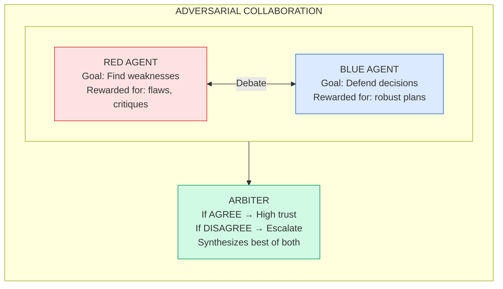
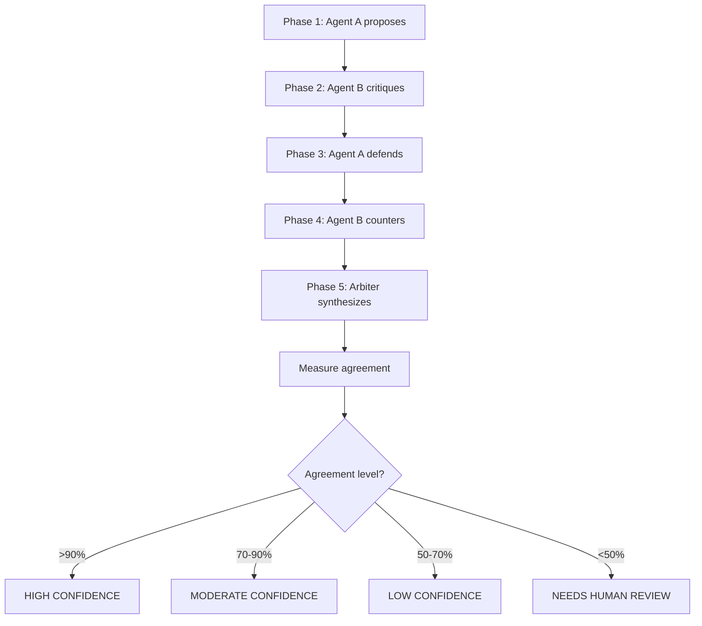
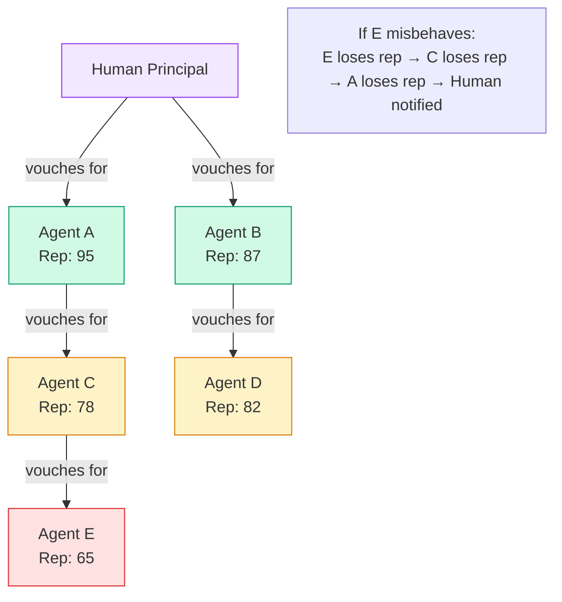
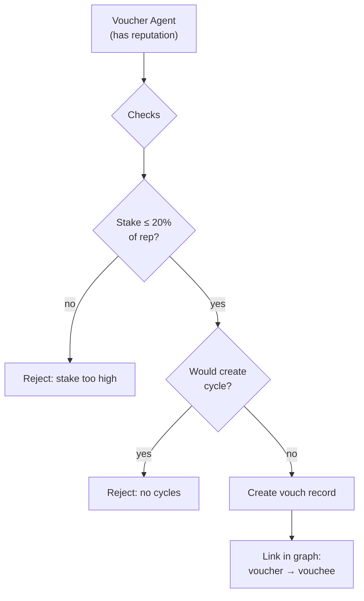
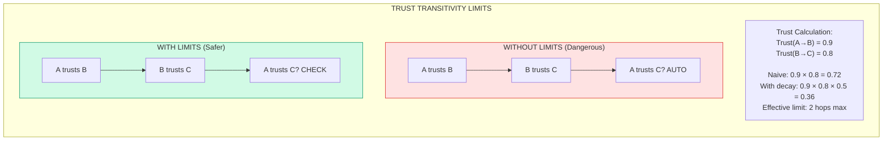
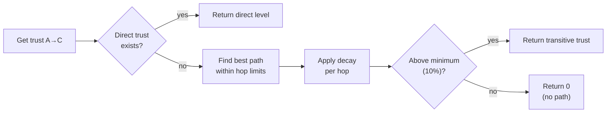
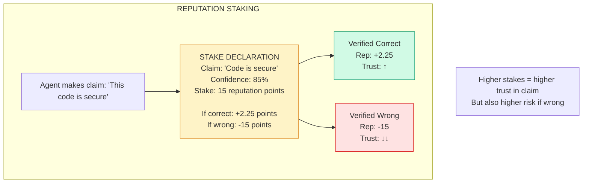
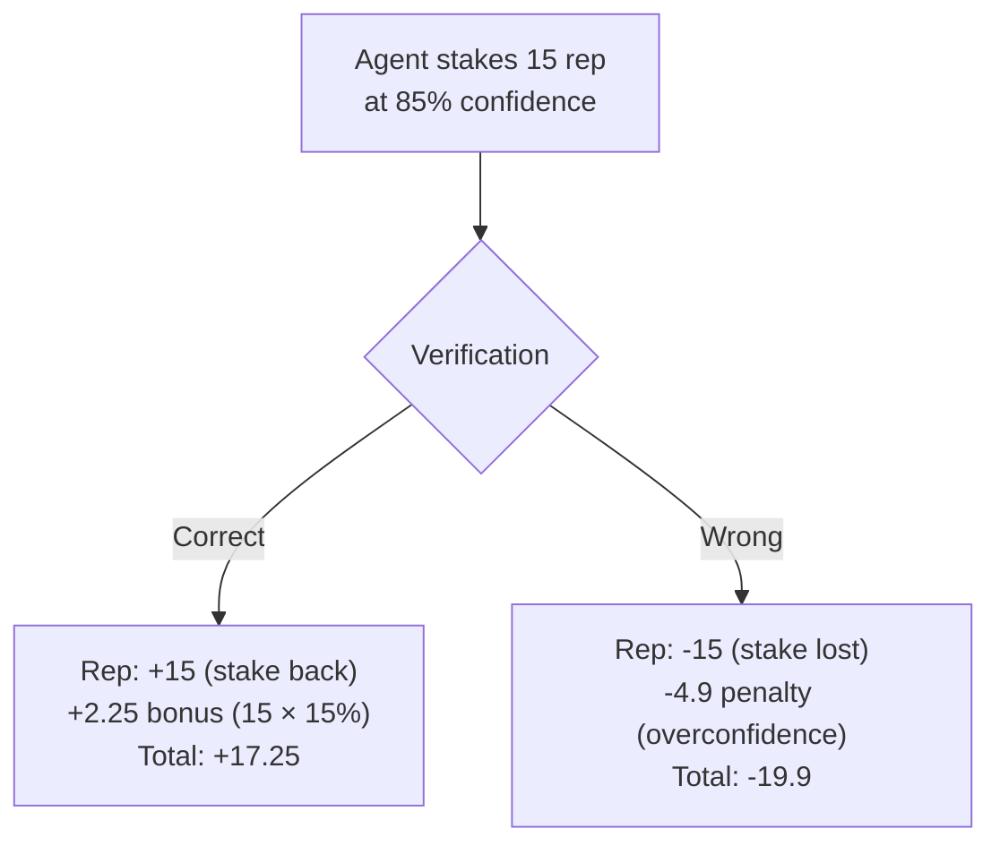

# Multi-Agent Patterns

:::note[TL;DR]
Use multiple agents for safety through disagreement, competition, and mutual oversight. Key patterns: **Adversarial Collaboration** (red/blue agents debate, arbiter synthesizes), **Cross-Validation** (independent agents verify each other), **Rotating Validators** (prevent capture through rotation), **Separation of Powers** (split authority across agents). Agreement between opposed agents is more trustworthy than single-agent conclusions.
:::

Multi-agent patterns address challenges specific to systems with multiple AI agents. These patterns leverage agent interactions for safety—using disagreement, competition, and mutual oversight to catch problems that single-agent systems might miss.

---

## Adversarial Collaboration

### Intent
Pair agents with deliberately opposed interests or roles so that their disagreements reveal problems, while their agreements indicate robustness.

### Motivation
If two agents with opposed incentives both reach the same conclusion, that conclusion is more trustworthy than one reached by either alone. Conversely, if they disagree, that signals something worth investigating.

### Structure



### Implementation

**Debate flow:**



**Devil's advocate variant:** Force one agent to argue against the decision regardless of its merit. If the devil's argument can't be adequately addressed → flag for review.

**Agent roles:**
| Role | Purpose |
|------|---------|
| Proposer | Makes proposals |
| Critic | Finds weaknesses |
| Defender | Justifies decisions |
| Devil's Advocate | Argues opposite position |

### Role Configurations

| Configuration | Roles | Use Case |
|---------------|-------|----------|
| **Proposer-Critic** | Build vs Challenge | Design review |
| **Prosecutor-Defense** | Attack vs Defend | Risk assessment |
| **Optimist-Pessimist** | Best case vs Worst case | Planning |
| **Specialist-Generalist** | Deep vs Broad | Coverage verification |
| **Fast-Slow** | Quick vs Thorough | Time-quality tradeoff |

### Preventing Collusion

**Isolation requirements:**
- Agents communicate only through formal debate (no side channels)
- Use different providers/models when possible
- Hide internal reasoning from each other

**Collusion detection signals:**
| Signal | What to Look For | Threshold |
|--------|-----------------|-----------|
| High agreement | Always agree without substantive debate | >95% agreement rate |
| Similar reasoning | Same phrasing, arguments, structure | Pattern similarity check |
| Coordinated timing | Suspiciously synchronized responses | Timing correlation analysis |

If any signals detected → investigate the pair, potentially reassign agents.

### Consequences

**Benefits:**
- Reveals weaknesses through opposition
- High confidence when adversaries agree
- Forces consideration of alternatives
- Harder to fool than single agent

**Costs:**
- Double the compute cost
- Requires genuine independence
- Debates can be unproductive
- Need good arbiter

**Risks:**
- Adversaries might collude
- Debates might miss the point
- Forced opposition might be shallow

### Related Patterns
- **Voting Tribunal**: Multiple agents vote
- **Rotating Validator**: Change adversary assignments
- **Separation of Powers**: Different roles can't collude

---

## Vouching Network

### Intent
Create accountability chains where agents vouch for others, putting their own reputation at stake for the agents they endorse.

### Motivation
If Agent A vouches for Agent B, and B misbehaves, A should suffer consequences. This creates incentives for careful vetting and ongoing monitoring among agents themselves.

### Structure



### Implementation

**Vouching process:**



**Damage propagation on incident:**

```
Agent E misbehaves (damage = 30 points)
  └─ E: -30 rep (primary)
  └─ C vouched for E (stake: 10) → C: -10 rep
     └─ A vouched for C (stake: 8) → A: -4 rep (50% decay)
        └─ Human notified
```

**Propagation rules:**
- Max depth: 3 hops
- Decay: 50% per hop
- Damage capped at voucher's stake
- New agents start at 50 reputation

### Vouching Rules

| Rule | Description | Rationale |
|------|-------------|-----------|
| **Stake limits** | Can't stake more than 20% of rep | Prevents catastrophic loss |
| **Scope constraints** | Vouch only for known domains | Limits blind vouching |
| **No cycles** | A can't vouch for B if B vouches for A | Prevents manipulation |
| **Expiry** | Vouches expire after time | Forces re-evaluation |
| **Transitivity limits** | Limited depth of propagation | Bounds cascading damage |

### Consequences

**Benefits:**
- Creates accountability without central oversight
- Incentivizes careful vetting
- Distributes monitoring responsibility
- Builds trust relationships

**Costs:**
- Complex reputation accounting
- Can create blame cascades
- Agents might vouch strategically

**Risks:**
- Reputation attacks through proxies
- Vouch hoarding without genuine trust
- Cycles despite prevention

### Related Patterns
- **Graduated Autonomy**: Reputation affects permissions
- **Trust Decay**: Vouches need renewal
- **Bonding & Slashing**: Similar economics

---

## Trust Transitivity Limits

### Intent
Prevent trust from automatically propagating through chains, requiring explicit verification at each step of a trust relationship.

### Motivation
Just because A trusts B and B trusts C doesn't mean A should trust C. Trust transitivity can be exploited by bad actors who gain trust through intermediaries. This pattern limits such exploitation.

### Structure



### Implementation

**Trust calculation with decay:**

```
Direct trust: A trusts B = 0.9, B trusts C = 0.8

Naive transitive:     0.9 × 0.8 = 0.72  ← Too high
With decay (50%):     0.9 × 0.8 × 0.5 = 0.36  ← More realistic
With 2-hop max:       Beyond 2 hops = 0
```



**Sensitive capabilities require direct trust only:**
- code_execution
- data_deletion
- permission_granting
- external_communication

For these, transitive trust is not sufficient — must have direct trust >0.8.

### Transitivity Policies

| Policy | Max Hops | Decay | Use Case |
|--------|----------|-------|----------|
| **Strict** | 1 | 0 | High security, direct only |
| **Limited** | 2 | 0.5 | Normal operations |
| **Moderate** | 3 | 0.7 | Social networks |
| **Permissive** | 5 | 0.9 | Low-stakes discovery |

### Consequences

**Benefits:**
- Prevents trust laundering
- Limits attack propagation
- Forces explicit verification
- Clear accountability

**Costs:**
- Slower trust establishment
- More administrative overhead
- May block legitimate operations

**Risks:**
- Too strict might prevent useful cooperation
- Decay values hard to calibrate
- Gaming through multiple identities

### Related Patterns
- **Vouching Network**: Provides trust evidence
- **Chinese Wall**: Prevents certain trust paths
- **Graduated Autonomy**: Trust affects capabilities

---

## Reputation Staking

### Intent
Require agents to stake their reputation when making claims or taking actions, creating tangible consequences for incorrect or harmful outputs.

### Motivation
Cheap talk is unreliable. If agents must put something valuable (their reputation) at stake when making claims, they'll be more careful and honest. This creates a market-like mechanism for truthful revelation.

### Structure



### Implementation

**Staking rules:**
- Maximum stake: 25% of current reputation
- Minimum stake: 1 point
- Minimum confidence to stake: 50%

**Resolution outcomes:**

| Outcome | Effect |
|---------|--------|
| **Correct** | Stake returned + bonus (higher bonus for lower stated confidence) |
| **Wrong** | Lose stake + overconfidence penalty |

**Overconfidence penalty:** Uses Brier-style scoring. Claiming 95% confidence and being wrong hurts much more than claiming 60% confidence and being wrong.



**Claim credibility score** combines:
- Agent's current reputation (30%)
- Agent's historical accuracy (30%)
- Stake relative to reputation (20%)
- Stated confidence (20%)

### Staking Mechanisms

| Mechanism | How It Works | Use Case |
|-----------|--------------|----------|
| **Fixed stake** | Same amount per claim | Simple, predictable |
| **Proportional** | Stake ∝ claim importance | Risk-adjusted |
| **Confidence-weighted** | Higher confidence = more stake | Calibration |
| **Market** | Others can bet against | Prediction markets |

### Consequences

**Benefits:**
- Incentivizes careful, truthful claims
- Creates calibrated confidence
- Stakes signal claim importance
- Self-policing through economics

**Costs:**
- Risk-averse behavior might be too cautious
- Reputation accumulation creates inequality
- Complex to verify claims

**Risks:**
- Gaming through many small true claims
- Reputation bankruptcy spirals
- Claims chosen to be easily verifiable

### Related Patterns
- **Bonding & Slashing**: Economic enforcement
- **Vouching Network**: Reputation relationships
- **Prediction Market Aggregation**: Market mechanisms

---

## Next Steps

See also:
- [Incentive Patterns](/design-patterns/incentive/) - Economic alignment
- [Recovery Patterns](/design-patterns/recovery/) - Failure handling
- [Structural Patterns](/design-patterns/structural/) - Architecture foundations
