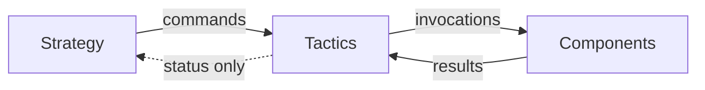
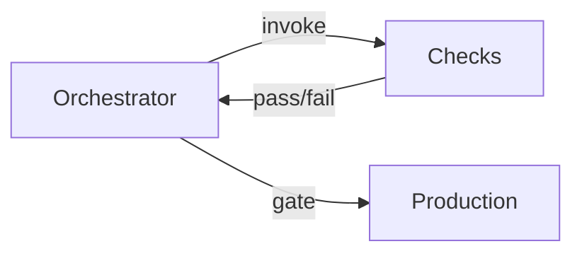

# Principles to Practice

This page maps the framework's abstract principles to their concrete applications in the worked examples, helping you see how theory becomes implementation.

## Quick Reference: Principles → Components

| Principle | Research Assistant | Code Deployment |
|-----------|-------------------|-----------------|
| **Least Intelligence** | Strategy uses GPT-3.5, not frontier | Orchestrator uses no ML at all |
| **Least Privilege** | Search can only query, not modify DBs | Reviewer can read code but not write |
| **Least Context** | Tactics sees only current sub-task | Canary sees only metrics, not code |
| **Least Persistence** | All components stateless | All components stateless |
| **Least Autonomy** | Human approves strategic pivots | Human approves every production deploy |
| **Least Surprise** | All LLMs at temperature=0 | Fuzzer uses logged seeds |
| **Least Connectivity** | Hypothesis → Forecaster (one-way) | Reviewer → Orchestrator (one-way) |
| **Least Observability** | Components can't detect testing | Components can't see deployment status |
| **Least Compute** | Search: 1s, Strategy: 10s, Hypothesis: 30s | Static: fast, Review: bounded |
| **Least Generality** | Fine-tuned summarizers, not GPT-4 | Narrow canary model, not frontier |
| **Max Verifiability** | Critical safety logic in verified code | Orchestrator is verified code only |

## Implementation Patterns by Risk Level

<details>
<summary>Low-Risk Components (Delegation Risk &lt; $200/month)</summary>

**Pattern**: Use narrow or verified implementations freely.

| Component | Example | Implementation |
|-----------|---------|----------------|
| Search | Research Assistant | Code (API calls + ranking) |
| Static Analysis | Code Deployment | Verified code |
| Unit Tests | Code Deployment | Code |
| Progress Monitor | Research Assistant | Mostly code |

**Principles applied**: Least Generality, Maximum Verifiability

</details>

<details>
<summary>Medium-Risk Components (Delegation Risk $200-$500/month)</summary>

**Pattern**: Fine-tuned narrow models with extensive testing.

| Component | Example | Implementation |
|-----------|---------|----------------|
| Summarizer | Research Assistant | Fine-tuned 7B model |
| Security Scanner | Code Deployment | Fine-tuned 7B model |
| Canary Analyzer | Code Deployment | Fine-tuned narrow model |
| Red Team | Research Assistant | Fine-tuned + checklists |

**Principles applied**: Least Intelligence, Least Generality, verification through narrow training

</details>

<details>
<summary>High-Risk Components (Delegation Risk &gt; $500/month)</summary>

**Pattern**: Defense in depth — multiple constraints, redundancy, human oversight.

| Component | Example | Implementation | Mitigations |
|-----------|---------|----------------|-------------|
| Hypothesis Generator | Research Assistant | Frontier LLM | Low privilege, evaluated by others |
| Code Reviewer | Code Deployment | Frontier LLM | Advisory only, human reviews |
| Strategy Module | Research Assistant | GPT-3.5 + rules | Older model, rule-based filtering |

**Principles applied**: All "Least X" principles simultaneously

</details>

## Delegation Risk in Action

<details>
<summary>Computing Delegation Risk — worked examples</summary>

### Computing Delegation Risk

**Research Assistant Summarizer**:
```
P(misrepresent findings) × Damage = 0.02 × $5,000 = $100
P(leak proprietary data) × Damage = 0.001 × $50,000 = $50
Total Delegation Risk = $150/month
```

**Code Deployment Canary**:
```
P(approve bad deploy) × Damage = 0.01 × $30,000 = $300
Total Delegation Risk = $300/month
```

</details>

<details>
<summary>Risk Inheritance — worked examples</summary>

### Risk Inheritance

**Research Assistant** (multiplicative rule):
```
Trust(Human → Hypothesis Generator)
= Trust(Human → Strategy) × Trust(Strategy → Tactics) × Trust(Tactics → Generator)
= 0.95 × 0.90 × 0.85
= 0.73
```

**Code Deployment** (blocked by architecture):
```
Trust(Human → Production via Reviewer) = 0
Why: Reviewer's output doesn't flow to production deploy
```

</details>

<details>
<summary>Budget Allocation — comparing approaches</summary>

### Budget Allocation Decisions

Both examples target ~$2,000/month total Delegation Risk but allocate differently:

**Research Assistant** — more distributed risk:
- Summarizer: 8%
- Code Deployer: 55%
- Coordinator: 26%

**Code Deployment** — risk concentrated in human-gated components:
- Production Deploy (human-gated): 26%
- Code Reviewer (advisory only): 26%
- Automated components: 48%

</details>

## Coordinator Principles Applied

| Coordinator Principle | Research Assistant | Code Deployment |
|----------------------|-------------------|-----------------|
| **Least Influence** | Strategy proposes, doesn't execute | Orchestrator routes, doesn't decide |
| **Least Direct Impact** | Works through components | Uses verified code, no ML |
| **Maximum Transparency** | All reasoning logged | Logic is auditable code |
| **Simplest Communication** | Structured task objects | Enum states only |
| **Shortest Horizon** | Plans current task only | No planning at all |
| **Mandatory Redundancy** | 5 strategy modules, 4/5 consensus | N/A (deterministic) |

## Architecture Patterns

### When to Use LLMs in Coordination

**Use LLM coordination (like Research Assistant)** when:
- Tasks require judgment about priority, strategy, decomposition
- Outcomes are recoverable (wasted effort, not disasters)
- Human can audit reasoning after the fact

**Use verified code coordination (like Code Deployment)** when:
- Logic is specifiable as rules
- Outcomes are hard to reverse
- Correctness is more important than flexibility

### Information Flow Patterns

**Research Assistant Pattern**: Bidirectional but constrained


**Code Deployment Pattern**: Strict pass/fail gates, no negotiation


<details>
<summary>Checklist: Applying the Framework</summary>

## Checklist: Applying the Framework

When designing a new system:

1. **Identify failure modes** — What can go wrong? What's the damage?
2. **Compute component Delegation Risks** — P(failure) × Damage for each
3. **Set system budget** — What total risk is acceptable?
4. **Allocate budgets** — Which components get how much?
5. **Choose implementations** — Verified code > narrow models > frontier LLMs
6. **Apply principles** — Go through each "Least X" for each component
7. **Design coordination** — LLM or code? What redundancy?
8. **Identify human gates** — Where do humans approve?
9. **Plan verification** — How will you test trust assumptions?
10. **Monitor in production** — Track actual vs. expected failure rates

</details>

## Further Reading

- [Least X Principles](/design-patterns/least-x-principles/) — Full principle definitions
- [Coordinator Constraints](/design-patterns/coordinator-constraints/) — Coordinator-specific principles
- [Research Assistant Example](/design-patterns/examples/research-assistant-example/) — Full worked example
- [Code Deployment Example](/design-patterns/examples/code-deployment-example/) — Higher-stakes example
- [Delegation Risk Overview](/delegation-risk/overview/) — Delegation Risk computation and propagation
