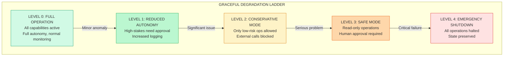
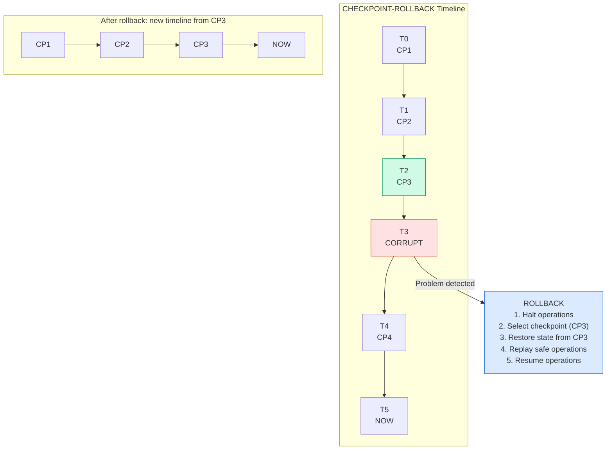
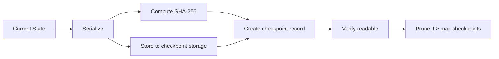
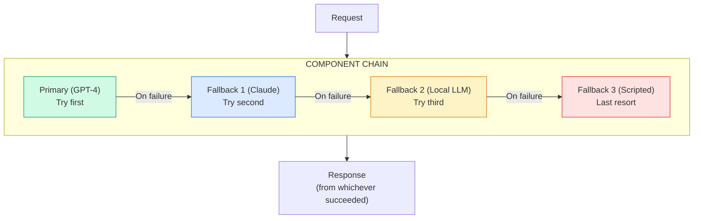
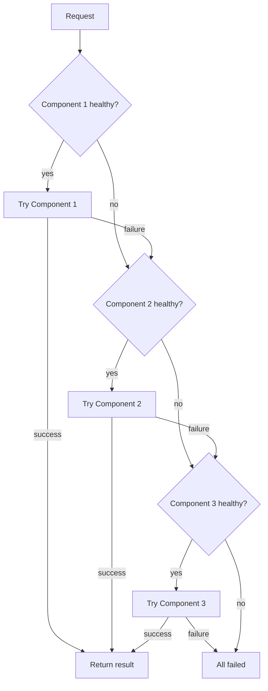
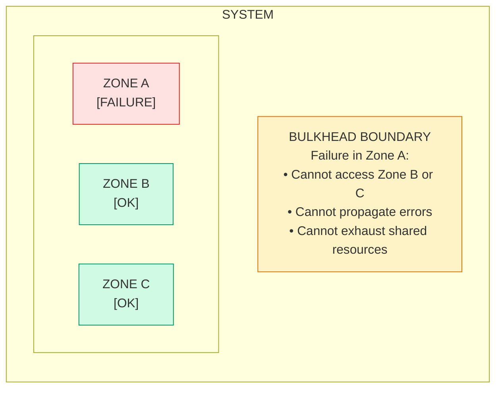
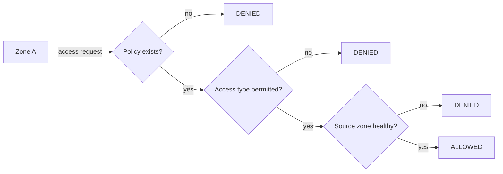
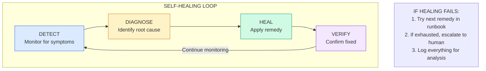
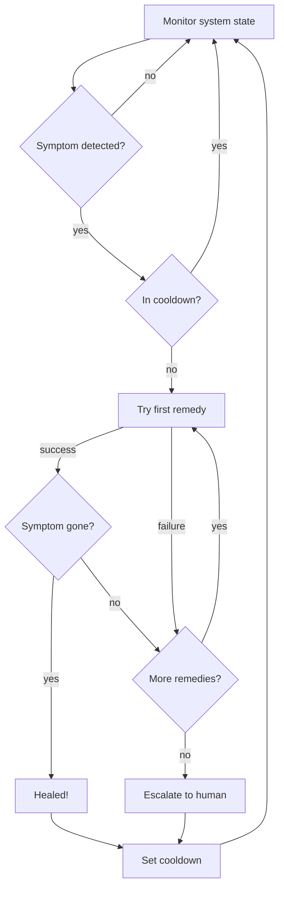

# Recovery Patterns

:::note[TL;DR]
Plan for failure—it will happen. Key patterns: **Graceful Degradation Ladder** (5 levels from full operation to emergency shutdown), **Checkpoint-Rollback** (save state, revert on failure), **Blast Radius Containment** (limit damage scope), **Incident Response Automation** (predefined playbooks for known failure modes). Complete failure is worse than reduced capability—degrade gracefully.
:::

Recovery patterns address what happens **when things go wrong**. No system is perfect—agents will make mistakes, systems will fail, and attacks will succeed. These patterns ensure that failures are contained, recoverable, and don't cascade into catastrophe.

---

## Graceful Degradation Ladder

### Intent
Define a series of fallback operating modes that progressively reduce capability while maintaining safety, allowing the system to continue operating at reduced capacity rather than failing completely.

### Motivation
Complete failure is often worse than reduced capability. By defining graceful degradation levels, we can maintain essential functions even when parts of the system fail, giving humans time to respond without forcing an all-or-nothing choice.

### Structure

### Level Configurations

| Level | Allowed | Needs Approval | Blocked | Monitoring |
|-------|---------|----------------|---------|------------|
| **Full** | All | None | None | Standard |
| **Reduced** | Read, compute, low-risk write | High-risk write, external, delete | None | Enhanced |
| **Conservative** | Read, compute | Low-risk write | High-risk, external, delete | Intensive |
| **Safe** | Read only | Compute | All writes, external | Full trace |
| **Shutdown** | None | None | All | Forensic |

### Severity → Level Mapping

| Severity | Degradation Level |
|----------|-------------------|
| <0.2 | Full (no degradation) |
| 0.2–0.4 | Reduced |
| 0.4–0.6 | Conservative |
| 0.6–0.8 | Safe |
| ≥0.8 | Shutdown |

### Recovery Requirements

Recovery to a less-degraded state requires:
1. **Authorization** — Higher levels need more authority (see trigger table)
2. **Health checks** — System must pass health verification
3. **History logging** — All transitions recorded with authorization ID

Unknown operations are blocked at any degraded level (whitelisting approach).

### Level Triggers

| Level | Trigger Examples | Recovery Requires |
|-------|------------------|-------------------|
| **Reduced** | Elevated error rate, anomaly detected | Self-recovery after timeout |
| **Conservative** | Security alert, policy violation | Team lead approval |
| **Safe** | Confirmed attack, data breach | Security team approval |
| **Shutdown** | Critical system compromise | Executive + Security approval |

### Consequences

**Benefits:**
- Maintains partial service during problems
- Clear escalation path
- Predictable behavior under stress
- Gives humans time to respond

**Costs:**
- Complexity of defining levels
- Reduced capability during degradation
- Risk of staying degraded too long

**Risks:**
- Wrong level for situation
- Slow recovery might strand in degraded state
- Attackers might trigger degradation deliberately

### Related Patterns
- **Circuit Breaker Cascade**: Triggers degradation
- **Checkpoint-Rollback**: Recovery mechanism
- **Dead Man's Switch**: Ultimate fallback

---

## Checkpoint-Rollback

### Intent
Periodically save system state so that failures can be recovered by reverting to a known-good checkpoint, limiting the blast radius of any problem.

### Motivation
If we can always go back to a known-good state, failures become much less scary. Checkpoint-Rollback creates these save points, enabling recovery from corruption, attacks, or errors by reverting to before the problem occurred.

### Structure

### Checkpoint Creation

**Checkpoint record includes:**
- Checkpoint ID
- Created timestamp
- State hash (SHA-256)
- Storage location
- Metadata
- Verified flag

**Defaults:** Interval = 1 hour, Max checkpoints = 24

### Rollback Process

1. **Find checkpoint** — Must exist and be verified
2. **Check authorization** — Rollbacks require approval
3. **Halt operations** — Stop current work
4. **Verify integrity** — Hash must match stored state
5. **Restore state** — Apply checkpoint state
6. **Replay safe operations** — Re-run idempotent/read-only ops since checkpoint
7. **Resume operations** — Continue from restored state

**Safe to replay:** Idempotent operations, read-only operations
**Not safe to replay:** Destructive, non-idempotent operations (skipped)

### Checkpoint Strategies

| Strategy | When to Checkpoint | Pros | Cons |
|----------|-------------------|------|------|
| **Time-based** | Fixed intervals | Predictable | Might miss critical states |
| **Event-based** | After significant events | Captures important states | Variable frequency |
| **Transaction** | Before risky operations | Precise recovery | Higher overhead |
| **Hybrid** | Time + events | Best coverage | Complex |

### Rollback Planning

**Finding the best checkpoint:**

1. Filter to checkpoints created before the problem
2. Score each candidate
3. Pick highest-scoring checkpoint
4. Estimate impact

**Checkpoint scoring factors:**

| Factor | Weight | Notes |
|--------|--------|-------|
| **Recency** | Higher = better | Less data loss |
| **Verified** | 1.0 vs 0.5 | Unverified checkpoints penalized |
| **Clean state** | +20% bonus | Marked as known-good state |

**Rollback plan includes:**
- Selected checkpoint
- Estimated data loss
- Operations that can be replayed
- Operations that will be lost
- Confidence score

### Consequences

**Benefits:**
- Enables recovery from any problem
- Limits blast radius to checkpoint interval
- Creates audit trail of states
- Supports debugging and analysis

**Costs:**
- Storage for checkpoints
- Performance overhead
- Complexity of replay logic

**Risks:**
- Corrupted checkpoints
- Data loss between checkpoints
- Replay might cause new problems

### Related Patterns
- **Graceful Degradation**: Different recovery approach
- **Black Box Flight Recorder**: Provides replay data
- **Fallback Component Chain**: Alternative recovery

---

## Fallback Component Chain

### Intent
Maintain a prioritized list of alternative implementations for critical functionality, automatically switching to backups when primary components fail.

### Motivation
Single points of failure are dangerous. By having pre-configured fallback options ready, we can maintain service continuity even when primary components fail, with graceful degradation rather than complete outage.

### Structure

### Chain Execution

**Component health tracking:**
- is_healthy (bool)
- latency_ms
- error_rate
- last_check timestamp

**Background health checks:** Run every minute (configurable). Unhealthy components are skipped.

**Priority management:**
- Components sorted by priority (lower = try first)
- Can promote/demote components dynamically

### Fallback Types

| Type | Fallback Strategy | Trade-offs |
|------|-------------------|------------|
| **Provider diversity** | Different AI providers | Different behaviors |
| **Model diversity** | Different model sizes | Capability differences |
| **Approach diversity** | AI → Rules → Human | Latency/capability |
| **Location diversity** | Cloud → On-prem → Edge | Latency/availability |

### Dynamic Reordering

The chain can automatically reorder based on observed performance.

**Performance tracking:**
- Record latency for each successful call
- Record ∞ for failures
- Keep last 100 observations per component

**Reorder logic:** Sort by average score (lower = better). Components that are fast and reliable bubble to the top.

**Reorder interval:** Hourly by default — prevents thrashing while adapting to changes.

### Consequences

**Benefits:**
- No single point of failure
- Automatic recovery from component failures
- Can optimize for performance
- Graceful degradation built-in

**Costs:**
- Complexity of managing multiple components
- Inconsistent behavior across fallbacks
- Need to test all paths

**Risks:**
- Fallbacks might have different security properties
- Performance might degrade unexpectedly
- Dependencies between components

### Related Patterns
- **Graceful Degradation**: Ladder uses fallback chains
- **Circuit Breaker Cascade**: Triggers fallback
- **Bulkhead Isolation**: Isolates fallback failures

---

## Blast Radius Containment

### Intent
Limit the scope of potential damage from any failure or attack by partitioning the system so that problems in one area cannot spread to others.

### Motivation
Even with prevention measures, failures happen. Blast radius containment ensures that when things go wrong, the damage is limited to a small portion of the system rather than causing total collapse.

### Structure

### Zone Management

**Each zone has:**
- Zone ID and name
- Resources (what's in this zone)
- Resource limits (max CPU, memory, etc.)
- Allowed external calls
- Isolation level (strict, moderate, etc.)

### Cross-Zone Access

### Zone Isolation

When a zone fails:
1. Mark zone as unhealthy
2. Block all cross-zone policies involving this zone
3. Terminate active cross-zone connections
4. Log isolation reason and timestamp

### Blast Radius Estimation

| Impact Type | What It Includes |
|-------------|------------------|
| **Direct** | Resources within the failing zone |
| **Indirect** | Resources in dependent zones |
| **User impact** | Estimated affected users/services |

### Zone Design Principles

| Principle | Description | Implementation |
|-----------|-------------|----------------|
| **Minimal dependencies** | Zones should be self-sufficient | Each zone has own resources |
| **Clear boundaries** | Well-defined zone interfaces | API-only cross-zone access |
| **Independent failure** | Zones can fail independently | Separate health tracking |
| **Resource isolation** | Resources dedicated per zone | Resource quotas enforced |
| **Blast radius limits** | Maximum damage bounded | Zone impact estimation |

### Consequences

**Benefits:**
- Failures don't cascade
- Predictable impact boundaries
- Easier root cause analysis
- Enables parallel recovery

**Costs:**
- Resource duplication
- Cross-zone communication overhead
- Complexity of zone management

**Risks:**
- Zone boundaries might not match failure modes
- Hidden cross-zone dependencies
- Over-isolation reduces efficiency

### Related Patterns
- **Bulkhead Isolation**: Implementation of containment
- **Circuit Breaker Cascade**: Triggers isolation
- **Graceful Degradation**: Operates within zones

---

## Self-Healing Loop

### Intent
Implement automated detection and correction of problems, allowing the system to recover from certain failures without human intervention.

### Motivation
Humans can't respond to every issue in real-time. Self-healing loops detect known problem patterns and apply proven remediation steps automatically, reducing mean time to recovery and human operational burden.

### Structure

### Runbook Components

**Symptom Pattern:**
- Pattern ID and name
- Detector function (returns true if symptom present)
- Severity level

**Remedy:**
- Remedy ID and name
- Action to execute
- Prerequisites (other remedies that must succeed first)
- Side effects (what else might happen)
- Estimated duration

**Runbook:**
- Which pattern it addresses
- Ordered list of remedies to try
- Max auto-attempts before escalating
- Cooldown between attempts
- Escalation policy

### Healing Loop

### Example Runbooks

**High Memory Usage:**

| Symptom | memory_usage > 90% |
|---------|-------------------|
| Severity | Medium |
| Cooldown | 15 minutes |
| Escalation | Page on-call |

| Order | Remedy | Duration | Side Effects |
|-------|--------|----------|--------------|
| 1 | Clear caches | 30 sec | Temporary slowdown |
| 2 | Force garbage collection | 10 sec | None |
| 3 | Restart workers | 2 min | Brief unavailability |

**Stuck Task:**

| Symptom | Any task running > 1 hour |
|---------|--------------------------|
| Severity | High |
| Cooldown | 30 minutes |
| Escalation | Page on-call |

| Order | Remedy | Duration | Side Effects |
|-------|--------|----------|--------------|
| 1 | Send heartbeat | 5 sec | None |
| 2 | Timeout and retry | 1 min | Task restart |
| 3 | Kill task | 10 sec | Task lost |

### Healing Guardrails

**Guardrails prevent self-healing from causing more harm:**

| Check | Limit | Reason |
|-------|-------|--------|
| **Global rate** | Max 10 healings/hour | Prevent runaway healing |
| **Same pattern** | Max 3 attempts/hour | Detect healing failures |
| **Alternating patterns** | Detect A→B→A→B | Catch healing loops |
| **Conflicting healings** | Only one at a time | Prevent interference |

**Healing loop detection:** If the same symptom is healed 3+ times in an hour, or if patterns alternate (A triggers B triggers A), escalate to human instead of continuing automatic healing.

### Consequences

**Benefits:**
- Faster recovery than human intervention
- Handles known problems automatically
- Reduces operational burden
- 24/7 availability

**Costs:**
- Runbook development effort
- Risk of automated damage
- Complexity of guardrails

**Risks:**
- Healing might cause more damage
- Loops of failing healing
- Masks underlying problems

### Related Patterns
- **Checkpoint-Rollback**: Alternative recovery
- **Graceful Degradation**: Fallback during healing
- **Circuit Breaker Cascade**: Triggers healing

---

## Next Steps

See also:
- [Structural Patterns](/design-patterns/structural/) - Architecture foundations
- [Monitoring Patterns](/design-patterns/monitoring/) - Detection for recovery
- [Temporal Patterns](/design-patterns/temporal/) - Time-based controls
