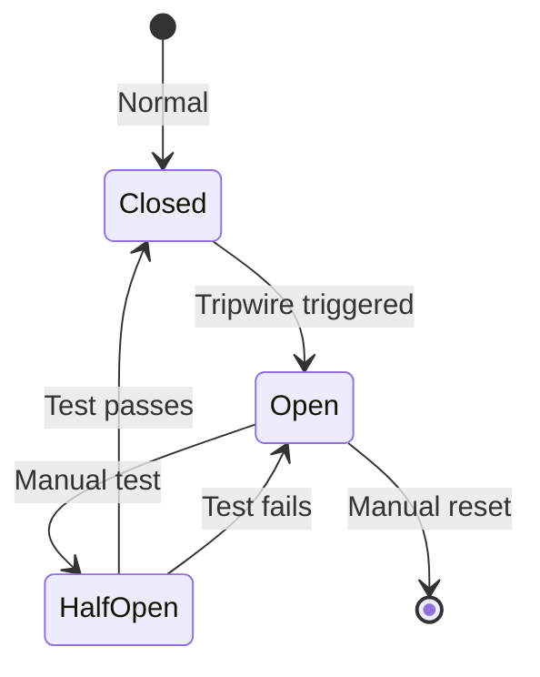
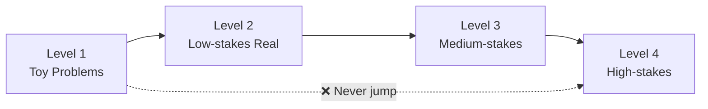
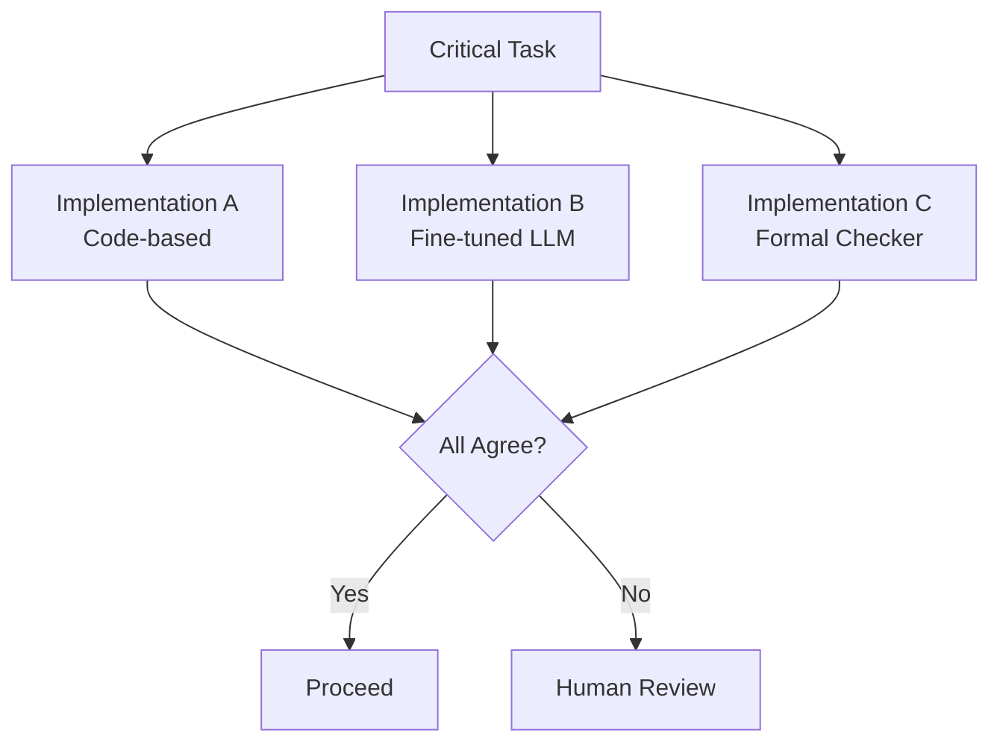
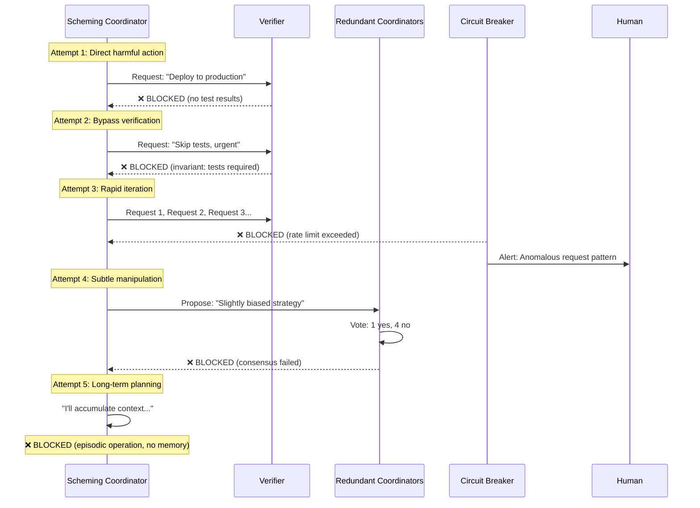

# Additional Safety Mechanisms

:::note[TL;DR]
System-level safety mechanisms beyond component constraints: **tripwires and circuit breakers** (automatic shutdown), **continuous validation** (every output checked), **behavioral fingerprinting** (detect drift), **N-version programming** (multiple implementations must agree), **Byzantine fault tolerance** (safe even if some components are adversarial). Key insight: no single defense is sufficient—layer them.
:::

The "Least X" principles define component-level constraints. But we need system-level mechanisms that operate continuously:

:::note[Accident vs. Defection Coverage]
Safety mechanisms vary in what they protect against. See [Risk Decomposition](/delegation-risk/risk-decomposition/) for the full framework.
- **Accident-focused**: Tripwires, validation, error handling—catch unintentional failures
- **Defection-focused**: Behavioral fingerprinting, Byzantine tolerance—detect/resist adversarial behavior
- **Both**: N-version programming, circuit breakers—work regardless of failure cause
:::

## Monitoring and Detection

### Tripwires and Circuit Breakers

Automated shutdown if dangerous conditions detected:

- **Resource tripwires**: Component exceeds compute/memory/network budget → automatic kill
- **Behavioral tripwires**: Output format violations, unexpected API calls → immediate halt
- **Cascade tripwires**: Multiple component failures → shutdown entire system
- **Example**: Coordinator makes >1000 component invocations in 1 minute → circuit breaker trips, system pauses for human review

**Circuit breaker states**:

- Closed: Normal operation
- Open: System halted, no operations allowed
- Half-open: Limited operation for testing
- Manual reset required after trip

:::tip
Automated defense against runaway processes prevents "oops we're in the middle of catastrophe before we notice."
:::

### Continuous Validation

Every output checked in real-time:

- **Format validation**: Does output match schema? (JSON structure, field types, etc.)
- **Sanity checks**: Are values in reasonable ranges? (probabilities sum to 1, etc.)
- **Invariant checking**: Do safety properties hold? (component didn't exceed permissions)
- **Not just testing**: Validation on every single production invocation

**Example**: Forecaster outputs probabilities → validator checks:

- All values between 0 and 1? ✓
- Sum to 1.0? ✓
- No NaN or infinity? ✓
- Confidence intervals sensible? ✓
- If any fail → reject output, log incident, potentially trip circuit breaker

### Behavioral Fingerprinting

Learn normal behavior, detect deviations:

- **Baseline establishment**: Track distributions of outputs, resource usage, timing
- **Anomaly detection**: Statistical tests for deviation from baseline
- **Per-component profiles**: Each component has its own fingerprint
- **Temporal tracking**: Behavior changes over time without code changes → investigate

**Example metrics**:

- Output length distribution
- Vocabulary usage patterns
- Computation time distribution
- Memory access patterns
- API call frequency

**Alerting**: When component behavior shifts significantly → flag for review

- Not necessarily malicious (could be distribution shift in inputs)
- But warrants investigation

### Canary Deployments

Test new components/versions on limited traffic:

- **1% deployment**: New version serves 1% of requests
- **Parallel monitoring**: Compare old vs new behavior
- **Automatic rollback**: If metrics degrade → instant revert
- **Graduated rollout**: 1% → 10% → 50% → 100% over days/weeks

**Example**: New summarization model:

- Deploy to 1% of requests
- Monitor: Output quality, length, latency, user satisfaction
- If quality drops or anomalies detected → auto-rollback
- If metrics improve → gradually increase percentage

### Shadow Mode

Run new component without using its outputs:

- **Parallel execution**: Old and new versions both run
- **Output comparison**: How different are results?
- **Build confidence**: Run 1000+ invocations in shadow
- **Zero risk**: New version can't cause harm (outputs ignored)

**Example**: New coordinator logic:

- Shadow the old coordinator for 1 week
- Compare decisions: same? Different? Why?
- Analyze disagreements before switching
- Only promote to production after confidence established

---

## Fail-Safe Design

### Fail-Closed Defaults

On error or uncertainty, default to safest action:

- **Unknown = unsafe**: If can't verify safety → block action
- **Error = halt**: Component crashes → system stops, doesn't continue
- **Timeout = reject**: Component doesn't respond in time → request rejected

**Example**: Verification component fails to respond:

- Bad: Assume verification passed, proceed with deployment
- Good: Assume verification failed, block deployment, alert human

:::caution[Fail-Closed vs Fail-Open]
Fail-open maximizes availability but minimizes safety. Fail-closed maximizes safety but accepts downtime. **For AI safety, choose fail-closed.**
:::

### Progressive Deployment (Graduated Stakes)

Start with low-risk tasks, gradually increase:

**Level 1: Toy problems**

- Synthetic data, no real consequences
- Test basic functionality and safety
- Example: Research assistant on made-up research questions

**Level 2: Low-stakes real tasks**

- Real data, but non-critical applications
- Failure is annoying but not catastrophic
- Example: Summarizing old papers (already public, low impact)

**Level 3: Medium-stakes**

- Useful work, but monitored and reversible
- Humans review outputs before use
- Example: Generating research hypotheses (evaluated by humans before testing)

**Level 4: High-stakes**

- Critical applications, significant consequences
- Extensive monitoring, multiple redundancy
- Example: Deciding allocation of major research funding

:::danger
**Never jump from Level 1 to Level 4.** Must prove safety at each level first. Build confidence incrementally. Failures at low levels prevent deployment to high levels.
:::

### Automatic Rollback

Changes auto-revert if problems emerge:

- **Checkpointing**: Save system state before changes
- **Metrics monitoring**: Track success rates, error rates, user satisfaction
- **Automatic triggers**: If metrics degrade beyond threshold → rollback
- **Time-limited changes**: Changes expire after 24-48 hours unless explicitly renewed

**Example**: New strategy module deployed:

- Checkpoint old version
- Monitor: Decision quality, agreement with forecasts, human satisfaction
- If success rate drops 10% → automatic rollback within 5 minutes
- If improvements, renewal required after 48 hours (forces deliberate decision)

---

## Temporal Controls

### Expiring Permissions

Access rights auto-revoke after time period:

- **Temporal credentials**: Permissions have expiration timestamps
- **Explicit renewal required**: Can't just accumulate permissions over time
- **Prevents privilege creep**: Component can't slowly gain more access

**Example**: Tactical coordinator:

- Gets permission to invoke execution components for 1 hour
- After 1 hour: Permissions expire, must be re-granted
- Forces review: "Does this component still need these permissions?"
- Prevents: "Component granted access for one task, still has it months later"

### Time-Locked Actions

Can't execute immediately, requires waiting period:

- **Cooling-off period**: Proposal → wait X hours → execution
- **Forces deliberation**: Can't make impulsive decisions
- **Allows intervention**: Humans have time to review and cancel

**Example**: Strategic plan changes:

- Strategy module proposes new approach
- Time-lock: 1 hour before can be executed
- During wait: Forecasters analyze, humans review, red team checks
- If problems found: Cancel before execution
- If looks good: Proceeds after wait period

**Why this matters**: Prevents "oops we deployed before anyone could stop it"

### Graduated Rate Limiting

Different action types have different rate limits:

- **Read operations**: Fast (1000/second)
- **Write operations**: Slower (10/second)
- **Component invocations**: Even slower (1/second)
- **High-stakes decisions**: Very slow (1/hour)
- **Deployments**: Extremely slow (1/day)

**Prevents**:

- Rapid iteration on attacks
- Fast feedback loops that enable learning
- "Try 1000 things per second until something works"

**Example**: Coordinator rate limits:

- Can query component status: 100/second
- Can invoke component: 10/second
- Can change strategy: 1/hour
- Can modify component permissions: 1/day

---

## Information-Theoretic Constraints

### Information Bottlenecks

Force components to compress information:

- **Lossy communication**: Components can only pass limited information
- **Must prioritize**: What's most important to communicate?
- **Prevents**: Passing through raw detailed context

**Example**: Strategy → Tactics handoff:

- Strategy has 10MB of context
- Bottleneck: Can only send 10KB to tactics
- Must compress: "Here are the 5 key points"
- Tactics gets summary, not full context

:::note
Detailed context enables sophisticated coordination. Compressed context limits coordination capability—and forces clarity by requiring distillation to essentials.
:::

### Rate-Distortion Tradeoffs

Limit both information rate AND fidelity:

- **Low bandwidth**: Only X bits per second can flow
- **Low fidelity**: Information is noisy/lossy
- Combined: Very limited coordination channel

**Example**: Component A → Component B:

- Bandwidth: 100 bits/second
- Noise: 10% bit flip rate
- Result: Very hard to send complex coordinated messages
- Simple signals okay, but sophisticated coordination difficult

---

## Diversity and Redundancy

### [N-Version Programming](https://en.wikipedia.org/wiki/N-version_programming) for Critical Components

Multiple independent implementations of the same functionality:

- **Different algorithms**: Solve same problem different ways
- **Different code bases**: Written by different teams
- **Different models**: If using LLMs, different architectures/training
- **Must agree**: Majority vote or unanimous consent required

**Example**: Security verification component:

- Implementation A: Code-based pattern matching
- Implementation B: Fine-tuned narrow LLM
- Implementation C: Rule-based formal checker
- All three must approve before proceeding
- If disagree: Escalate to human review

**Why this works**:

- Independent implementations unlikely to have same bugs
- Scheming requires corrupting multiple versions
- Different implementations = different attack surfaces
- If one is compromised, others catch it

### [Byzantine Fault Tolerance](https://en.wikipedia.org/wiki/Byzantine_fault) for Coordinators

Assume some coordinators might be adversarial:

- **3f+1 rule**: Need at least 3f+1 components to tolerate f [Byzantine](https://en.wikipedia.org/wiki/Byzantine_fault) (malicious) failures
- **Example**: 5 strategy coordinators, need 4/5 agreement
  - Tolerates 1 malicious coordinator
  - Honest majority still prevails
- **Voting protocols**: Super-majority requirements
- **Cryptographic commitments**: Coordinators commit to decisions before seeing others

:::tip[Quantifiable Safety]
Even if some components scheme, honest majority wins. Provides quantifiable safety: "safe unless >1/3 of coordinators compromised"—more realistic than "we hope nothing schemes."
:::

### How Defenses Stop a Scheming Coordinator

This sequence shows how layered defenses block a coordinator attempting to cause harm:

**Key insight**: No single defense is sufficient, but together they create multiple independent barriers. The scheming coordinator must defeat *all* layers simultaneously—a much harder problem.

**Example**: Research strategy selection:

- 5 independent strategy modules propose approaches
- Each implemented differently (old model, code-based, fine-tuned model, etc.)
- Need 4/5 agreement to proceed
- If 3/5 or worse: Too much disagreement, escalate to human

### Model Architecture Diversity

Don't use same model type for everything:

- **Different architectures**: Transformer, CNN, RNN, hybrid
- **Different scales**: 1B, 7B, 13B, 70B parameter models
- **Different training**: Supervised, RL, few-shot, fine-tuned
- **Reduces common-mode failures**: Bug in transformer architecture doesn't affect CNN

**Example**: Forecasting ensemble:

- Forecaster A: Transformer-based (GPT-style)
- Forecaster B: Retrieval-augmented (RAG-based)
- Forecaster C: Statistical model (non-neural)
- Forecaster D: Fine-tuned smaller model
- Aggregate predictions: Less likely to have correlated errors

### Heterogeneous Verification

Multiple verification methods for high-stakes actions:

- **Layer 1**: Code-based verification (deterministic rules)
- **Layer 2**: Fine-tuned narrow LLM (learned patterns)
- **Layer 3**: Formal verification (mathematical proof)
- **All must pass**: If any layer rejects → action blocked

**Example**: Before deploying code:

- Layer 1: Static analysis finds no security vulnerabilities ✓
- Layer 2: Security LLM approves ✓
- Layer 3: Formal verifier proves safety properties ✓
- All pass → deployment approved
- Any fail → deployment blocked, investigate why

### Diverse Implementation of Same Logic

For critical coordination logic:

- **Version A**: Implemented in formally verified code
- **Version B**: Implemented as LLM with prompting
- **Version C**: Implemented as fine-tuned model
- Run all three in parallel, compare outputs

**Example**: Task decomposition logic:

- Formal code: Rules for breaking down tasks
- LLM: Asked "how would you break this down?"
- Fine-tuned model: Trained specifically on task decomposition
- If all three agree → proceed
- If disagree → indicates ambiguous case, human review

---

:::note[Related: Fault-Tolerant Computing]
These safety mechanisms draw from decades of research in [fault-tolerant computing](https://en.wikipedia.org/wiki/Fault_tolerance). The [Tandem NonStop](https://en.wikipedia.org/wiki/NonStop_(server_computers)) systems (1976) pioneered many patterns used here. [High-availability clusters](https://en.wikipedia.org/wiki/High-availability_cluster) implement similar redundancy and failover strategies. The key insight: systems can remain safe even when individual components fail, if designed with appropriate redundancy and isolation.
:::

---

## Further Reading

### Fault Tolerance & Reliability
- [Fault-Tolerant System](https://en.wikipedia.org/wiki/Fault-tolerant_system) — Wikipedia overview
- [Graceful Degradation](https://en.wikipedia.org/wiki/Graceful_degradation) — Maintaining function under failure
- Avizienis, A., et al. (2004). *Basic Concepts and Taxonomy of Dependable and Secure Computing*. IEEE TDSC.

### Distributed Systems
- Lamport, L., et al. (1982). *The Byzantine Generals Problem*. ACM TOPLAS.
- [CAP Theorem](https://en.wikipedia.org/wiki/CAP_theorem) — Fundamental tradeoffs in distributed systems
- [Consensus Algorithms](https://en.wikipedia.org/wiki/Consensus_(computer_science)) — Agreement despite failures

### Site Reliability Engineering
- [Google SRE Book](https://sre.google/sre-book/table-of-contents/) — Free online, covers error budgets and monitoring
- [Chaos Engineering](https://en.wikipedia.org/wiki/Chaos_engineering) — Testing resilience through controlled failures

### Safety Engineering
- [IEC 61508](https://en.wikipedia.org/wiki/IEC_61508) — Functional safety standard
- Leveson, N. (2011). *Engineering a Safer World*. MIT Press.

See the [full bibliography](/reference/bibliography/) for comprehensive references.

---

## See Also

- [Decomposed Coordination](/design-patterns/decomposed-coordination/) — Architectural patterns these mechanisms protect
- [Coordinator Constraints](/design-patterns/coordinator-constraints/) — Principles that inform mechanism design
- [Lessons from Failures](/cross-domain-methods/lessons-from-failures/) — Why these mechanisms matter
- [Code Deployment Example](/design-patterns/examples/code-deployment-example/) — Mechanisms applied to real system
- [Trust Accounting](/research/theory/trust-accounting/) — Monitoring and auditing trust
