# Structural Patterns

:::note[TL;DR]
Define the architecture of delegation. Key patterns: **Escalation Ladder** (match oversight to stakes—autonomous for low-risk, human review for high-risk), **Gateway Chokepoint** (single entry point for validation), **Bulkhead Isolation** (contain failures to compartments), **Separation of Powers** (split authority so no single component controls everything). Choose structural patterns first, then layer others on top.
:::

**Patterns in this section:**
- [Escalation Ladder](#escalation-ladder) — Match oversight intensity to actual stakes
- [Voting Tribunal](#voting-tribunal) — Require multi-party agreement for high-stakes actions
- [Graduated Autonomy](#graduated-autonomy) — Earn trust through demonstrated performance
- [Capability Airlock](#capability-airlock) — Isolate dangerous capabilities behind barriers
- [Task Decomposition Pipeline](#task-decomposition-pipeline) — Break complex tasks into verifiable steps
- [Gateway Chokepoint](#gateway-chokepoint) — Funnel operations through monitored control points
- [Bulkhead Isolation](#bulkhead-isolation) — Contain failures to compartments
- [Separation of Powers](#separation-of-powers) — Distribute authority across independent parties

---

Structural patterns define the **architecture** of delegation relationships. They determine who can do what, how authority flows, and what constraints are baked into the system's design.

These patterns are foundational—you typically choose structural patterns first, then layer other patterns on top.

---

## Escalation Ladder

### Intent
Create a hierarchy of oversight where tasks can be escalated to higher-authority reviewers when stakes or uncertainty exceed thresholds.

### Motivation
Not all decisions require the same level of oversight. Simple, low-stakes tasks can be handled autonomously, while high-stakes or uncertain situations need human review. The Escalation Ladder lets you match oversight intensity to actual need.

### Structure

### Participants
- **Task Agent**: Handles incoming work, decides whether to act or escalate
- **Supervisor (per level)**: Reviews escalated tasks, can approve, modify, or escalate further
- **Escalation Policy**: Rules that determine when to escalate
- **Stakes Assessor**: Component that estimates task stakes/complexity

### Dynamics

**Escalation triggers:**
- Stakes exceed level's threshold
- Confidence below minimum
- Situation too novel for current level

**Permission attenuation:** Lower levels get progressively restricted permissions (e.g., level 0 gets 1/1 of base, level 1 gets 1/2, level 2 gets 1/3)

### Consequences

**Benefits:**
- Matches oversight cost to actual need
- Lower levels handle routine work efficiently
- Escalation context helps higher levels decide faster
- Creates clear accountability chains

**Costs:**
- Latency increases with escalation
- Stakes assessment can be gamed if not robust
- Bottlenecks at higher levels during crises
- Requires well-calibrated thresholds

**Risks:**
- Agent might under-report stakes to avoid escalation
- Human levels might rubber-stamp due to volume
- Escalation floods during systematic issues

### Implementation Guidance

1. **Start conservative**: Set low initial thresholds, raise based on track record
2. **Log all escalations**: Analyze patterns to tune thresholds
3. **Independent stakes assessment**: Don't let the acting agent assess its own stakes
4. **Escalation rate monitoring**: Alert if escalation rates change significantly
5. **De-escalation paths**: Allow higher levels to delegate back down

### Known Uses
- Content moderation pipelines (auto-approve → AI review → human review → policy team)
- Financial approval chains (employee → manager → director → CFO)
- Medical triage systems (nurse line → urgent care → ER → specialist)
- Code review bots (auto-merge → reviewer → senior → architect)

### Related Patterns
- **Graduated Autonomy**: Trust levels affect which rung you start on
- **Cooling Off Period**: Adds time delays to escalation
- **Gateway Chokepoint**: All escalations go through monitored point

---

## Voting Tribunal

### Intent
Require agreement from multiple independent agents before high-stakes actions, preventing unilateral errors or manipulation.

### Motivation
Single points of failure are dangerous. When multiple independent parties must agree, it becomes much harder for errors to slip through or for any single agent to cause harm—whether through mistake or malice.

### Structure

### Voting Schemes

| Scheme | Rule | Use When |
|--------|------|----------|
| **Unanimous** | All must agree | Irreversible actions, safety-critical |
| **Supermajority** | 2/3 or 3/4 must agree | High-stakes, want some fault tolerance |
| **Majority** | More than half agree | Moderate stakes, efficiency matters |
| **Veto** | Any one can block | When false positives are expensive |
| **Weighted** | Votes weighted by expertise/trust | Heterogeneous committee |
| **Quorum** | Minimum participation required | Async voting, availability concerns |

### Implementation

**Key process steps:**
1. **Isolate**: Each agent votes without seeing others' votes or reasoning
2. **Collect**: Gather votes in parallel with timeout
3. **Check collusion**: Flag if reasoning is suspiciously identical (>95% similarity)
4. **Require dissent explanation**: If not unanimous, dissenters must explain
5. **Aggregate**: Apply voting scheme to determine outcome

**Aggregation formulas:**

| Scheme | Approval Condition |
|--------|-------------------|
| Unanimous | All agents approve |
| Supermajority | ≥ 2/3 approve |
| Majority | > 1/2 approve |
| Veto | Any rejection blocks |
| Weighted | Sum(confidence × vote) > 0 |

### Ensuring Independence

The tribunal's power comes from independence. Threats to independence:

| Threat | Mitigation |
|--------|------------|
| Same training data | Use models from different providers |
| Shared context | Provide minimal, separate contexts |
| Communication | Isolate agents during deliberation |
| Correlated errors | Diversify model architectures |
| Prompt injection | Sanitize proposal before distribution |

### Consequences

**Benefits:**
- No single point of failure
- Catches errors visible to any member
- Creates audit trail of reasoning
- Resistant to single-agent manipulation

**Costs:**
- Latency (parallel voting helps)
- Cost multiplied by committee size
- Coordination complexity
- Requires genuinely diverse agents

**Risks:**
- Groupthink if not truly independent
- Lowest common denominator decisions
- Strategic voting if agents model each other

### Related Patterns
- **Adversarial Collaboration**: Committee members with opposed incentives
- **Rotating Validator**: Change committee composition
- **Reputation Staking**: Weight votes by track record

---

## Graduated Autonomy

### Intent
Increase agent permissions progressively based on demonstrated trustworthiness, starting with minimal autonomy and expanding based on track record.

### Motivation
Trust should be earned, not assumed. New agents (or new capability deployments) should prove themselves in low-stakes situations before being granted high-stakes authority. This mirrors how human organizations build trust.

### Structure

### Promotion Criteria

Each level has increasingly stringent requirements:

| Level | Tasks | Time | Max Error | Max Escalation | Audit Score | Human Sign-off |
|-------|-------|------|-----------|----------------|-------------|----------------|
| 0→1 | 100 | 7 days | 5% | 30% | 0.80 | No |
| 1→2 | 1,000 | 30 days | 2% | 10% | 0.90 | Yes |
| 2→3 | 10,000 | 90 days | 1% | 5% | 0.95 | Yes |
| 3→4 | 100,000 | 365 days | 0.5% | 2% | 0.98 | Board level |

All levels require: **No critical incidents** during the evaluation period.

### Demotion Triggers

Trust must be able to decrease as well as increase:

| Trigger Type | Examples | Action |
|--------------|----------|--------|
| **Immediate** (drop to Level 0) | Safety violation, deception detected, unauthorized capability use, data exfiltration attempt | Full re-evaluation required |
| **Gradual** (drop one level) | Sustained error rate increase, unusual escalation patterns, audit score decline | Reset promotion progress |

### Consequences

**Benefits:**
- Limits blast radius of new deployments
- Creates natural testing progression
- Builds justified confidence over time
- Provides clear advancement path

**Costs:**
- Slow to reach full autonomy
- Requires substantial infrastructure for tracking
- May frustrate genuinely capable agents
- Track record might not transfer to new domains

**Risks:**
- Gaming metrics to achieve promotion
- Sandbagging at lower levels, then exploiting higher
- Distribution shift making track record invalid

### Implementation Guidance

1. **Domain-specific levels**: Trust in code review doesn't imply trust in financial decisions
2. **Capability-based, not agent-based**: Track trust per capability, not per agent identity
3. **Decay without activity**: Trust should decay if agent is idle in a domain
4. **Cross-validation**: Periodically test higher-level capabilities without granting permissions

### Related Patterns
- **Trust Decay**: Complements by eroding unused trust
- **Capability Sunset**: Auto-expire permissions
- **Escalation Ladder**: Determines starting rung based on trust level

---

## Capability Airlock

### Intent
Isolate dangerous capabilities behind multiple containment barriers that must be explicitly traversed, preventing accidental or unauthorized access.

### Motivation
Some capabilities are inherently dangerous—network access, code execution, financial transactions, system modifications. Rather than just permissioning them, we can architecture the system so these capabilities exist in isolated "airlocks" that require explicit traversal.

### Structure

### Airlock Protocol

**Entry protocol:**
1. **Verify parent zone access** — Agent must be in the zone above before entering this one
2. **Log attempt** — Record who is trying to enter, why, before any decision
3. **Check static requirements** — Agent trust level, capability prerequisites
4. **Dynamic approval** — May involve human approval for higher zones
5. **Create scoped token** — Time-limited, usage-limited, specific scope
6. **Start monitoring** — Track all actions during this session

**Exit protocol:**
1. **Record usage** — What was done with the capability
2. **Sanitize output** — Verify results don't leak sensitive data
3. **Revoke token** — End the access grant
4. **Stop monitoring** — Close the session

### Zone Definitions

| Zone | Example Capabilities | Entry Requirements |
|------|---------------------|-------------------|
| **Outer** | Text generation, math | None |
| **Inner** | Read customer data, access logs | Task justification, audit logging |
| **Critical** | Code execution, API calls, DB writes | Human approval or high trust + justification |
| **Vault** | Self-modification, weight access | Multi-human approval, time-limited, air-gapped execution |

### Consequences

**Benefits:**
- Defense in depth through architecture
- Clear capability boundaries
- Natural audit points at each transition
- Impossible to "accidentally" access dangerous capabilities

**Costs:**
- Latency for zone transitions
- Complexity of zone management
- May require restructuring existing systems
- Overhead of token management

**Risks:**
- Zone boundaries might not match actual risk boundaries
- Token leakage or reuse
- Side channels between zones

### Related Patterns
- **Privilege Bracketing**: Complementary—brackets time, airlock brackets capability
- **Gateway Chokepoint**: Airlocks are specialized chokepoints
- **Bulkhead Isolation**: Similar concept for failure containment

---

## Task Decomposition Pipeline

### Intent
Break complex tasks into smaller, independently verifiable steps where each step's output can be validated before proceeding.

### Motivation
Large tasks are hard to verify. Small tasks are easier. By decomposing work into steps with clear inputs/outputs, we create natural verification points and limit the blast radius of any single step's failure.

### Structure

```mermaid
flowchart TB
    Task["ORIGINAL TASK<br/>'Refactor the authentication system'"]
    Task --> Decomposer["Decomposer"]

    subgraph Pipeline["DECOMPOSED TASKS"]
        direction LR

        subgraph S1["Step 1"]
            Step1["Analyze<br/>current system"]
            Val1["Validator<br/>• Doc output exists"]
        end

        subgraph S2["Step 2"]
            Step2["Design<br/>new system"]
            Val2["Validator<br/>• Doc • Human approve"]
        end

        subgraph S3["Step 3"]
            Step3["Implement<br/>changes"]
            Val3["Validator<br/>• Code review • Types"]
        end

        subgraph S4["Step 4"]
            Step4["Test and<br/>verify"]
            Val4["Validator<br/>• Tests pass • Perf"]
        end

        Step1 --> Val1
        Val1 --> Step2
        Step2 --> Val2
        Val2 --> Step3
        Step3 --> Val3
        Val3 --> Step4
        Step4 --> Val4
    end

    Decomposer --> S1

    style S1 fill:#dbeafe,stroke:#2563eb
    style S2 fill:#dbeafe,stroke:#2563eb
    style S3 fill:#dbeafe,stroke:#2563eb
    style S4 fill:#dbeafe,stroke:#2563eb
```

### Pipeline Execution

**Each step has:**
- **Executor** — The function that does the work
- **Validator** — Checks output before proceeding
- **Rollback** — Optional cleanup if step fails
- **Timeout** — Maximum execution time
- **Max retries** — Attempts before giving up (default: 3)

**On failure:** Steps are rolled back in reverse order to restore consistent state.

### Decomposition Strategies

| Strategy | When to Use | Example |
|----------|-------------|---------|
| **Sequential** | Each step needs previous output | Compile → Link → Test |
| **Parallel-then-merge** | Independent work, then combine | Analyze files in parallel, merge findings |
| **Iterative refinement** | Successive approximation | Draft → Review → Revise → Review |
| **Hierarchical** | Sub-tasks have sub-sub-tasks | Epic → Story → Task |

### Validation Types

| Validator | What It Checks | Use Case |
|-----------|----------------|----------|
| **Schema** | Output matches expected structure | API responses, data formats |
| **Determinism** | Same input gives consistent output (run N times) | Non-deterministic processes |
| **Regression** | Doesn't break existing tests | Code changes, refactoring |
| **Human** | Requires human approval within timeout | High-stakes decisions |

### Consequences

**Benefits:**
- Each step is independently verifiable
- Failures are localized and recoverable
- Natural progress tracking
- Enables different trust levels per step

**Costs:**
- Decomposition overhead
- Inter-step coordination complexity
- May not suit tightly-coupled work

**Risks:**
- Poor decomposition creates false confidence
- Validators might miss cross-step issues
- Rollback might be incomplete

### Related Patterns
- **Checkpoint-Rollback**: Recovery mechanism for pipeline failures
- **Escalation Ladder**: Different steps might have different escalation rules
- **Gateway Chokepoint**: Validators act as chokepoints

---

## Gateway Chokepoint

### Intent
Force all operations of a certain type through a single monitored control point, enabling comprehensive logging, policy enforcement, and anomaly detection.

### Motivation
If dangerous operations can happen through multiple paths, it's hard to monitor and control them all. By funneling all such operations through a single gateway, you get a natural point for enforcement and observation.

### Structure

```mermaid
flowchart TB
    subgraph Agents["Agent Requests"]
        AgentA["Agent A"]
        AgentB["Agent B"]
        AgentC["Agent C"]
    end

    AgentA --> Gateway
    AgentB --> Gateway
    AgentC --> Gateway

    subgraph Gateway["GATEWAY CHOKEPOINT"]
        Auth["• Authentication"]
        Authz["• Authorization"]
        Rate["• Rate limiting"]
        Log["• Logging"]
        Policy["• Policy enforcement"]
        Anomaly["• Anomaly detection"]
    end

    Gateway --> Resource

    subgraph Resource["Protected Resource"]
        DB["Database, API,<br/>File System, etc."]
    end

    style Gateway fill:#fef3c7,stroke:#d97706
    style Resource fill:#d1fae5,stroke:#059669
```

### Request Processing

**Log entry captures:**
- Timestamp and request ID
- Agent ID and source
- Operation and parameter hash
- Outcome and any flags

### Gateway Types

| Type | Controls | Example |
|------|----------|---------|
| **Database Gateway** | All queries | SQL proxy with query analysis |
| **API Gateway** | External calls | HTTP proxy with allowlists |
| **Execution Gateway** | Code running | Sandbox with syscall filtering |
| **File Gateway** | Disk I/O | FUSE filesystem with policies |
| **Network Gateway** | Connections | Firewall with deep inspection |

### Policy Examples

| Policy | Rule | Example |
|--------|------|---------|
| **Business Hours** | High-risk operations only during work hours | Deny code deployments at 3am |
| **Volume** | Max records accessed within time window | Max 10,000 rows per hour |
| **Sensitive Data** | PII access requires explicit permission | Block queries matching SSN patterns |
| **Blast Radius** | Limit scope of any single operation | Max 100 rows per DELETE |

### Consequences

**Benefits:**
- Complete visibility into operations
- Single point for policy enforcement
- Enables sophisticated anomaly detection
- Clean audit trail

**Costs:**
- Single point of failure (need HA)
- Potential performance bottleneck
- Complexity of gateway logic
- May need multiple gateways for different resource types

**Risks:**
- Bypass through unmonitored paths
- Gateway compromise is catastrophic
- Over-centralization

### Related Patterns
- **Capability Airlock**: Gateways between zones
- **Semantic Firewall**: Content-aware gateway
- **Black Box Flight Recorder**: Gateway is natural logging point

---

## Bulkhead Isolation

### Intent
Partition the system into isolated compartments so that failures in one compartment cannot cascade to others, limiting blast radius.

### Motivation
Ships have bulkheads so that a hull breach doesn't sink the entire vessel. Software systems should similarly contain failures to prevent cascading collapse.

### Structure

### Bulkhead Execution

**Each bulkhead has:**
- **Max concurrent** — Parallel execution limit
- **Max queue** — Waiting request limit
- **Resource limits** — Memory, CPU, DB connections

### Example Configuration

| Bulkhead | Concurrent | Queue | Memory | CPU | DB Connections |
|----------|------------|-------|--------|-----|----------------|
| **Critical** | 10 | 100 | 1 GB | 25% | 5 |
| **Normal** | 50 | 500 | 4 GB | 50% | 20 |
| **Background** | 100 | 1000 | 2 GB | 25% | 10 |

Requests are routed to bulkheads based on priority. If a bulkhead fails or fills up, only that compartment is affected.

### Compartmentalization Strategies

| Dimension | Description | Example |
|-----------|-------------|---------|
| **By priority** | Critical vs normal vs background | Payment processing vs analytics |
| **By tenant** | Isolate customers from each other | Multi-tenant SaaS |
| **By function** | Separate capabilities | Auth vs data vs compute |
| **By risk** | Isolate risky operations | Experimental vs production |
| **By agent** | Isolate different AI agents | Agent A can't affect Agent B |

### Consequences

**Benefits:**
- Failures don't cascade
- Predictable resource allocation
- Easier to reason about failure modes
- Natural scaling units

**Costs:**
- Resource inefficiency (reserved capacity)
- Cross-bulkhead communication overhead
- Complexity of routing logic

**Risks:**
- Bulkhead boundaries might not match failure domains
- Cross-bulkhead dependencies can still cause issues
- Over-isolation hurts system coherence

### Related Patterns
- **Circuit Breaker**: Protects individual bulkheads
- **Blast Radius Containment**: Similar goal, different mechanism
- **Capability Airlock**: Bulkheads between capability zones

---

## Separation of Powers

### Intent
Distribute authority across multiple independent parties so that no single entity can perform dangerous actions unilaterally, requiring coordination for significant decisions.

### Motivation
Concentrating power is dangerous. By separating powers—like governments do with executive, legislative, and judicial branches—we prevent any single agent or component from having unchecked authority.

### Structure

```mermaid
flowchart TB
    subgraph Roles["SEPARATION OF POWERS"]
        direction LR

        subgraph Proposer["PROPOSER"]
            P1["Can:<br/>• Draft plans<br/>• Analyze<br/>• Recommend"]
            P2["Cannot:<br/>• Execute<br/>• Approve self"]
        end

        subgraph Approver["APPROVER"]
            A1["Can:<br/>• Accept/reject<br/>• Modify<br/>• Request changes"]
            A2["Cannot:<br/>• Propose<br/>• Execute"]
        end

        subgraph Executor["EXECUTOR"]
            E1["Can:<br/>• Run approved actions<br/>• Report results"]
            E2["Cannot:<br/>• Propose<br/>• Approve"]
        end

        Proposer -->|"PROPOSALS"| Approver
        Approver -->|"APPROVED"| Executor
    end

    subgraph Auditor["AUDITOR"]
        AU["Can: Review all actions, flag violations, trigger alerts<br/>Cannot: Propose, approve, or execute"]
    end

    Executor --> Auditor

    style Proposer fill:#dbeafe,stroke:#2563eb
    style Approver fill:#fef3c7,stroke:#d97706
    style Executor fill:#d1fae5,stroke:#059669
    style Auditor fill:#f3e8ff,stroke:#9333ea
```

### Role Definitions

| Role | Allowed Actions | Cannot | Key Constraints |
|------|-----------------|--------|-----------------|
| **Proposer** | Draft, analyze, recommend, revise | Execute, approve | Cannot hold Approver or Executor role |
| **Approver** | Review, approve, reject, request changes | Propose, execute | Cannot approve own proposals |
| **Executor** | Execute, report, rollback | Propose, approve | Can only execute approved proposals |
| **Auditor** | Review logs, flag violations, report | Propose, approve, execute | Independent, can hold other roles |

### Role Conflict Matrix

**Enforcement rules:**
- System validates no agent holds conflicting roles
- Self-approval is blocked (proposer ≠ approver for same item)
- Execution requires `APPROVED` status
- Risk levels may require escalation to higher-authority approvers

### Separation Configurations

| Configuration | Roles | Use Case |
|---------------|-------|----------|
| **Basic** | Proposer, Approver | Simple oversight |
| **Standard** | Proposer, Approver, Executor | Full separation |
| **Enhanced** | Above + Auditor | With independent audit |
| **Checks & Balances** | Each role can veto others in specific ways | Maximum safety |

### Consequences

**Benefits:**
- No unilateral dangerous actions
- Clear accountability per role
- Natural audit trail
- Prevents both mistakes and malice

**Costs:**
- Slower for legitimate actions
- Coordination overhead
- Need enough independent parties
- Complex role management

**Risks:**
- Collusion between roles
- Role boundaries might not prevent all harms
- Deadlock if roles can't agree

### Related Patterns
- **Voting Tribunal**: Multi-party approval within a role
- **Adversarial Collaboration**: Explicitly opposed roles
- **Constitutional Constraints**: Inviolable rules all roles must follow

---

## Next Steps

See also:
- [Verification Patterns](/design-patterns/verification/) - How to validate behavior
- [Information Patterns](/design-patterns/information/) - Managing what agents know
- [Temporal Patterns](/design-patterns/temporal/) - Time-based controls
