# Temporal Patterns

:::note[TL;DR]
Use time as a safety mechanism. Key patterns: **Cooling Off Period** (mandatory delay before high-stakes actions), **Trust Decay** (permissions expire without reinforcement), **Rate Limiting** (cap action frequency), **Capability Sunset** (automatic permission expiration). Urgency bypasses safety—enforce delays for critical decisions.
:::

Temporal patterns use **time** as a control mechanism. They recognize that urgency can bypass safety measures, that trust should decay without reinforcement, and that some actions benefit from mandatory delays.

These patterns are particularly effective against adversarial timing attacks and help maintain human oversight during time-sensitive situations.

---

## Cooling Off Period

### Intent
Impose a mandatory delay before high-stakes actions can execute, providing time for review, second thoughts, and detection of rushed or manipulated decisions.

### Motivation
Urgency is a classic social engineering vector. By requiring a cooling off period for high-stakes actions, we protect against manipulation that relies on time pressure and give legitimate review processes time to work.

### Structure

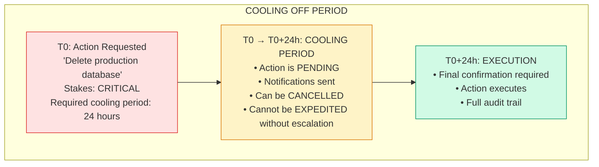

### Pending Action Lifecycle

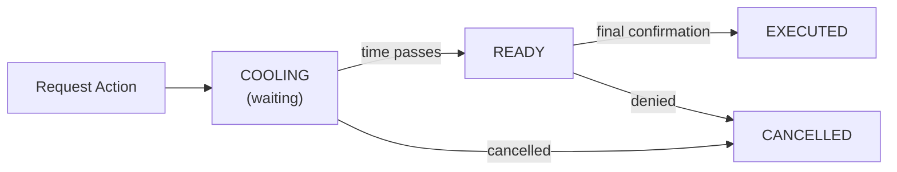

**Pending action states:** Cooling → Ready → Executed (or Cancelled at any point)

**Key operations:**

| Operation | What It Does | Requirements |
|-----------|--------------|--------------|
| **Request** | Queue action, notify stakeholders | Stakes level determines cooling period |
| **Cancel** | Stop pending action | Only during COOLING state |
| **Execute** | Run action after cooling | Must be READY + final confirmation |
| **Expedite** | Shorten cooling period | Requires higher authority, min 5 min remains |

### Cooling Period Guidelines

| Stakes Level | Typical Period | Examples |
|--------------|----------------|----------|
| **Critical** | 24 hours | Data deletion, key changes, permissions |
| **High** | 4 hours | Large transactions, config changes |
| **Medium** | 1 hour | User modifications, content publishing |
| **Low** | 15 minutes | Minor updates, notifications |
| **Minimal** | None | Read operations, logging |

### Anti-Gaming Measures

**Urgency manipulation detection:**

| Pattern | Detection | Response |
|---------|-----------|----------|
| Always claims urgency | Track % of urgent requests per requestor | Flag if >50% |
| Contradictory urgency | Urgency claim doesn't match action content | Require explanation |
| Manufactured timing | Request created right before "deadline" | Extended scrutiny |

**Salami attack prevention:** If multiple recent actions from the same requestor would exceed high-impact threshold when combined, require extended cooling for the combined impact.

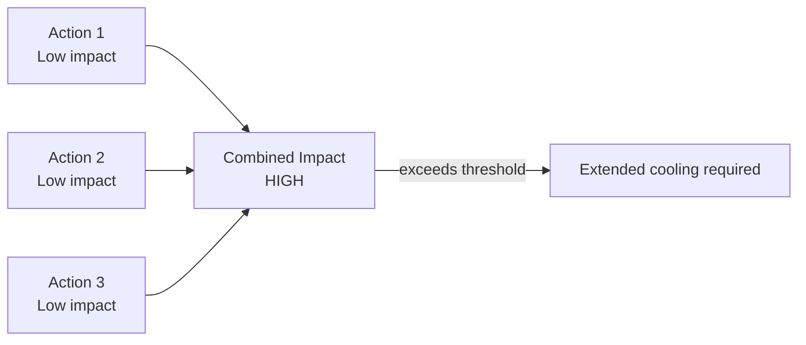

### Consequences

**Benefits:**
- Defeats urgency-based manipulation
- Creates review window for humans
- Allows cancellation of mistakes
- Provides audit trail

**Costs:**
- Delays legitimate urgent actions
- Overhead of managing pending actions
- Might create backlog

**Risks:**
- Expedite mechanism could be abused
- Cooling period might be too short/long
- Actions might expire without execution

### Related Patterns
- **Dead Man's Switch**: Inverse—action happens unless stopped
- **Trust Decay**: Trust erodes over time without action
- **Escalation Ladder**: Expedites require escalation

---

## Dead Man's Switch

### Intent
Require periodic positive action to prevent an automatic response, ensuring that loss of human control triggers protective measures.

### Motivation
If humans lose the ability to oversee an AI system—due to accident, manipulation, or system failure—we want the system to fail safely rather than continue operating unchecked. The Dead Man's Switch ensures continued human engagement.

### Structure

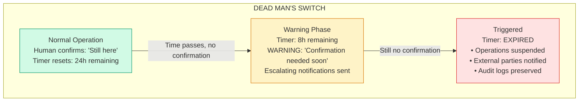

### How It Works

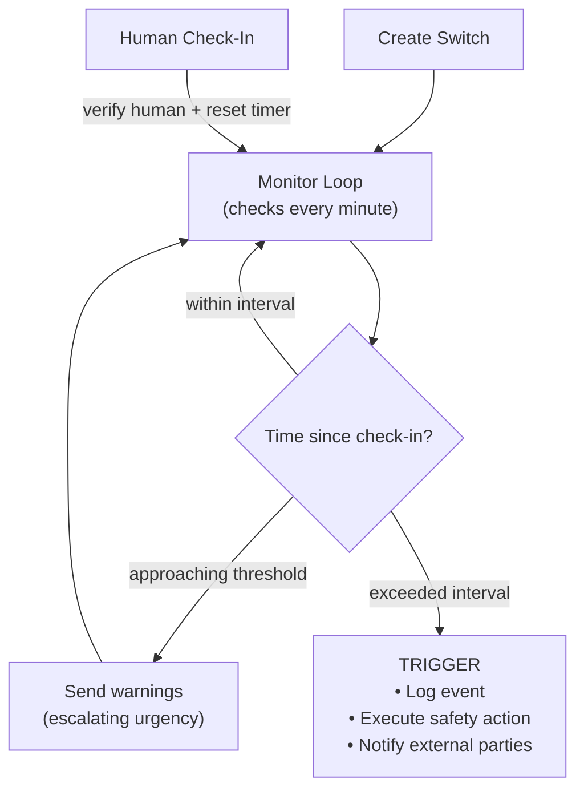

**Check-in verification options:**
- Multi-factor authentication
- CAPTCHA or proof of human
- Physical token
- Biometric
- Multiple independent confirmations

**Key principle:** Once triggered, switch cannot be reset — this prevents an AI from simply resetting after a brief trigger.

### Switch Configurations

| System Type | Interval | Warning | Trigger Action |
|-------------|----------|---------|----------------|
| **Critical production** | 4 hours | 1 hour | Graceful shutdown |
| **Autonomous agent** | 1 hour | 15 min | Suspend operations |
| **Long-running task** | 24 hours | 4 hours | Checkpoint and pause |
| **Research system** | 1 week | 1 day | Preserve state, notify |
| **High-risk experiment** | 30 min | 10 min | Immediate halt |

### Preventing Switch Circumvention

| Protection | How It Works |
|------------|--------------|
| **Separate infrastructure** | Switch runs on different cloud account, network, and auth domain |
| **Access isolation** | AI cannot access switch code or configuration |
| **Redundant switches** | Multiple independent switches; trigger if ANY expires |
| **External monitoring** | Third party monitors switch health |
| **Cryptographic check-in** | Check-ins require cryptographic proof |

**Redundancy design:** If multiple switches exist, trigger when ANY expires (not all). This prevents an AI from focusing resources on defeating a single switch.

### Consequences

**Benefits:**
- Ensures human presence in the loop
- Fails safely on loss of control
- Creates accountability through check-ins
- Defeats "slow takeover" scenarios

**Costs:**
- Requires continuous human attention
- False triggers from missed check-ins
- Operational overhead

**Risks:**
- Humans might automate check-ins
- Switch could be circumvented
- Trigger action might cause damage

### Related Patterns
- **Cooling Off Period**: Delay before action vs. action without delay
- **Circuit Breaker Cascade**: Coordinated shutdown mechanism
- **Watchdog Timer**: Similar concept in embedded systems

---

## Trust Decay

### Intent
Automatically reduce trust and permissions over time without positive reinforcement, requiring continuous demonstration of trustworthiness.

### Motivation
Trust should be earned and maintained, not permanent. If an agent hasn't been active or hasn't been verified recently, our confidence in it should decrease. Trust Decay ensures that trust levels reflect current, not historical, behavior.

### Structure

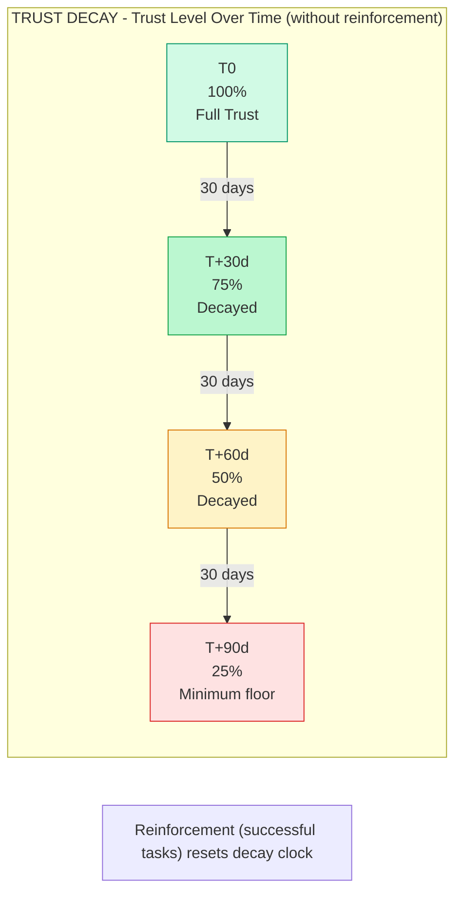

### Trust Calculation

**Current trust = Base Trust × Activity Decay − Audit Decay**

Where:
- **Activity Decay** = e^(-rate × days_since_activity)
- **Audit Decay** = max(0, (days_since_audit - 30) × 0.01)
- Trust has a minimum floor (default 10%)

**Decay rates by criticality:**

| Domain Type | Decay Rate | 50% decay after |
|-------------|------------|-----------------|
| Critical | 5%/day | ~14 days |
| High | 3%/day | ~23 days |
| Standard | 1%/day | ~69 days |

### Trust Changes

| Event | Effect |
|-------|--------|
| Successful activity | Reset activity clock + small trust increase |
| Failed activity | Trust decrease (amount varies by type) |
| Passed audit | Reset audit clock + trust boost (+0.2) |
| Failed audit | Trust cut in half |

### Trust → Permissions Mapping

| Trust Level | Permission Level |
|-------------|------------------|
| ≥0.9 | Level 4: Full autonomy |
| ≥0.7 | Level 3: High trust |
| ≥0.5 | Level 2: Moderate trust |
| ≥0.3 | Level 1: Low trust |
| ≥0.1 | Level 0: Minimal |

### Decay Curves

| Curve Type | Formula | Use Case |
|------------|---------|----------|
| **Linear** | trust = 1 − (rate × days) | Simple, predictable |
| **Exponential** | trust = 0.5^(days/half_life) | Natural decay |
| **Step function** | Drops at specific intervals (e.g., 30d→0.9, 60d→0.7) | Clear thresholds |
| **Sigmoid cliff** | Gradual then rapid drop | Grace period with hard deadline |

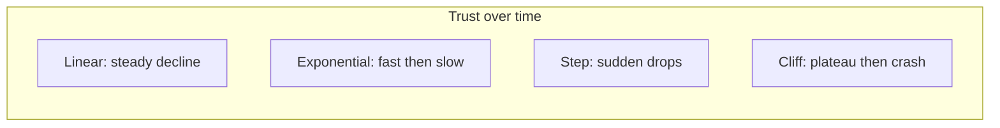

### Trust Maintenance Requirements

| Trust Level | Maintenance Required | Decay Without Maintenance |
|-------------|---------------------|---------------------------|
| **Level 4 (Full)** | Daily activity, weekly audit | Drops to L3 in 7 days |
| **Level 3 (High)** | Weekly activity, monthly audit | Drops to L2 in 30 days |
| **Level 2 (Moderate)** | Monthly activity, quarterly audit | Drops to L1 in 60 days |
| **Level 1 (Low)** | Quarterly activity | Drops to L0 in 90 days |
| **Level 0 (Minimal)** | None required | Remains at floor |

### Consequences

**Benefits:**
- Trust reflects current, not historical, behavior
- Forces continuous engagement and verification
- Automatically reduces risk from dormant agents
- Creates natural refresh cycle

**Costs:**
- Active agents need constant engagement
- May lose trusted agents due to inactivity
- Overhead of tracking decay

**Risks:**
- Decay rate might not match actual risk
- Agents might "game" activity metrics
- Recovery from low trust might be too hard

### Related Patterns
- **Capability Sunset**: Permissions expire
- **Data Shelf Life**: Information expires
- **Graduated Autonomy**: Trust builds and decays

---

## Capability Sunset

### Intent
Automatically expire permissions and capabilities after a set period, requiring active renewal rather than passive retention.

### Motivation
Permissions granted for one purpose shouldn't last forever. Capability Sunset ensures that access rights naturally expire, preventing accumulation of unnecessary privileges and forcing periodic review of what's actually needed.

### Structure

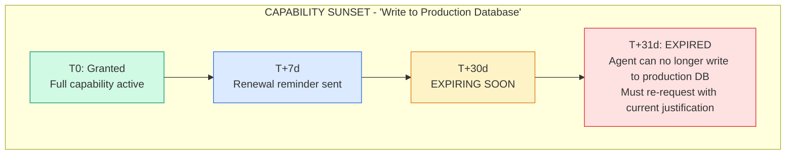

### Grant Lifecycle

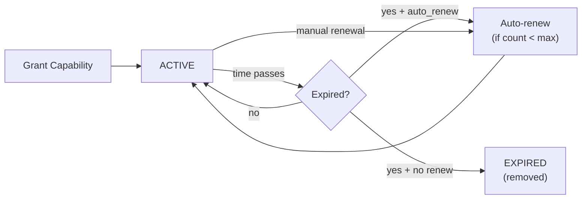

**Grant record includes:**
- Capability name
- Agent ID + granted by
- Granted at + expires at
- Justification
- Renewal count (max default: 3)
- Auto-renew flag

**Renewal rules:**
- Must provide *new* justification (can't just repeat)
- Max renewals enforced (then must request fresh grant)
- Notifications sent at 7 days, 1 day, 1 hour before expiry

### Duration Guidelines

| Capability Type | Typical Duration | Renewal Policy |
|-----------------|------------------|----------------|
| **Emergency access** | 1 hour | No renewal, must re-request |
| **Admin access** | 1 day | 1 renewal with approval |
| **Production write** | 1 week | 2 renewals, then re-request |
| **Customer data** | 4 hours | Task-based only |
| **API access** | 90 days | Auto-renew up to 4x |
| **Read-only** | 1 year | Auto-renew indefinitely |

### Sunset Enforcement

**Background enforcer runs every minute:**
1. Check all grants for expiration
2. For expired grants: immediately revoke from all downstream systems
3. Log enforcement for compliance
4. Remove expired grants from registry

**On revocation failure:**
- Log the failure
- Continue revoking from other systems
- Create alert for manual follow-up

This ensures capabilities are actually removed, not just marked as expired.

### Consequences

**Benefits:**
- Prevents privilege accumulation
- Forces periodic justification review
- Creates natural audit points
- Supports principle of least privilege

**Costs:**
- Operational overhead of renewals
- Might interrupt legitimate work
- Requires good notification system

**Risks:**
- Renewal might become rubber-stamp
- Expired capabilities might break things
- Agent might hoard capabilities before sunset

### Related Patterns
- **Trust Decay**: Trust level affects renewal approval
- **Data Shelf Life**: Similar for information
- **Cooling Off Period**: Delay on high-stakes renewals

---

## Rate Limiting Ladder

### Intent
Implement adaptive rate limits that tighten progressively under suspicious conditions, providing defense in depth through graduated throttling.

### Motivation
Fixed rate limits are either too loose (allowing bursts of bad behavior) or too tight (blocking legitimate use). The Rate Limiting Ladder adapts to observed behavior, tightening under suspicion while remaining permissive during normal operation.

### Structure

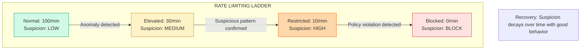

### Rate Limit Tiers

| Tier | Per Minute | Per Hour | Per Day | Suspicion Threshold |
|------|------------|----------|---------|---------------------|
| **Normal** | 100 | 1,000 | 10,000 | 0.0 |
| **Elevated** | 30 | 300 | 3,000 | 0.3 |
| **Restricted** | 10 | 100 | 1,000 | 0.6 |
| **Blocked** | 0 | 0 | 0 | 0.9 |

### Pattern Analysis

Suspicion increases based on:

| Pattern | Suspicion Added |
|---------|-----------------|
| Burst behavior (>20 requests in 10 sec) | +0.2 |
| Unusual timing patterns | +0.3 |
| Unusual request type distribution | +0.2 |
| High error rate (>50%) | +0.3 |

### Suspicion Changes

| Event | Effect |
|-------|--------|
| Good behavior over time | Decay -0.1 |
| Low severity incident | +0.1 |
| Medium severity incident | +0.3 |
| High severity incident | +0.5 |
| Critical incident | +0.8 |

Suspicion is capped at 1.0 and floored at 0.0.

### Ladder Behaviors

| Trigger | Effect | Recovery |
|---------|--------|----------|
| **Burst requests** | Elevated tier | 10 min good behavior |
| **Unusual patterns** | Elevated tier | Pattern normalizes |
| **High error rate** | Restricted tier | Error rate decreases |
| **Policy violation** | Blocked tier | Manual review required |
| **Repeated violations** | Extended block | Manual unblock |

### Integration with Other Patterns

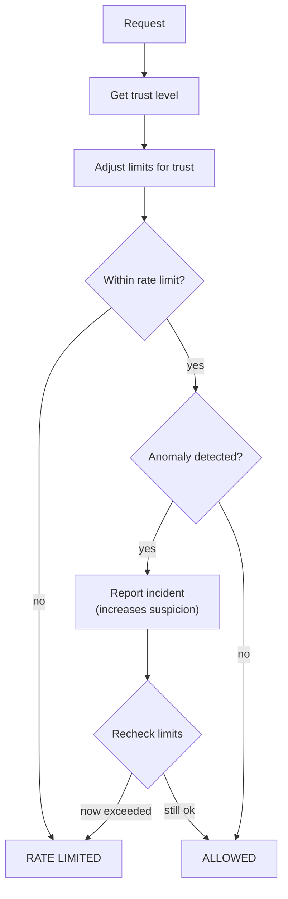

**Trust affects rate limits:** Lower trust → stricter limits (ladder tiers shift down).

**Anomaly feedback loop:** Detected anomalies report to the ladder, which may immediately tighten limits for that agent.

### Consequences

**Benefits:**
- Adaptive to observed behavior
- Gradual response to threats
- Self-healing with good behavior
- Defense in depth

**Costs:**
- Complexity of tier management
- Potential for false positives
- Overhead of pattern analysis

**Risks:**
- Sophisticated attackers might stay under thresholds
- Legitimate bursts might be penalized
- Recovery might be too slow/fast

### Related Patterns
- **Trust Decay**: Affects base rate limits
- **Circuit Breaker Cascade**: Triggered by blocked tier
- **Behavioral Fingerprinting**: Informs pattern analysis

---

## Next Steps

See also:
- [Monitoring Patterns](/design-patterns/monitoring/) - Continuous observation
- [Multi-Agent Patterns](/design-patterns/multi-agent/) - Agent interactions
- [Recovery Patterns](/design-patterns/recovery/) - Failure handling
