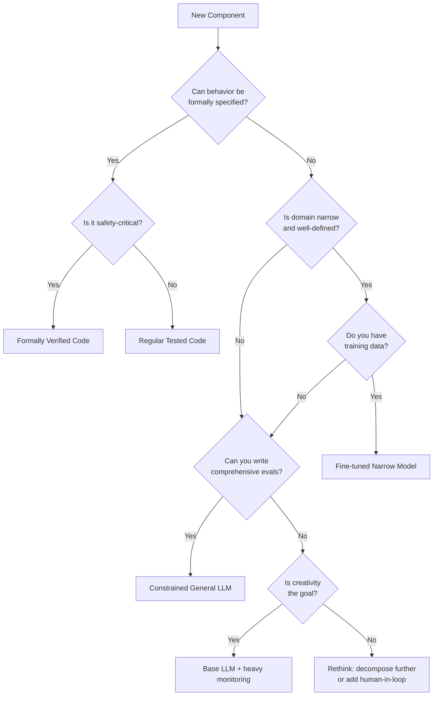
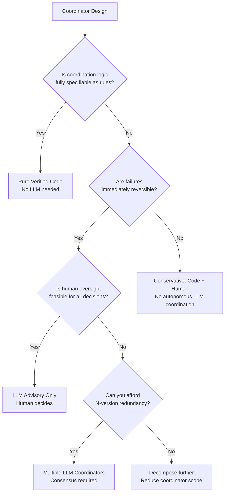
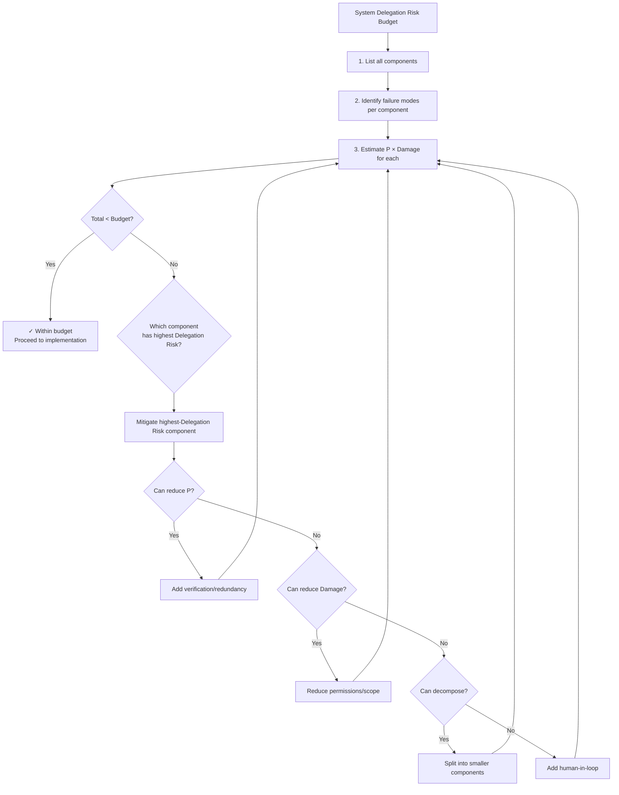
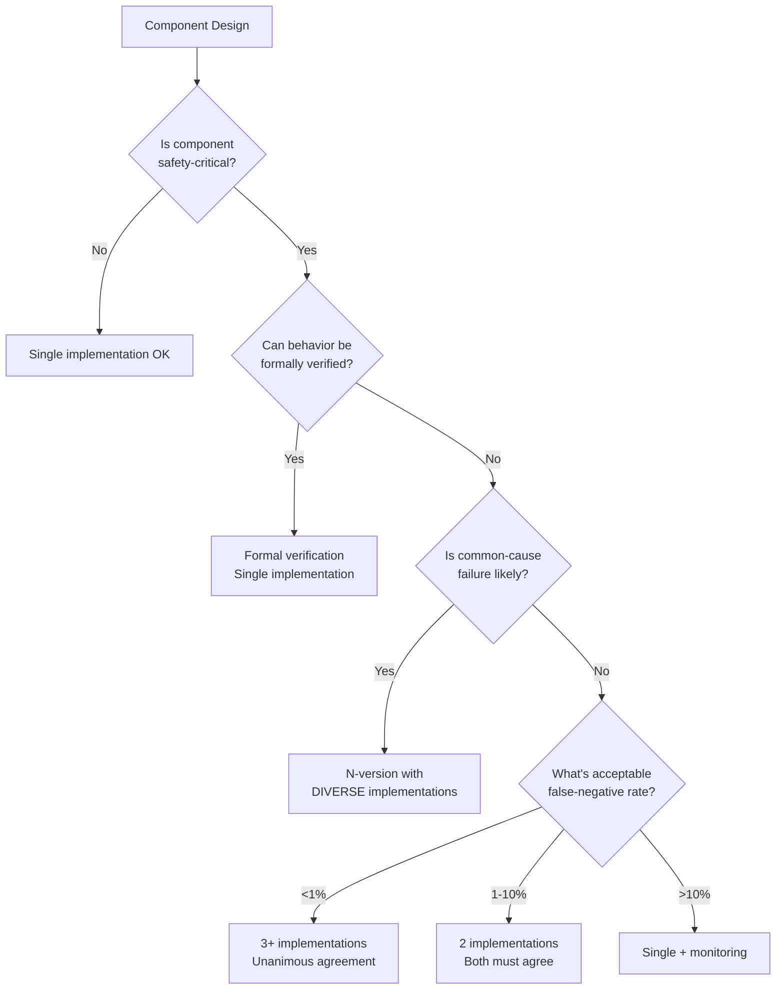
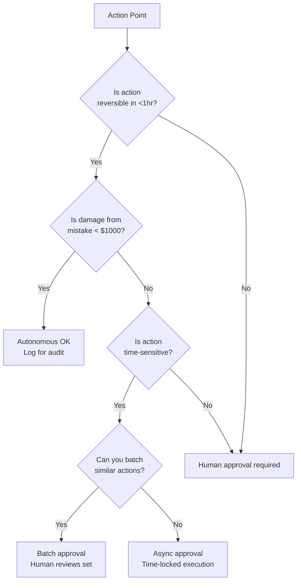

# Implementation Decision Guide

Practical decision trees for applying the framework. Use these when designing a new system or evaluating an existing one.

## Decision Tree 1: Choosing Component Implementation

For each component, work through this tree:

### Implementation Recommendations by Type

| Decision | Implementation | Delegation Risk Multiplier | Examples |
|----------|---------------|----------------|----------|
| Formally Verified | Coq, Isabelle, TLA+ | 0.1x | Access control, invariants |
| Regular Code | Python, Rust with tests | 0.3x | Parsers, validators, routing |
| Fine-tuned Narrow | 7B model, task-specific | 0.5x | Summarization, classification |
| Constrained General | GPT-4 + prompts + evals | 1.0x | Code review, gap analysis |
| Base LLM | Frontier model | 2.0x | Hypothesis generation |

**The multiplier**: Rough factor for how much the implementation choice affects Delegation Risk. Formal verification ~10x safer than base LLM for equivalent tasks.

---

## Decision Tree 2: Coordinator Design

Should your coordinator use an LLM or pure code?

### Coordinator Implementation Matrix

| Stakes | Reversibility | Recommended Approach |
|--------|---------------|---------------------|
| Low | Easy | Single LLM coordinator OK |
| Low | Hard | LLM + automatic rollback |
| High | Easy | LLM advisory + human approval |
| High | Hard | Code only OR N-version + human gate |

---

## Decision Tree 3: Delegation Risk Budget Allocation

How to allocate your system's delegation risk budget across components:

### Budget Allocation Heuristics

| Component Type | Typical Delegation Risk Share | Justification |
|----------------|-------------------|---------------|
| Coordinators | 20-30% | High leverage, needs headroom |
| High-capability LLMs | 30-40% | Inherently less predictable |
| Verified code | 5-10% | Low risk, give small budget |
| Human-gated actions | 20-30% | Human absorbs residual risk |

---

## Decision Tree 4: When to Add Redundancy

### Redundancy Configurations

| Config | Implementations | Agreement | Tolerates |
|--------|-----------------|-----------|-----------|
| 2-of-2 | 2 | Both agree | 0 failures |
| 2-of-3 | 3 | Majority | 1 failure |
| 3-of-4 | 4 | Super-majority | 1 Byzantine |
| 4-of-5 | 5 | Super-majority | 1 Byzantine + 1 crash |

**Byzantine**: Assumes adversarial/arbitrary behavior, not just crashes.

---

## Decision Tree 5: Human-in-the-Loop Placement

Where should humans approve decisions?

### Human Oversight Patterns

| Pattern | Latency | Throughput | Use When |
|---------|---------|------------|----------|
| Sync approval | High | Low | High-stakes, rare actions |
| Async approval | Medium | Medium | Important but not urgent |
| Batch approval | Low | High | Many similar low-stakes actions |
| Audit-only | None | Unlimited | Low-stakes, reversible |

---

## Quick Decision Checklist

For each component, answer:

- [ ] **Implementation**: Code, narrow model, or general LLM?
- [ ] **Risk budget**: What Delegation Risk allocation?
- [ ] **Redundancy**: Single, double, or N-version?
- [ ] **Human gate**: Approval required, async, batch, or audit-only?
- [ ] **Monitoring**: What metrics trigger alerts?
- [ ] **Rollback**: How to undo if problems detected?

For the system as a whole:

- [ ] **Total Delegation Risk**: Sum of components < budget?
- [ ] **Concentration**: No single component > 50% of budget?
- [ ] **Coordinator**: Appropriate constraints applied?
- [ ] **Verification**: How will you validate trust assumptions?

---

## Example: Applying Decision Trees

**Scenario**: Building a customer support bot that can issue refunds.

**Component: Refund Issuer**
1. **Implementation tree**: Can't formally specify (customer situations vary) → Domain narrow? Yes (refunds only) → Have training data? Yes → **Fine-tuned narrow model**
2. **Risk budget**: Refund mistakes = moderate damage (~$100 avg) → Medium Delegation Risk allocation
3. **Redundancy tree**: Safety-critical? Yes (money involved) → Formally verified? No → **2-of-2 with different models**
4. **Human gate tree**: Reversible? Yes (can reverse refund) → Damage < $1000? Usually → **Audit-only for small refunds, approval for large**

**Result**: Two fine-tuned models must agree, small refunds auto-approved with logging, large refunds require human approval.

---

## See Also

- [Research Assistant Example](/design-patterns/examples/research-assistant-example/) — Full worked example
- [Code Deployment Example](/design-patterns/examples/code-deployment-example/) — Higher-stakes example
- [Principles to Practice](/design-patterns/principles-to-practice/) — Mapping principles to implementations
